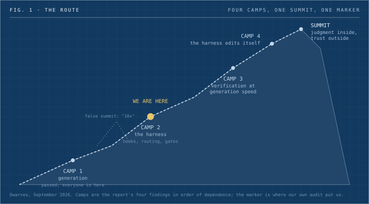
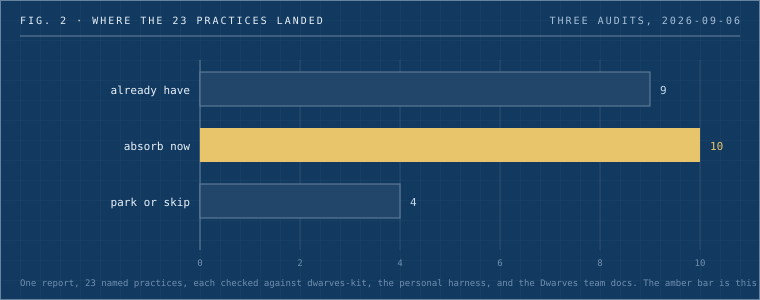

Forty CTOs and architects sat in a room in Engelberg this June and argued for three days about what software engineering is turning into. Thoughtworks wrote it up. One line from the notes has stayed with me: engineering is now distilled down to how do I describe the goal, and how do I verify I've reached it.

I read that the same week I found out one of our money-path alerts had been green for a month while reading a source that had been retired on the first of August. The probe was healthy. The thing it was watching was gone. Nobody noticed because a green light looks the same whether or not anything is behind it.

So this is a post about where we are on the mountain, and what I think the top looks like. I'm writing it because the next few months of work at Dwarves are being sequenced against this picture, and it's easier to argue with a picture than with a backlog.

_Fig. 1: The route as I see it. Four camps in order of dependence, one marker for where our own audit put us, and one false summit drawn where the marketing lives._

## The summit

Here's my definition, and you can disagree with it. The summit is a firm where a fleet of agents does the building, and every claim the fleet makes gets verified for less than it cost to produce. The only work a human still does by hand is set the goal, make the calls the fleet can't, and accept the result. Judgment inside, trust outside. I wrote about why those two survive in [an earlier post](what-stays-valuable-when-anyone-can-build.md); this one is about the route.

The word that matters in that definition is cheaper. Any team can verify agent output if they're willing to read every line. That's camp one with extra steps. The summit is when checking costs less than making, because that's the point where the fleet's throughput becomes the firm's throughput instead of the reviewer's.

Someone in Engelberg put it more bluntly: the only thing they don't want to outsource is the acceptance criteria. Everything else they're willing to hand over. I think that's the summit stated in one sentence.

## Camp one, generation

Everyone's here. It's the valley floor now. A model writes a module, a test file, a Terraform plan, faster than anyone in the room can read it. The report's first finding says code generation is no longer the bottleneck, and I don't know a single working engineer who'd argue.

The trap at camp one is mistaking it for altitude. The team that ships the most generated code has the most unverified surface. The report has a case study that came up in several sessions independently: a product manager and a designer who became "superpowers" cranking out features with agents, while the engineer got relegated to cleanup. Leadership called it highly productive and a disaster in the making, in the same breath.

## Camp two, the harness

This is where we are, and I can say that with some evidence because I counted.

My own Claude Code settings carry about forty hook rows. Nine of them are PreToolUse hooks that block: a secret guard that refuses to let a resolved credential reach the transcript, a branch guard, a worktree guard, a gate that refuses to create a new script until the "does this already exist" check has been logged. Four more fire on Stop and refuse the turn itself: one blocks a message that claims "done" with zero tool calls behind it, one blocks a fenced shell command that was shown but never run.

Every one of those exists because something went wrong first. The branch guard's own error message tells you why it's there: eight pushes reached main on August 26 from inside a script, where a text-matching guard couldn't see the branch name. The guard now refuses any script that pushes unless you mark the push deliberate. That's what harness engineering looks like from the inside, most days.

The report's second finding says the scaffolding around a model matters more than the model, and that it may be where competitive differentiation lives once models commoditize. One organization there cut token use by at least four times with a better harness. Another found a smaller model with a good harness outperformed a larger one with a weak harness. We measured the same shape on our side before the report existed: a strong orchestrator over cheap workers came in about three times cheaper than an all-premium fleet, same result. Cache reads were 58% of our Opus spend when we last looked, and every bit of that is the harness's doing.

Camp two is real altitude. It's also where I think most serious teams will be stuck for a while, because the next pitch is steeper.

## Camp three, verification at the speed of generation

The first thing to admit is that we thought we were further up than we are.

We run a mutation ratchet on our Workers monorepo. It's good. It also took 47 minutes per merge, burned 5,101 GitHub Actions minutes in ten days, and exhausted the org's monthly allowance on the sixth. Actions got switched off org-wide for part of August. The ratchet runs on a Mac Mini in Da Nang now, at zero marginal cost, and it's advisory. The kit's mutation smoke is advisory too, scoped to changed hunks. Neither of them stops a merge.

Then there's the green probe I opened with. The proof-of-done for that alert had a negative control, and the negative control was vacuous: it proved the probe reacted to a fault in a source that no longer produced anything. We fixed it on August 30 with a staleness assertion, zero rows for three weeks now alerts, so the probe can never pass by reading nothing again. That's one probe. I'm sure there are others.

The report describes what camp three needs and it's more specific than I expected. Coverage first. Then an agent actively tries to break the code without breaking any test. Then mutation testing, only if the probe succeeded. We have the first and the third. We don't have the middle step, and the middle step is the one that tells you whether your test suite means anything. There's a row on the kit board for it now.

The other camp-three finding is uncomfortable. Nobody in Engelberg could cite data on how many defects manual code review actually catches. They called it a status quo illusion. Our own code-review rubric prescribes a monthly calibration sample of five to ten merged PRs, to check whether review caught what it should have. I went looking for the numbers this week and found that we've never recorded one.

## Camp four, the harness edits itself

The best-performing teams in the report don't hand-write their harnesses. They let agents fail, run a "learn" step that reflects on the session and proposes edits to the scaffolding, and treat the human's job as periodic pruning rather than authorship.

We built half of this. The kit has a skill-curator that's supposed to review a session at compaction time and draft skill proposals into a staging folder, and a promote gate where I approve or reject them. The audit this week found the producer half was never wired: the PreCompact and SessionEnd hook arrays in my live settings are empty, and the staging folder doesn't exist. I had the pruning shears and nothing growing.

That's a one-line settings change, which is the annoying kind of gap. The report's warning about camp four is the one I'd underline: shared skills and context artifacts decay exactly like unowned frameworks unless someone owns them, and they need a with-and-without eval so you can cut the ones the model no longer needs. We can list which skills never fire. We can't yet measure whether a skill that does fire earns its context.

## The weather: two clocks

The sharpest diagnostic in the whole report is what they called the two clocks. Teams tracked the clock for producing code and the clock for waiting on a decision. Throughput exploded. Cycle time didn't move. The constraint had walked upstream to decisions and spec clarity, and the pipeline people kept optimizing wasn't where the time went.

I can confirm the first clock is broken on our side and I can't read the second. Our projects database has a closed date on 2 of 62 projects, so cycle time is unmeasurable, which an internal doc already admitted. My own board has rows marked "Han's call" and "held on Han" with no view of how long they've sat there. I'm building a lens that lists them oldest first. My expectation is that the median age of a decision waiting on me is larger than the median build time of the work behind it, and if that's true, the constraint is my calendar.

## Altitude sickness

Three things the report flags that I'd rather name now than discover later.

Token spend is a governance problem. One organization saw internal security incidents up roughly twenty times in six months, while token budgets blew through annual allocations in three months. The report's line is that this needs the same discipline as cloud spend, named owner and a review cadence, applied early. Our desk fleet's AI Gateway fronting has been blocked at phase three for weeks, and nobody's name is on the spend. Both are fixable this month.

The apprenticeship crisis is real and it's slow. Six sessions independently raised the same fear: if seniors pair only with agents, juniors lose the path to judgment. Our junior contractor role already budgets sixteen to twenty hours a week of mentored project work and rejects the "just don't hire juniors" answer. What we don't have is the format the report describes, a design quorum where the senior leads the design conversation live while the junior drives the agent, and a checkpoint where someone has to walk through a shipped change with no model in the room. The seven-to-ten-year cohort got singled out as the group under most strain, the people whose decade of skill a model now often exceeds. They're usually your delivery leads.

The expectation gap. Boards are betting on a picture where a PRD goes into the machine and working software comes out, because their own experience of AI is report-writing tools that genuinely work that way. The room's estimate of realistic gain across the full lifecycle was two to three times, and they gave the gap between that and "10x" twelve to eighteen months before it resets. I've drawn that as the false summit in the figure, below camp two.

## What we're doing this period

I ran the report against what we actually have. Three audits, one per home: the kit, my personal harness, and the Dwarves ops docs. Twenty-three named practices.

_Fig. 2: Where the report's practices landed after the audit. The nine we have include the proof-of-done gate, the understanding gate, lane-based autonomy tiers, and desk allow-lists. The ten are this period's climb._

The ten are small on purpose. An adversarial prober lens in the review battery. A hook that turns lint output into step-by-step fix instructions, which one team in the report credited with moving code-smell resolution from under half to about ninety percent. A dependency-age guard that blocks a package name that doesn't exist and warns on anything under fourteen days old. The learn-loop producer, wired. The decisions lens. On the Dwarves side, the gap that embarrassed me most: our client security overview and our data processing agreement don't mention AI at all, and we have no written policy on which tools may see client code. That gets written first. A legacy modernization package gets written second, because the report calls it the clearest value pool in the market and we have four case studies and nothing selling it.

Each of those ships with a number attached or it doesn't ship. The lint hook logs rule ids seen versus rule ids gone. The decisions lens reports a median age per week. If the report's numbers don't reproduce here, that's a finding too.

## Where the argument leaks

The camps are a line and the work isn't. We're running camp-four wiring and camp-three probes in the same fortnight, and a good week at camp two still matters more than a bad week at camp three.

Every number I've quoted from Engelberg is one organization's anecdote. The four-times token cut, the ninety percent, the twenty-times incident rise. None of them came with an n. I've treated them as tripwires to measure against, and I'd ask you to do the same with mine: forty hook rows is one person's harness, and 2 of 62 is one company's database.

The summit might not be reachable for judgment-shaped work. Verification cheaper than generation is a clear target for code. For a proposal, a hire, a pricing call, I don't know what cheap verification means, and the honest answer is that those stay at the human clock for the foreseeable future. That's probably fine. Those are the calls the summit says a human keeps anyway.

The room in Engelberg agreed on one more thing I'll end on. They don't expect a plateau. They expect the cycles to compress, and they argued that the durable move is to build capability that holds its value wherever the hype lands: the harness, the verification discipline, the governance. We're at camp two. The next pitch is verification, starting with whether our own checks are reading anything.
