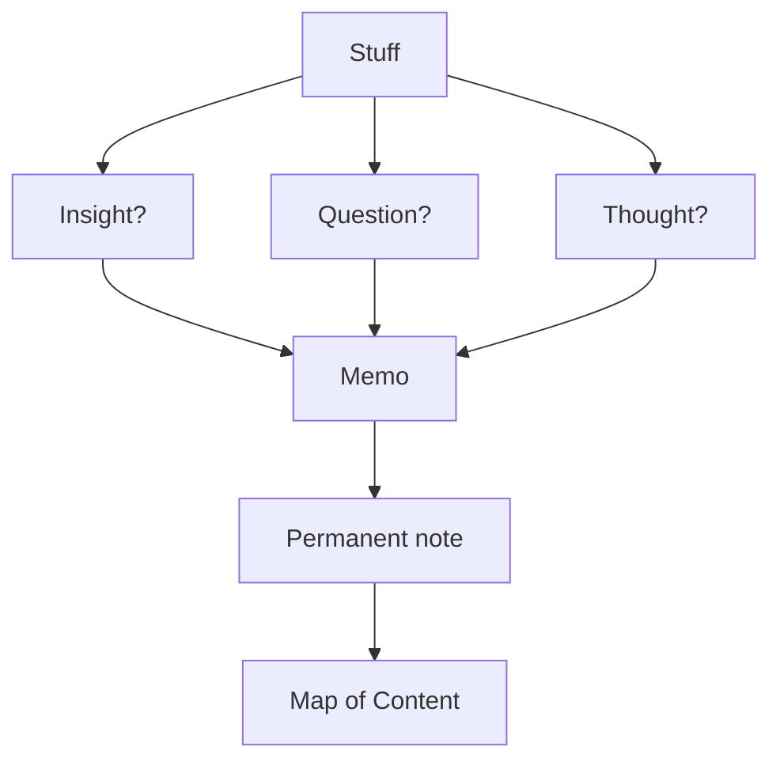

Welcome to the Dwarves Brainery.

Dwarves are a group of technology innovation advocates. This project is a part of our continuous learning engine, where we want to build up the 1% improvement habit, learning in public.

We believe that behind every success comes great preparation, accumulation and compound every single day. This brain repo contains our notes and studies for any upcoming challenges.

Written by Dwarves for product craftsmen.\
Learned by engineers. Experimented by engineers.

### Workflow

Applying the Zettelkasten method to construct our reference neuron network, we collect learning pieces from articles, books, papers, videos and then put them here to evaluate before boarding them on our technology adoption radar. We also adopted the LYT method with an initial setup and notes from Moby Diction Publish. It sets a great standard and we find it very helpful.



## ✨ Latest memos

```dsql-list
WITH sorted_vault AS (
    SELECT
        short_title,
        title,
        file_path,
        description,
        authors,
        md_content,
        ROW_NUMBER() OVER () AS item_number
    FROM vault
    ORDER BY date DESC
    LIMIT 3
)
SELECT
    '<div id="new-memos" class="v-list" data-placement="vertical">' ||
    GROUP_CONCAT(
        '<div id="memo-' || item_number || '" class="v-list-item" >' ||
        '<div class="v-list-item-image">' || '</div>' ||
        '<div class="v-list-item-body">' ||
            '<a class="v-list-item-title" href="/' || REGEXP_REPLACE(LOWER(REGEXP_REPLACE(REPLACE(REPLACE(file_path, '.md', ''), ' ', '-'), '[^a-zA-Z0-9/_-]+', '-')), '(-/|-$|_index$)', '') || '">' || REPLACE(REPLACE(REPLACE(COALESCE(short_title, title), '&', '&'), '<', '<'), '>', '>') || '</a>' ||
            '<div class="v-list-item-desc">' || REPLACE(REPLACE(REPLACE(description, '&', '&'), '<', '<'), '>', '>') || '</div>' ||
            '<div class="v-list-item-author">' ||
                REPLACE(REPLACE(
            REPLACE(
                ARRAY_TO_STRING(
                    LIST_TRANSFORM(authors, author ->
                        '<a href="/contributor/' || author || '">' || author || '</a>'
                    ), ', '),
                    '&', '&'),
                    '<', '<'),
                    '>', '>')
            || '</div>' ||
        '</div>' ||
        '</div>',
        ''
    ) ||
    '</div>' AS latest_memos_html
FROM sorted_vault;
```

## 💡 OGIFs

```dsql-list
SELECT markdown_link(COALESCE(short_title, title), file_path)
FROM vault
WHERE ['ogif'] && tags
ORDER BY date DESC
LIMIT 5
```

## 🧑‍💻 Life at Dwarves

```dsql-list
WITH sorted_vault AS (
    SELECT
        short_title,
        title,
        file_path,
        description,date,
        ROW_NUMBER() OVER () AS item_number
    FROM vault
    WHERE ['team'] && tags
    ORDER BY date DESC
    LIMIT 3
)
SELECT
    '<div id="open-positions" class="v-list" data-placement="vertical">' ||
    GROUP_CONCAT(
        '<div id="memo-' || item_number || '" class="v-list-item no-image" >'
||'<div class="v-list-item-body">'||
        '<a class="v-list-item-title" href="/' || REGEXP_REPLACE(LOWER(REGEXP_REPLACE(REPLACE(REPLACE(file_path, '.md', ''), ' ', '-'), '[^a-zA-Z0-9/_-]+', '-')), '(-/|-$|_index$)', '') || '">' || REPLACE(REPLACE(REPLACE(COALESCE(short_title, title), '&', '&'), '<', '<'), '>', '>') || '</a>' ||
         '<div class="v-list-item-desc">' || REPLACE(REPLACE(REPLACE(description, '&', '&'), '<', '<'), '>', '>') || '</div>' ||
          '<div class="v-list-item-time">' ||
REPLACE(REPLACE(REPLACE(
    strftime('%B %d, %Y', date),
    '&', '&'),
    '<', '<'),
    '>', '>'
) || '</div>'||
        '</div>'
        '</div>',
        ''
    )||
    '</a>' ||
    '</div>' AS team_html
FROM sorted_vault;
```

## 📝 Changelog

```dsql-list
WITH sorted_vault AS (
    SELECT
        short_title,
        title,
        file_path,
        date,
        ROW_NUMBER() OVER () AS item_number
    FROM vault
   WHERE ['weekly-digest'] && tags
ORDER BY date DESC
    LIMIT 3
)
SELECT
    '<div id="changelog" class="link-v-list" data-placement="vertical">' ||
    GROUP_CONCAT(
        '<div id="memo-' || item_number || '" class="link-v-list-item" >'
||
        '<a class="link-v-list-item-title" href="/' || REGEXP_REPLACE(LOWER(REGEXP_REPLACE(REPLACE(REPLACE(file_path, '.md', ''), ' ', '-'), '[^a-zA-Z0-9/_-]+', '-')), '(-/|-$|_index$)', '') || '">' || REPLACE(REPLACE(REPLACE(COALESCE(short_title, title), '&', '&'), '<', '<'), '>', '>') || '</a>' ||
        '<span class="link-v-list-item-time"> - ' ||
REPLACE(REPLACE(REPLACE(
    strftime('%B %d, %Y', date),
    '&', '&'),
    '<', '<'),
    '>', '>'
) || '</span>'
        '</div>',
        ''
    )||
    '</a>' ||
    '</div>' AS open_positions_html
FROM sorted_vault;
```

## 🤝 Open positions

```dsql-list
WITH sorted_vault AS (
    SELECT
        short_title,
        title,
        file_path,
        description,
        ROW_NUMBER() OVER () AS item_number
    FROM vault
    WHERE ['hiring'] && tags
  AND hiring = true
    ORDER BY date DESC
    LIMIT 3
)
SELECT
    '<div id="open-positions" class="v-list" data-placement="vertical">' ||
    GROUP_CONCAT(
        '<div id="memo-' || item_number || '" class="v-list-item no-image" >'
||'<div class="v-list-item-body">'||
        '<a class="v-list-item-title" href="/' || REGEXP_REPLACE(LOWER(REGEXP_REPLACE(REPLACE(REPLACE(file_path, '.md', ''), ' ', '-'), '[^a-zA-Z0-9/_-]+', '-')), '(-/|-$|_index$)', '') || '">' || REPLACE(REPLACE(REPLACE(COALESCE(short_title, title), '&', '&'), '<', '<'), '>', '>') || '</a>' ||
         '<div class="v-list-item-desc">' || REPLACE(REPLACE(REPLACE(description, '&', '&'), '<', '<'), '>', '>') || '</div>' ||
        '</div>'
        '</div>',
        ''
    )||
    '</a>' ||
    '</div>' AS open_positions_html
FROM sorted_vault;
```

### Contributing

At Dwarves, we encourage our people to read, write, share what we learn with others, and [contributing to the Brainery](CONTRIBUTING.md) is an important part of our learning culture. For visitors, you are welcome to read them, contribute to them, and suggest additions. We maintain a monthly pool of $1500 to reward contributors who support our journey of lifelong growth in knowledge and network.

### Love what we are doing?

- Check out our [products](https://superbits.co)
- Hire us to [build your software](https://d.foundation)
- Join us, [we are also hiring](https://careers.d.foundation)
- Visit our [Discord learning network](https://discord.gg/dfoundation)
