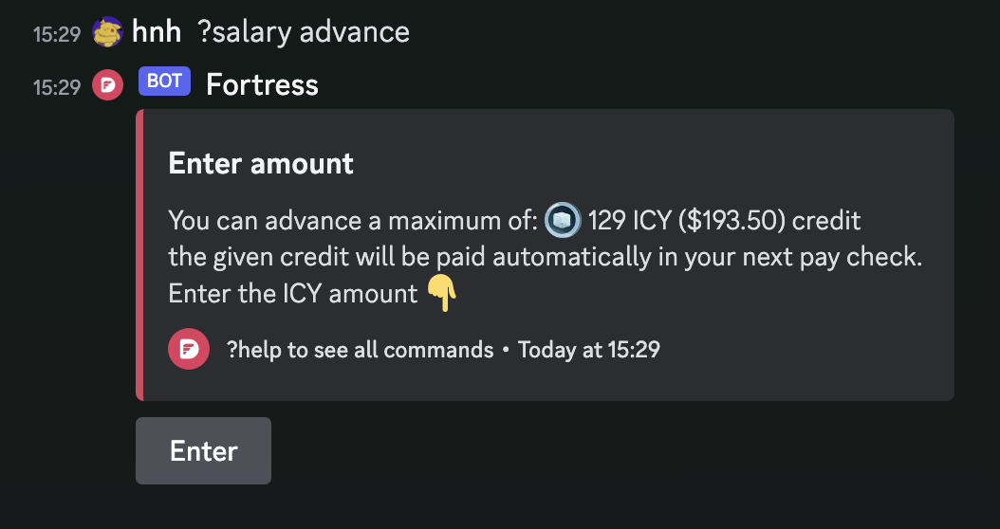

---
tags:
  - dwarves
  - icy
title: $icy Salary Advance
date: 2023-11-23
description: A short-term credit benefit for full-time peeps.
authors:
  - hnh
menu: memo
toc: false
notice:
type: memo
show_frontmatter: true
---

as we said in our recent post [[memo/icy-in-2024|$icy in 2024 plan]].

Today, we're launching the first feature from our 2024 roadmap: an $icy salary advance.
It's a short-term credit benefit available to all full-time employees in our company.

Simply put, it's a policy that allows you to receive a portion of your upcoming payroll in the form of icy. Currently, everyone can access up to 25% of their total payroll.

Just head over to the DMs of the 'Fortress' bot and type ?salary advance, and we'll guide you through the process with a small 0.5% service fee.

Cheers.

