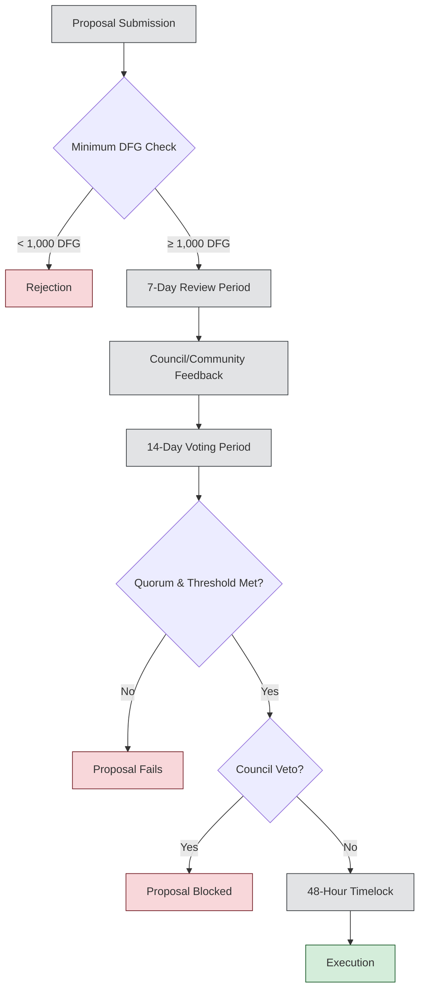

Moving from team control to community governance requires careful design. The transition must maintain protocol direction while gradually distributing decision-making power to stakeholders.

## Overview

The Dwarves+ Protocol governance framework is designed to transition from centralized team control to community-driven decision-making while maintaining operational efficiency and strategic direction. This document outlines the governance structure, voting systems, and implementation roadmap for progressive decentralization.

## Governance philosophy

### Core principles

1. **Progressive decentralization**: Gradual transition from team control to community governance
2. **Stakeholder alignment**: Decision-making power proportional to long-term commitment
3. **Expertise recognition**: Mechanisms to leverage domain knowledge and experience
4. **Transparency**: All governance processes publicly auditable and documented
5. **Adaptability**: Governance systems that evolve with protocol maturity

### Governance objectives

- **Protocol direction**: Strategic decisions on research focus and partnerships
- **Resource allocation**: Treasury management and funding distribution
- **Parameter optimization**: Token economics and reward mechanism adjustments
- **Community standards**: Quality assurance and contributor guidelines
- **Risk management**: Security measures and emergency response protocols

## Comprehensive governance voting systems

The Dwarves+ Protocol implements a sophisticated voting system that evolves through three distinct phases, each designed to address different stages of protocol maturity and community development.

### Voting system overview

#### Purpose and scope

- **Primary function**: Facilitate decisions on research funding, partnerships, profit allocation, and protocol upgrades
- **Governance token**: DFG with staked tokens receiving enhanced voting weight (2x multiplier)
- **Transition goal**: Move from 100% team control to 50% community governance by Q2 2026
- **Long-term vision**: Achieve 75%+ decentralized governance while maintaining strategic coherence

#### Governance token (DFG) mechanics

- **Total supply**: 1,000,000 DFG (fixed supply)
- **Voting power**: Base 1 DFG = 1 vote, with staking multipliers
- **Minimum proposal**: 1,000 DFG required to submit proposals
- **Eligibility**: All DFG holders can participate in governance

### Phase 1: Initial governance (Q3-Q4 2025)

#### One token, one vote (1T1V) system

**Core mechanics**:

- **Voting weight**: 1 DFG = 1 vote (no staking multipliers)
- **Council oversight**: 5-member team-appointed council with veto power
- **Veto threshold**: Council can block proposals that drain >20% of treasury
- **Quorum requirement**: 10% of total DFG supply (100,000 DFG)
- **Approval threshold**: Simple majority (51%)

**Implementation details**:

```solidity
// Simplified voting calculation for Phase 1
function calculateVotingPower(address voter) public view returns (uint256) {
    return dfgToken.balanceOf(voter);
}

function isProposalApproved(uint256 proposalId) public view returns (bool) {
    Proposal memory proposal = proposals[proposalId];
    uint256 totalVotes = proposal.forVotes + proposal.againstVotes;
    
    // Check quorum (10% of total supply)
    if (totalVotes < (dfgToken.totalSupply() * 10) / 100) {
        return false;
    }
    
    // Check majority approval
    return proposal.forVotes > proposal.againstVotes;
}
```

**Proposal categories**:

1. **Research funding**: Up to $50,000 per proposal
2. **Partnership approvals**: Strategic alliances and collaborations
3. **Parameter adjustments**: Minor tokenomics modifications
4. **Community initiatives**: Events, bounties, and engagement programs

**Council veto powers**:

- **Treasury protection**: Prevent proposals that risk protocol solvency
- **Security measures**: Block potentially harmful technical changes
- **Quality control**: Ensure proposals meet minimum standards
- **Strategic alignment**: Maintain focus on core mission

### Phase 2: Transition governance (Q1-Q2 2026)

#### Staked-weighted voting with quadratic adjustment (SWV-QA)

**Enhanced mechanics**:

- **Base voting**: Unstaked DFG = 1 vote
- **Staking bonus**: Staked DFG = 2 votes
- **Whale mitigation**: Quadratic adjustment for large holders
- **Council evolution**: Elected by DFG holders, reduced veto power (25% override)
- **Quorum increase**: 15% of total DFG supply (150,000 DFG)
- **Threshold variation**: 51% for standard, 66% for profit reallocation

**Mathematical model**:

$$Vote_{weight} = \begin{cases}
DFG_{unstaked} & \text{for unstaked tokens} \\
DFG_{staked} \times 2 \times \sqrt{\frac{1000}{DFG_{staked}}} & \text{for large staked holders} \\
DFG_{staked} \times 2 & \text{for unstaked tokens < 1000}
\end{cases}$$

**Example calculations**:

| DFG Holdings | Staking Status | Raw Votes | Adjusted Votes | Effective Power |
|--------------|----------------|-----------|----------------|-----------------|
| 100 | Unstaked | 100 | 100 | 0.1% |
| 100 | Staked | 200 | 200 | 0.2% |
| 1,000 | Staked | 2,000 | 2,000 | 1.8% |
| 10,000 | Staked | 20,000 | 6,325 | 5.7% |
| 50,000 | Staked | 100,000 | 14,142 | 12.8% |

**Implementation code**:

```solidity
function calculateVotingPower(address voter) public view returns (uint256) {
    uint256 unstakedDFG = dfgToken.balanceOf(voter) - stakedDFG[voter];
    uint256 stakedTokens = stakedDFG[voter];

    uint256 baseVotes = unstakedDFG;
    uint256 stakedVotes;

    if (stakedTokens > 0) {
        if (stakedTokens >= 1000) {
            // Apply quadratic adjustment for large holders
            stakedVotes = stakedTokens * 2 * sqrt(1000) / sqrt(stakedTokens);
        } else {
            // Full 2x multiplier for smaller holders
            stakedVotes = stakedTokens * 2;
        }
    }

    return baseVotes + stakedVotes;
}
```

**Governance split mechanism**:

- **Team allocation**: 400,000 DFG (40% of supply)
- **Community earned**: 400,000 DFG via ICY staking
- **Reserved pool**: 200,000 DFG for future distribution
- **Effective control**: ~50% community, 50% team by Q2 2026

### Phase 3: Decentralized governance (Post-2026)

#### Delegated quadratic voting (DQV)

**Advanced mechanics**:

- **Vote weight**: $\sqrt{DFG_{held} + DFG_{delegated}}$
- **Delegation system**: Token holders can delegate to expert representatives
- **Automated execution**: Smart contract-based proposal implementation
- **No council**: Fully decentralized decision-making
- **Higher quorum**: 20% of total DFG supply (200,000 DFG)
- **Threshold maintained**: 51% standard, 66% for critical changes

**Delegation framework**:

$$Delegate_{power} = \sqrt{\sum_{i=1}^{n} DFG_{delegated,i}} + \sqrt{DFG_{owned}}$$

Where:
- $n$ = number of delegators
- $DFG_{delegated,i}$ = tokens delegated by user $i$
- $DFG_{owned}$ = delegate's own tokens

**Representative categories**:

1. **Research leads**: Domain experts in specific technical areas
2. **Community managers**: Focus on contributor experience and engagement
3. **Economic advisors**: Specialists in tokenomics and treasury management
4. **Security experts**: Focused on protocol safety and risk management

### Implementation architecture

#### Smart contract system

**Core contracts**:

1. **GovernanceToken.sol**: DFG token with delegation functionality
2. **Governor.sol**: Main governance logic and proposal management
3. **Timelock.sol**: Execution delay for approved proposals
4. **VotingPowerCalculator.sol**: Phase-specific voting weight calculations

**Proposal lifecycle**:


#### Proposal types and requirements

| Proposal Type | DFG Required | Threshold | Timelock | Council Veto |
|---------------|--------------|-----------|----------|--------------|
| Research Funding (<$10K) | 1,000 | 51% | 24 hours | No |
| Major Funding ($10K-$50K) | 2,500 | 51% | 48 hours | Phase 1-2 |
| Treasury Allocation (>$50K) | 5,000 | 66% | 72 hours | Phase 1-2 |
| Parameter Changes | 1,000 | 51% | 48 hours | Phase 1-2 |
| Emergency Actions | 10,000 | 75% | 12 hours | No |
| Constitutional Changes | 25,000 | 75% | 7 days | Phase 1-2 |

#### Voting process implementation

**Step 1: Proposal submission**
```solidity
function propose(
    address[] memory targets,
    uint256[] memory values,
    bytes[] memory calldatas,
    string memory description
) public returns (uint256) {
    // Implementation details
}
```

**Step 2: Voting**
```solidity
function castVote(uint256 proposalId, uint8 support) public {
    // Implementation details
}

function castVoteWithReason(uint256 proposalId, uint8 support, string memory reason) public {
    // Implementation details
}
```

**Step 3: Proposal execution**
```solidity
function execute(uint256 proposalId) public payable {
    // Implementation details
}
```

#### Governance dashboard and analytics

**Key metrics**:

- **Voter participation rate**: Percentage of DFG holders voting
- **Proposal success rate**: Percentage of approved proposals
- **Quorum attainment**: Frequency of meeting quorum requirements
- **Delegation rate**: Percentage of DFG delegated to representatives
- **Treasury allocation**: Funds distributed via governance

**Features**:

- **Real-time voting dashboard**: Live updates on ongoing proposals
- **Historical data**: Archive of all past proposals and voting results
- **Delegate leaderboards**: Rankings of top delegates by voting power
- **Transparency reports**: Regular audits of governance actions

### Governance incentives

#### Contributor rewards for governance

- **Voting rewards**: 10 ICY per vote cast (capped at 100 ICY/week)
- **Proposal bounties**: 50 DFG for successfully approved proposals (>75% support)
- **Delegate compensation**: Share of protocol fees for active delegates (Phase 3)

#### Reputation and recognition

- **Governance contributor badge**: Awarded for active participation in proposals
- **Leaderboard ranking**: Public recognition for top voters and delegates
- **Exclusive access**: Early access to research, events for active governors

### Risk management and safeguards

#### Governance attack vectors

- **Whale dominance**: Mitigated by quadratic voting and delegation
- **Voter apathy**: Addressed by voting rewards and engagement programs
- **Malicious proposals**: Council veto (Phase 1-2), emergency pause (all phases)
- **Sybil attacks**: KYC for DFG holders (Phase 2), reputation scores

#### Emergency procedures

- **Protocol pause**: 75% DFG vote to temporarily halt operations (30 days)
- **Treasury freeze**: Council (Phase 1-2) or 75% DFG vote to freeze treasury
- **Bug bounties**: Continuous programs for smart contract security

#### Formal verification and audits

- **Smart contract audits**: Regular third-party audits of governance contracts
- **Formal verification**: Mathematical proof of protocol correctness
- **Bug bounty programs**: Ongoing incentives for security researchers

### Governance roadmap and milestones

#### Phase 1 (Q3-Q4 2025): Initial setup

- **Launch 1T1V**: One token, one vote system activated
- **Council establishment**: 5-member initial council nominated
- **Basic proposal flow**: Research funding, minor parameter changes
- **DFG distribution**: Initial allocation to team and early contributors

#### Phase 2 (Q1-Q2 2026): Transition and growth

- **SWV-QA implementation**: Staked-weighted quadratic voting online
- **Council elections**: First community elections for council members
- **Expanded proposal types**: Partnerships, major treasury allocations
- **50% community control**: Governance power shifts gradually

#### Phase 3 (Post-2026): Full decentralization

- **DQV activation**: Delegated quadratic voting fully implemented
- **Council dissolution**: Automated execution via smart contracts
- **Self-sustaining governance**: Community-driven evolution
- **Cross-chain governance**: Integration with other blockchain networks

### Legal and compliance considerations

#### Regulatory environment

- **Jurisdiction**: US/Singapore compliance framework
- **Security vs. utility**: Legal opinion on DFG (security) and ICY (utility) classification
- **AML/KYC**: Compliance for DFG holders (Phase 2)

#### Legal structure

- **Decentralized autonomous organization (DAO)**: Formal legal wrapper (if applicable)
- **Foundation model**: Non-profit entity supporting protocol development
- **Legal counsel**: Ongoing consultation for regulatory changes

## Conclusion

The Dwarves+ Protocol governance framework is a dynamic system designed for progressive decentralization, balancing initial team guidance with long-term community control. By empowering DFG holders through fair voting mechanisms, robust incentives, and transparent processes, we aim to build a resilient, innovative, and truly decentralized research and development ecosystem.
