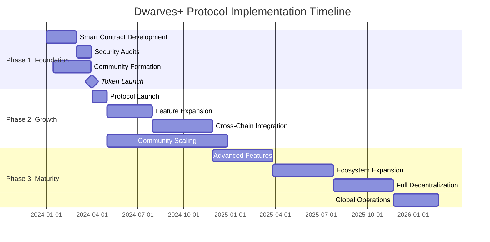

## Overview

This roadmap outlines the systematic transition from Dwarves Foundation to Dwarves+ Protocol, implementing the dual-token system while maintaining operational continuity and community growth.

## Implementation philosophy

### Core principles

1. **Gradual transition**: Smooth migration from centralized to decentralized operations
2. **Community first**: Prioritize contributor experience and community building
3. **Technical excellence**: Robust, secure, and scalable infrastructure
4. **Value preservation**: Maintain existing business relationships and reputation
5. **Regulatory compliance**: Ensure legal compliance throughout the transition

## Phase 1: Foundation and preparation (months 1-6)

### Objectives

- Establish token infrastructure and smart contracts
- Begin community formation and contributor onboarding
- Maintain existing business operations while building protocol foundation

### Technical milestones

#### Month 1-2: Smart contract development

- [ ] **ICY token contract**: ERC-20 implementation with burn and mint functions
- [ ] **DFG token contract**: ERC-20 governance token with voting capabilities
- [ ] **Staking contracts**: Multi-tier staking with time-locked rewards
- [ ] **Treasury management**: Multi-signature treasury with time-locked controls
- [ ] **Bitcoin treasury integration**: Bitcoin custody and backing ratio contracts
- [ ] **Initial security audit**: Preliminary audit of core contracts

#### Month 3-4: Governance infrastructure

- [ ] **Proposal system**: On-chain proposal creation and voting
- [ ] **Activity chair contracts**: Automated role-based permissions
- [ ] **Reward distribution**: Automated ICY distribution for contributions
- [ ] **Reputation system**: On-chain reputation tracking and scoring
- [ ] **Integration testing**: End-to-end testing of all protocol components

#### Month 5-6: Launch preparation

- [ ] **Final security audit**: Comprehensive audit by leading security firms
- [ ] **Testnet deployment**: Full protocol deployment on Ethereum testnet
- [ ] **Community testing**: Beta testing with early contributor community
- [ ] **Documentation**: Complete technical and user documentation
- [ ] **Legal structure**: Finalize legal framework and compliance procedures

### Community development

#### Strategic contributor onboarding

- **Target**: 50-75 early contributors (current team + external hires)
- **Focus**: Multi-tier approach combining existing team with strategic external talent
- **Acquisition channels**:
  - **Academic researchers**: University partnerships and research collaborations
  - **Senior developers**: GitHub, Stack Overflow, developer conferences
  - **Web3 builders**: Crypto Twitter, Discord communities, DeFi forums
  - **Strategic partners**: Development agencies and research institutions

#### Go-to-market foundation

- **Pre-launch campaign**:
  - [ ] Brand identity and messaging framework development
  - [ ] Content marketing engine setup (blog, social media, educational resources)
  - [ ] Influencer and partnership outreach program
  - [ ] "Founding contributor" NFT badge program design
- **Referral system implementation**:
  - [ ] Multi-tier referral program (25 ICY + 5% first-year earnings)
  - [ ] Attribution tracking and analytics system
  - [ ] Referral leaderboards and recognition program
- **Community infrastructure**:
  - [ ] Discord server architecture with research centers and project workspaces
  - [ ] Onboarding bootcamp curriculum (1-week intensive program)
  - [ ] Mentorship matching system and buddy program
  - [ ] Achievement badge ecosystem and gamification elements

#### Governance formation

- **Progressive decentralization**:
  - [ ] Initial 5-member council (team-appointed)
  - [ ] Community moderation roles with ICY rewards (15 ICY/session)
  - [ ] Proposal testing with mock governance scenarios
  - [ ] Voting mechanism testing (1T1V → SWV-QA → DQV transition)
- **Community guidelines**:
  - [ ] Participation standards and code of conduct
  - [ ] Contribution quality metrics and peer review processes
  - [ ] Conflict resolution and dispute mechanisms
  - [ ] Cultural values integration and reinforcement

### Business operations

- **Revenue continuity**: Maintain existing client relationships
- **New client integration**: Begin educating clients about protocol transition
- **Partnership development**: Establish strategic partnerships for protocol launch
- **Bitcoin treasury setup**: Establish Bitcoin custody and purchase procedures
- **Treasury management**: Begin monthly Bitcoin purchases from profit allocation

### Key deliverables

- [ ] Audited smart contracts deployed on Ethereum mainnet
- [ ] Strategic community of 50-75 contributors with diverse expertise
- [ ] Complete go-to-market infrastructure and launch campaign ready
- [ ] Advanced Discord community with 500+ engaged members
- [ ] Multi-tier referral system operational with tracking analytics
- [ ] Comprehensive onboarding program with 90%+ completion rate
- [ ] Achievement badge ecosystem and gamification features active
- [ ] Basic governance infrastructure with progressive decentralization plan
- [ ] Legal framework and compliance procedures established
- [ ] Community guidelines and cultural reinforcement mechanisms

## Phase 2: Launch and growth (months 7-18)

### Objectives

- Full protocol launch with complete token economics
- Scale contributor network and implement all activity chairs
- Establish sustainable revenue streams and treasury management

### Technical milestones

#### Month 7-9: Protocol launch

- [ ] **Mainnet deployment**: Launch all protocol contracts on Ethereum
- [ ] **Token distribution**: Execute initial DFG distribution to core team
- [ ] **Staking launch**: Enable ICY and DFG staking with rewards
- [ ] **Governance activation**: Full proposal and voting system operational
- [ ] **Contributor platform**: Web platform for contribution tracking and rewards

#### Month 10-12: Feature expansion

- [ ] **Base integration**: Deploy protocol operations on Base network
- [ ] **Advanced staking**: Implement delegation and liquid staking features
- [ ] **Partnership integrations**: Technical integrations with strategic partners
- [ ] **Analytics dashboard**: Real-time protocol metrics and community insights
- [ ] **Mobile application**: Mobile app for community engagement and governance

#### Month 13-18: Optimization and scaling

- [ ] **Arweave integration**: Deploy permanent storage on Arweave network
- [ ] **DeFi integrations**: Yield farming and liquidity provision features
- [ ] **NFT marketplace**: Platform for research IP and contributor profile NFTs
- [ ] **Advanced governance**: Implement quadratic voting and conviction voting
- [ ] **AI-powered matching**: Automated contributor-project matching system

### Community scaling

#### Strategic contributor growth

- **Target**: 100+ active contributors by month 18 (Phase 2 completion)
- **Geographic expansion**: Contributors from 15+ countries with regional chapters
- **Quality-focused growth**: Emphasis on high-value contributors over quantity
- **Specialization**: Develop expertise in key technical domains
- **Acquisition strategy**:
  - [ ] "Build the future" developer campaign with ICY bounties
  - [ ] "Research renaissance" academic partnership program
  - [ ] "Governance pioneers" Web3 builder recruitment
  - [ ] University collaboration agreements (10+ institutions)
  - [ ] Conference presence and speaking opportunities

#### Advanced community engagement

- **Content and education**:
  - [ ] Weekly tech talks (50 ICY presenters, 20 ICY attendees)
  - [ ] Monthly community challenges (100-500 ICY prizes)
  - [ ] Quarterly research symposiums and governance assemblies
  - [ ] Peer learning and knowledge sharing programs
- **Recognition and gamification**:
  - [ ] Dynamic leaderboard systems across contribution categories
  - [ ] Comprehensive badge ecosystem (Bronze → Elite Contributor)
  - [ ] Milestone celebrations and community spotlights
  - [ ] Cross-regional collaboration projects
- **Retention optimization**:
  - [ ] 30-day success program with weekly check-ins
  - [ ] 90-day integration program with leadership preparation
  - [ ] Career development support and external opportunities
  - [ ] Continuous value delivery through advanced projects

#### Governance maturation

- **Progressive decentralization timeline**:
  - [ ] Month 7-12: Phase 1 (1T1V) with council oversight
  - [ ] Month 13-18: Phase 2 (SWV-QA) with 50% community control
  - [ ] Council election by DFG holders (month 12)
  - [ ] Veto power reduction from 100% to 25% (month 18)
- **Governance metrics**:
  - [ ] Active Proposals: 2-5 governance proposals per month
  - [ ] Voting Participation: Target 60%+ DFG holder participation
  - [ ] Proposal Quality: Detailed analysis and impact assessment
  - [ ] Decision Speed: Efficient 14-day voting cycles
- **Community leadership development**:
  - [ ] Research lead roles for specialized domains
  - [ ] Elected moderator positions with community voting
  - [ ] Ambassador program for regional representation
  - [ ] Project manager roles for cross-team initiatives

### Business development

#### Revenue diversification

- **Consulting growth**: Scale to $10-20M annual consulting revenue
- **Research partnerships**: Establish 5-10 major research partnerships
- **Training programs**: Launch professional blockchain training programs

#### Treasury management

- **Bitcoin accumulation**: Build Bitcoin treasury through monthly purchases
- **Diversification**: Build treasury to $5-10M with 60-80% in Bitcoin
- **Yield generation**: Implement DeFi strategies for non-Bitcoin treasury
- **Strategic investments**: Invest in complementary protocols and technologies
- **Backing ratio management**: Maintain healthy ICY backing ratios

### Implementation timeline visualization

### Key deliverables

- [ ] Fully operational dual-token protocol with 100+ high-quality contributors
- [ ] Self-sustaining governance with 60%+ DFG holder participation
- [ ] Advanced community engagement systems with 85%+ retention rate
- [ ] Global contributor network across 15+ countries with regional chapters
- [ ] Comprehensive educational and mentorship programs
- [ ] Dynamic gamification and recognition systems
- [ ] Sustainable revenue streams and Bitcoin treasury management
- [ ] Robust technical infrastructure and smart contract security
- [ ] Clear legal and regulatory compliance framework
- [ ] Thriving ecosystem of partners, clients, and community members

## Metrics and key performance indicators

### Overall protocol health

- **Active contributors**: Target 100+ by June 2027
- **Revenue growth**: Target $10-20M annual consulting revenue by June 2027
- **Bitcoin treasury size**: Target $5-10M by June 2027
- **Governance participation**: Target 60%+ DFG holder voting participation
- **Community retention**: Target 80%+ active contributors after 6 months

### Phase-specific KPIs

#### Phase 1: Foundation (months 1-6)

- **Contributors**: 50-75 active contributors
- **Smart contract audits**: 2 completed, no critical vulnerabilities
- **Community members**: 500+ Discord/Telegram members
- **Referral system**: 100+ successful referrals
- **Onboarding completion**: 90%+ for new contributors

#### Phase 2: Growth (months 7-18)

- **Contributors**: 100-300 active contributors
- **Revenue**: $1-5M annual consulting revenue
- **Bitcoin treasury**: $1-3M in BTC holdings
- **Governance proposals**: 2-5 proposals per month
- **Staking participation**: 25%+ of ICY supply staked

#### Phase 3: Maturity (months 19-36)

- **Contributors**: 1,000-3,000 active contributors
- **Revenue**: $10-20M annual consulting revenue
- **Bitcoin treasury**: $5-10M in BTC holdings
- **Governance participation**: 60%+ DFG holder participation
- **Retention**: 80%+ active contributors after 6 months

## Risk mitigation

### Technical risks

- **Smart contract vulnerabilities**: Regular audits, bug bounties, formal verification
- **Scalability limitations**: Multi-network strategy (Base, Arweave), off-chain solutions
- **Infrastructure failures**: Redundant systems, multi-cloud deployment, disaster recovery

### Economic risks

- **Token price volatility**: Bitcoin backing, diversified treasury, gradual release schedules
- **Revenue fluctuations**: Diversified revenue streams, contingency funds
- **Economic model failure**: Continuous simulation, adaptive parameters, governance oversight

### Community risks

- **Low participation**: Gamification, incentive alignment, easy-to-use governance tools
- **Community fragmentation**: Clear guidelines, conflict resolution, active moderation
- **Sybil attacks**: Identity verification, reputation systems, progressive decentralization

### Regulatory risks

- **Uncertainty**: Legal counsel, compliance by design, geographic diversification
- **Classification**: Structure tokens as utility/governance, not securities
- **AML/KYC**: Implement as required for large transactions/governance roles

## Conclusion

The Dwarves+ Protocol implementation roadmap provides a clear, phased approach to building a decentralized research and development ecosystem. By prioritizing security, community, and sustainable economics, this roadmap aims to guide the protocol to become a leading force in the decentralized future of work and knowledge creation.
