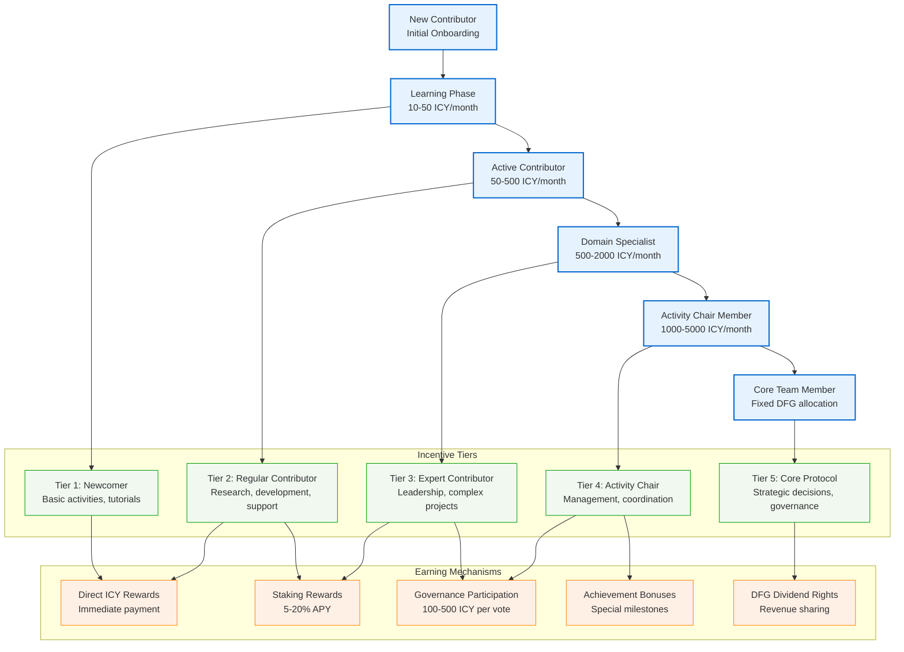

The incentive structure balances psychological motivation with economic rewards to create a thriving contributor ecosystem. By understanding what drives people to contribute their best work, we can build reward systems that feel meaningful and sustainable.

## Incentive design philosophy

### Core principles

1. **Merit-based rewards**: Compensation proportional to value created
2. **Intrinsic motivation**: Appeal to purpose, autonomy, and mastery
3. **Progressive recognition**: Increasing rewards for sustained contributions
4. **Collaborative culture**: Incentives that promote teamwork and knowledge sharing
5. **Long-term alignment**: Rewards that encourage sustained engagement

## Contributor motivation analysis

### Intrinsic motivators

#### 1. Purpose and impact

**Psychological driver**: Desire to contribute to meaningful work
**Protocol implementation**:

- Clear mission statement and impact metrics
- Regular showcasing of protocol achievements
- Contributor impact stories and case studies
- Direct connection between individual work and protocol success

#### 2. Autonomy and flexibility

**Psychological driver**: Desire for self-direction and control
**Protocol implementation**:

- Flexible work arrangements and project selection
- Contributor-driven initiative proposals
- Minimal bureaucracy and red tape
- Self-directed learning and skill development

#### 3. Mastery and growth

**Psychological driver**: Desire to improve and become excellent
**Protocol implementation**:

- Comprehensive skill development programs
- Mentorship and coaching opportunities
- Regular feedback and performance reviews
- Recognition of expertise and knowledge sharing

#### 4. Community and belonging

**Psychological driver**: Desire for social connection and recognition
**Protocol implementation**:

- Strong community culture and shared values
- Regular community events and gatherings
- Peer recognition and appreciation systems
- Collaborative projects and team achievements

### Extrinsic motivators

#### 1. Financial rewards

**Monetary compensation**: ICY tokens, DFG allocations, stablecoin payments
**Implementation**: Competitive compensation based on contribution value

#### 2. Status and recognition

**Social recognition**: Reputation scores, badges, public acknowledgment
**Implementation**: Multi-tiered recognition system with public visibility

#### 3. Career advancement

**Professional growth**: Skill development, networking, career opportunities
**Implementation**: Clear progression paths and external career support

## Reward mechanism architecture

### Contribution assessment framework

#### 1. Quantitative metrics (40% of assessment)

- **Code contributions**: Lines of code, bug fixes, feature implementations
- **Research output**: Publications, citations, peer reviews
- **Community engagement**: Forum posts, mentorship hours, event participation
- **Project delivery**: On-time delivery, quality metrics, client satisfaction

#### 2. Qualitative metrics (40% of assessment)

- **Innovation impact**: Breakthrough ideas, creative solutions
- **Collaboration quality**: Teamwork, knowledge sharing, conflict resolution
- **Leadership demonstrated**: Initiative, guidance, decision-making
- **Cultural contribution**: Values alignment, community building

#### 3. Peer recognition (20% of assessment)

- **Peer nominations**: Recognition from fellow contributors
- **360-degree feedback**: Comprehensive evaluation from multiple perspectives
- **Community voting**: Democratic assessment of contributions
- **Mentorship feedback**: Evaluation from mentees and mentors

### Reward distribution mechanisms

#### 1. Base contribution rewards

**Frequency**: Weekly distribution
**Mechanism**: Algorithmic assessment with human oversight
**Amount**: 50-70% of total reward pool

**Reward categories**:

- **Research excellence**: 100-1,000 ICY per publication
- **Code quality**: 50-500 ICY per contribution
- **Community leadership**: 25-250 ICY per activity
- **Mentorship**: 25-200 ICY per mentoring session
- **Innovation**: 200-2,000 ICY for breakthrough contributions

#### 2. Performance bonuses

**Frequency**: Monthly assessment
**Mechanism**: Holistic evaluation by activity chairs
**Amount**: 20-30% of total reward pool

**Bonus categories**:

- **Excellence bonus**: Top 10% performers receive 2x multiplier
- **Improvement bonus**: Most improved contributors receive 1.5x multiplier
- **Innovation bonus**: Revolutionary contributions receive 3x multiplier
- **Leadership bonus**: Activity chair members receive 1.4x multiplier

#### 3. Long-term incentives

**Frequency**: Quarterly and annual distributions
**Mechanism**: Vesting schedules and milestone achievements
**Amount**: 10-20% of total reward pool

**Long-term rewards**:

- **Loyalty rewards**: Increasing bonuses for sustained participation
- **Milestone rewards**: Achievements for major protocol milestones
- **Equity participation**: DFG token allocations for top contributors
- **Profit sharing**: Revenue sharing for long-term participants

## Contributor journey and progression

### Contributor journey visualization

### Onboarding phase (months 1-3)

#### Welcome incentives

- **Onboarding bonus**: 500 ICY welcome package
- **Mentor assignment**: Paired with experienced contributor
- **Skill assessment**: Comprehensive evaluation and development plan
- **Initial projects**: Carefully selected projects for early success

#### Support systems

- **Dedicated support**: Priority access to help and resources
- **Learning resources**: Comprehensive training materials and courses
- **Community integration**: Introduction to community and culture
- **Feedback loops**: Regular check-ins and adjustment opportunities

### Growth phase (months 4-12)

#### Skill development

- **Learning bonuses**: Rewards for completing training programs
- **Certification rewards**: Recognition for professional certifications
- **Conference participation**: Sponsored attendance at industry events
- **Internal presentations**: Opportunities to share knowledge

#### Increased responsibility

- **Project leadership**: Opportunities to lead initiatives
- **Mentorship roles**: Become a mentor to new contributors
- **Committee participation**: Join protocol governance committees
- **Specialization tracks**: Focus on specific areas of expertise

### Mastery phase (months 13+)

#### Advanced recognition

- **Expert status**: Recognition as protocol expert in specific domains
- **Thought leadership**: Opportunities for external speaking and writing
- **Protocol governance**: Increased influence in protocol decisions
- **Strategic input**: Involvement in high-level strategic planning

#### Legacy building

- **Knowledge documentation**: Rewards for creating educational content
- **Protocol improvement**: Leading major protocol enhancements
- **Community building**: Developing new community initiatives
- **External representation**: Representing protocol at external events

## Gamification elements

### Badges and achievements

- **Skill badges**: Earn badges for mastering specific skills
- **Contribution streaks**: Reward consistent daily/weekly contributions
- **Milestone achievements**: Celebrate major protocol contributions
- **Leadership badges**: Recognize leadership roles and impact

### Leaderboards and ranking

- **Top contributors**: Publicly display top performers by category
- **Reputation scores**: Dynamic scores reflecting contribution quality
- **Activity leaderboards**: Rank contributors based on specific activities
- **Tier progression**: Visual indicators of contributor growth

### Challenges and quests

- **Weekly challenges**: Protocol-wide tasks with bonus rewards
- **Bounty quests**: Specific, high-value tasks with clear rewards
- **Learning paths**: Structured learning with milestones and rewards
- **Community quests**: Collaborative challenges for group achievements

## Anti-gaming measures

### Quality assurance

- **Peer review**: Mandatory review of all contributions by peers
- **Activity chair oversight**: Human review of high-value contributions
- **Automated quality checks**: AI-powered tools for code and content quality
- **Dispute resolution**: Fair process for resolving reward disputes

### Sybil resistance

- **Identity verification**: KYC for large reward payouts and governance roles
- **Reputation-weighted voting**: Reduce impact of new or low-reputation accounts
- **Multi-factor authentication**: Secure access to contributor accounts
- **Fraud detection**: AI-powered systems to detect suspicious activity

### Incentive alignment

- **Progressive rewards**: Rewards increase with sustained, quality contributions
- **Vesting schedules**: Long-term lockups for DFG token allocations
- **Staking requirements**: Minimum staking for certain governance rights
- **Penalty mechanisms**: Deductions for low-quality or malicious contributions

## Metrics and key performance indicators

### Contributor engagement

- **Active contributors**: Monthly active users earning ICY
- **Retention rate**: Percentage of contributors active after 3/6/12 months
- **Average earnings**: ICY earned per contributor per month
- **Activity diversity**: Range of activities contributors engage in

### Incentive effectiveness

- **Contribution volume**: Number of submissions per category
- **Quality score**: Average quality of contributions
- **Leaderboard movement**: Rate of new contributors rising in ranks
- **Staking participation**: Percentage of ICY locked in staking

### Economic impact

- **ICY velocity**: Rate at which ICY tokens circulate within the protocol
- **DFG governance participation**: Voting rates and proposal submissions
- **Protocol revenue growth**: Link between contributor activity and revenue
- **Treasury health**: Growth and utilization of Bitcoin treasury

## Making it work

Success depends on balance. Too much emphasis on financial rewards can crowd out intrinsic motivation. Too little structure can lead to confusion and unfairness. The key is creating clear pathways for growth while maintaining the flexibility to recognize exceptional contributions that don't fit standard categories.

We'll track participation patterns, retention rates, and contributor satisfaction to refine these mechanisms over time.
