The technical infrastructure needs to handle token operations, governance voting, contributor rewards, treasury management, and Bitcoin-backed value systems across multiple blockchains while maintaining security and scalability.

## Overview

The Dwarves+ Protocol is built on a modular, secure, and scalable architecture that supports the dual-token system, governance mechanisms, contributor reward systems, and Bitcoin-backed value layer. This document outlines the technical infrastructure, smart contract design, and system architecture with integrated Bitcoin treasury management.

## Architectural principles

### Core design principles

1. **Modularity**: Separate concerns into independent, interoperable modules
2. **Security first**: Defense-in-depth security across all system components
3. **Scalability**: Designed to handle growth from hundreds to thousands of users
4. **Upgradability**: Safe upgrade mechanisms for protocol evolution
5. **Decentralization**: Progressive decentralization of system components
6. **Bitcoin integration**: Secure Bitcoin custody and value backing mechanisms

### Technical requirements

- **High availability**: 99.9% uptime target
- **Low latency**: Sub-second response times for user interactions
- **Fault tolerance**: Graceful degradation under failure conditions
- **Data integrity**: Immutable audit trails for all critical operations
- **Regulatory compliance**: Architecture supports compliance requirements
- **Bitcoin security**: Institutional-grade Bitcoin custody and management

## System architecture overview

### Simplified protocol architecture

```mermaid
flowchart TD
    subgraph L3 ["🌐 Layer 3: Application Layer"]
        direction LR
        WebApp["📱 Web & Mobile Apps<br/>User Interface"]
        Dashboard["📊 Analytics Dashboard<br/>Treasury Monitoring"]
    end
    
    subgraph L2 ["⚙️ Layer 2: Protocol Layer"]
        direction LR
        Tokens["🪙 Dual Token System<br/>ICY (Utility) + DFG (Governance)"]
        Governance["🏛️ Governance & Treasury<br/>Decision Making"]
        Rewards["💰 Contributor Rewards<br/>Incentive Mechanisms"]
        BitcoinBacking["🟠 Bitcoin Value Backing<br/>Treasury-backed Value"]
    end
    
    subgraph L1 ["⛓️ Layer 1: Infrastructure Layer"]
        direction LR
        Ethereum["🔷 Ethereum<br/>Core Contracts"]
        Base["🔵 Base Network<br/>Low-cost Operations"]
        Bitcoin["🟠 Bitcoin Network<br/>Treasury Holdings"]
        Storage["🌐 Arweave<br/>Permanent Storage"]
    end
    
    %% Layer connections
    L3 --> L2
    L2 --> L1
    
    %% Key value flows (simplified)
    Bitcoin -.->|"Value Floor"| Tokens
    
    %% Styling
    classDef layer3 fill:#E6FFE6,stroke:#009900,stroke-width:3px,color:#000
    classDef layer2 fill:#E6F3FF,stroke:#0066CC,stroke-width:3px,color:#000
    classDef layer1 fill:#FFE6E6,stroke:#CC0000,stroke-width:3px,color:#000
    classDef bitcoin fill:#FFF5E6,stroke:#FF8C00,stroke-width:2px,color:#000
    
    class L3 layer3
    class L2 layer2
    class L1 layer1
    class Bitcoin,BitcoinBacking bitcoin
```



### Detailed protocol architecture diagram

```mermaid
graph TB
    subgraph L3 ["🖥️ Layer 3: Application Layer"]
        direction LR
        WebApp["📱 Web Application<br/>React + Node.js<br/>PostgreSQL"]
        MobileApp["📲 Mobile Apps<br/>iOS/Android<br/>React Native"]
        Dashboard["📊 Analytics Dashboard<br/>Business Intelligence<br/>Performance Metrics"]
        TreasuryDash["🟠 Treasury Dashboard<br/>Bitcoin Holdings<br/>Real-time Metrics"]
    end
    
    subgraph L2 ["⚙️ Layer 2: Protocol Services"]
        direction TB
        subgraph Core ["🎯 Core Services"]
            Identity["👤 Identity Management<br/>Reputation Tracking"]
            Contribution["📝 Contribution Tracking<br/>Assessment & Scoring"]
            Rewards["💰 Reward Distribution<br/>Automated ICY System"]
        end
        subgraph Gov ["🏛️ Governance Services"]
            GovEngine["⚖️ Governance Engine<br/>Proposals & Voting"]
            Treasury["🏦 Treasury Management<br/>Multi-sig Operations"]
        end
        subgraph Bitcoin ["🟠 Bitcoin Services"]
            BTCCustody["🔐 Bitcoin Custody<br/>Multi-signature Wallet"]
            BTCOracle["📊 Bitcoin Price Oracle<br/>Real-time BTC Pricing"]
            ValueBacking["💧 Value Backing Engine<br/>ICY Floor Calculation"]
            BTCManagement["🎛️ Treasury Management<br/>DCA & Rebalancing"]
        end
        subgraph Support ["🔧 Supporting Services"]
            API["🌐 API Gateway<br/>Standardized Access"]
            Analytics["📈 Analytics Engine<br/>Performance Metrics"]
            Storage["💾 File Storage<br/>Distributed Storage"]
            Notifications["🔔 Notification System<br/>Real-time Events"]
            Indexing["🔍 Indexing Service<br/>Fast Blockchain Query"]
        end
    end
    
    subgraph L1 ["⛓️ Layer 1: Blockchain Infrastructure"]
        direction TB
        subgraph Ethereum ["🔷 Ethereum Mainnet"]
            ICY["🪙 ICY Token Contract<br/>ERC-20 Utility Token"]
            DFG["🗳️ DFG Token Contract<br/>ERC-20 Governance Token"]
            GovContract["📜 Governance Contracts<br/>Proposal & Voting Logic"]
            StakingContract["🔒 Staking Contracts<br/>Reward Distribution"]
            TreasuryContract["🏛️ Treasury Contracts<br/>Multi-signature Control"]
            BTCBacking["🟠 BTC Backing Contract<br/>Value Floor Calculation"]
        end
        subgraph Base ["🔵 Base Network"]
            BaseICY["🪙 ICY on Base<br/>Bridged Utility Token"]
            BaseRewards["💰 Reward Distribution<br/>Low-cost Operations"]
            BaseTreasury["🏦 Treasury Operations<br/>Frequent Transactions"]
            BaseBTCOracle["📊 BTC Price Feed<br/>Cross-chain Oracle"]
        end
        subgraph Bitcoin ["🟠 Bitcoin Network"]
            BTCMultisig["🔐 Multi-signature Wallets<br/>5-of-7 Treasury Control"]
            BTCTimelock["⏰ Time-locked Contracts<br/>Governance Delays"]
            BTCColdStorage["❄️ Cold Storage<br/>Long-term Holdings"]
            BTCOperational["🔄 Operational Wallet<br/>Active Management"]
        end
        subgraph Arweave ["🌐 Arweave Network"]
            PermanentStorage["📚 Permanent Storage<br/>Research & Publications"]
            IPFSGateway["🔗 IPFS Gateway<br/>Decentralized Content"]
            DataArchive["📦 Data Archive<br/>Protocol History"]
            BTCTransparency["📋 BTC Transparency<br/>Purchase History"]
        end
    end
    
    %% Layer connections
    L3 -.->|"API Calls"| L2
    L2 -.->|"Smart Contract Calls"| L1
    
    %% Specific connections
    WebApp --> API
    MobileApp --> API
    Dashboard --> Analytics
    TreasuryDash --> BTCManagement
    
    API --> Identity
    API --> Contribution  
    API --> Rewards
    API --> GovEngine
    API --> Treasury
    API --> BTCCustody
    
    Identity --> ICY
    Contribution --> ICY
    Rewards --> BaseRewards
    GovEngine --> DFG
    Treasury --> TreasuryContract
    
    %% Bitcoin Integration
    BTCCustody --> BTCMultisig
    BTCOracle --> BaseBTCOracle
    ValueBacking --> BTCBacking
    BTCManagement --> BTCOperational
    
    %% Cross-chain connections
    Storage --> PermanentStorage
    Indexing --> DataArchive
    Analytics --> BaseTreasury
    Notifications --> BaseICY
    BTCManagement --> BTCTransparency
    
    %% Bitcoin backing flows
    BTCMultisig --> ValueBacking
    BTCOracle --> BTCBacking
    BTCBacking --> ICY
    
    %% Styling
    classDef layer3 fill:#E6FFE6,stroke:#009900,stroke-width:3px,color:#000
    classDef layer2 fill:#E6F3FF,stroke:#0066CC,stroke-width:3px,color:#000
    classDef layer1 fill:#FFE6E6,stroke:#CC0000,stroke-width:3px,color:#000
    classDef core fill:#F0F8F0,stroke:#009900,stroke-width:2px
    classDef gov fill:#F0F0FF,stroke:#0066CC,stroke-width:2px
    classDef bitcoin fill:#FFF5E6,stroke:#FF8C00,stroke-width:3px
    classDef support fill:#F8F8F0,stroke:#666,stroke-width:1px
    classDef ethereum fill:#FFF0F0,stroke:#CC0000,stroke-width:2px
    classDef base fill:#E6F0FF,stroke:#0052FF,stroke-width:2px
    classDef bitcoinNet fill:#FFE5B4,stroke:#FF8C00,stroke-width:2px
    classDef arweave fill:#F0FFF0,stroke:#00CC66,stroke-width:2px
    
    class L3 layer3
    class L2 layer2
    class L1 layer1
    class Core core
    class Gov gov
    class Bitcoin bitcoin
    class Support support
    class Ethereum ethereum
    class Base base
    class Bitcoin bitcoinNet
    class Arweave arweave
```



### Layer 1: Blockchain infrastructure

#### Primary blockchain: Ethereum mainnet

- **Smart contracts**: Core protocol logic and token contracts
- **Security**: Ethereum's proven security and decentralization
- **Interoperability**: Access to DeFi ecosystem and tooling
- **Governance**: On-chain voting and proposal systems
- **Bitcoin backing**: Smart contracts for value floor calculation

#### Bitcoin network integration

- **Multi-signature wallets**: 5-of-7 custody for treasury Bitcoin
- **Time-locked contracts**: Governance-controlled treasury operations
- **Cold storage**: Long-term Bitcoin holdings security
- **Operational wallets**: Active treasury management
- **Transparency layer**: Public Bitcoin transaction history

#### Additional networks

- **Base**: Ethereum L2 for low-cost frequent transactions and reward distribution
- **Arweave**: Permanent data storage for research publications and protocol history

### Layer 2: Protocol services

#### Core services

- **Identity management**: Decentralized identity and reputation tracking
- **Contribution tracking**: Automated contribution assessment and scoring
- **Reward distribution**: Automated ICY token distribution system
- **Governance engine**: Proposal creation, voting, and execution
- **Treasury management**: Multi-signature treasury operations

#### Bitcoin services

- **Bitcoin custody**: Institutional-grade multi-signature Bitcoin storage
- **Bitcoin price oracle**: Real-time BTC pricing for value calculations
- **Value backing engine**: Dynamic ICY value floor calculation
- **Treasury management**: Dollar-cost averaging and rebalancing automation

#### Supporting services

- **Notification system**: Real-time notifications for protocol events
- **Analytics engine**: Performance metrics and business intelligence
- **API gateway**: Standardized access to protocol services
- **File storage**: Distributed storage for protocol data
- **Indexing service**: Fast querying of blockchain data

### Layer 3: Application layer

#### Web application

- **Frontend**: React-based web application
- **Backend**: Node.js API servers
- **Database**: PostgreSQL for off-chain data
- **CDN**: Global content delivery network
- **Monitoring**: Application performance monitoring

#### Treasury dashboard

- **Bitcoin metrics**: Real-time Bitcoin holdings and valuation
- **Value backing**: Live ICY value floor calculations
- **Purchase history**: Transparent Bitcoin acquisition records
- **Treasury health**: Composition and rebalancing status

#### Mobile applications

- **iOS/Android**: Native mobile applications
- **React native**: Cross-platform mobile development
- **Push notifications**: Real-time mobile notifications
- **Biometric authentication**: Secure mobile authentication

## Smart contract architecture

### Core token contracts

#### ICY token contract with Bitcoin backing

```solidity
contract ICYToken is ERC20, Ownable, Pausable {
    // Dynamic supply with minting and burning capabilities
    uint256 public constant MAX_SUPPLY = 1_000_000_000e18;
    uint256 public inflationRate = 3; // 3% annual inflation
    
    // Bitcoin backing integration
    IBitcoinBackingOracle public btcBackingOracle;
    uint256 public backingRatio = 40; // 40% of BTC treasury backs ICY
    
    // Minting controls
    mapping(address => bool) public minters;
    mapping(address => uint256) public mintAllowances;
    
    // Burning mechanisms
    uint256 public totalBurned;
    event TokensBurned(address indexed burner, uint256 amount, string reason);
    
    // Automatic buyback system
    uint256 public buybackThreshold = 20; // 20% BTC treasury growth triggers buyback
    event AutoBuyback(uint256 icyAmount, uint256 btcTreasuryValue);
    
    // Staking integration
    mapping(address => uint256) public stakedBalances;
    mapping(address => uint256) public stakingRewards;
    
    // Value floor calculation
    function getValueFloor() public view returns (uint256) {
        uint256 btcTreasuryValue = btcBackingOracle.getTreasuryValue();
        uint256 circulatingSupply = totalSupply() - totalBurned;
        return (btcTreasuryValue * backingRatio * 1e18) / (circulatingSupply * 100);
    }
}
```

#### DFG token contract

```solidity
contract DFGToken is ERC20, ERC20Votes, Ownable {
    // Fixed supply governance token
    uint256 public constant TOTAL_SUPPLY = 10_000_000e18;
    
    // Vesting mechanisms
    mapping(address => VestingSchedule) public vestingSchedules;
    
    struct VestingSchedule {
        uint256 totalAmount;
        uint256 startTime;
        uint256 duration;
        uint256 cliffDuration;
        uint256 releasedAmount;
    }
    
    // Dividend distribution
    uint256 public totalDividends;
    mapping(address => uint256) public dividendClaims;
}
```

### Bitcoin backing contracts

#### Bitcoin backing oracle

```solidity
contract BitcoinBackingOracle {
    // Price feeds
    AggregatorV3Interface internal btcPriceFeed;
    
    // Treasury tracking
    mapping(bytes32 => uint256) public btcWalletBalances;
    uint256 public totalBtcTreasury;
    uint256 public lastUpdateTimestamp;
    
    // Multi-signature validation
    mapping(address => bool) public authorizedReporters;
    uint256 public requiredReporters = 3;
    
    // Treasury value calculation
    function getTreasuryValue() public view returns (uint256) {
        (, int256 price, , ,) = btcPriceFeed.latestRoundData();
        require(price > 0, "Invalid BTC price");
        return totalBtcTreasury * uint256(price) / 1e8;
    }
    
    // Update Bitcoin treasury holdings
    function updateTreasuryBalance(
        bytes32 walletId,
        uint256 balance,
        bytes[] memory signatures
    ) external {
        require(signatures.length >= requiredReporters, "Insufficient signatures");
        // Validate signatures and update balance
        btcWalletBalances[walletId] = balance;
        _recalculateTotalTreasury();
    }
    
    // Automatic buyback trigger
    function checkBuybackTrigger() external view returns (bool) {
        // Logic to determine if 20% treasury growth threshold is met
        return _calculateTreasuryGrowth() >= 20;
    }
}
```

#### Treasury management contract

```solidity
contract TreasuryManagement {
    // Bitcoin custody integration
    mapping(bytes32 => BitcoinWallet) public btcWallets;
    
    struct BitcoinWallet {
        string walletAddress;
        uint256 balance;
        WalletType walletType;
        uint256 lastUpdate;
    }
    
    enum WalletType {
        COLD_STORAGE,
        OPERATIONAL,
        TIMELOCK
    }
    
    // Dollar-cost averaging system
    struct DCASchedule {
        uint256 monthlyAmount;
        uint256 lastPurchase;
        bool active;
    }
    
    DCASchedule public dcaSchedule;
    
    // Purchase execution
    function executeBitcoinPurchase(
        uint256 usdAmount,
        bytes32 targetWallet
    ) external onlyAuthorized {
        require(dcaSchedule.active, "DCA not active");
        require(block.timestamp >= dcaSchedule.lastPurchase + 30 days, "Too early");
        
        // Execute purchase logic (integration with custody provider)
        _executePurchase(usdAmount, targetWallet);
        dcaSchedule.lastPurchase = block.timestamp;
        
        emit BitcoinPurchase(usdAmount, targetWallet, block.timestamp);
    }
}
```

### Governance contracts

#### Governance controller with Bitcoin integration

```solidity
contract GovernanceController {
    // Proposal management
    struct Proposal {
        uint256 id;
        address proposer;
        string title;
        string description;
        uint256 startTime;
        uint256 endTime;
        uint256 forVotes;
        uint256 againstVotes;
        ProposalState state;
        ProposalType proposalType;
        mapping(address => bool) hasVoted;
    }
    
    enum ProposalType {
        STANDARD,
        TREASURY_ALLOCATION,
        BITCOIN_STRATEGY,
        EMERGENCY
    }
    
    // Bitcoin-specific governance
    uint256 public constant BITCOIN_PROPOSAL_THRESHOLD = 5000e18; // 5K DFG for BTC proposals
    uint256 public constant BITCOIN_QUORUM = 30; // 30% quorum for Bitcoin decisions
    
    // Voting mechanisms
    mapping(uint256 => Proposal) public proposals;
    mapping(address => bool) public isVoter;
    
    // Bitcoin treasury governance
    function createBitcoinProposal(
        string memory title,
        string memory description,
        uint256 duration,
        ProposalType proposalType
    ) public returns (uint256) {
        require(DFGToken(dfgToken).balanceOf(msg.sender) >= BITCOIN_PROPOSAL_THRESHOLD, 
                "Insufficient DFG for Bitcoin proposal");
        // Create proposal with enhanced requirements for Bitcoin decisions
    }
}
```

#### Treasury contract with Bitcoin custody

```solidity
contract TreasuryContract {
    // Multi-signature control
    mapping(address => bool) public isSigner;
    uint256 public requiredSignatures = 5; // 5-of-7 for Bitcoin operations
    
    // Bitcoin custody addresses
    mapping(bytes32 => string) public btcAddresses;
    mapping(bytes32 => uint256) public btcBalances;
    
    // Fund management
    mapping(address => uint256) public balances;
    
    // Bitcoin-specific operations
    function initiateBitcoinTransfer(
        bytes32 fromWallet,
        string memory toAddress,
        uint256 amount,
        string memory purpose
    ) public onlySigners {
        require(btcBalances[fromWallet] >= amount, "Insufficient Bitcoin balance");
        // Initiate multi-signature Bitcoin transaction
        _createBitcoinTransaction(fromWallet, toAddress, amount, purpose);
    }
    
    // Time-locked Bitcoin operations
    function scheduleBitcoinOperation(
        bytes32 wallet,
        uint256 amount,
        uint256 unlockTime,
        string memory operation
    ) public onlyGovernance {
        // Schedule Bitcoin operation with time delay
    }
}
```

#### Staking contract with Bitcoin benefits

```solidity
contract StakingContract {
    // Staking balances
    mapping(address => uint256) public stakedBalances;
    mapping(address => uint256) public stakingTimestamp;
    
    // Bitcoin appreciation rewards
    mapping(address => uint256) public btcAppreciationRewards;
    IBitcoinBackingOracle public btcOracle;
    
    // Reward distribution with Bitcoin backing benefits
    mapping(address => uint256) public rewardsClaimed;
    
    // Enhanced staking with Bitcoin backing
    function stake(uint256 amount) public {
        require(amount > 0, "Amount must be positive");
        ICYToken(icyToken).transferFrom(msg.sender, address(this), amount);
        
        stakedBalances[msg.sender] += amount;
        stakingTimestamp[msg.sender] = block.timestamp;
        
        // Calculate Bitcoin backing bonus
        _calculateBitcoinBackingBonus(msg.sender);
    }
    
    // Calculate rewards including Bitcoin appreciation
    function calculateRewards(address staker) public view returns (uint256) {
        uint256 baseRewards = _calculateBaseRewards(staker);
        uint256 btcBonus = _calculateBitcoinAppreciationBonus(staker);
        return baseRewards + btcBonus;
    }
}
```

## Bitcoin custody and security infrastructure

### Multi-signature Bitcoin custody

#### Custody architecture

- **5-of-7 multi-signature**: Requires 5 signatures from 7 authorized signers
- **Hardware security modules**: Private keys stored in HSMs
- **Geographic distribution**: Signers distributed across multiple jurisdictions
- **Institutional custody**: Integration with Coinbase Custody, BitGo, or similar

#### Wallet structure

```
Bitcoin Treasury Architecture:
├── Cold Storage (80% of holdings)
│   ├── Vault 1: Multi-sig 5-of-7 (Long-term holdings)
│   ├── Vault 2: Multi-sig 5-of-7 (Strategic reserve)
│   └── Emergency Vault: Multi-sig 7-of-7 (Emergency only)
├── Operational Wallet (15% of holdings)
│   ├── DCA Wallet: Multi-sig 3-of-5 (Monthly purchases)
│   ├── Rebalancing Wallet: Multi-sig 3-of-5 (Portfolio management)
│   └── Liquidity Wallet: Multi-sig 3-of-5 (Buyback operations)
└── Hot Wallet (5% of holdings)
    ├── Trading Wallet: Multi-sig 2-of-3 (Active management)
    └── Emergency Wallet: Multi-sig 2-of-3 (Crisis response)
```

### Security protocols

#### Key management

- **Hardware security modules**: All private keys stored in FIPS 140-2 Level 3 HSMs
- **Key sharding**: Private keys split using Shamir's Secret Sharing
- **Regular rotation**: Key rotation every 12 months
- **Audit trails**: All key operations logged and monitored

#### Transaction security

- **Time-locked transactions**: Large movements require 48-72 hour delays
- **Governance approval**: Major operations require DFG holder approval
- **Multi-party computation**: Enhanced security for signing operations
- **Real-time monitoring**: 24/7 monitoring of all Bitcoin addresses

### Interoperability and bridges

#### Cross-chain bridge (ethereum <> base)

- **ERC-20 Bridge**: Facilitates seamless transfer of ICY and DFG tokens
- **Trusted Relayers**: Secure relay network for cross-chain communication
- **Lock & Mint**: Tokens locked on Ethereum, minted on Base, and vice-versa
- **Audited Contracts**: Bridge contracts undergo rigorous security audits

#### Bitcoin-Ethereum bridge (for backing verification)

- **Oracle network**: Multiple independent oracles verify Bitcoin holdings
- **Merkle proofs**: Bitcoin transaction inclusion proofs
- **Time-delayed updates**: Bitcoin balance updates with verification delays
- **Fraud prevention**: Challenge-response system for disputed updates

#### Arweave integration

- **Permanent Data Storage**: Research publications and historical data archived
- **Content Addressing**: Data accessed via content hashes (CID)
- **Decentralized Access**: Content retrievable from Arweave network
- **IPFS Gateway**: Seamless access to Arweave content via IPFS
- **Bitcoin transparency**: All Bitcoin transactions and treasury data archived

## Bitcoin treasury management automation

### Dollar-cost averaging (DCA) system

#### Automated purchase system

```solidity
contract BitcoinDCAManager {
    struct DCAConfig {
        uint256 monthlyBudget;        // USD amount to purchase monthly
        uint256 minPurchaseAmount;    // Minimum purchase to optimize fees
        uint256 lastPurchaseTime;     // Timestamp of last purchase
        bool active;                  // DCA system status
    }
    
    DCAConfig public dcaConfig;
    address public treasuryManager;
    
    // Execute monthly Bitcoin purchase
    function executeMonthlymPurchase() external {
        require(block.timestamp >= dcaConfig.lastPurchaseTime + 30 days, "Too early");
        require(dcaConfig.active, "DCA not active");
        
        uint256 purchaseAmount = dcaConfig.monthlyBudget;
        
        // Execute purchase through custody provider API
        _executeBitcoinPurchase(purchaseAmount);
        
        dcaConfig.lastPurchaseTime = block.timestamp;
        emit BitcoinPurchaseExecuted(purchaseAmount, block.timestamp);
    }
}
```

### Treasury rebalancing automation

#### Automatic rebalancing triggers

- **Target allocation**: 60-80% Bitcoin, 15-25% stablecoins, 5-15% other
- **Rebalancing threshold**: ±10% deviation from target allocation
- **Frequency**: Monthly rebalancing review
- **Governance override**: Community can override automatic rebalancing

### Value backing calculation engine

#### Real-time backing ratio calculation

```solidity
contract ValueBackingEngine {
    IBitcoinBackingOracle public btcOracle;
    ICYToken public icyToken;
    
    uint256 public backingRatio = 40; // 40% of BTC treasury backs ICY
    
    function calculateICYFloorValue() public view returns (uint256) {
        uint256 btcTreasuryUSD = btcOracle.getTreasuryValue();
        uint256 icyCirculatingSupply = icyToken.totalSupply() - icyToken.totalBurned();
        
        return (btcTreasuryUSD * backingRatio * 1e18) / (icyCirculatingSupply * 100);
    }
    
    function triggerAutoBuyback() external {
        require(btcOracle.checkBuybackTrigger(), "Buyback conditions not met");
        
        // Calculate buyback amount (5-10% of monthly ICY volume)
        uint256 buybackAmount = _calculateBuybackAmount();
        
        // Execute ICY buyback from DEX
        _executeBuyback(buybackAmount);
        
        emit AutoBuybackTriggered(buybackAmount, block.timestamp);
    }
}
```

## Security and auditing

### Security framework

- **Defense-in-Depth**: Multi-layered security approach
- **Least Privilege**: Components have minimum necessary access rights
- **Regular Audits**: Scheduled and ad-hoc security audits
- **Bug Bounty Program**: Incentivizing ethical hackers for vulnerability discovery
- **Threat Modeling**: Proactive identification of potential attack vectors
- **Bitcoin security**: Specialized Bitcoin custody security measures

### Auditing process

- **External Audits**: Reputable blockchain security firms (e.g., Consensys, Trail of Bits)
- **Bitcoin custody audits**: Specialized Bitcoin security audits
- **Internal Reviews**: Regular code reviews by development team
- **Community Audits**: Open-source code allows for community scrutiny
- **Formal Verification**: Mathematical proof of critical smart contract correctness

### Emergency procedures

- **Pause Mechanism**: Ability to pause critical smart contract functions
- **Emergency Upgrade**: Rapid deployment of critical bug fixes
- **Multi-Signature Control**: High-value operations require multiple approvals
- **Disaster Recovery**: Comprehensive plans for data recovery and system restoration
- **Bitcoin emergency procedures**: Specialized Bitcoin custody emergency protocols

## Upgradeability and maintenance

### Upgrade mechanisms

- **Proxy Contracts (UUPs)**: Transparent proxies for upgradable smart contracts
- **Time-Locked Upgrades**: Governance-approved upgrades with delay
- **Modular Design**: Facilitates easier upgrades of individual components
- **Bitcoin integration upgrades**: Safe upgrade paths for Bitcoin backing contracts

### Maintenance and monitoring

- **Continuous Integration/Deployment (CI/CD)**: Automated testing and deployment
- **Real-Time Monitoring**: Alerting for anomalies and performance issues
- **Automated Testing**: Extensive unit, integration, and end-to-end tests
- **Incident Response Plan**: Structured approach to handling production issues
- **Bitcoin monitoring**: 24/7 monitoring of Bitcoin treasury and custody systems

## Conclusion

The Dwarves+ Protocol architecture is designed for robustness, security, and future adaptability with integrated Bitcoin-backed value systems. By leveraging best practices in blockchain engineering, smart contract development, Bitcoin custody, and decentralized system design, we aim to build a resilient and innovative platform that serves as the foundation for a thriving research and development ecosystem with sustainable value backing through Bitcoin treasury management.
