Every protocol faces technical, economic, and operational risks. Identifying them early and building mitigation strategies reduces the chance of catastrophic failure.

## Executive summary

This document identifies, analyzes, and provides mitigation strategies for risks associated with the Dwarves+ Protocol transition and dual-token system. Risk management is critical for long-term protocol success and stakeholder protection.

## Risk assessment framework

### Risk categories and mitigation flow

```mermaid
flowchart TD
    subgraph "Risk Assessment Process"
        Identify[Identify Risks] --> Assess[Assess Impact & Probability]
        Assess --> Prioritize[Prioritize by Severity]
        Prioritize --> Mitigate[Develop Mitigation Strategies]
        Mitigate --> Monitor[Monitor & Review]
        Monitor --> Identify
    end
    
    subgraph "Risk Categories"
        Technical[Technical Risks<br/>Smart Contracts, Infrastructure]
        Economic[Economic Risks<br/>Token Economics, Bitcoin Treasury]
        Operational[Operational Risks<br/>Team, Partnerships]
        Regulatory[Regulatory Risks<br/>Legal, Compliance, Bitcoin]
        Community[Community Risks<br/>Governance, Participation]
    end
    
    subgraph "Risk Levels"
        Critical[Critical - 5<br/>Protocol Survival Threat]
        High[High - 4<br/>Significant Impact]
        Medium[Medium - 3<br/>Moderate Impact]
        Low[Low - 2<br/>Minor Impact]
        Minimal[Minimal - 1<br/>Negligible Impact]
    end
    
    subgraph "Mitigation Strategies"
        Preventive[Preventive Measures<br/>Code Reviews, Audits]
        Detective[Detective Measures<br/>Monitoring, Alerts]
        Corrective[Corrective Measures<br/>Emergency Response]
        Recovery[Recovery Measures<br/>Backup, Disaster Recovery]
    end
    
    %% Risk Category Connections
    Technical --> Critical
    Technical --> High
    Economic --> High
    Economic --> Medium
    Operational --> Medium
    Regulatory --> High
    Community --> Medium
    
    %% Mitigation Connections
    Critical --> Preventive
    Critical --> Detective
    High --> Corrective
    Medium --> Recovery
    
    %% Styling
    classDef riskCritical fill:#FFE6E6,stroke:#CC0000,stroke-width:3px
    classDef riskHigh fill:#FFF0E6,stroke:#FF8000,stroke-width:2px
    classDef riskMed fill:#F8F8E6,stroke:#CCB300,stroke-width:2px
    classDef riskLow fill:#F0F8F0,stroke:#009900,stroke-width:1px
    classDef process fill:#E6F3FF,stroke:#0066CC,stroke-width:2px
    
    class Critical riskCritical
    class High,Economic,Regulatory riskHigh
    class Medium,Operational,Community riskMed
    class Low,Minimal riskLow
    class Identify,Assess,Prioritize,Mitigate,Monitor,Preventive,Detective,Corrective,Recovery process
    class Technical riskCritical
```

### Risk categories

1. **Technical risks**: Smart contracts, infrastructure, and security
2. **Economic risks**: Token economics, market conditions, and financial sustainability
3. **Operational risks**: Team, partnerships, and business execution
4. **Regulatory risks**: Legal compliance and changing regulations
5. **Community risks**: Governance, participation, and social dynamics

### Risk rating system

- **Critical (5)**: Immediate threat to protocol survival
- **High (4)**: Significant impact on protocol performance
- **Medium (3)**: Moderate impact with manageable consequences
- **Low (2)**: Minor impact with limited consequences
- **Minimal (1)**: Negligible impact on protocol operations

## Technical risks

### Smart contract vulnerabilities

**Risk level**: Critical (5)
**Impact**: Complete loss of funds, protocol failure
**Probability**: Medium (smart contracts are complex)

**Mitigation strategies**:

- Multiple security audits by reputable firms (Consensys, Trail of Bits, OpenZeppelin)
- Bug bounty programs with substantial rewards ($100K+ for critical bugs)
- Gradual deployment with increasing value at risk
- Emergency pause functionality with time-locked upgrades
- Formal verification for critical contract components

### Infrastructure failures

**Risk level**: High (4)
**Impact**: Service disruption, user experience degradation
**Probability**: Medium (dependent on external services)

**Mitigation strategies**:

- Multi-cloud deployment across AWS, Google Cloud, and Azure
- Decentralized infrastructure using IPFS and decentralized storage
- Redundant RPC endpoints and failover mechanisms
- Real-time monitoring and automated incident response
- Regular disaster recovery testing and procedures

### Scalability limitations

**Risk level**: Medium (3)
**Impact**: Network congestion, high fees, poor user experience
**Probability**: High (Ethereum scalability issues)

**Mitigation strategies**:

- Multi-network deployment (Ethereum mainnet, Base L2, Arweave storage)
- Base integration for high-frequency, low-cost operations
- Arweave integration for permanent data storage
- Progressive decentralization to reduce on-chain operations
- Regular capacity planning and scaling strategies

## Economic risks

### Token price volatility

**Risk level**: High (4)
**Impact**: Contributor compensation instability, governance disruption
**Probability**: High (crypto market volatility)

**Mitigation strategies**:

- Stablecoin payment options for contributors
- Treasury diversification across multiple assets
- Gradual token release schedules to prevent dumping
- Market making partnerships to provide liquidity
- Hedging strategies for large token positions

### Economic model failure

**Risk level**: Critical (5)
**Impact**: Unsustainable tokenomics, protocol collapse
**Probability**: Medium (complex economic interactions)

**Mitigation strategies**:

- Economic modeling and simulation before launch
- Gradual parameter adjustments based on real-world data
- Governance mechanisms to modify economic parameters
- Regular economic health assessments by experts
- Emergency economic stabilization mechanisms

### Market competition

**Risk level**: Medium (3)
**Impact**: Reduced market share, talent drain, revenue loss
**Probability**: High (competitive market)

**Mitigation strategies**:

- Unique value proposition through research focus
- Strong network effects and community building
- Continuous innovation and feature development
- Strategic partnerships and ecosystem integration
- Premium pricing through demonstrated expertise

### Treasury mismanagement

**Risk level**: High (4)
**Impact**: Financial instability, inability to fund operations
**Probability**: Medium (complex DeFi landscape)

**Mitigation strategies**:

- Professional treasury management team
- Conservative investment strategies initially
- Diversification across asset classes and protocols
- Multi-signature controls with time-locked major transactions
- Regular financial audits and transparency reports

### Bitcoin treasury volatility

**Risk level**: High (4)
**Impact**: ICY value floor fluctuations, treasury value swings
**Probability**: High (Bitcoin market volatility)

**Mitigation strategies**:

- Dollar-cost averaging for Bitcoin purchases to reduce timing risk
- Diversified treasury composition (60-80% BTC, not 100%)
- Stablecoin buffer (15-25%) for operational stability
- Gradual position building over 12+ month periods
- Treasury rebalancing protocols during extreme volatility

### Bitcoin custody risk

**Risk level**: High (4)
**Impact**: Loss of Bitcoin reserves, protocol backing failure
**Probability**: Low (with proper security measures)

**Mitigation strategies**:

- Multi-signature Bitcoin custody (5-of-7 signing threshold)
- Institutional-grade custody solutions (Coinbase Custody, BitGo)
- Hardware security modules for private key storage
- Time-locked treasury withdrawals with governance approval
- Regular security audits of custody procedures and insurance coverage

### Bitcoin regulatory risk

**Risk level**: Medium (3)
**Impact**: Forced liquidation, custody restrictions, compliance costs
**Probability**: Medium (evolving Bitcoin regulations)

**Mitigation strategies**:

- Legal jurisdiction diversification for treasury holdings
- Proactive compliance monitoring for Bitcoin custody regulations
- Professional legal counsel for treasury management
- Contingency plans for regulatory changes
- Alternative treasury assets as backup options

## Operational risks

### Key person dependency

**Risk level**: High (4)
**Impact**: Knowledge loss, operational disruption
**Probability**: Medium (startup nature)

**Mitigation strategies**:

- Comprehensive documentation of all processes
- Cross-training and knowledge sharing programs
- Succession planning for critical roles
- Distributed leadership structure
- Competitive retention packages for key contributors

### Talent retention

**Risk level**: High (4)
**Impact**: Key contributors leave for competing opportunities
**Probability**: Medium (competitive market)

**Mitigation strategies**:

- Progressive reward structures for long-term contributors
- Governance participation opportunities
- Competitive compensation packages
- Strong community culture and engagement
- Continuous skill development opportunities

### Communication breakdowns

**Risk level**: Medium (3)
**Impact**: Misunderstandings, delays, reduced efficiency
**Probability**: Medium (distributed team)

**Mitigation strategies**:

- Standardized communication channels (Discord, Notion, GitHub)
- Regular all-hands meetings and transparent updates
- Clear roles and responsibilities
- Conflict resolution mechanisms
- Emphasis on asynchronous communication best practices

### Burnout and welfare

**Risk level**: Medium (3)
**Impact**: Reduced productivity, health issues, attrition
**Probability**: Medium (high-growth environment)

**Mitigation strategies**:

- Flexible work hours and remote-first policies
- Mental health support resources
- Emphasis on work-life balance
- Regular check-ins and feedback sessions
- Promote breaks and vacation time

### Legal and compliance risks

**Risk level**: High (4)
**Impact**: Fines, legal action, operational shutdown
**Probability**: Medium (complex global regulations)

**Mitigation strategies**:

- Dedicated legal counsel specializing in web3
- Proactive monitoring of regulatory changes
- Compliance by design in all protocol features
- Geographic diversification of operations
- Regular internal compliance audits

### Reputational damage

**Risk level**: High (4)
**Impact**: Reduced trust, loss of contributors/clients, decreased token value
**Probability**: Medium (public nature of web3)

**Mitigation strategies**:

- Maintain transparency in all operations
- Proactive community engagement and feedback mechanisms
- Rapid response to negative incidents
- High-quality research and product delivery
- Strong ethical guidelines for all team members

## Regulatory risks

### Global regulatory uncertainty

**Risk level**: High (4)
**Impact**: Legal restrictions, operational limitations, market access issues
**Probability**: High (evolving crypto regulations)

**Mitigation strategies**:

- Engage legal experts specializing in international crypto law
- Establish legal entities in crypto-friendly jurisdictions (e.g., Singapore, Cayman Islands)
- Design tokenomics with legal guidance to minimize security classification risks
- Implement robust KYC/AML procedures for relevant activities
- Continuously monitor global regulatory developments and adapt

### Security classification of tokens

**Risk level**: Critical (5)
**Impact**: DFG classified as security, strict regulatory oversight, legal penalties
**Probability**: Medium (depends on jurisdiction and interpretation)

**Mitigation strategies**:

- Structure DFG primarily for governance (no explicit profit-sharing rights)
- Legal opinions from multiple jurisdictions confirming utility nature of ICY
- Avoid marketing DFG as an investment opportunity
- Ensure decentralized distribution of DFG over time
- Regular legal review of tokenomics and marketing materials

### Decentralized autonomous organization (DAO) legality

**Risk level**: Medium (3)
**Impact**: Legal ambiguity, liability for DAO members, operational challenges
**Probability**: Medium (DAO legal frameworks are nascent)

**Mitigation strategies**:

- Explore DAO legal wrappers in various jurisdictions (e.g., Wyoming DAOs)
- Clearly define the legal relationship between Dwarves Foundation and the Protocol
- Implement multi-signature governance for critical decisions
- Provide clear disclaimers regarding liability and participation
- Contribute to the development of favorable DAO legal frameworks

### Anti-money laundering (AML) and know-your-customer (KYC) compliance

**Risk level**: High (4)
**Impact**: Regulatory fines, platform shutdown, reputational damage
**Probability**: High (strict global AML/KYC enforcement)

**Mitigation strategies**:

- Implement KYC/AML for DFG holders participating in major governance (e.g., treasury votes)
- Partner with regulated crypto exchanges for ICY/DFG liquidity
- Monitor suspicious transaction patterns on-chain
- Educate community on compliance requirements
- Adhere to travel rule requirements where applicable

## Community risks

### Low governance participation

**Risk level**: Medium (3)
**Impact**: Centralization of power, unrepresentative decisions, reduced engagement
**Probability**: Medium (common in DAOs)

**Mitigation strategies**:

- Implement voting rewards (ICY for participation)
- Simplify voting mechanisms (user-friendly dashboard)
- Regular communication and education on proposals
- Introduce delegated voting to leverage expertise
- Gamification and reputation systems for governance activity

### Community fragmentation or conflict

**Risk level**: Medium (3)
**Impact**: Reduced collaboration, negative sentiment, talent drain
**Probability**: Medium (diverse community interests)

**Mitigation strategies**:

- Clear code of conduct and moderation guidelines
- Robust dispute resolution mechanisms
- Promote inclusive communication channels
- Foster shared values and mission through regular events
- Identify and empower community leaders

### Sybil attacks in governance

**Risk level**: High (4)
**Impact**: Malicious actors manipulating votes, undermining decentralization
**Probability**: Low (with proper safeguards)

**Mitigation strategies**:

- Implement quadratic voting to mitigate whale influence
- Proof of humanity mechanisms (e.g., BrightID integration for certain votes)
- Staked-weighted voting with lockup periods
- Reputation-based voting for specific proposal types
- Require KYC for high-impact governance participation

### Contributor quality decline

**Risk level**: Medium (3)
**Impact**: Reduced research output, lower client satisfaction, reputational damage
**Probability**: Medium (scaling challenges)

**Mitigation strategies**:

- Rigorous peer review and quality assurance processes
- Clear contribution guidelines and templates
- Mentorship programs for new contributors
- Performance-based ICY rewards with quality multipliers
- Community-driven feedback and rating systems

### Information asymmetry

**Risk level**: Low (2)
**Impact**: Uninformed decisions, reduced trust
**Probability**: Low (due to transparency efforts)

**Mitigation strategies**:

- Comprehensive public documentation (whitepaper, tokenomics, roadmap)
- Real-time dashboards for key metrics (treasury, token supply, governance)
- Regular community calls and AMAs with leadership
- Open-source smart contracts and verifiable on-chain data
- Clear communication channels for questions and clarifications

## Risk monitoring and reporting

### Continuous monitoring framework

- **Real-time dashboards**: Monitoring of key performance indicators (KPIs) and risk metrics
- **Automated alerts**: Notifications for predefined thresholds or anomalies
- **Security audits**: Scheduled and ad-hoc audits of smart contracts and infrastructure
- **Compliance checks**: Regular reviews of regulatory landscape and internal policies
- **Community sentiment analysis**: Tools to track discussions and identify potential conflicts

### Reporting and communication

- **Quarterly risk reports**: Comprehensive updates to DFG holders and the community
- **Emergency alerts**: Immediate notifications for critical issues
- **Public disclosures**: Transparent reporting of audit results and incident responses
- **Governance proposals**: Community votes on major risk mitigation strategies

## Conclusion

The Dwarves+ Protocol approaches risk management with a proactive and multi-faceted strategy, aiming to identify, assess, and mitigate potential threats across technical, economic, operational, regulatory, and community domains. By fostering transparency, implementing robust safeguards, and empowering community governance, we strive to build a resilient and sustainable decentralized research and development ecosystem.
