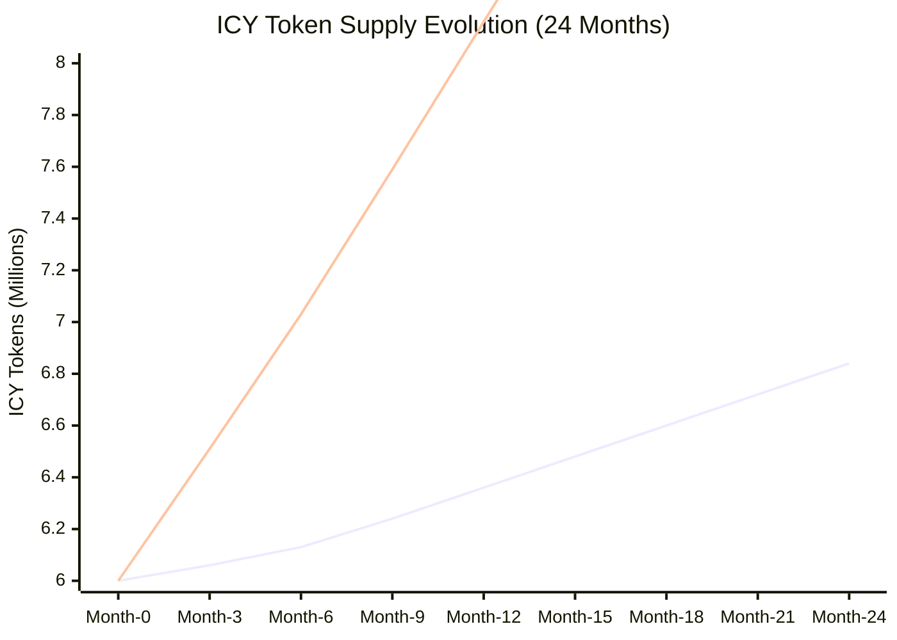
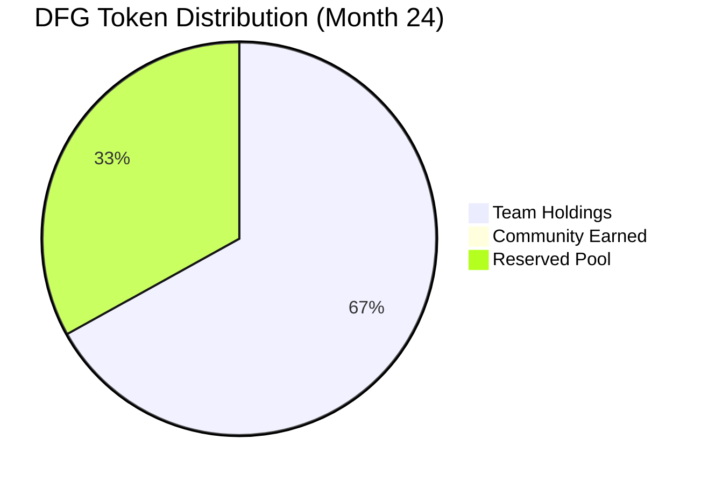
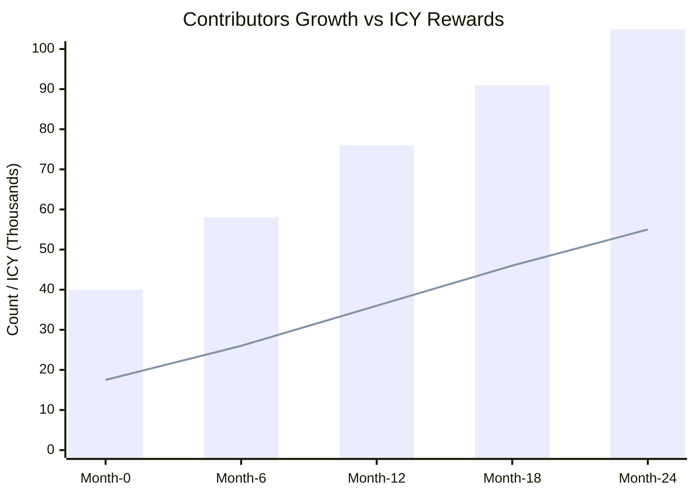
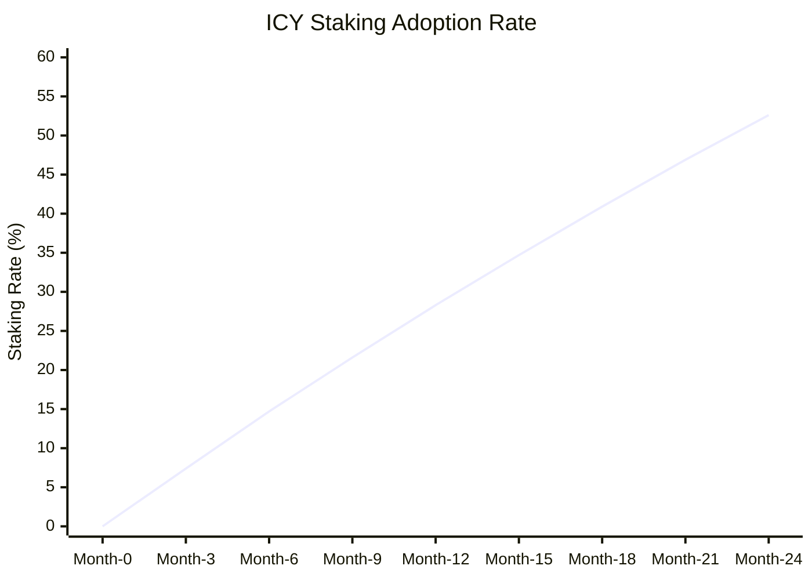
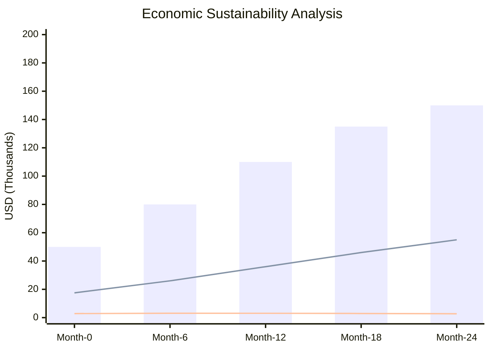
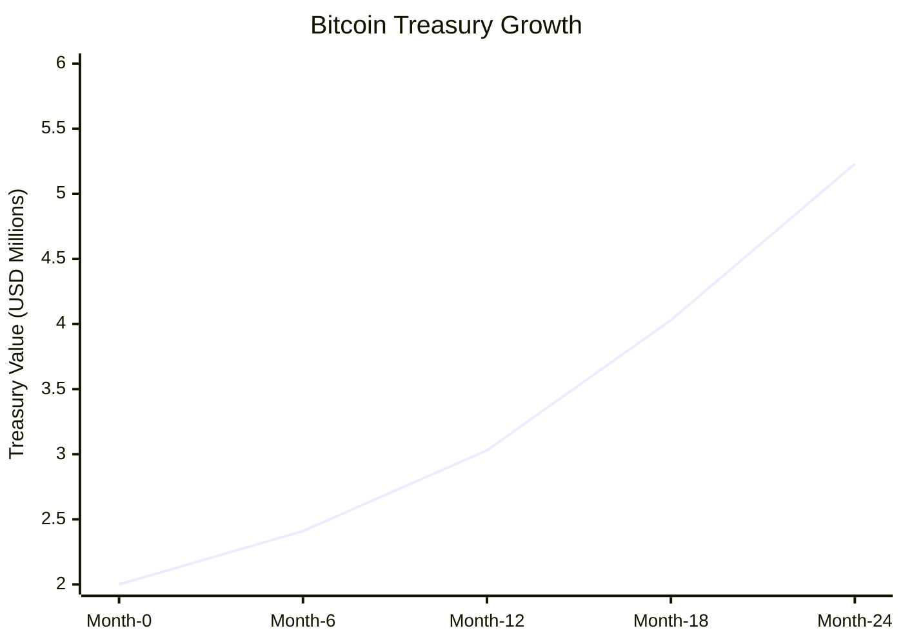
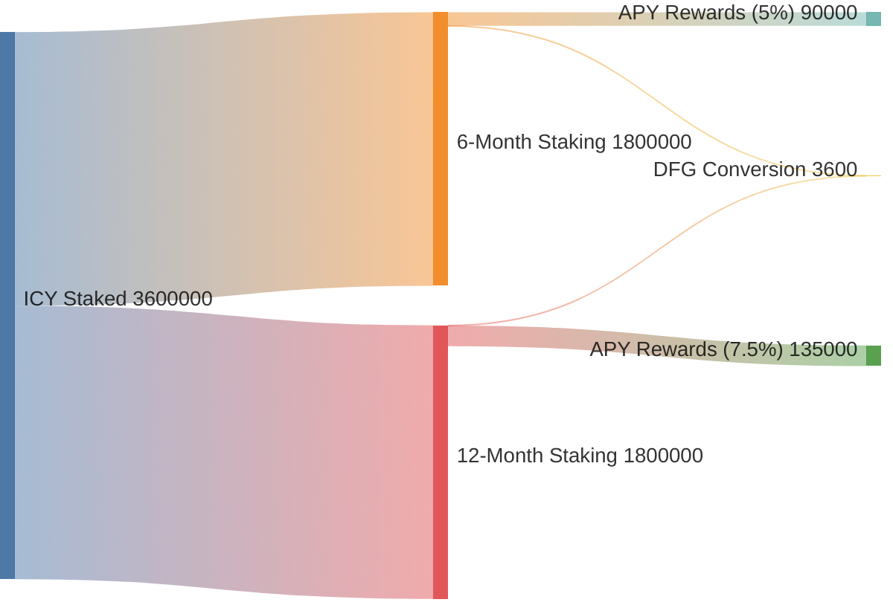
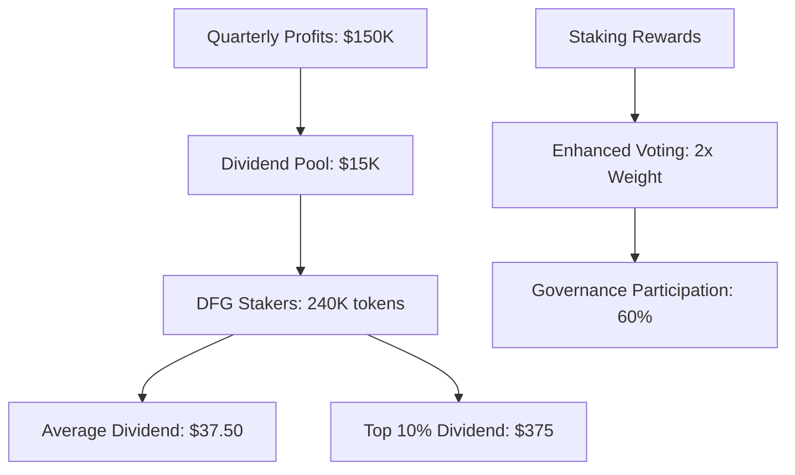

## Chart 1: Token supply evolution

### ICY supply growth over time



### DFG distribution progression



## Chart 2: Contributor growth & activity

### Contributors vs monthly ICY rewards



### Staking participation rate



## Chart 3: Economic sustainability

### Revenue vs token rewards cost



### Treasury growth (BTC value)



## Chart 4: Staking dynamics

### ICY staking rewards distribution



### DFG dividend flow



## Python implementation

### Data visualization code

```python
import matplotlib.pyplot as plt
import numpy as np
import pandas as pd
from datetime import datetime, timedelta

# Simulation data
months = np.arange(0, 25)
contributors = np.linspace(40, 105, 25)
icy_circulating = 6000000 + np.cumsum(np.linspace(0, 838500, 25))
icy_staked = np.linspace(0, 3600000, 25)
dfg_earned = np.maximum(0, (icy_staked / 1000) - 150)  # 6-month delay
revenue = np.linspace(50000, 150000, 25)

# Create comprehensive dashboard
fig, ((ax1, ax2), (ax3, ax4)) = plt.subplots(2, 2, figsize=(15, 12))

# Chart 1: Token Supply Evolution
ax1.plot(months, icy_circulating/1e6, label='Circulating ICY', linewidth=2)
ax1.plot(months, icy_staked/1e6, label='Staked ICY', linewidth=2)
ax1.plot(months, (icy_circulating + icy_staked)/1e6, label='Total ICY', linewidth=2, linestyle='--')
ax1.set_title('ICY Token Supply Evolution', fontsize=14, fontweight='bold')
ax1.set_xlabel('Month')
ax1.set_ylabel('ICY Tokens (Millions)')
ax1.legend()
ax1.grid(True, alpha=0.3)

# Chart 2: Contributors vs Rewards
ax2_twin = ax2.twinx()
ax2.bar(months, contributors, alpha=0.6, label='Contributors', color='skyblue')
ax2_twin.plot(months, (contributors * 500 * (1 + 0.3 * months/24))/1000, 
              color='red', linewidth=2, label='Monthly ICY Rewards (K)')
ax2.set_title('Contributors Growth vs ICY Rewards', fontsize=14, fontweight='bold')
ax2.set_xlabel('Month')
ax2.set_ylabel('Contributors', color='blue')
ax2_twin.set_ylabel('ICY Rewards (Thousands)', color='red')
ax2.legend(loc='upper left')
ax2_twin.legend(loc='upper right')

# Chart 3: Economic Sustainability
sustainability_ratio = revenue / (contributors * 500 * (1 + 0.3 * months/24))
ax3.bar(months, revenue/1000, alpha=0.6, label='Monthly Revenue ($K)', color='green')
ax3.plot(months, sustainability_ratio, color='red', linewidth=2, marker='o', 
         label='Sustainability Ratio')
ax3.axhline(y=2.0, color='red', linestyle='--', alpha=0.7, label='Target Ratio (2.0)')
ax3.set_title('Economic Sustainability Analysis', fontsize=14, fontweight='bold')
ax3.set_xlabel('Month')
ax3.set_ylabel('Revenue ($K) / Ratio')
ax3.legend()
ax3.grid(True, alpha=0.3)

# Chart 4: Staking Dynamics
staking_rate = 0.25 + 0.5 * months / 24
ax4.plot(months, staking_rate * 100, linewidth=3, color='purple', label='Staking Rate (%)')
ax4.fill_between(months, 0, staking_rate * 100, alpha=0.3, color='purple')
ax4.plot(months, dfg_earned/100, linewidth=2, color='gold', label='DFG Earned (Hundreds)')
ax4.set_title('Staking Adoption & DFG Earning', fontsize=14, fontweight='bold')
ax4.set_xlabel('Month')
ax4.set_ylabel('Percentage / DFG (Hundreds)')
ax4.legend()
ax4.grid(True, alpha=0.3)

plt.tight_layout()
plt.show()

# Advanced Analytics
def calculate_token_velocity(circulating, transaction_volume):
    """Calculate token velocity metric"""
    return transaction_volume / circulating

def sustainability_score(revenue, token_cost, treasury_growth):
    """Calculate overall sustainability score"""
    revenue_ratio = revenue / token_cost
    treasury_ratio = treasury_growth / revenue
    return (revenue_ratio * 0.6 + treasury_ratio * 0.4)

# Scenario modeling
scenarios = {
    'optimistic': {'growth_multiplier': 1.25, 'retention_rate': 0.9},
    'base': {'growth_multiplier': 1.0, 'retention_rate': 0.85},
    'conservative': {'growth_multiplier': 0.75, 'retention_rate': 0.8},
    'bear': {'growth_multiplier': 0.5, 'retention_rate': 0.7}
}

def run_scenario(scenario_params, months=24):
    """Run tokenomics simulation for different scenarios"""
    growth_mult = scenario_params['growth_multiplier']
    retention = scenario_params['retention_rate']
    
    contributors = np.minimum(40 * (1 + 0.08 * months * growth_mult)**np.arange(months+1), 
                             105 * growth_mult)
    revenue = 50000 * (1 + 0.1 * months * growth_mult)**np.arange(months+1)
    icy_rewards = contributors * 500 * (1 + 0.4 * np.arange(months+1)/24)
    
    return {
        'contributors': contributors,
        'revenue': revenue,
        'icy_rewards': icy_rewards,
        'sustainability': revenue / icy_rewards
    }

# Generate scenario comparison
fig, ax = plt.subplots(figsize=(12, 8))
colors = ['green', 'blue', 'orange', 'red']
for i, (name, params) in enumerate(scenarios.items()):
    result = run_scenario(params)
    ax.plot(result['sustainability'], label=f'{name.title()} Scenario', 
            color=colors[i], linewidth=2)

ax.axhline(y=2.0, color='black', linestyle='--', alpha=0.7, label='Target Ratio')
ax.set_title('Sustainability Ratio Across Scenarios', fontsize=16, fontweight='bold')
ax.set_xlabel('Month')
ax.set_ylabel('Sustainability Ratio')
ax.legend()
ax.grid(True, alpha=0.3)
plt.show()
```

### Advanced metrics calculation

```python
class TokenomicsSimulator:
    def __init__(self, initial_supply=10000000, initial_contributors=40):
        self.icy_supply = initial_supply
        self.dfg_supply = 1000000
        self.contributors = initial_contributors
        self.treasury_btc = 2000000
        
    def simulate_month(self, month):
        """Simulate one month of protocol activity"""
        # Calculate contributors growth
        new_contributors = min(40 + (65 * month / 24), 105)
        
        # Calculate ICY emissions
        avg_icy_per_contributor = 500 + (200 * month / 24)
        activity_multiplier = 1 + (0.3 * month / 24)
        monthly_icy = new_contributors * avg_icy_per_contributor * activity_multiplier
        
        # Calculate staking
        staking_rate = 0.25 + (0.5 * month / 24)
        staked_icy = self.icy_supply * staking_rate
        
        # Calculate DFG earned (6-month delay)
        dfg_earned = max(0, staked_icy / 1000) if month >= 6 else 0
        
        # Update supply and treasury based on calculations
        # For example, a simplified update to ICY supply:
        self.icy_supply += monthly_icy
        
        return {
            'month': month,
            'contributors': new_contributors,
            'monthly_icy_emissions': monthly_icy,
            'staked_icy': staked_icy,
            'dfg_earned': dfg_earned
        }

# Example usage:
simulator = TokenomicsSimulator()
simulation_results = []
for i in range(25):
    results = simulator.simulate_month(i)
    simulation_results.append(results)

# You can now process simulation_results to create more detailed plots or analyses.
