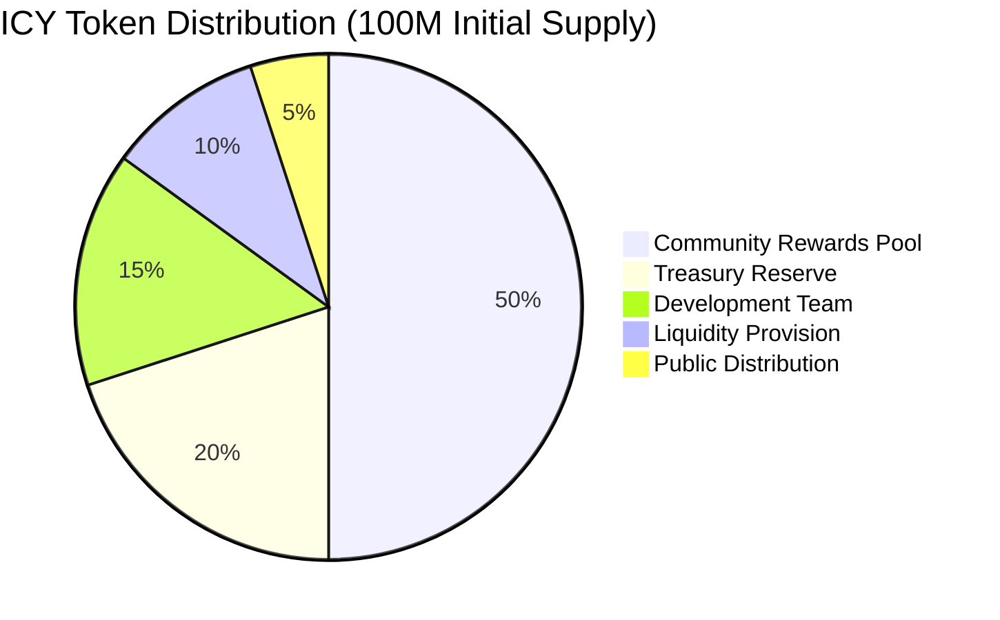
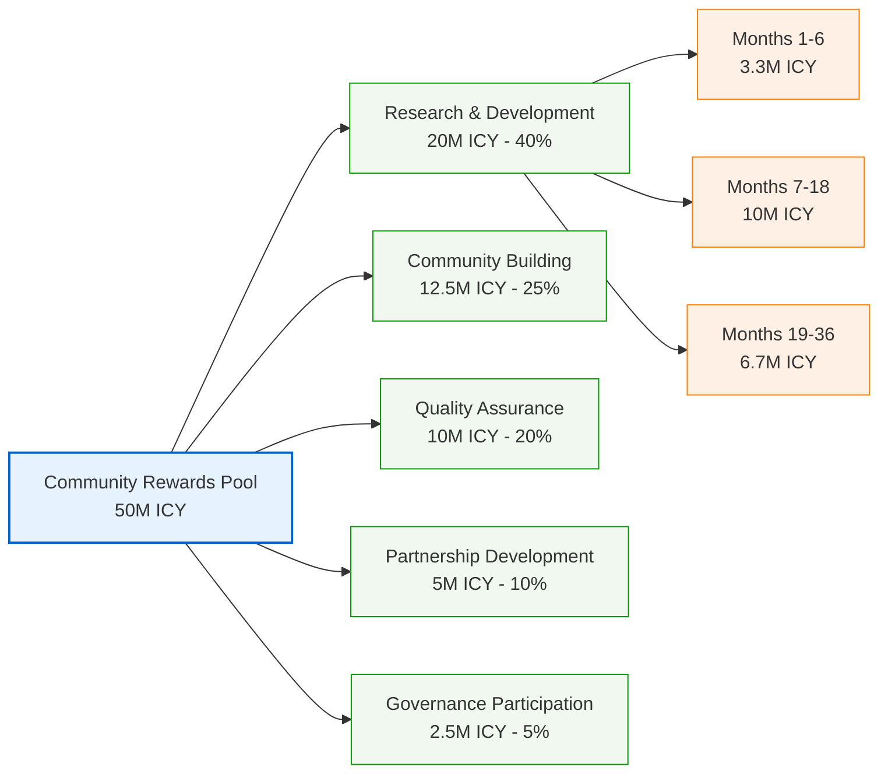
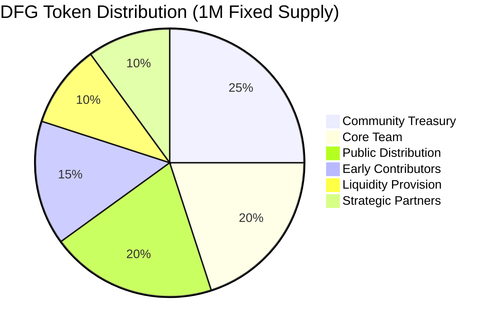

Fair distribution builds trust and prevents concentration risk. The allocation balances community rewards, team incentives, and operational needs while maintaining long-term sustainability.

## Overview

The Dwarves+ Protocol token distribution plan outlines the strategic allocation of both ICY and DFG tokens to ensure sustainable growth, community development, and long-term protocol success. This document details the distribution mechanisms, vesting schedules, and allocation rationales.

## Distribution philosophy

### Core principles

1. **Community first**: Majority allocation to community and contributors
2. **Long-term alignment**: Vesting schedules that encourage sustained participation
3. **Fair distribution**: Equitable access for different stakeholder groups
4. **Growth incentives**: Allocations that drive protocol adoption and development
5. **Transparency**: Clear and public distribution mechanisms

### Strategic objectives

- **Decentralization**: Prevent concentration of token ownership
- **Incentive alignment**: Reward value creation and long-term commitment
- **Liquidity provision**: Ensure adequate token liquidity for healthy markets
- **Community building**: Foster strong, engaged community of contributors
- **Sustainable growth**: Support protocol development and expansion

## ICY token distribution

### Total supply management

- **Initial supply**: 100,000,000 ICY (100M)
- **Maximum supply**: 1,000,000,000 ICY (1B) - hard cap
- **Dynamic issuance**: 2-5% annual inflation based on protocol metrics
- **Burn mechanisms**: Regular token burns to maintain supply balance

### ICY token distribution visualization

### Primary distribution categories

#### 1. Community rewards pool (50% - 50M ICY)

**Purpose**: Incentivize ongoing contributions and community participation

**Allocation breakdown**:

- **Research & development**: 20M ICY (40% of rewards)
- **Community building**: 12.5M ICY (25% of rewards)
- **Quality assurance**: 10M ICY (20% of rewards)
- **Partnership development**: 5M ICY (10% of rewards)
- **Governance participation**: 2.5M ICY (5% of rewards)

**Distribution schedule**:

- **Month 1-6**: 8.3M ICY (16.6% of rewards pool)
- **Month 7-18**: 25M ICY (50% of rewards pool)
- **Month 19-36**: 16.7M ICY (33.4% of rewards pool)

**Eligibility requirements**:

- Identity verification for rewards >100 ICY/month
- Minimum 30-day protocol participation
- Quality score above protocol threshold
- Compliance with community guidelines

#### 2. Development team (15% - 15M ICY)

**Purpose**: Compensate core development team and early contributors

**Team categories**:

- **Core developers**: 8M ICY (53% of team allocation)
- **Protocol architects**: 3M ICY (20% of team allocation)
- **Community managers**: 2M ICY (13% of team allocation)
- **Advisors**: 2M ICY (14% of team allocation)

**Vesting schedule**:

- **Cliff period**: 6 months from token launch
- **Vesting duration**: 36 months linear vesting
- **Monthly release**: 347,222 ICY per month after cliff
- **Early contributor bonus**: 25% bonus for pre-launch contributors

#### 3. Treasury reserve (20% - 20M ICY)

**Purpose**: Protocol development, partnerships, and strategic initiatives

**Reserve categories**:

- **Development fund**: 8M ICY (40% of treasury)
- **Partnership fund**: 5M ICY (25% of treasury)
- **Marketing fund**: 4M ICY (20% of treasury)
- **Emergency fund**: 3M ICY (15% of treasury)

**Release schedule**:

- **Immediate**: 5M ICY for launch activities
- **Year 1**: 6M ICY for growth initiatives
- **Year 2**: 5M ICY for scaling operations
- **Year 3**: 4M ICY for sustainability programs

#### 4. Liquidity provision (10% - 10M ICY)

**Purpose**: Ensure token liquidity and market stability

**Liquidity allocation**:

- **DEX liquidity**: 6M ICY (60% of liquidity allocation)
- **Market making**: 2M ICY (20% of liquidity allocation)
- **Liquidity incentives**: 2M ICY (20% of liquidity allocation)

**Deployment schedule**:

- **Launch**: 4M ICY for initial liquidity
- **Month 3**: 2M ICY for additional pairs
- **Month 6**: 2M ICY for expanded liquidity
- **Month 12**: 2M ICY for Base network liquidity

#### 5. Public distribution (5% - 5M ICY)

**Purpose**: Public access and broader community participation

**Distribution methods**:

- **Community sale**: 2M ICY (40% of public allocation)
- **Airdrops**: 1.5M ICY (30% of public allocation)
- **Bounty programs**: 1M ICY (20% of public allocation)
- **Community events**: 0.5M ICY (10% of public allocation)

**Timeline**:

- **Pre-launch**: Community sale (2M ICY)
- **Launch**: Initial airdrop (0.5M ICY)
- **Months 1-6**: Bounty programs (1M ICY)
- **Ongoing**: Community events (1.5M ICY over 2 years)

## DFG token distribution

### DFG token distribution visualization

### Total supply: 1,000,000 DFG (Fixed Supply)

### Distribution categories

#### 1. Core team (20% - 200K DFG)

**Purpose**: Align core team with long-term protocol success

**Team allocation**:

- **Founders**: 80K DFG (40% of team allocation)
- **Core developers**: 60K DFG (30% of team allocation)
- **Key contributors**: 40K DFG (20% of team allocation)
- **Advisors**: 20K DFG (10% of team allocation)

**Vesting schedule**:

- **Cliff period**: 12 months from token generation
- **Vesting duration**: 48 months linear vesting
- **Monthly release**: 4,167 DFG per month after cliff
- **Acceleration clauses**: Performance-based acceleration for milestones

#### 2. Early contributors (15% - 150K DFG)

**Purpose**: Reward early protocol contributors and supporters

**Contributor categories**:

- **Pre-launch contributors**: 75K DFG (50% of early allocation)
- **Beta testers**: 30K DFG (20% of early allocation)
- **Community leaders**: 30K DFG (20% of early allocation)
- **Strategic advisors**: 15K DFG (10% of early allocation)

**Vesting schedule**:

- **Cliff period**: 6 months from token generation
- **Vesting duration**: 24 months linear vesting
- **Monthly release**: 6,250 DFG per month after cliff
- **Merit bonuses**: Additional allocations for exceptional contributions

#### 3. Community treasury (25% - 250K DFG)

**Purpose**: Community-controlled allocation for protocol development

**Treasury categories**:

- **Contributor incentives**: 100K DFG (40% of treasury)
- **Partnership development**: 50K DFG (20% of treasury)
- **Research grants**: 50K DFG (20% of treasury)
- **Community programs**: 30K DFG (12% of treasury)
- **Emergency reserve**: 20K DFG (8% of treasury)

**Release mechanism**:

- **Governance control**: All releases require governance approval
- **Quarterly reviews**: Regular assessment of treasury usage
- **Proposal system**: Community proposals for treasury allocation
- **Transparency**: Public reporting of all treasury activities

#### 4. Liquidity provision (10% - 100K DFG)

**Purpose**: Provide DFG liquidity for governance participation

**Liquidity strategy**:

- **DEX liquidity**: 60K DFG (60% of liquidity allocation)
- **Lending protocols**: 20K DFG (20% of liquidity allocation)
- **Market making**: 20K DFG (20% of liquidity allocation)

**Deployment schedule**:

- **Launch**: 40K DFG for initial liquidity
- **Month 3**: 20K DFG for additional pairs
- **Month 6**: 20K DFG for expanded liquidity
- **Month 12**: 20K DFG for Base network liquidity

#### 5. Public distribution (20% - 200K DFG)

**Purpose**: Broader community access and market adoption

**Distribution methods**:

- **Community sale**: 100K DFG (50% of public allocation)
- **Airdrops**: 60K DFG (30% of public allocation)
- **Bounty programs**: 40K DFG (20% of public allocation)

**Timeline**:

- **Initial launch**: Community sale (100K DFG)
- **Month 3**: Targeted airdrop (30K DFG)
- **Months 6-12**: Bounty programs (40K DFG)
- **Ongoing**: Community events and contests (70K DFG over 2 years)

#### 6. Strategic partners (10% - 100K DFG)

**Purpose**: Incentivize key partnerships and ecosystem integrations

**Partner categories**:

- **Technology partners**: 40K DFG (40% of partner allocation)
- **Research partners**: 30K DFG (30% of partner allocation)
- **Ecosystem partners**: 30K DFG (30% of partner allocation)

**Vesting schedule**:

- **Cliff period**: 6 months from agreement signing
- **Vesting duration**: 24 months linear vesting
- **Monthly release**: 4,167 DFG per month after cliff
- **Performance clauses**: Linked to partnership milestones and value delivery

## Vesting and lockup mechanisms

### Overview of vesting schedules

| Stakeholder Group | Token Type | Allocation | Cliff Period | Vesting Duration | Monthly Release |
|-------------------|------------|------------|--------------|------------------|-----------------|
| Core Team         | ICY        | 15M ICY    | 6 months     | 36 months        | 347,222 ICY     |
| Core Team         | DFG        | 200K DFG   | 12 months    | 48 months        | 4,167 DFG       |
| Early Contributors | ICY        | 50M ICY    | 0 months     | Dynamic          | Dynamic         |
| Early Contributors | DFG        | 150K DFG   | 6 months     | 24 months        | 6,250 DFG       |
| Strategic Partners | DFG        | 100K DFG   | 6 months     | 24 months        | 4,167 DFG       |

### Detailed vesting schedules

#### Core team ICY vesting

- **Total allocation**: 15,000,000 ICY
- **Cliff**: 6 months
- **Vesting**: 36 months linear after cliff
- **Monthly release**: (15,000,000 / 36) = 416,667 ICY

#### Core team DFG vesting

- **Total allocation**: 200,000 DFG
- **Cliff**: 12 months
- **Vesting**: 48 months linear after cliff
- **Monthly release**: (200,000 / 48) = 4,167 DFG

#### Early contributors DFG vesting

- **Total allocation**: 150,000 DFG
- **Cliff**: 6 months
- **Vesting**: 24 months linear after cliff
- **Monthly release**: (150,000 / 24) = 6,250 DFG

#### Strategic partners DFG vesting

- **Total allocation**: 100,000 DFG
- **Cliff**: 6 months
- **Vesting**: 24 months linear after cliff
- **Monthly release**: (100,000 / 24) = 4,167 DFG

### Lockup mechanisms

- **Staked ICY**: 6 or 12-month lockup for DFG conversion
- **Staked DFG**: 12-month lockup for dividend share and 2x voting weight
- **Liquidity pool tokens**: 12-month initial lockup for seed liquidity

## Governance and transparency

### Decentralized decision-making

- **Proposal review**: Community scrutiny of all token releases
- **Voting**: DFG holders approve or reject release proposals
- **Multi-signature**: All major releases require multi-sig approval

### Transparency and reporting

- **Public dashboard**: Real-time view of all token allocations and releases
- **Audit reports**: Regular third-party audits of distribution smart contracts
- **On-chain verification**: All transactions verifiable on Base chain

## Risk mitigation

### Market manipulation prevention

- **Gradual release**: Prevents large market dumps
- **Vesting schedules**: Aligns incentives with long-term protocol health
- **Liquidity depth**: Reduces price impact of large trades

### Compliance and legal considerations

- **Regulatory review**: Ongoing legal assessment of distribution methods
- **Jurisdictional analysis**: Ensure compliance with target markets
- **KYC/AML**: Implement as required for certain distribution events

## Conclusion

The Dwarves+ Protocol token distribution plan is meticulously designed to foster a sustainable, decentralized, and community-driven ecosystem. By aligning incentives through thoughtful allocations and transparent vesting, we aim to build long-term value and ensure the protocol's success.
