Two tokens solve different problems. ICY handles daily rewards and transactions. DFG enables governance and long-term value capture. Bitcoin backing provides stability and growth potential that pure utility tokens can't match.

## Token architecture

### ICY token (utility token)

#### Core properties

- **Symbol**: ICY
- **Type**: ERC-20 Utility Token
- **Total supply**: Dynamic (starts at 100M, adjusts based on protocol activity)
- **Decimals**: 18
- **Value backing**: Bitcoin-backed through treasury reserves

#### Supply mechanics

- **Inflation rate**: 2-5% annually based on protocol growth
- **Burn mechanisms**:
  - 1% of transaction fees
  - Governance-voted burn events
  - Unused treasury allocations (quarterly burn)
  - Bitcoin-triggered buyback and burn (automatic)
- **Maximum supply**: 1B ICY tokens (hard cap)

#### Value backing system

ICY tokens are backed by Bitcoin held in the protocol treasury, creating a dynamic value floor:

- **Backing ratio**: Variable based on BTC treasury size and ICY circulation
- **Initial conversion**: Approximately 0.00003 BTC per ICY (adjusts with market)
- **Value calculation**: ICY Value = (BTC Treasury Size / ICY Circulation) × BTC Price
- **Liquidity pools**: Separate BTC and ICY pools maintain market pricing

#### Utility functions

1. **Contribution rewards**: Primary reward mechanism for all protocol activities
2. **Staking**: Stake ICY to earn protocol yield and voting power multipliers
3. **Transaction fees**: Pay for premium protocol services
4. **Liquidity provision**: Provide liquidity for protocol DEX pairs
5. **Reputation boost**: Burn ICY to increase contributor reputation scores

#### Earning mechanisms

Contributors earn ICY through verified activities:

| Activity | ICY Reward Range | Verification Method |
|----------|------------------|-------------------|
| Research Publication | 100-1,000 ICY | Peer review + citation metrics |
| Code Contribution | 50-500 ICY | Pull request review + impact assessment |
| Community Engagement | 10-100 ICY | Engagement metrics + quality scores |
| Mentoring | 25-250 ICY | Mentee progress + feedback ratings |
| Partnership Development | 200-2,000 ICY | Deal value + success metrics |
| Bug Bounty | 100-5,000 ICY | Severity level + fix verification |

### DFG token (governance token)

#### Core properties

- **Symbol**: DFG
- **Type**: ERC-20 Governance Token
- **Total supply**: 10M DFG (fixed supply)
- **Decimals**: 18
- **Initial price**: $10.00 (bootstrap pricing)

#### Supply distribution

- **Core team**: 20% (2M DFG) - 4-year vesting
- **Early contributors**: 15% (1.5M DFG) - 2-year vesting
- **Community treasury**: 25% (2.5M DFG) - governance-controlled
- **Liquidity provision**: 10% (1M DFG) - immediate
- **Strategic partners**: 10% (1M DFG) - negotiated vesting
- **Public distribution**: 20% (2M DFG) - various methods

#### Governance rights

1. **Proposal submission**: Minimum 1,000 DFG required
2. **Voting power**: 1 DFG = 1 vote (with staking multipliers)
3. **Dividend rights**: Quarterly profit distribution to DFG holders
4. **Treasury access**: Vote on treasury fund allocation
5. **Protocol upgrades**: Vote on technical and economic changes

#### Dividend mechanism

- **Source**: Protocol revenue from consulting, partnerships, and services
- **Distribution**: 70% to DFG holders, 30% to protocol treasury
- **Frequency**: Quarterly distributions
- **Calculation**: Pro-rata based on DFG holdings and staking duration

## Bitcoin-backed value layer

### Treasury management strategy

#### Bitcoin acquisition principles

1. **Gradual and scheduled purchase**
   - **Dollar-cost averaging**: Regular, consistent BTC purchases regardless of price
   - **Schedule**: Monthly purchases from consulting profits (10-15% of revenue)
   - **Transparency**: Public announcement of purchase schedule and amounts
   - **Market timing**: Additional purchases during significant price corrections
   - **Anti-speculation**: Avoid large one-off purchases to prevent market manipulation

2. **Profit allocation framework**
   - **Source**: Consulting business profits (from existing 10-15% treasury reserve)
   - **Conversion**: Automatic conversion of allocated profits to Bitcoin
   - **Frequency**: Monthly conversion aligned with financial reporting cycles
   - **Minimum threshold**: $10,000 minimum per purchase to optimize fees

#### Treasury composition

- **Bitcoin reserve**: 60-80% of treasury value in BTC
- **Stablecoin buffer**: 15-25% in USDC/USDT for operational expenses
- **Protocol tokens**: 5-15% in ICY/DFG for ecosystem support

### ICY buyback and burn mechanism

#### Automatic triggers

1. **Bitcoin growth trigger**
   - **Threshold**: When BTC treasury grows >20% month-over-month
   - **Action**: Automatic buyback of 5-10% of monthly ICY trading volume
   - **Execution**: Gradual buyback over 1-2 weeks to minimize price impact

2. **Surplus profit trigger**
   - **Threshold**: When monthly profits exceed 150% of 6-month average
   - **Action**: Convert 25% of excess profits to ICY buyback
   - **Burn**: Immediate burn of purchased ICY tokens

#### Governance-controlled burns

1. **Quarterly review burns**
   - **Frequency**: Every quarter based on treasury health
   - **Proposal**: DFG holders vote on burn amounts (minimum 1,000 DFG to propose)
   - **Execution**: Burns between 0.1-2% of circulating ICY supply

2. **Strategic burns**
   - **Purpose**: Market stabilization or value enhancement
   - **Threshold**: Requires 60% DFG holder approval
   - **Limits**: Maximum 5% of circulating supply per year

### Transparent treasury dashboard

#### Real-time metrics

1. **Bitcoin holdings**
   - Current BTC amount and USD value
   - Historical purchase prices and dates
   - Average cost basis and unrealized gains/losses
   - Percentage of total treasury in BTC

2. **ICY token metrics**
   - Current backing ratio (BTC per ICY)
   - Circulating supply and recent burns
   - Value floor based on BTC backing
   - Liquidity pool status and depth

3. **DFG token metrics**
   - Total supply and distribution status
   - Staking participation rates
   - Governance proposal activity
   - Dividend distribution schedule

4. **Operational transparency**
   - Monthly profit allocation to BTC purchases
   - Upcoming scheduled BTC purchases
   - Recent buyback and burn activities
   - Treasury diversification ratios

### Risk management

#### Volatility mitigation

1. **Scheduled purchases**: Regular buying reduces timing risk
2. **Diversified holdings**: Not 100% BTC to manage volatility
3. **Gradual adjustments**: Slow changes to backing ratios
4. **Community communication**: Advance notice of major treasury changes

#### Liquidity management

1. **Stablecoin reserves**: Maintain operational liquidity
2. **Staged withdrawals**: Gradual ICY redemptions to prevent runs
3. **Emergency funds**: 3-6 months operational expenses in stablecoins
4. **Market making**: Protocol-owned liquidity in DEX pools

## Economic flows

### ICY & DFG token economics flow

```mermaid
flowchart TD
    Contributors[Contributors 🌐] --> Contribute[Contribute]
    Contribute --> Protocol[Dwarves+ Protocol]
    
    %% Activity Chairs
    Contribute --> Engagement[Engagement & Integration]
    Contribute --> Delivery[Delivery & Consulting]
    Contribute --> Learning[Learning & Training]
    Contribute --> Marketing[Marketing & Communication]
    Contribute --> Sales[Sales & Partnership]
    
    %% ICY Flow
    Protocol --> EarnICY[Earn 💧ICY]
    EarnICY --> Accumulate[Accumulate]
    EarnICY --> StakeICY[Stake 💧ICY]
    StakeICY --> EarnDFG[Earn 💎DFG]
    
    %% DFG Flow
    Protocol --> BeStakeholder[Be a Stakeholder]
    BeStakeholder --> StakeDFG[Stake 💎DFG]
    EarnDFG --> Invest[Invest]
    
    %% Governance & Profits
    StakeDFG --> Vote[Vote 🗳️]
    StakeDFG --> Profit[Profit 💰]
    
    %% Revenue Sources
    ConsultingRevenue[Consulting Revenue 💵] --> Profit
    ProtocolFees[Protocol Fees 💸] --> Profit
    LiquidityPools[Liquidity Pools 🌊] --> Treasury[Treasury 🏦]
    
    %% Bitcoin Treasury Layer
    Profit --> BTCPurchase[BTC Purchase 🟠]
    BTCPurchase --> BTCTreasury[BTC Treasury 🟠]
    BTCTreasury --> ICYBacking[ICY Value Backing 💧]
    BTCTreasury --> BuybackBurn[ICY Buyback & Burn 🔥]
    
    %% Profit Distribution
    Profit --> Dividends[Dividends 💎]
    Profit --> Treasury
    Profit --> Reinvestment[Reinvestment 🔄]
    
    %% Dashboard Transparency
    BTCTreasury --> Dashboard[Public Dashboard 📊]
    ICYBacking --> Dashboard
    EarnICY --> Dashboard
    StakeDFG --> Dashboard
    
    %% Styling
    classDef tokenICY fill:#87CEEB,stroke:#4682B4,stroke-width:2px
    classDef tokenDFG fill:#FFD700,stroke:#DAA520,stroke-width:2px
    classDef revenue fill:#90EE90,stroke:#228B22,stroke-width:2px
    classDef governance fill:#DDA0DD,stroke:#9370DB,stroke-width:2px
    classDef bitcoin fill:#F7931A,stroke:#FF8C00,stroke-width:3px
    
    class EarnICY,StakeICY,Accumulate,ICYBacking tokenICY
    class BeStakeholder,EarnDFG,StakeDFG,Vote,Profit,Dividends tokenDFG
    class ConsultingRevenue,ProtocolFees revenue
    class Engagement,Delivery,Learning,Marketing,Sales governance
    class BTCPurchase,BTCTreasury,ICYBacking,BuybackBurn bitcoin
    class Treasury,Reinvestment,Dashboard default
```

### Key economic flows

- **Contributor value loop**: Contributors earn ICY for contributions, incentivizing ongoing participation.
- **DFG governance loop**: Staked DFG grants governance power and dividend share, aligning long-term holders.
- **Bitcoin treasury integration**: Bitcoin profits enhance ICY value and fund protocol development.
- **Burn mechanisms**: Reduce token supply, creating deflationary pressure and supporting value.
- **Revenue recycling**: Protocol revenue is distributed as dividends and reinvested for growth.

## Economic parameters

### ICY token parameters

- **Initial supply**: 100,000,000 ICY
- **Maximum supply**: 1,000,000,000 ICY
- **Annual inflation**: 2-5% (governance-adjustable)
- **Transaction fee burn**: 1% of all ICY transactions
- **Staking APY**: 5-20% (variable based on lock-up and tier)
- **Bitcoin buyback trigger**: >20% monthly BTC treasury growth

### DFG token parameters

- **Total supply**: 10,000,000 DFG (fixed)
- **Proposal threshold**: 1,000 DFG
- **Voting quorum**: 10-20% of circulating DFG
- **Dividend share**: 70% of protocol revenue
- **Staking multiplier**: Up to 2x voting weight for 12-month lock-up

## Governance and decision-making

### Parameter adjustment

- **Governance proposals**: DFG holders can propose changes to token parameters.
- **Voting period**: 7 days for most economic proposals.
- **Execution**: Multi-signature treasury control for parameter changes.

### Treasury allocation

- **Community proposals**: DFG holders vote on treasury fund allocations.
- **Quarterly reviews**: Regular assessment of treasury performance and utilization.
- **Emergency funds**: Governance can approve emergency releases for critical situations.

## Conclusion

The Dwarves+ Protocol tokenomics design creates a robust, self-sustaining ecosystem. By intertwining utility (ICY) and governance (DFG) tokens with a Bitcoin-backed treasury, the model incentivizes value creation, fosters decentralized decision-making, and ensures long-term sustainability and growth. This design promotes a meritocratic, community-driven approach to research and development, setting a new standard for decentralized organizations.
