A token needs real reasons to be used, held, and valued beyond speculation. ICY utility design focuses on productive uses that benefit both individual holders and the protocol ecosystem.

## Overview

The ICY token serves as the economic engine of the Dwarves+ Protocol, facilitating value exchange, incentivizing contributions, and maintaining protocol health. With Bitcoin treasury backing, ICY tokens now have additional value stability and growth potential tied to Bitcoin appreciation.

## Utility design philosophy

### Core principles

1. **Productive utility**: Every ICY use case creates value for the protocol
2. **Circulation incentives**: Mechanisms that encourage healthy token circulation
3. **Value capture**: Utility functions that capture and redistribute value
4. **Anti-speculation**: Design that favors utility over speculation
5. **Sustainable growth**: Utility that scales with protocol adoption
6. **Bitcoin-backed stability**: Value floor protection through BTC treasury reserves

## ICY token utility framework

### Primary utilities

#### 1. Contribution rewards

**Purpose**: Incentivize valuable protocol contributions
**Mechanism**: Algorithmic distribution based on contribution assessment
**Circulation impact**: High - constant inflow to active contributors

**Reward categories**:

- **Research & development**: 40% of total rewards
- **Community building**: 25% of total rewards
- **Quality assurance**: 20% of total rewards
- **Partnership development**: 10% of total rewards
- **Governance participation**: 5% of total rewards

**Reward multipliers**:

- **New contributor bonus**: 1.5x for first 3 months
- **Consistency bonus**: 1.2x for contributors active >6 months
- **Quality bonus**: 1.3x for top-rated contributions
- **Leadership bonus**: 1.4x for activity chair members
- **Staking bonus**: 1.1-1.5x based on staking tier

#### 2. Staking and yield generation

**Purpose**: Encourage long-term holding and provide passive income
**Mechanism**: Time-locked staking with variable APY
**Circulation impact**: Medium - removes tokens from circulation temporarily

**Staking tiers**:

| Lock Period | Base APY | Bonus Features |
|-------------|----------|----------------|
| 30 days | 5% | Early unstaking (2% penalty) |
| 90 days | 8% | Governance vote weight +10% |
| 180 days | 12% | Priority project access |
| 365 days | 18% | Maximum governance bonuses |

**Yield sources**:

- **Protocol revenue**: 30% of staking rewards
- **DeFi strategies**: 25% of staking rewards
- **Bitcoin treasury growth**: 25% of staking rewards (BTC appreciation benefits)
- **Partnership fees**: 15% of staking rewards
- **Treasury yield**: 5% of staking rewards

#### 3. Service payments and fees

**Purpose**: Monetize premium protocol features and services
**Mechanism**: Direct payment for enhanced services
**Circulation impact**: High - creates burn pressure and utility demand

**Premium services**:

- **Priority support**: 50 ICY/month for expedited assistance
- **Advanced analytics**: 100 ICY/month for detailed metrics
- **Project showcase**: 200 ICY for featured project listing
- **Mentorship matching**: 25 ICY per successful match
- **Certification programs**: 500-2,000 ICY per certification

#### 4. Governance participation

**Purpose**: Enable community governance and decision-making
**Mechanism**: Staking for enhanced voting power and proposal rights
**Circulation impact**: Low - primarily staking-based

**Governance features**:

- **Vote weight multiplier**: Up to 2x with maximum staking
- **Proposal submission**: 100 ICY fee (refunded if approved)
- **Delegation rewards**: 1% of staked ICY annually for delegates
- **Committee participation**: 50 ICY/month for active committee members

#### 5. Reputation and social features

**Purpose**: Build contributor reputation and social dynamics
**Mechanism**: Voluntary burning for reputation enhancement
**Circulation impact**: High - permanent token removal

**Reputation system**:

- **Skill badges**: 10-100 ICY to claim verified skills
- **Profile enhancement**: 25 ICY for premium profile features
- **Reputation boost**: 50-500 ICY for reputation score increases
- **Social features**: 5-20 ICY for social interactions and endorsements

### Secondary utilities

#### 6. Liquidity provision

**Purpose**: Maintain token liquidity and earn yield
**Mechanism**: Automated market making and liquidity pools
**Circulation impact**: Medium - tokens locked in liquidity provision

**Liquidity incentives**:

- **ICY/ETH pool**: 15% APY + trading fees
- **ICY/USDC pool**: 12% APY + trading fees
- **ICY/DFG pool**: 20% APY + trading fees
- **Impermanent loss protection**: 50% coverage for long-term LPs

#### 7. Marketplace transactions

**Purpose**: Facilitate peer-to-peer value exchange
**Mechanism**: Escrow and payment for marketplace services
**Circulation impact**: High - active trading and exchange

**Marketplace features**:

- **Skill marketplace**: Hire contributors for specific tasks
- **Knowledge marketplace**: Buy/sell research and insights
- **Tool marketplace**: Access to premium development tools
- **NFT marketplace**: Trade research IP and contributor achievements

## Bitcoin treasury integration

### Value backing mechanism

The Bitcoin treasury provides ICY tokens with a dynamic value floor, creating additional utility benefits:

#### Direct benefits

1. **Value floor protection**: ICY tokens cannot fall below the Bitcoin backing ratio
2. **Appreciation upside**: ICY benefits from Bitcoin price appreciation
3. **Market confidence**: Treasury backing reduces volatility concerns
4. **Long-term value**: Bitcoin's deflationary nature supports ICY growth

#### Indirect benefits

1. **Staking attractiveness**: Bitcoin backing makes staking more appealing
2. **Contribution incentives**: More valuable rewards encourage participation
3. **Network effects**: Stronger token economics attract more contributors
4. **Partnership value**: Bitcoin backing enhances partnership negotiations

### Treasury-linked utilities

#### 1. Bitcoin-backed staking rewards

- **Enhanced APY**: Base staking rates plus Bitcoin appreciation share
- **Value floor guarantee**: Staked ICY backed by minimum Bitcoin ratio
- **Appreciation bonus**: Additional rewards during Bitcoin growth periods
- **Treasury health bonus**: Extra rewards when treasury exceeds targets

#### 2. Bitcoin growth participation

- **Growth sharing**: Long-term holders benefit from Bitcoin treasury appreciation
- **Buyback benefits**: Automatic ICY buybacks when Bitcoin treasury grows
- **Value compounding**: Treasury growth compounds with protocol growth
- **Market cycles**: Benefits from Bitcoin's long-term appreciation trends

#### 3. Stability premium services

- **Stable value services**: Premium services priced based on Bitcoin backing
- **Treasury-linked pricing**: Service costs adjust with treasury health
- **Value guarantee programs**: Services with Bitcoin-backed value guarantees
- **Premium staking tiers**: Enhanced staking with treasury backing benefits

### Bitcoin treasury value flow

```mermaid
flowchart TD
    subgraph "Revenue Sources"
        ConsultingProfits[Consulting Profits 💵]
        PartnershipFees[Partnership Fees 🤝]
        ServiceRevenue[Service Revenue 🛠️]
    end
    
    subgraph "Treasury Management"
        TreasuryAllocation{Treasury Allocation<br/>10-15% of Profits}
        BTCPurchase[Bitcoin Purchase 🟠<br/>Monthly DCA]
        BTCTreasury[Bitcoin Treasury 🟠<br/>60-80% Allocation]
        StablecoinReserve[Stablecoin Reserve 💰<br/>15-25% for Operations]
    end
    
    subgraph "ICY Token Benefits"
        ValueFloor[ICY Value Floor 💧<br/>BTC Backing Ratio]
        AppreciationShare[Appreciation Sharing 📈<br/>BTC Growth Benefits]
        BuybackTrigger[Automatic Buyback 🔄<br/>>20% Treasury Growth]
        StakingRewards[Enhanced Staking 🏆<br/>BTC Appreciation Bonus]
    end
    
    subgraph "Community Benefits"
        Contributors[Contributors 👥<br/>Better Rewards]
        Stakers[Stakers 🔒<br/>Bitcoin Exposure]
        LongTermHolders[Long-term Holders 💎<br/>Value Appreciation]
    end
    
    %% Revenue Flow
    ConsultingProfits --> TreasuryAllocation
    PartnershipFees --> TreasuryAllocation
    ServiceRevenue --> TreasuryAllocation
    
    %% Treasury Flow
    TreasuryAllocation --> BTCPurchase
    BTCPurchase --> BTCTreasury
    TreasuryAllocation --> StablecoinReserve
    
    %% Bitcoin Benefits Flow
    BTCTreasury --> ValueFloor
    BTCTreasury --> AppreciationShare
    BTCTreasury --> BuybackTrigger
    BTCTreasury --> StakingRewards
    
    %% Community Impact
    ValueFloor --> Contributors
    AppreciationShare --> Stakers
    BuybackTrigger --> LongTermHolders
    StakingRewards --> Contributors
    
    %% Feedback Loop
    Contributors --> ConsultingProfits
    
    %% Styling
    classDef revenue fill:#90EE90,stroke:#228B22,stroke-width:2px
    classDef treasury fill:#F7931A,stroke:#FF8C00,stroke-width:2px
    classDef icy fill:#87CEEB,stroke:#4682B4,stroke-width:2px
    classDef community fill:#DDA0DD,stroke:#9370DB,stroke-width:2px
    
    class ConsultingProfits,PartnershipFees,ServiceRevenue revenue
    class BTCPurchase,BTCTreasury,StablecoinReserve treasury
    class ValueFloor,AppreciationShare,BuybackTrigger,StakingRewards icy
    class Contributors,Stakers,LongTermHolders community
```

### Treasury impact on circulation

#### Enhanced circulation drivers

- **Contribution rewards**: Regular issuance of ICY to contributors drives immediate circulation
- **Service payments**: ICY spent on premium services recirculates into the protocol treasury
- **Liquidity provision**: ICY is locked in pools, reducing immediate selling pressure but facilitating trading
- **Staking rewards**: Earned ICY can be re-staked or spent, creating demand
- **Marketplace transactions**: ICY used for peer-to-peer exchanges increases velocity

#### Factors affecting velocity

- **Staking rates**: Higher staking rates reduce circulating supply, impacting velocity
- **Holding incentives**: Long-term holder benefits (e.g., DFG conversion) reduce selling
- **Utility expansion**: New ICY use cases increase demand and velocity
- **Market sentiment**: Bullish markets tend to increase velocity

## ICY token lifecycle

### Token generation and issuance

- **Initial supply**: 100M ICY at launch
- **Dynamic minting**: Controlled inflation (2-5% annually) based on protocol growth
- **Minting triggers**: Activated by governance, tied to key performance indicators
- **Transparency**: All minting events publicly recorded on Base network

### Circulation and usage

- **Contributor earning**: Primary inflow into circulation
- **Service consumption**: ICY spent on premium services (burn/reallocate)
- **Staking**: Removal from active circulation to earn yield
- **Trading**: Exchange on DEXs for other cryptocurrencies
- **DFG conversion**: Conversion of staked ICY to DFG at specific milestones

### Burn and deflationary mechanisms

- **Transaction fees**: 1% of all protocol transaction fees are burned
- **Reputation burns**: Voluntary burning for profile enhancement
- **Governance burns**: Quarterly burns approved by DFG holders
- **Automatic buyback & burn**: Triggered by Bitcoin treasury growth
- **Service consumption**: ICY used for certain services may be burned

## Conclusion

The Dwarves+ Protocol utility economics are designed to create a vibrant, self-sustaining ecosystem for the Dwarves+ Protocol. By incentivizing productive contributions, fostering long-term holding through staking, and integrating Bitcoin backing for stability, ICY aims to be a robust and valuable utility asset that scales with the protocol's success.
