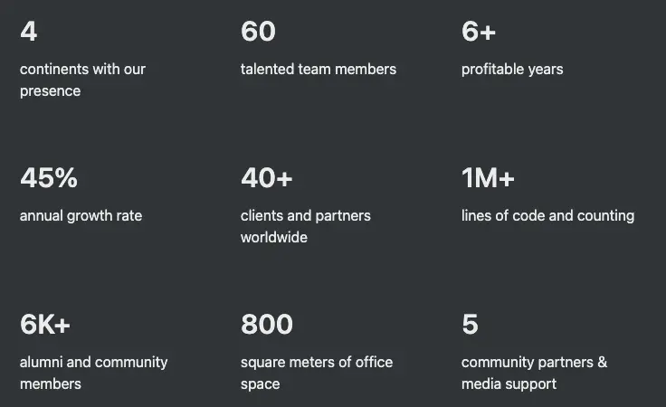
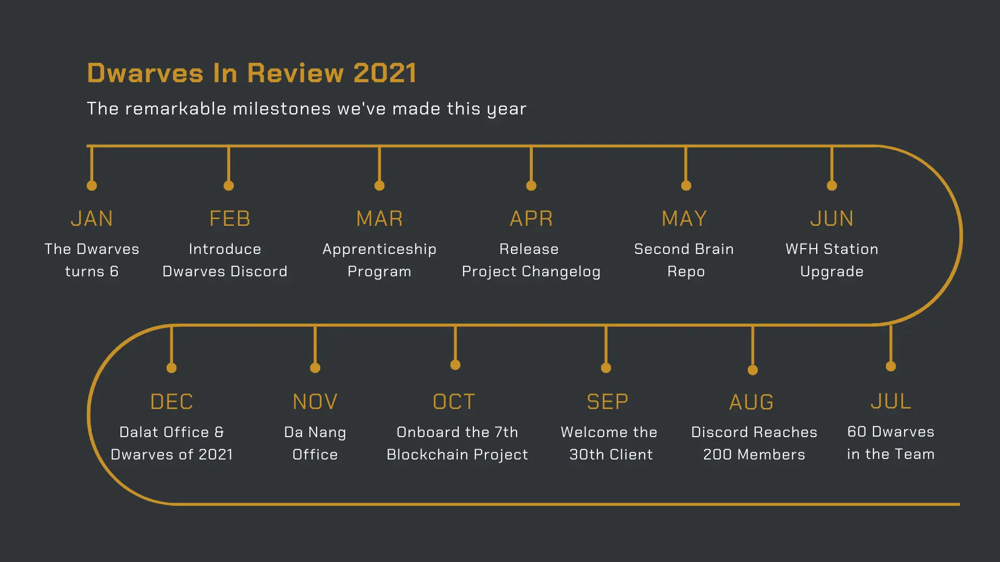
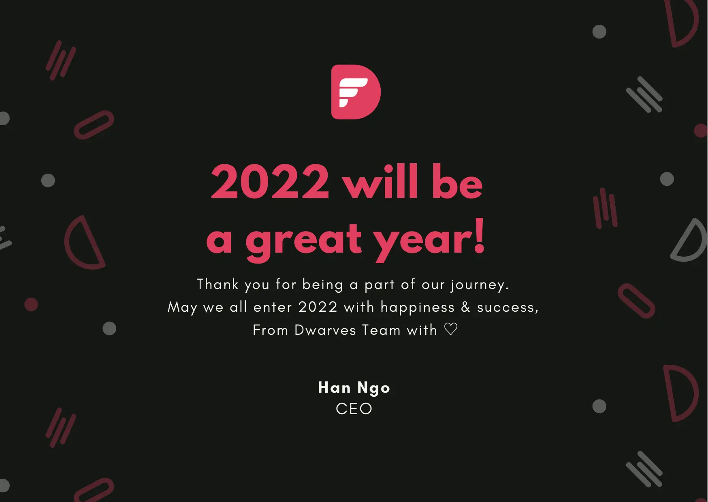

Hey, it’s Han and Nikki in your inbox again. On behalf of the entire Dwarves team, happy 2022!

For us 2021 is eventful, and memorable. It was full of changes and challenges, but our can-do mindset made us gritty. While we didn’t have all the answers, we decided to just try and do. As we state in our [Agile Minifesto](https://dwarves.foundation/manifesto): fail fast, learn often, and it's okay to start over.

The results were beyond our expectation. We got to collaborate with several great clients and partners, including [Setel](http://setel.com), [Momos](http://momos.io), [Mudah](http://mudah.my), [Attrace](http://attrace.com), [SP Group](http://spgroup.com.sg), [Vietcetera](http://vietcetera.com), [WeBuild](http://webuild.community) and many more. We automated most of our operations using Notion, Basecamp and our very own self-built Fortress. We formed a team specialized in blockchain & web3. And along the way, we did everything we can to level up our team.

We wouldn’t have made it without everyone reading this email right now. So to say, we’re incredibly grateful to you, the one trusting us enough to offer us those dream collaborations, evangelizing our services and participate in helping us scaling and up-leveling our team.

## 2021 - a year of innovative reconstruction, dream collaborations and our journey to be better
### In numbers

### In timeline

### More room for like-minded people
As long as it's someone who is good at what they do and sees things the same way we do, then it's a yes - we’d love to have you here!

Our people is our greatest asset. That's why most of our effort goes into hiring the right people, giving them our absolute support to grow with us.
- Reached 60 engineers on the team.
- Recruited only mid & senior engineers everywhere in Vietnam.
- More teammates took on leading & mentoring roles
- Increased compensation and benefits for every Dwarves.
- Issued Dwarves Token to reward positive contributions.
- Refined engineering career ladder & mentorship, raising the bar.
- Facilitated training and learning team-wise.

### Advancing in tech
Throughout 2021, our bet was on the Web3, the Open Internet, and the next-gen automation software using AI and Big Data.
- 6+ blockchain-based projects onboard.
- Blockchain development team reached 20 Dwarves.
- Active study groups organized by the Dwarves themselves.

### New business directions and new partnerships
We’re at a stage where we have the chance to get involved in different kinds of projects. Our new business direction and project decisions brought us to:

- Got bigger partnerships with certain restriction in number of deployed head counts.
- Shifted gradually from outsourcing to software consulting.
- Engineers involved in project decisions and hiring for projects.
- Engineers got to work and deliver as a team.

Also, now you can visit Dwarves and have a good time at 4 different locations in Vietnam; HCMC, Danang, Hanoi, Dalat.

## So what's in store for 2022?
As a profitable and fast-moving company, the possibilities ahead of us are limitless. Dwarves 2.0 for us is about finding a great mix of quality and quantity, and becoming greater at what we are already good at.

- **Doubling down on blockchain & web3**. We are never to stay behind when it comes to tech.
- **Partnering with even more fantastic teams** and ship more top-notch products. We want to help more and more businesses to be able to leverage technology.
- **Leveling up**. We are going to be a team that knows how to build software right, and is able to teach others on that.
- **Scaling up**. We are expanding the team and hope to reach those with the same DNAs. If you know someone who might be interested, send them to **[Dwarves Careers](https://memo.d.foundation/careers/hiring/).**

That's just a small part in our backlog, we are going to try our hands at many different things.

**Here's to many more great products, meaningful partnerships and friendships, experiments and experiences, challenges and opportunities.**

Onward and upward,

Han & Nikki.