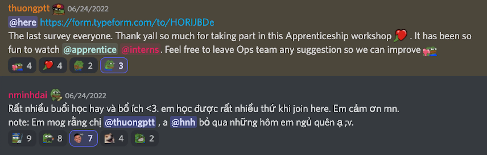

It’s Han and Nikki here,

Plus an extra fresh voice we’re bringing to Dwarves Updates, in hope we can offer you more engineering-related insights and thoughts.

If you’re a part of our Discord server, you probably have noticed #blockchain is our most busy channel. It’s partially because of all the fusses within the crypto scene, but mainly because we’re aggressively learning, experimenting, and evolving on our blockchain expertise.

The data study group is also getting exciting. We’re seeing more learning notes submitted in our Brainery than ever before, making all the rewards, time and effort we invest in this industry fairly justify.

In this month's edition, [Thanh Pham](https://www.linkedin.com/in/thanh-pham-466326108/), our engineering manager took the stage. He shares how Dwarves are prepping designers and engineers for the next few years, even the next few decades. So they get the upper hand when trends shift and technologies change.

- Our view on the direction of data
- Blockchain as a career path for software engineers
- Learning as the north-star metric
- Apprenticeship Updates

### Our view on the direction of data.
2018, our bet was blockchain because we saw its endless possibilities, we weren’t wrong. Since then, we have successfully launched a team of 20 folks, focusing solely on building and shipping awesome blockchain products worldwide.

2022, our bet goes to data. Here are the signals:

- We've been seeing more demand for data engineers and analysts in the market.
- Data engineers and analysts enjoy a slightly higher paycheck than software engineers.
- More and more enterprises are making use of big data to achieve business benefits.
- Smaller businesses are facing the challenge of organizing data such that it can help us better answer business questions.

These signals mean the data market is full of potential, but the number of good data engineers and analysts is still few and far between.

As a tech firm, our end-game for data lies in data science, AI, and machine learning. AI and machine learning help disaggregate data through inductive reasoning, find and associate patterns naturally, such as for video depth maps, and let it find ways to train and learn by itself. It’s the perfect combo.

With the direction set, for months we’ve been prepping research and discussion environments to encourage engineers to take a closer and more novel look at data, every ins and outs.

The knowledge, experience and insights we learn become talking/discussion points for our **Weekly Radio Talk (Monday 10AM UTC on Dwarves Discord)**.

Since we’re big on sharing, we will also be hosting podcasts for our community, notably to share ideas about data. This is somewhat similar to Rado Talk, except no presentation, just lots of discussions, questions, and some good banter from time to time.

We hope this casual format will allow us to invite community members to express their thoughts more casually, give us insights that we may have overlooked, and make the topic around data more involved. We’re open to everyone who looks to share and discuss tech, send a ping via [**our Discord**](http://discord.gg/dwarvesv) and we’ll talk asap.

### Blockchain as a career path
The blockchain movement shapes up and integrates into every of our business decisions. It all starts with projects, training & team knowledge base.

We got a chance to sit down with **[Ngoc Thanh](https://www.linkedin.com/in/pham-ngoc-thanh-99626249/), Sr. Blockchain Engineer**. With over 10 years in software development, and has led 5 blockchain projects, his sentiment on blockchain initiates multiple things we do to uplift the team's knowledge base.

> “It no longer stays as a platform where you build and develop an application. Blockchain offers an open platform and foundation to create a decentralized application and its ecosystem. The foundation of blockchain derives from the backend technique. But as time goes by, its potential bypasses all the ongoing notions of software engineering.”

He stated once people place reliance on blockchain technology and its ability, it grows as a burgeoning software foundation. From what he concepts, blockchain opens other career paths alongside frontend or backend engineering. It's an alternative to exploring and surpassing one's seniority.

Check out the full read [here](https://www.notion.so/DF-Apprenticeship-2022-Meet-The-Mentors-Ngoc-Thanh-Pham-a6f8c3c7d4a14bd5be55d6465b9f330b?pvs=21).

Thanh, along with other team leads and senior engineers at Dwarves are looking for talented people to join their squads. Email us at [spawn@dwarvesv.com](mailto:spawn@dwarvesv.com) if you’re interested in joining them.

### Learning as the north-star metric
Dwarves equal constant learning and sharing. Last month, our theme was Blockchain Concepts and Frontend Guidance.

The team was having a blast. **June's Brainery sees a 116% input increase compared to May's.** And here's the best thing: We got the first community contributors this time. Pretty dope.

With **Dwarves Sponsorship**, all contributors receive an appreciation reward from us, for the effort they spent to help grow our knowledge base.

- [Brainery: Service-based Architecture](https://brain.d.foundation/Engineering/Service-based+architecture)
- [Brainery: Blockchain Oracle](https://brain.d.foundation/Engineering/Blockchain+Oracle)
- [Brainery: How token works in Solana](https://brain.d.foundation/Blockchain/How+Tokens+Work+on+Solana)
- [Brainery: NFT Fractionalization](https://brain.d.foundation/Blockchain/NFT+Fractionalization)
- [Brainery: Blockchain Bridge](https://brain.d.foundation/Blockchain/Blockchain+Bridge)
- [Brainery: Useeffects double calls in React 18](https://brain.d.foundation/Frontend/useEffect+double+calls+in+React+18)
- [Brainery: Javascript Modules](https://brain.d.foundation/Frontend/JavaScript+modules)
- [Brainery: Finite-state Transducer](https://brain.d.foundation/Engineering/Finite-state+transducer), [Mealy machine](https://brain.d.foundation/Engineering/Mealy+machine) and [Moore machine](https://brain.d.foundation/Engineering/Moore+machine)
- [Brainery: Overview of Domain-driven Design](https://brain.d.foundation/Engineering/Overview+of+Domain+Driven+Design)
- [Brainery: What Screens Want](https://brain.d.foundation/Engineering/Overview+of+Domain+Driven+Design)
- [Radio Talk: Engineering an NFT Marketplace](https://www.youtube.com/watch?v=_GEw4qIiex4)
- [Radio Talk: Build and deploy a Solana dApp](https://www.youtube.com/watch?v=pWNjpvr8U98)
- [Radio Talk: Mobile UI/UX - How to do it right](https://www.youtube.com/watch?v=MW9o6Q2Zwt4)
- [Radio Talk: Generics in Go](https://www.youtube.com/watch?v=96bHvQQLaMk)
- [Radio Talk: Apache Spark](https://www.youtube.com/watch?v=6nini4cmk1E)
- [Radio Talk: A/B testing in practice](https://www.youtube.com/watch?v=ereZ_HpOkvI)

We’re always looking to get better for our audience, if you have any feedback or any burning questions for us, hit reply and we’ll do our best.

### Apprenticeship: the drawbacks and the treasure
We went from screening over 150 applications to accepting 7 software engineers for the program. After that, it’s all about training and guiding those 7 gems on one thing: [How to build software right](https://bit.ly/3QH3pm4).

Over the span of 4 weeks, we facilitated 15 workshops, which were led by our senior engineers and also invited university professors. We ask for the apprentices’ feedback after every workshop. While the feedback looks generally good, there are drawbacks and we'd love to log them as lessons learned.

- Some presentations were a bit sparse, and some were too long (Mostly because our engineers teach from their real working experience).
- Some sessions felt incomplete as we didn’t include case studies.

These problems are rather small, but we’ll vow to fix them and improve ourselves so we can be even more supportive to our apprentices.

Onto the brighter side, our apprentices have been great listeners and doers, which significantly influences their mentors. We treasure that. We can't express how fulfilling it is to see individuals, whom we were in their shoes once, begin to take their first step in creating an impact in society, and of course - our workplace.

### Launching home-like Dwarves Hubs in Danang and Dalat
If you’re tired of being confined within your home office, here’s the good news. **Dwarves Hub in Danang and Dalat is open for everyone**. Think of it as a place where Dwarves and friends can work, hang out, and get to know one another.

As Dwarves work from anywhere, these little hubs we build across the country serve the only purpose of offering our team a comfy remote experience when they need it.

If you work remotely and need a change in the working environment, come spend some time with Dwarves. If you still have to come to the office every day, our company is fully remote and [**we’re always hiring**](https://careers.d.foundation/e55e8831f99f424d899b76c2a82fd21b).

That's all for now. Until next time,

Han & Nikki.