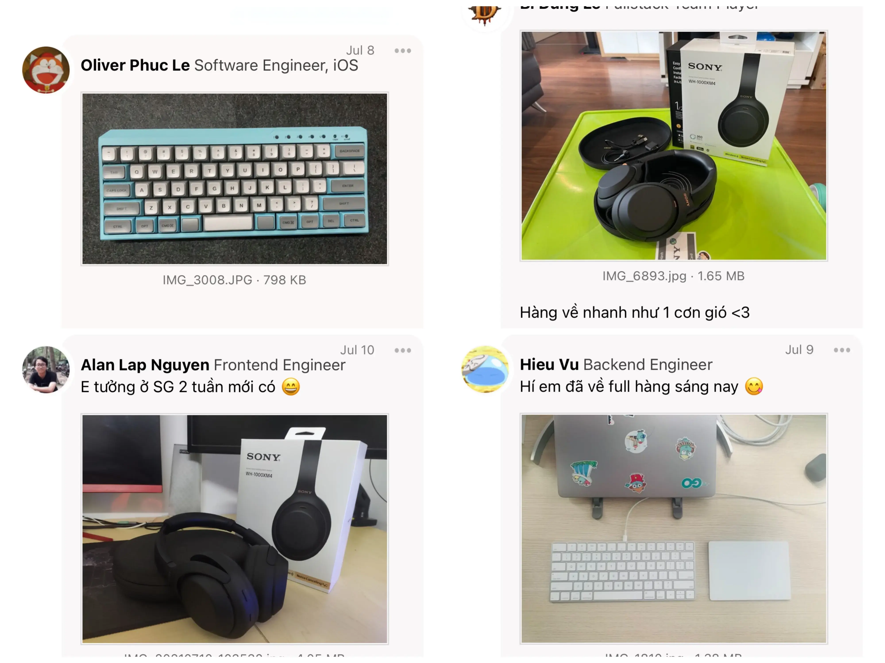

Hey,

It's Han and the Dwarves team again. We work as a borderless software firm by crafting world-class products that bring great impacts for various industries.

Dwarves Updates notes down how we move toward that goal. You're receiving this because we would love to have you as a part of the journey. It contains our lessons learned, our adoption, our investment in the team, and how we turn those experiences into our client's success.

### We're opening a new office in Da Lat
We're software people, we know from day one that great performance and great results come from having the freedom to choose how we work. We wanted the same flexibility for everyone in the team.

Since June 2020, we've been planning on a new office/studio in Da Lat. It's a peaceful highland in the central of Viet Nam. Fresh air, cool weather, little traffic, little noise and outstanding nature. It's the perfect place for work to feel less like work. Now our engineers have one more space they can choose to work at. Be it the comfort of their own home, our headquarter in bustling HCMC, or our new cozy studio in Da Lat.

During the pandemic, it became clear that our remote-first approach was definitely working. While other firms had to abruptly transition the entire operation online, the Dwarves sought to improve what we have been doing. Communication with clients got more active, work process got more organized, the team themselves grew closer. A few tweaks here and there, and we were good to go.

But that isn't the end of it. We understand once remote working turns full-time, caring for our employee well-being will be more vital than ever, especially in an industry as demanding and fast developing as software.

### Which leads us to: upgrading WFH experience
It's our second initiative: every team member got a small grant to upgrade their WFH workspace. Not only that it's a chance to give the team what they need to work better, it's also a chance for the team to bond. People seem to love it, We see a lot of fun conversations going around and we are flooded with photos showing off new gears.

We like to joke within our team that the goal is to make "every line of code resembles happiness, every software is a happy product". It's a joke, but it's not far from the truth. With everything we do at Dwarves, we are going after better working conditions, happier employees, hence better work delivery, happier clients.

As someone who leads and serves a team, I'm convinced taking actions to improve employee well-being is a must, but the outcomes still thrive beyond our expectations. And the astounding thing is that it's not difficult, even the smallest things we can do for our people can yield significant impacts.

