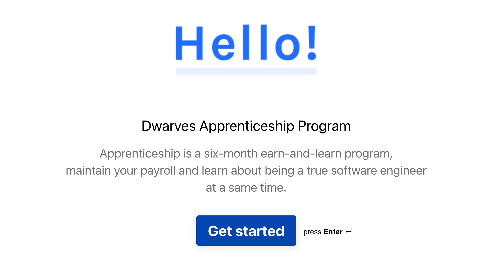

Hi, this is Han, the CEO of Dwarves Foundation. This month the Dwarves score 40th client that we have the honor to serve. And for that, we decide to launch the Dwarves Updates.

As we build this company like we build a product, when we think about this approach, we ask different questions: Do people work here know how to use the company? Is it simple? Is it obvious how it works? Are there bugs? What's broken that we can fix quickly and what's going to take a long time?

A company is like software. It has to be usable, it has to be useful. And it probably also has bugs, places where the company crashes because of bad organizational design or cultural oversights.

Dwarves Updates contains what we learned, our tech adoption, our investment in the team, and how we turn those experiences into our client's and partner's success. You're receiving this because we would love to have you as a part of the journey.

### HR: Apprenticeship Training
In the past, one of our strategies to acquire talent was to conduct the Internship Program, twice a year when the university students graduate or start looking for real-world experience.

In 2018 and 2019, with the tailored program for freshers, we hire many of them from top universities in Vietnam. Usually, it's about 150 applicants and filters out 140. That's a good number, but this year we decide to try another program call Apprenticeship.

As the Internship Program has its cons:
- It might take an intern 6 months to pick up the pace, and on some consulting projects, they can only help with shadow work. And it brings more management effort to keep the quality up.
- Second, if it's the first job of interns, they will leave for more experience after 12 or 18 months, even if we want to retain them. It tears down all the efforts that we spend on them.

The Apprenticeship Program comes from different aspects. Apprenticeship is a total six-month, earn-and-learn training program that we designed for individuals that have at least 1 or 2 years of work experience.

We promise the same or even better paycheck for candidates and offer them the modern work environment, better experience, a guided career path, peers, and mentors.

The first launch was hit with fewer applications compared to the Internship one, but we can meet different people with a higher stage of mind and more straightforward goals for their career path. We are trialing simultaneously, so I will let you know if there's anything fun.

For the detail of the Apprenticeship Program, check out [here](https://github.com/dwarvesf/WeAreHiring/blob/master/open-positions/Apprentice.md).

That's it for the first release. See you next time.
Han & the Dwarves