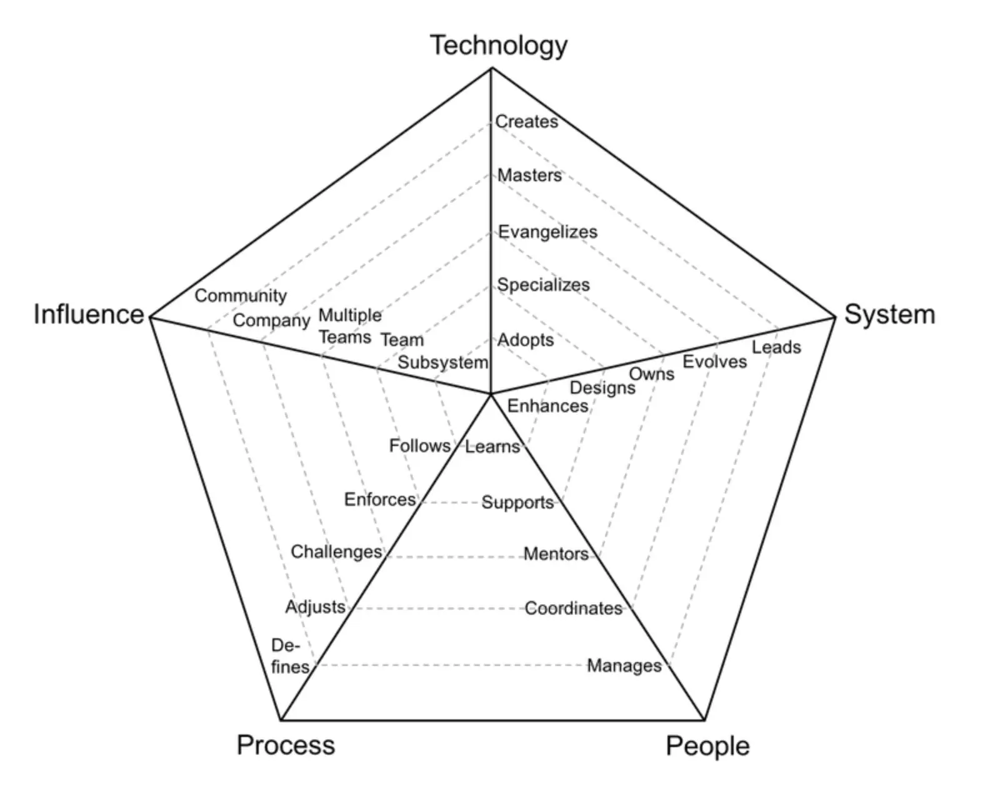

Greetings,

It's Han and Nikki from Team Dwarves. Time does fly when we get to do something we love. As we keep working on building up the team and producing codes for our clients, we didn't even notice it's already the end of September. Here's another update from Dwarves for you. Throughout September, we have completed our bi-annual performance review.

### How we approach engineer performance review
We all have our fair share of performance reviews, be it reviewing others or being reviewed. Saying most of our experience with performance reviews is unpleasant isn't far from the truth.

We don't want the team at Dwarves having to go through those, so we design our performance reviews around the engineers, instead of management.
- The engineers reflect on their growth, their point of view on the team and the organization, then share with us through a self-review.
- We also expect the engineers to have a sense of where they want to go next, in terms of their professional growth.
- The performance review is conducted by someone who has intimate knowledge about the engineer; their direct team lead, project lead, or mentor. We believe only those who know what the engineer has been up to can give a relevant, specific, and fair review.
- It's a two-way conversation. We are in no way above engineers just because we're branded "management". So we take the back seat, let the engineer feel comfortable enough to share things with us. Then together, we check back on their performance, discuss how they can be even better, celebrate any achievements they have made (a little motivation goes a long way). Everything is laid out as specific as we can be.

One important thing here is that during these performance reviews, we don't just focus on their execution and technical excellency. We also pay extra attention to their skills in leadership, collaboration, organizational contribution. We want our engineers to be excellent outside their lines of code too, if they want to move upward in their career.

The framework we use at Dwarves to set expectations and plan career growth for engineers.

For every engineer, we hope they stay with us for 3 - 5 years. It's an unspoken mission that during their time at Dwarves, we provide them all the practices and skills they need to be able to build and consult on software development. That's why we set our performance review once every 6 months, enough time for engineers to achieve certain goals.

Engineers should walk out of their performance review with not just new ranks, new numbers, but also a realistic professional goal for the next 6 months, and a high-level plan to achieve that goal. One step closer to their long-term career goals.

We have been keeping at it for years. Naturally how we do performance review shapes into how we grade engineers as well. For instance, in order to reach the "senior" title at Dwarves, an engineer is not only capable of handling the entire cycle of their code (development, test, production, subsequent fixes, and improvements), but also needs to be able to drive execution by organizing works within their team and holding the team accountable.

Some can even say we're a bit strict, but that's how we uphold a high quality bar and keep our promise of delivering great software. That's also how we give support and guidance to the people who make up our team. As we grow and scale, the now engineers will grow into leaders, managers who provide guidance to our next generation of engineers.

That's it for now. Thank you for reading through.

Til next time,
Han & the Dwarves.