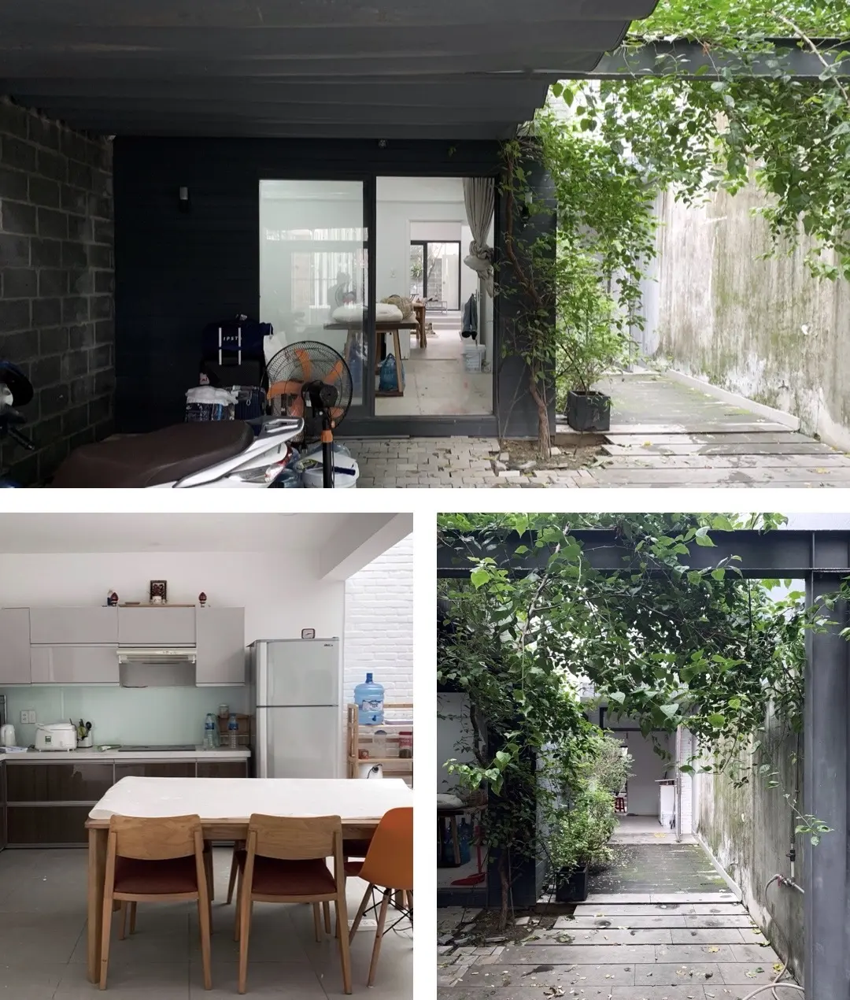
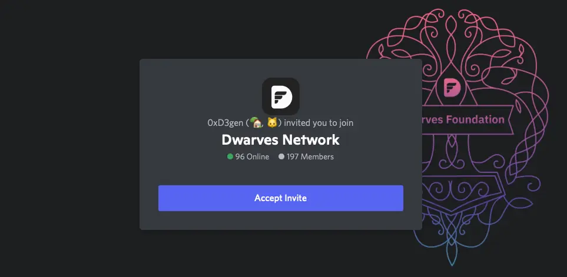

Greetings,

It's Han and Nikki from Team Dwarves. We're almost at the end of this year. While we know everyone is busy wrapping up 2021, we hope you're taking care of yourself and staying safe.

Remember last month when we mentioned [refining our engineering ladder](https://log.d.foundation)? Executing this one initiative was our main focus for the whole November. With this new way of looking at growth, we hope to be able to expand the team on top of a scalable foundation. First by:

 Develop a high-level structure that enables easy scaling of teams or adding new available resources to projects.
- **Some senior engineers were promoted to leads or relevant positions.** Meaning besides the technical excellency, they will also have room to have more impact, influence, and leadership on people, while taking on responsibilities for their teams and the company.
- **Managers, tech leads, and PMs collaborate with each other to facilitate communication and processes** across teams within the company, making sure everyone knows we're working towards a common purpose which is better engineering.
- **We also introduce a new engineering 60-day plan for new hires.** In the past, our onboarding process wasn't strictly scheduled, resulting in training and coaching taking longer than expected before a new hire can join a project. We hope with this new 60-day plan, carefully executed and supervised, we can reduce the lag time from demand to supply.

There's no one engineering organizational structure that fits all. What fits our fast-growing team today might not fit 6 months from now. We'll have to be agile and iterate. But for now, we're pretty well-set for some heavyweight talent acquisition initiatives.

### Some other highlights of November
**Recruiting team members everywhere in Vietnam.**

In the last few months, we have been hard at work to build offices across the country. It's our first attempt to be able to reach more engineers. Though we're a 100% remote team, we still want to offer engineers a place to work if they feel like it.

Soon with offices in HCMC, Hanoi, Danang & Dalat, we hope to tap into greater pools of Vietnamese talents, growing our team fast and increasing our capacity. These offices are more like hubs, so we welcome our partners, friends, clients, and non-Dwarves techies to come and spend their time there.

People in our network can be granted flight tickets to these offices too, just say the word.

Danang office is looking good.

**Making a name for ourselves in web 3.0 space**
Last month alone, we received 8 requests for partnership in building Web 3.0 products, and a dozen people reaching out for our knowledge and advice.

If you read our previous issue, you would already know how we screen for new projects during high demand, so we're not gonna talk about that again. We just want to share the good signal, and hope we get to work with you on something in web 3.0 soon. Or if you have friends looking to build something in this space, we'd completely appreciate an into :)

FYI, as we want to drive focus on Web 3.0 without confusing people with our other services, we have a separate website for it [here](https://console.so).

**Foster community, help others win, and get cool perks in the process**
- Opening our Discord channel for the public. [**Join in the conversation**](https://discord.gg/dzNBpNTVEZ) if you haven't, there are a lot of useful stuff going around.
- Sponsoring multiple tech events in Vietnam. Vietnam is the starting point, we're excited to connect with tech talents anywhere, not just Vietnam.
- Public weekly training and knowledge sharing (on Discord too).
- Coming soon: engage to earn for Dwarves network.

Last but not least, big thanks to everyone who reads through and reaches out to let us know that they enjoy these snippets of news we send out! We greatly appreciate it.

Til next time,
Han & Team Dwarves.