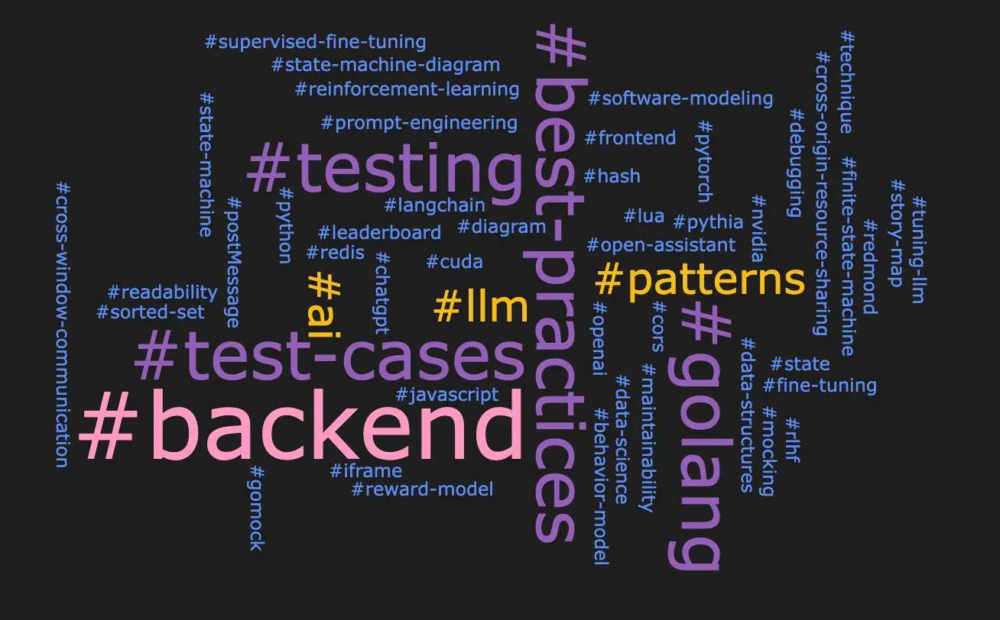
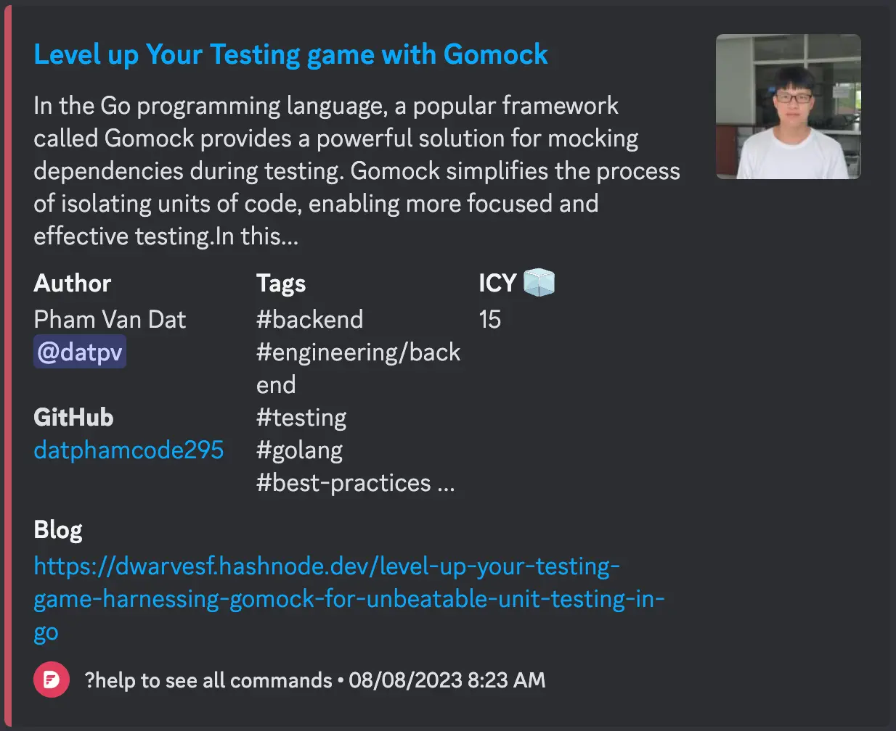
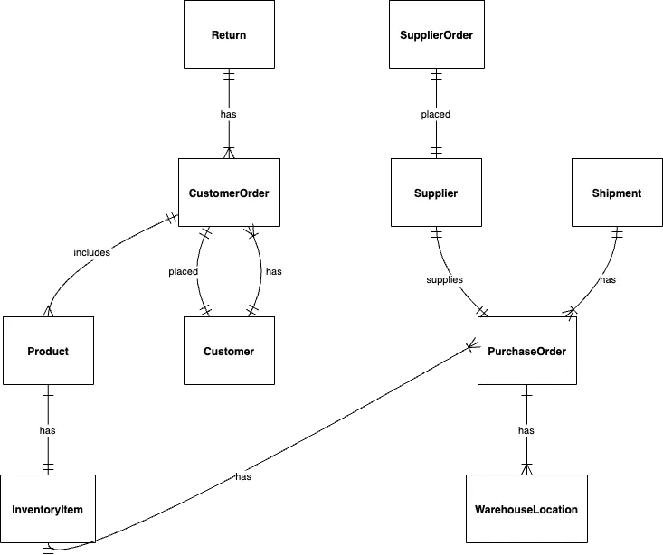
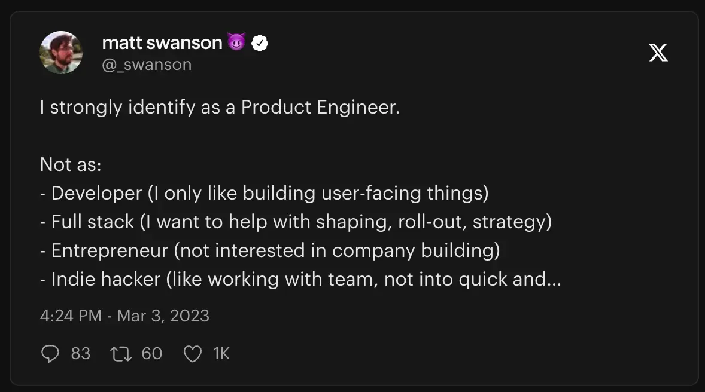
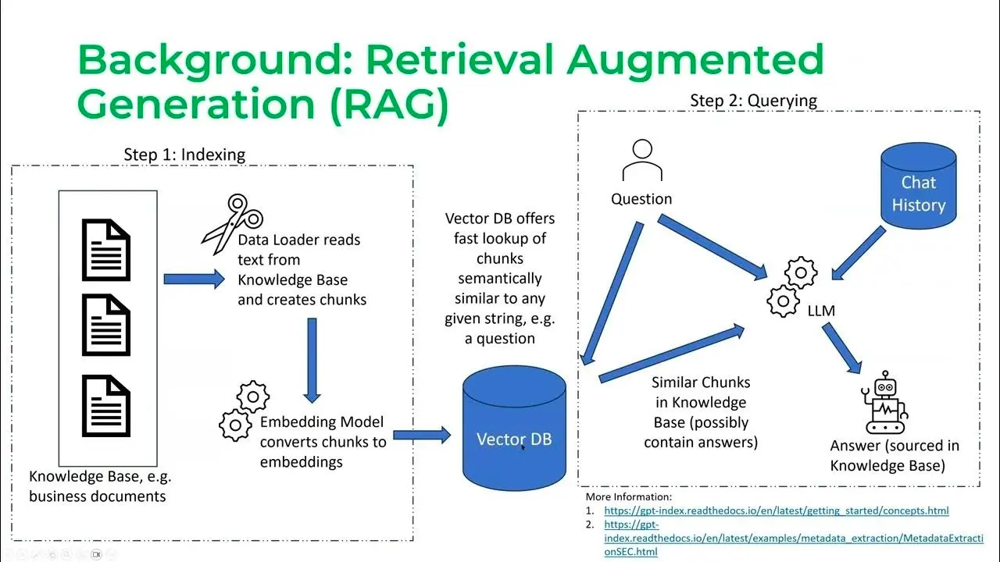
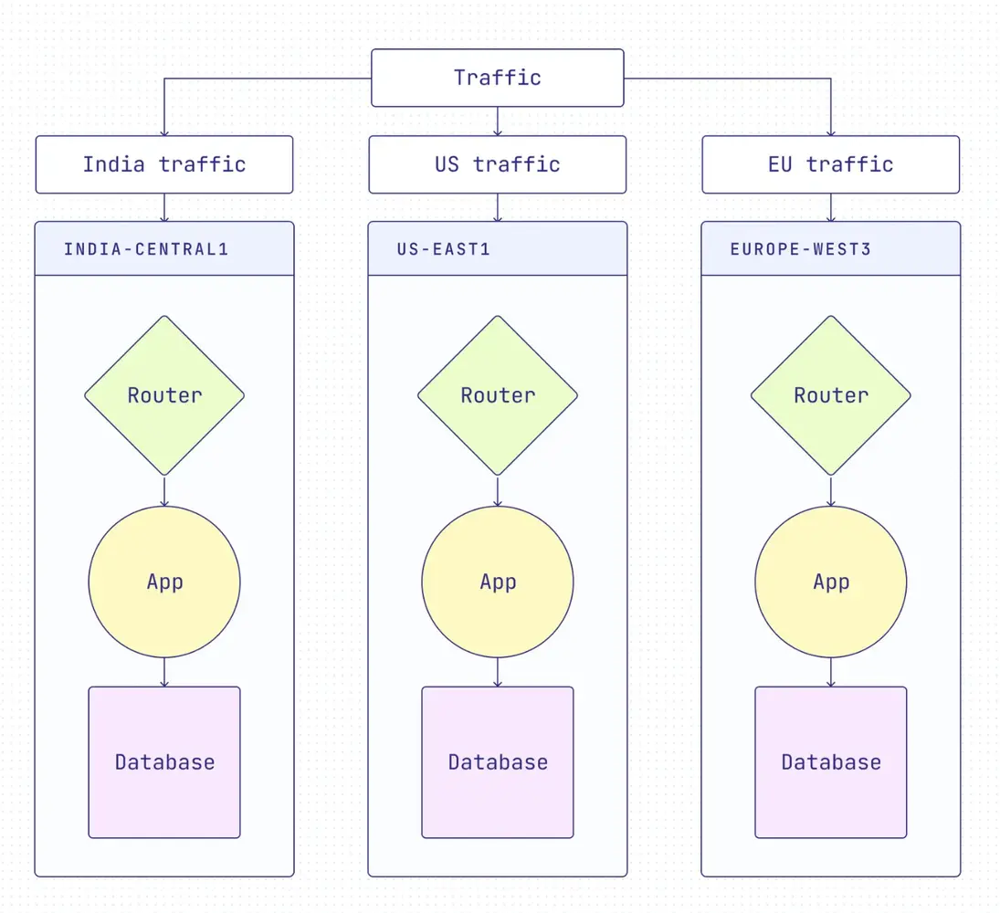

---
tags:
  - engineering
  - performance
  - updates
  - team
  - forward-engineering
  - dwarves
title: Forward Engineering August 2023
date: 2023-08-30
description: "Our adventure until now has been incredibly thrilling, with a strong focus on 'LLM in Production.' Now, we shift our attention to a topic that is always important and never outdated: **Fullstack Engineering**."
authors:
  - thanh
  - monotykamary
menu: memo
type: 
hide_frontmatter: false
author: Thanh Pham, Tom X Nguyen
---

As we step into the exciting opportunities of August, we are at a crucial point in the ever-changing world of technology. Our adventure until now has been incredibly thrilling, with a strong focus on 'LLM in Production.' Now, we shift our attention to a topic that is always important and never outdated: **Fullstack Engineering**.

In a world where new businesses and product teams are always changing, there is a high demand for engineers who are skilled in many areas and can handle both sides of the development process. The rise of AI-powered development tools has blurred the lines between front-end and back-end development, making it essential for engineers to know a wide range of technologies and methods.

# Tech Radar
---

Step into the latest edition of the Dwarves Foundation Tech Radar Report, where we shed light on the technologies steering our engineering team's growth and success. In this report, we illuminate the technologies shaping our path forward, from evaluating new methodologies to embracing tools that amplify our efficiency.

.mp4)

### Type-safe Server Client Development
***Assess***

Developers working on Javascript Applications often face the challenge of enforcing type safety between the client and server. One effective solution is to automatically generate an OpenAPI Spec file from server code. This can then be used with the OpenAPI generator to produce a client-side library for making Type-safe API calls to the backend. Our existing workflow has adopted the Type-safe approach using Swagger for API documentation. We aim to upgrade this approach by automating the generation of API methods.

### Large Language Models
***Trial***

Our journey with [Large Language Models](https://radar.d.foundation/Large-language-model-LLM-60d7f1372aef4e60ae12894bdbafa473) continues to evolve. We are extending our research and learning path for engineers starting out in developing AI, as outlined in this [Engineering Story Map for LLMs](https://dwarvesf.hashnode.dev/an-engineering-story-map-for-llms). Although each engineering story is unique, this map provides a general idea of where one might be in their journey and what lies ahead. We also had a successful experiment with Reinforcement Learning from Human Feedback (RLHF), despite realizing the challenges in the process of training and fine-tuning models in terms of handling operational, data, and lack of foundational knowledge. More details on the challenges faced can be found in this [article](https://dwarvesf.hashnode.dev/challenges-faced-when-researching-rlhf-with-openassistant).

### PNPM
***Adopt***

Our team has officially decided to switch to [pnpm](https://radar.d.foundation/pnpm-198b80c6b5444f8cb1d11392ddc2bf63) as our primary package management tool. After careful evaluation, we found that pnpm is widely embraced by the development community and has been successfully used by great teams at Vercel, Nx, and Chakra UI. Previously, we were using Yarn V1 classic, but as our projects grew, we faced challenges with disk space and slow installations. To streamline our development workflow, we explored pnpm and conducted thorough tests. The results were promising, proving pnpm to be efficient and reliable. Now, we have successfully migrated all major internal tools to pnpm, and it's already making a positive impact on our development speed and productivity. We've also started incorporating pnpm into some client projects. Though we encountered some difficulties with hoisted dependencies in monorepos during the migration process, the overall effort was worthwhile, contributing to our team's enhanced efficiency.

### Qwik
***Assess***

The developer world is flooded with numerous frameworks. NextJS, a comprehensive ecosystem and the reference implementation of React, has extensive libraries, documentation, and resources, aspects not paralleled by [Qwik](https://radar.d.foundation/Qwik-e37f4c5cf0ff434ea53c18a2af805864). This makes us skeptical about using Qwik for critical projects in the foreseeable future. However, Qwik's methodology could represent the future of development. It is crucial to understand Qwik's architecture, efficiency secrets, and coding technique implications. One key concept is [Resumability](https://dwarvesf.hashnode.dev/exploring-resumable-server-side-rendering-with-qwik#heading-resumability), which refers to the ability of Qwik applications to resume from a server-side-rendered (SSR) state without the need for hydration. It's not about adopting Qwik entirely, but recognizing its potential influence on stalwarts like React and NextJS. Familiarity with Qwik can provide a pioneering advantage and a fresh perspective on framework dynamics.

### AI-aided development
***Assess***

In the software industry, the exploration of rapidly evolving AI tools for code writing support is becoming increasingly common. One compelling use-case is leveraging ChatGPT to generate tests for existing implementations, or even adopting a Test-Driven Development (TTD) approach where the AI drafts the tests before we implement the details. Beyond testing, our engineers have successfully utilized GPT models to generate Entity-Relationship Diagrams (ERDs) and various UML diagrams, with promising results. While we've experimented with AI for auditing source code, this remains a work-in-progress due to security concerns. Additionally, Copilot has become an invaluable tool in our development workflow, offering next-level autocompletion features that significantly enhance productivity.

# Brainery
---

### **Growth and Direction**
As we proceed in our journey of knowledge and skill enhancement, our Brainery continues to bloom with exciting ideas and valuable insights. Our contributors have exhibited an increased proficiency in delivering concise writings, covering work delivery, practical concepts, and foundational knowledge.

This month, we are thrilled to highlight our learning journey towards Full stack engineering. Unlike previous months, there has been a greater focus on backend engineering from our Golang 2023 course. We’re really proud of our frontend engineers that participated in our backend course and really excited what they can do with their newfound knowledge. 

### Trending Tags
The trending tags of this month offer a fascinating snapshot of our contributors' current research interests and thought processes. It's been particularly interesting to see the ongoing focus on LLM, with the addition of our [story map for LLMs](https://brain.d.foundation/Engineering/AI/Story+map+for+LLMs), and research on [reinforcement learning](https://brain.d.foundation/Engineering/AI/RLHF+with+Open+Assistant).

In parallel with the AI-centric discussions, we have also seen increased exploration into backend techniques, such as testing and handling concurrency. These discussions underline our commitment to staying at the forefront of tech innovations while deepening our understanding of core concepts.

The tags for August include: `#backend` `#test-cases` `#best-practices` `#golang` and many others:

### **Top Contributors and Notes**Our community continues to thrive due to the collective effort of our talented contributors. 

Each month, we acknowledge their contributions in our Brainery's **[Latest Notes](https://brain.d.foundation/Latest+Notes)** section, linking their GitHub accounts for further reference.

We also value and encourage our community's interaction on our **[Discord](https://chat.openai.com/discord.gg/dwarvesv)** server. It's a great space to stay updated, engage in lively discussions, and catch up on the latest from us. Be sure to join us there!

Here are some noteworthy articles that were shared in our Brainery during August:

* [Testing Made Simple Best Practices for Golang Test](https://brain.d.foundation/Engineering/Backend/Testing+Made+Simple+Best+Practices+for+Golang+Test) by (@Dat Pham) 
* [Test Doubles](https://brain.d.foundation/Engineering/Backend/Test+Doubles) by (@Dat Pham) 
* [Level up Your Testing game with Gomock](https://brain.d.foundation/Engineering/Backend/Level+up+Your+Testing+game+with+Gomock) by (@Dat Pham) 
* [Story map for LLMs](https://brain.d.foundation/Engineering/AI/Story+map+for+LLMs) by (@Tom X Nguyen) 
* [RLHF with Open Assistant](https://brain.d.foundation/Engineering/AI/RLHF+with+Open+Assistant) by (@Toan Ho) 
* [UML state machine diagram](https://brain.d.foundation/Engineering/UML+state+machine+diagram) by (@Khac Vy) 
* [Redis Leaderboard](https://brain.d.foundation/Engineering/Backend/Redis+Leaderboard) by (@Tuan Pham) 
* [Window and iframe communcation](https://brain.d.foundation/Engineering/Frontend/Window+and+iframe+communcation) by (@Thanh Pham) 

# R&D Topics and Challenges
---

Innovation continues to drive us forward at R&D. For the month ahead, we're expanding our scope to encompass emerging trends in development productivity, user interface design, and engineering paradigms.

### **Research Topics**
* **API Code & Client Generator**: As we stride towards bolstering our development productivity, adopting or customizing a tool for API code and client generation is the next logical step. The principal objective is to find a tool that provides robust schema validation, supports authentication, and can be seamlessly integrated with API fetching libraries like react-query and swr. This will expedite our development process, making it more efficient and streamlined.
* **Live Chat UI**: Crafting an exceptional Live Chat Widget brings multiple challenges to the forefront. Our focus here involves effective communication between iframe and window, maintaining stable socket connections, and employing the optimistic pattern for real-time updates. Performance and user experience remain at the core of our design considerations, as we aim to build a seamless and responsive live chat system.
* **Product vs Platform Engineer**: We are reevaluating our approach to categorizing engineers based on their tech stack. Instead, we are exploring the interesting perspective of categorizing engineers as Product or Platform Engineers. Product Engineers are focused on building and enhancing features that address end user problems, whereas Platform Engineers concentrate on the infrastructure that underpins the product. This distinction will help in aligning the skill sets of our engineers more effectively with their roles, ensuring optimal productivity and outcome.

### **Future Challenges**
Besides our main research subjects, we are also monitoring various upcoming trends that might bring either hurdles or prospects in the upcoming times. These encompass:

* **Fullstack tracing**
* **CQRS**
* **Documentation as Code**
* **Just enough architecture**

As we persist in our R&D voyage, we endeavor to remain at the forefront of tech progress, delivering creative answers that propel our initiatives and the broader software sector.

# Research Narratives
---

### Software Design Research Group
This month, our Software Design Research Group is getting a bit of a revamp. The group has been exploring ways to use AI to give insights into a project, as well as explore using animations to better explain more complex topics for system design & data structures and algorithms.

Key discussions this month included:
* **Using AI to help augment System Design** - We used ChatGPT to help us event storm a warehouse inventory application which was then used to generate prompts to create AI diagram templates on Draw.io.

* **Exploring animations with Motion Canvas and Remotion** - We take an introductory look into 2 libraries to help us programmatically create animations for algorithms and system design, making the topic more accessible for our engineers across domains. Shoutout to [NGs-Hjodra](https://www.youtube.com/@NGs-Hjodra) for his open-source work and examples on Motion Canvas.

These insights continue to broaden our understanding of both traditional and emerging software design concepts, equipping us to better tackle real-world challenges.

# Dwarves Rewind August 2023
---

[Dwarves Rewind](https://www.linkedin.com/newsletters/dwarves-rewind-6963734647327375360/) is a reading list serving as a collection of news we aggregate weekly. Tech is a very high-paced industry, and rewind helps to serve as a curated list of trending and high-profile topics that everyone can look back on.

### Trending and Hot Topics
This month, our engineers have been on top of topics related to full stack and DevOps testing, such Test Doubles, Failure Management in Go, Testing AWS services with LocalStack, and using Mock Service Worker (MSW) for web development. This month also includes research journeys with LLMs and a few others:
* **[Product and Platform Engineers](https://leerob.io/blog/product-engineers)**** - **The changing landscape of frontend and backend engineering and the emergence of product and platform engineers. Frontend developers are now building entire web applications, while backend developers are faced with the choice of supporting frontend code or focusing on infrastructure.

* **[An Engineering Story Map for LLMs (by Tom Nguyen)](https://dwarvesf.hashnode.dev/an-engineering-story-map-for-llms)**** - **This story map aims to help engineers learn how to investigate and create AI applications like chatbots, code automation, personal assistants, and LLMs like ChatGPT and LLaMA.

* **[Open challenges in LLM research (Huyen Chip)](https://huyenchip.com/2023/08/16/llm-research-open-challenges.html)** - [Chip Huyen](https://www.linkedin.com/in/chiphuyen?miniProfileUrn=urn%3Ali%3Afs_miniProfile%3AACoAAAIQAJQBE3ykLNnsOPVvxwuuVCOir2zAjOQ) has discussed some of the open challenges in LLMs research, crucial for improving the performance and applicability of these models.

* **[How to Build a Globally Distributed, Multi-Region Identity and Access Platform with Go](https://www.ory.sh/global-identity-and-access-management-multi-region/)**** **- Organizations are given the ability to effectively manage user identification and authorization on a worldwide scale by global identity and access management (IAM).

---

In the ever-changing world of technology, design, and trending platforms. We’re dedicated to sharing our research and the knowledge we’ve learned to the community. 

We have a lot more to share. If you want to keep up with us, we’d love to have you in our next chapter.

### **Get in touch with Dwarves**
Discord: [discord.gg/dwarvesv](https://discord.gg/dwarvesv?fbclid=IwAR0nzdqNuclemLUa7Pg4e2xwAMG2SqPvsD_3EbkVP3p1Oy1c5tl8zHKZPAM)

Fanpage: [https://www.facebook.com/dwarvesf](https://www.facebook.com/dwarvesf)

Website: [https://dwarves.foundation](https://dwarves.foundation/) 

Hashnode: [dwarvesf.hashnode.dev](https://dwarvesf.hashnode.dev/)
