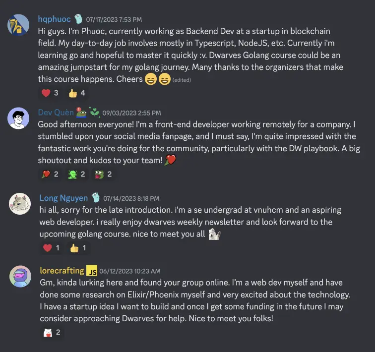
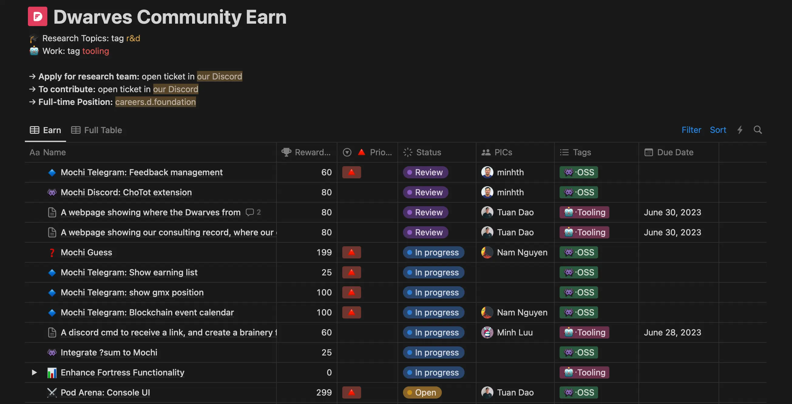

Hello, It’s Han & Nikki.

Since you last heard from us, we have been going through a lot of changes. There are both good changes and so-so changes. In this update, we are excited to share the real journey of growth and transformation that our team has embarked upon, as we continue to strive to become a more skilled and knowledgable software team.

- Shifting focus towards techniques
- Going full-stack engineering
- Growing a support system for the community
- Building stronger bonds through collaboration
- Nurturing relationships for shared success

### Shifting focuses towards techniques
It’s a bold decision the team has taken. Our team is investing heavily in research and development focused specifically on techniques that remain steadfast over time. With how fast the software landscape is changing, it is easy to chase the latest, trendy and cool tools out there. But it’s always the fundamental principles and techniques that build skills that last longer. When they understand the core techniques, they can pick the right tools for the job, learn new things easily, and be more creative.

### Going full-stack engineering
As we watch the tech landscape closely, it shows that due to the tight economy, more and more businesses look for full-stack engineers to save development cost. Full-stack engineers are expected to understand the entire software development process, from conceptualization to deployment and maintenance.

It’s only natural that going fulls-stack engineering is also good next step for our engineers. We have always been big on engineers being able to take up more responsibilities and more complex problems.

### Growing a support system for the community
We realized if we wanted to build meaningful connections with talented tech people, we needed to share what we are great at with everyone out there first. Therefore, we are moving forward to being 50% company - 50% community.

The transition is a long run, it takes tremendous time and effort. We wouldn’t have made this much progress without our team members putting in the extra hours outside of the client works. It could be small effort, like answering programming questions from the community members. It could be team effort, like organizing a free Golang course for 30 learners. We are thankful for and encouraged by each one of them. Our community activities have gained significant traction:

- Golang from Basic to Advance course received ~90 registrations, 30 peeps accepted and several fun demos at the end of the course
- 43 weekly radio talks, featured profound software engineers from around globe
- 10 tech events, partnered with various other tech communities around Vietnam
- Our learning site grew x1.5 members

With more members actively participating and more community members to join hands in various initiatives, we hope this trend will continue and knowledge will spread further.

### Building stronger bonds through collaboration
It wasn’t our intention at first, but pushing toward a 50% company - 50% community model definitely brought the team closer than ever. In a remote working setup like our team, the lack of physical activities make it hard for team bonding.

With our [**Community Earn model**](http://earn.d.foundation), [**collaborative R&D**](https://brain.d.foundation/README), and Community Engagement activities in place, we gained back the sense of unity we partly lost due to remote working. Our internal channels on Discord are brewing again, team members feel connected. Especially, we are also seeming clear improvements when our engineers communicate with the clients and their team.

### Nurturing relationships for shared success
In case you forgot, rather than doing outbound marketing and sales, we are more invested in building [our partner network](https://dwarves.foundation/partner)

For our partners, a relationship with us mean:
- having a trustworthy team to introduce to businesses in their network who need software development.
- accessing to other lines of expertises in our network
- having resources for other activities such as organizing events, summits, etc
- commission rates based on project scale and longevity

We have been testing this model since 2020, some partners have been with us for years. Engaging with our partners closely has been showing great potentials. Their support and trust in our team have brought back several projects, expanding our network and opening doors for profit even in challenging times.

We don’t have much criteria for scouting partners, as long as you care about the impact of technology and have a talent for connecting people, we’re open to have a talk with you to discuss further.

Now that we look back, the past few months for us has been a journey of trialing new ways of doing things, regaining unity and expanding our horizons. We look forward to the next chapter, where we aim to deliver even more remarkable results and build lasting relationships with our team members, community, partners and clients.

That's all for now. Until next time,
Han and Nikki.