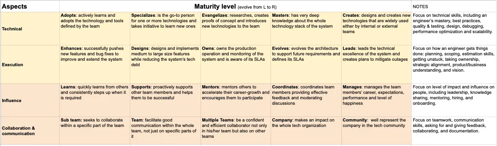
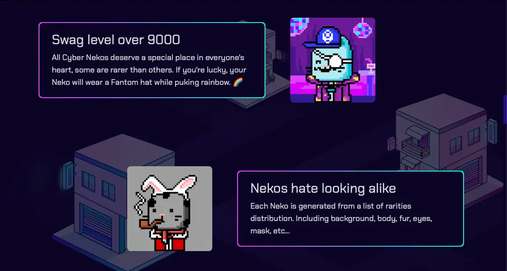

Greetings,

It's Han and Nikki from Team Dwarves. We're here with the fifth edition of our Dwarves Updates. October has been a wild ride for us as a company. Most of our effort was spent on rethinking growth paths for our engineers.

### The common scenarios with growth for engineers
Growth is pretty easy during the first few years; conquer technical skills, discover tools and become proficient in using them, getting things done better and faster.

Then comes that point when growth stalls. It's when the work engineers do every day stops being exciting. They might get faster, but the code quality most likely stays the same - [good enough, perfect is an enemy of good](https://dwarves.foundation/manifesto). The stack stays still, because they only need that much to do the work. One of the easy ways out is to quit, get a new job at a new company. Only for the cycle to repeat itself.

As a company, we want people to grow and go with us for a long time, so it's our job to ask ourselves: how do we grow our engineers? The answer for us is to constantly provide engineers with new, exciting challenges.

### Redefined engineering career ladder
Every company has a career ladder, not all companies actually make use of it. We have to admit, as we get busy with the increasing amount of projects, we did overlook the importance of the engineering career ladder. It's time we took it seriously again.

This career ladder is applied to everyone within the company. We sit down with engineers, define their desired growth path, then design an action plan for it.
- Junior or mid engineers know what is expected to reach the senior level.
- Senior engineers understand the company, the nature of the work, the process, now they know what is expected to reach the multiplier level. They can either grow into a master of their craft or a manager, a leader.

### Step into consulting
Engineers at Dwarves are always encouraged to have ideas, opinions and be free-spoken about them. That's why we believe while consulting is not much about technology or engineering, our engineers would do a good job at consulting. We already got positive words on how our engineers' ideas help clients outside of their scope of work.

We are currently training a good number of engineers at Dwarves on consulting. There will be a lot of new challenges, seeing problems from a broader perspective, analyzing products from multiple angles, experiencing other fields such as management, marketing, copywriting.

### Learn a new tech
Learning a new technology is always exciting for our engineers. It's even better when they can do so as a group. We form teams within our team to learn new tech and make stuff with it. We keep tabs on tech trends and make decisions on which tech to invest in based on its potential to impact the future.

Our latest bet is on blockchain, Metaverse, AI & ML. Our blockchain-focused team has been producing some great products, including [Cyber Neko](https://www.notion.so/e54d9ca7641c45699a38ee89bc937703?pvs=21), [LFW](https://www.notion.so/e54d9ca7641c45699a38ee89bc937703?pvs=21)

### Screen projects more carefully
Dwarves is at a stage where we have the chance to get involved in different kinds of projects. Good project decisions can bring us to a new high and stimulate engineers to develop.

Generally, we lean forward on projects that:
- Solve new, interesting problems
- Have tech stack we are excellent at, or tech stack we've been learning
- Allow our engineers to work and deliver as a team
- Allow our engineers to develop in their roles

Most importantly, our engineers also have a say in the project decisions, as we always discuss with them to understand their view of the project, making sure it's something that they want to be a part of.

Those are just a few initiatives we're currently pushing, there are more in our backlog. Our people are our greatest asset, it's only right that we do whatever we can to make sure when the company grows, its people grow along. The way we see it, devoting to growth is a way to keep engineers engaged and happy. Engaged and happy engineers produce great codes, great codes make great products, great products make clients happy. And if clients are happy, we are happy too.

That's all for this update. We hope you have a great week ahead.

Til next time,
Han & Team Dwarves.