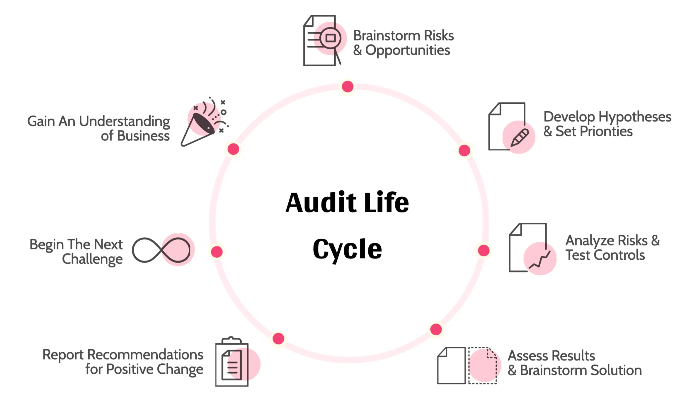

Hey,

It's Han & Nikki from Team Dwarves. This email is the third month we share about our journey to Software Craftsmanship. The last two issues were in June and July. And we received quite a little feedback from our friends and past clients. Thanks for supporting.

This month, we share about how we do project delivery compliance.

### How we do compliance
If there's something that we try to minimize at all costs, it's risks. Risks in software development come at the expense of both our clients and our team. Bigger cost, longer development time, slipping schedules, increasing in working hours, descending team spirit...

Throughout August, the senior team at Dwarves put in the extra time to audit multiple projects. The goal is simple: maximize resource use and increase the success rate of the project.

That means:
- Every procedure deemed unnecessary, unproductive needs to go.
- Identify potential defects and weaknesses early on, so we can act on them asap.
- Team members have an understanding of the scope of work, objectives, requirements.
- Progress is on track, we're not holding the client back.

The technical audit goes top-down from checking if the overall system architecture and database design are appropriate to the nature of the software, to the design of objects and business application servers, to implementation and coding techniques.

The other part is the management audit, where we focus on not our engineers' performance but also how well aware they are of the software they build and the business they build it for.

### Lesson learned
While we didn't detect any major technical issues that may seriously harm a project, we found intriguing what we found out during the management audit.

- The importance and success criteria of a project is something that needs to reminding everyone in a while. If the engineers don't feel like they're providing values, it's easy to slip. Our PMs have been instructed on this.
- Teams that have access to business intelligence are more fond of the software they build. A sense of product ownership allows engineers to put in the extra effort and perform even better.
- Some of our engineers are showing signs that they can bridge the gap between tech and business challenges. When they discover room for improvements, they're not shy from raising it to the clients and volunteer to take up more responsibilities.

The last bullet point has us literally over the moon. Because only when engineers perceive what they do in a broader sight (beyond the hard coding) can they be involved further in the software development cycle.

Our ultimate goal is to build and ship software. That starts with our engineers really understanding software. Therefore, we will continue to encourage our engineers to take the initiative and grow beyond their title.

That's it for the this issue. See you next time.
Han & the Dwarves