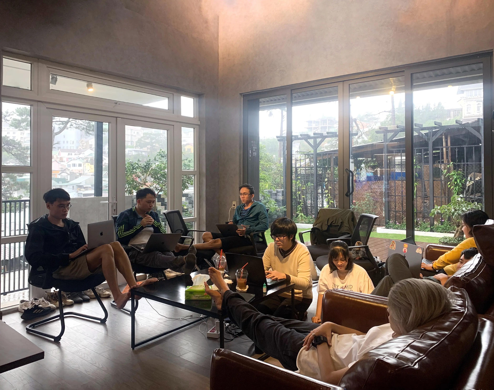

## Our vision for growth
Last Jan 2020, we got the chance to celebrate our first milestone - [Dwarves Foundation reached 5 years old](https://dwarves.foundation/five). The remarkable moment contained the proudest thing we delivered.

* **Remote Culture** - That enables us to make things work without any physical constraints. We were able to focus on what we value: Knowledge and People. To name a few:
* **[The Handbook](https://dwarves.foundation/radar/)** - To demonstrate our culture, the future we pursue and what portrays the Dwarves.
* **ESOP** - Once we work toward the same goal, sharing those rewards for the contributors is vital.
* **Automation Operation** - Automating mundane processes gives us the time and effort to focus on what we do best. The ratio between engineers and operation resources is 70s to 10s.

## Where are we on the succes ladder
For these current and upcoming triumphs, it’s an honor for me to call for a small celebration for Dwarves 2.5. - A team of 80s and still thrive to co-create the future using tech.

* 3 remote offices in Saigon, Danang and Dalat.
* Extend the tech advocates with Techie Story
* Blockchain Squad
* [Console Labs](https://console.so/)
* [Pod Town](https://pod.town/)
* 46% growth in team scale.

To step up means to diversify the way we run.

## Introducing the leading chairs
We like the idea of labeling teams by what they deliver. Hence, the next chapter of Dwarves will be based on five angles.

* Partnership, led by Nikki Ngoc Truong: Ensure our tech know-how can bring impact through strategic partners.
* Delivery, led by Duc Thanh Pham, Ngoc Thanh Pham & Huy Tieu: Ensure our production team ships out quality deliverables.
* Learning, led by Tom Nguyen & Hieu Vu: Ensure our continuous learning habit is illustrated in different forms.
* Communication, led by Nikki Ngoc Truong: Ensure our transparent information internally and externally.
* Engagement, led by Huy Nguyen & Giang Than: Ensure the same vision across teammates despite their function teams.

My best of applause to have these rising elements for the next phase of Dwarves.

