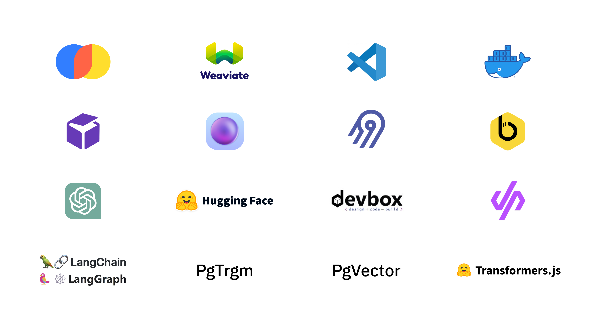
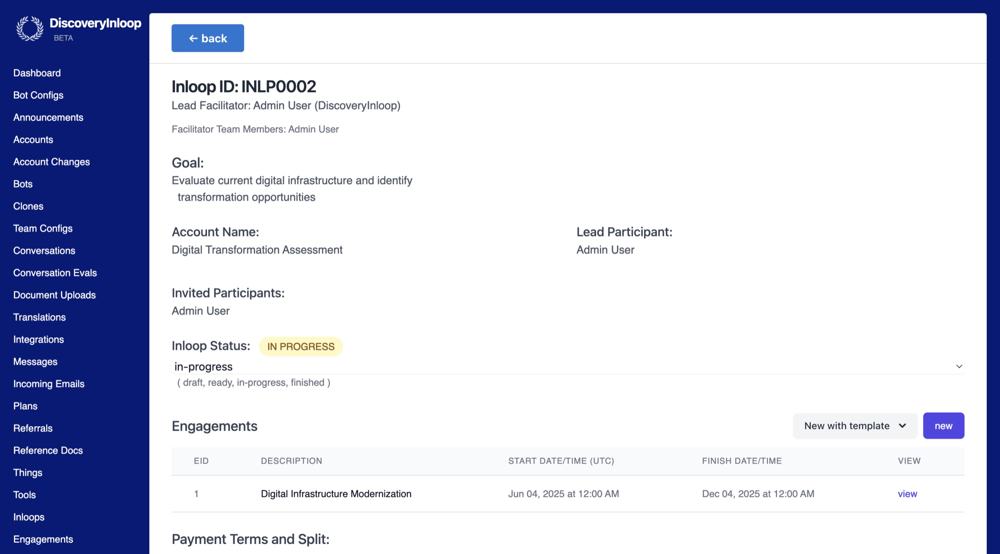

## About Dwarves Consulting

Dwarves build and ship top-notch software. We're a team of design and development experts working closely with clients to craft software, build tech teams, and invest in people who create world's next favorite things.

We prioritize creating the right product that brings tangible business values, rather than simply building features. Working with us, you'll be working with a dedicated team focusing solely on your needs and goals.

**We make it possible by:**

- Providing solutions first, before any hard coding
- Work, deliver and take responsibility as a team
- Fulfilling our team with highly skillful and efficient people
- Implementing frictionless management and collaboration processes

**We started as software engineers** - Founded in 2015, our founding team consists of developers from the same tech community in Vietnam.

**Technology is our core passion** - 8 years in existence, technology expertise and advancement remain our top focus. As we expand the team, we push forward to reach new technology every day.

## Facts & Figures

- **80+ developers** with 3-9 years of experience
- **4 designers**
- **30+ clients** worldwide
- **70+ projects** delivered
- **20 strategic partnerships** with tech communities and universities
- **Offices** in Vietnam, Canada, Germany
- **Founded** in 2015

## Our services

Our services are tailored to blend into the nature of each client we work with. Depends on the your unique needs, project scope, requirements and expectations, we provide different types of services and are capable of customizing them for you.

### AI Services

#### AI Development

- **AI Engineering**: Build, deploy, and optimize AI models
- **AI-Powered Digital Products**: Create digital products with AI to enhance user experiences and business results
- **AI-Powered Chatbots**: Develop intelligent chatbots and assistants for better customer support
- **Custom AI Platforms**: Design scalable AI platforms tailored to industry needs

#### DataOps

- **AI Integration and Deployment**: Integrate AI models into existing systems and ensure smooth deployment across various environments
- **Data Pipeline Development**: Build strong data pipelines for efficient data flow and integration
- **MLOps and LLMOps**: Streamline ML and language model operations for efficient development and deployment

#### AI Projects

**Fornax**: Uses AI to evaluate pitch decks and works as a white-label app with partners to sift and evaluate upcoming startups.

- Tech Stack: GPT-4o

**Droppii**: A pioneering e-commerce and dropshipping consulting platform in Vietnam that uses AI and Large Language Models (LLM) to automate product consultation and recommendations.

- Tech Stack: GPT 3.5 Instruct

**Memo**: Our firm's second brain for sharing knowledge and insights publicly, making results more privacy-focused for readers.

- Tech Stack: DuckDB, Transformers.js

**Plot**: A creative hub for social media and content management using AI to automatically label images and content posts.

- Tech Stack: Cohere Embeddings v3, GPT4 Turbo, Pinecone Vector DB

**Screenz**: A platform that automates the hiring process with AI-powered candidate screening and evaluation.

- Tech Stack: ElevenLabs, GPT-4o

**Inloop**: Human-in-the-loop AI solution that combines AI and human expertise to provide consulting service for startups and businesses.

- Tech Stack: Agentic AI, Claude Sonnet, RAG, Cohere Embed v3, OpenRouter

**Observer**: Our social listening and data analytics agent that uses AI to analyze technology trends and insights from targeted sources.

- Tech Stack: Mastra.ai, MCP, DuckDB, crawl4ai, Gemini

## Web3 Services

#### Console Labs

Console Labs is a Dwarves' subsidiary focusing highly on web3 R&D and services:

- **Blockchain Integration**: Build a layer to manage and manipulate data between current system and public blockchain network
- **Architecture Design**: Right architecture planning for novel blockchain systems
- **Indexing Node**: Pull and organize blockchain data into offchain nodes for further use and query
- **Vesting Contract**: Smart contracts for token unlocking at specified block heights/slots
- **Smart Contract**: Custom smart contracts and logic on EVM compatible chains
- **DeFi**: Development of blockchain-based financial solutions, asset tokenization platforms, p2p lending, neobanks
- **Contract Audit**: Manual code review and automatic analysis for security issues
- **NFT Launch**: Build contracts and tools to support NFT collection launching

#### Web3 Projects

- **Neutronpay**: Payment platform on Bitcoin's Lightning Network
- **Mochi**: Web3 tooling/infrastructure
- **Eklipse**: Video-based NFT tooling for game streamers
- **iCrosschain**: Cross-chain swap
- **MStation**: On-chain RPG game
- **Attrace**: Blockchain referral layer
- **Tokenomy**: Mobile app for crypto investment platform

## We work with companies of all sizes

### Client Highlights

**SP Group** (Singapore)

- Industry: Energy Tech
- Services: Digital transformation pipeline including utility management, marketplace platforms, and smart grid technology
- Tech Stack: Golang, ReactJS, Tailwind, Logging/Monitoring, Automated CICD pipeline
- Team Size: 21 engineers

**Setel** (Malaysia)

- Industry: Internet Marketplace
- Services: Malaysia's biggest Pay, Pump & Go super-app for Petronas gas stations
- Tech Stack: TypeScript, Next.js, React, AWS, Microservices
- Team Size: 8 engineers

## Tech stack

**Backend**: Go, Elixir, Java Spring Boot
**Frontend**: TypeScript, React/Redux/Redux Saga, Next.js, Angular
**Mobile**: Objective-C, Swift, Kotlin
**Architecture**: Clean, N-Tiers
**Cloud**: GCP, AWS, Azure
**Cloud Tools**: Docker, Kubernetes, Terraform, Ansible, Vault
**Design**: Figma, Sketch

## What makes you want to work with us

### Transparent, minimal procedure

We focus our energy on building and shipping. Little paperwork, fast processes.
Every phase of our processes is transparent and documented to avoid any conflict of interest.

#### 1. Understanding your needs

What you are building, who you are building it for. What differentiate you from competitors. When you intend to get to market. Your plan for scaling. The more we understand your needs, the better the product we build for you.

#### 2. Designing the solution

From specifications and requirements based on your needs, our team of business analysts and designers work with you to craft the product, focusing on the experience and how the product delivers value to them.

#### 3. Developing the product

For iterative development, we break down the scope of work into milestones and priorities, focusing on releasing and getting to market.

We work in rapid 1-2 week sprints, with thorough planning and reviewing of each sprint for constant feedback and improvement.

### We work, deliver, take responsibility as a team

There is no individual roles in our software teams. It's the whole team that commits to the product.
That's how we keep our focus on maximizing values for our clients, and not losing sight of the bigger picture.

- Planning is done as a team
- Review is done as a team
- Retrospective is done as a team
- If it works, it's the whole team's achievement. If it fails, it's the whole team's responsibility to take, then make it work.

### We open source everything

### We're quick to tackle crisis

We promise to respond and resolve in a timely fashion when problems arise, depends on priority & severity.
After issues are resolved, we will conduct issue investigation and provide preventive measures.

### Other strengths

## Service Offerings

### Staff Augmentation

Scale up your tech team quick to meet your development roadmap and get to market faster.

Our in-house talents are selected through a strict interviewing process, with proper training before they get to work on client's projects.

We only deploy engineers who meet your requirements and teck stack.

- Frontend Engineer
- Backend Engineer
- Fullstack Engineer
- Blockchain Engineer
- QAQC
- DevOps
- Tech Lead
- Product Owner
- Project Manager
- Product Manager
- Product Designer
- Graphic Designer

### Consulting & Development

Identify and solve your most critical software challenges.

- Strategy & Architecture
- Digital Transformation
- Business Process Reengineering
- Enterprise Service Management
- Systems Integration & Application Management Services

Design experience based on business needs and tech requirements.

- Market & User Research
- Product Strategy
- UI/UX
- Brand Identity & Application

Build and ship in small, continuous releases, focusing on quality, speed and agility.

- Web Development
- Mobile Development
- Tooling Development
- API Development
- Managed Services
- MVP Development

## Client Testimonials

> "They left us with great development and improvement, in terms of work result and team synchronization. A worthy evidence for Attrace's investments and we hope nothing more than to keep going with them in long-term, provide opportunities for these devs to grow with Attrace."
>
> — Erwin, Attrace's CEO & Founder

> "It was hard to disrupt Singapore dentistry market. But the work with Dwarves Foundation made me believe Dental Marketplace would make a difference. The MVP was high-quality and expected to grow. Every of our question and feedback was explained and resolved well."
>
> — Desmond Goh, Dental Marketplace's Founder & CEO

> "They were great with communication and flexibility. They were also world-class in learning new technologies. We worked with a team of 5 people, ranging from designers and developers. Whenever we needed extra hands, Dwarves could activate new team members within a week's notice. We were able to get to market faster and iterate 10x faster than prior to having the team."
>
> — Matt Lock, Arrow Coffee's Head of Product

## Build with us

Tell us what you need,
we'll have the answer for you within the next 24 hours.

Or contact us at:

- W: (+1) 818 408 6969
- M: <team@d.foundation>
