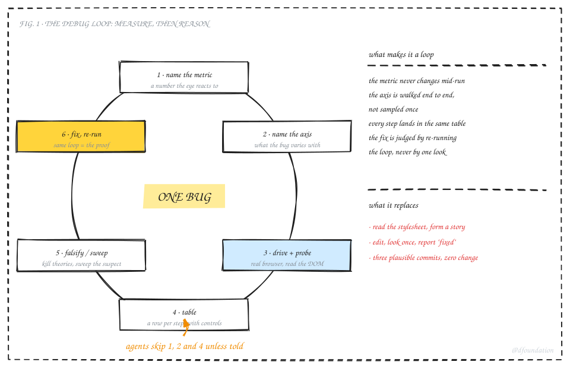
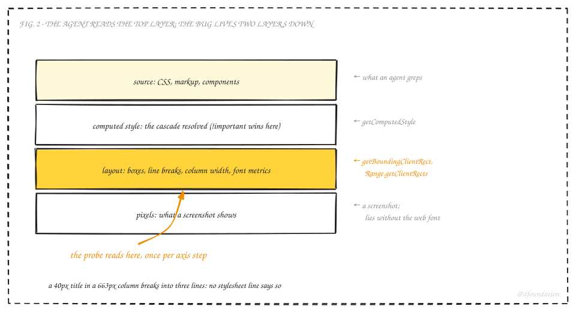
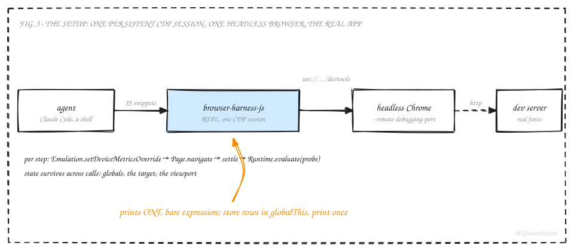
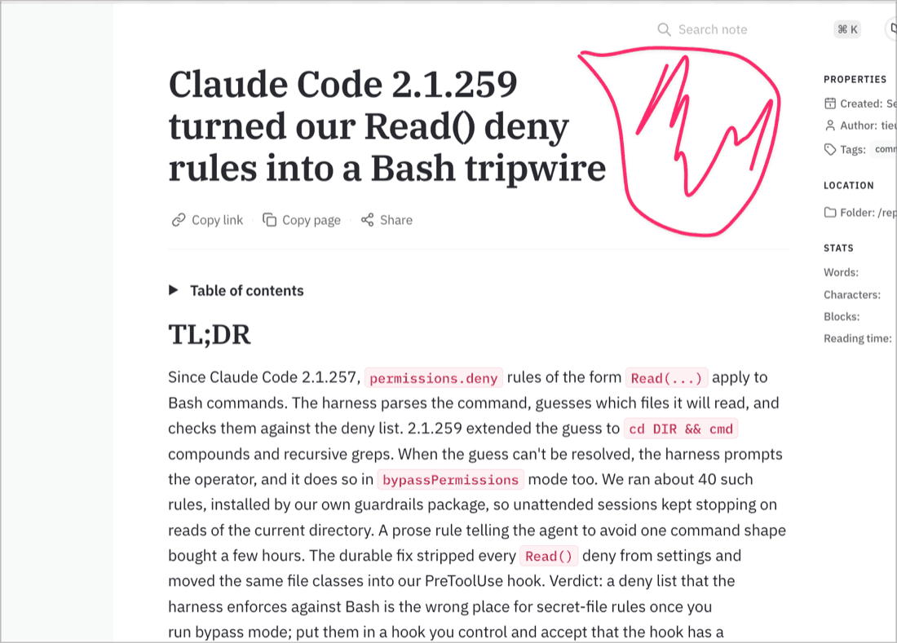
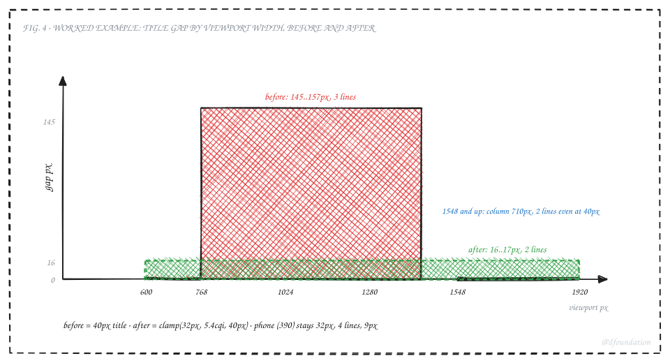

## TL;DR

Coding agents debug layout the way they debug everything: read the source, form a story, edit, look once, report. For CSS that fails more often than it works, because layout does not live in the stylesheet. It lives in computed boxes that depend on font metrics, column widths and word lengths the agent never sees. We now run a different loop for UI bugs: name a metric, name the axis the bug varies on, drive a real browser over the DevTools Protocol, read the numbers out of the DOM at every step of that axis, and let the table kill theories before anyone commits one. The same loop, re-run after the fix, is the proof. The tooling is small: [browser-harness-js](https://github.com/monotykamary/browser-harness-js), a REPL that holds one DevTools Protocol session open, in front of a headless Chrome; the loop is a dozen lines of JavaScript on top of it. On the case that forced this on us, three plausible CSS commits had changed nothing measurable; one thirteen-row table found the cause in a minute, and a second sweep gave the fix. This post is the loop, the probe, the setup, and what still goes wrong.



_Fig. 1: The loop. Six steps, one metric, one table. Agents skip steps 1, 2 and 4 unless told to run them._

## 1. Why agents guess at layout

An agent given "the title looks inset on smaller screens" does something reasonable: it greps the stylesheet for the title, finds a rule, and builds a story around it. `text-wrap: balance` evens line lengths, so surely that is the inset. It edits, takes a screenshot or checks a status code, and reports done. Every step is defensible. The whole is a guess.



_Fig. 2: Source, computed style, layout, pixels. The agent greps the top layer; layout bugs live two layers down, and the probe reads from there._

The stylesheet is the top of four layers. Below it the cascade resolves (and an `!important` in another file quietly wins). Below that the layout engine produces boxes, line breaks and a column width. Below that, pixels. A layout bug is a fact about the third layer. Reading the first layer harder does not reach it, and a single screenshot of the fourth layer is one sample at one size, in whatever font happened to load.

The fix is not a smarter agent. It is a loop that forces the agent to read the third layer, across the whole range the bug lives in, before it forms a theory.

## 2. The loop

**Step 1, name the metric.** Turn the complaint into a number the browser can report. "Looks inset" became: the heading's box right edge minus the right edge of its widest rendered line, plus its line count. A metric you cannot compute from the DOM is not a metric yet.

**Step 2, name the axis.** What does the bug vary with? Here viewport width. Elsewhere it is font size, content length, locale, theme, zoom, or time since load. Pick the axis and its stops before touching code. Thirteen widths from 390 to 1920 covered phones, tablets, every common laptop and a desktop.

**Step 3, drive and probe.** A real Chromium, real fonts, the real app. At each stop: set the viewport, load the page, wait for it to settle, run one JavaScript probe inside the page that returns a row. The probe is the heart of the loop and it is small.

**Step 4, table.** One row per stop, same columns, and at least one control column that can rule out a whole class of cause. Ours carried the neighbouring paragraph's right edge, so "it's padding" could be answered by comparing two numbers.

**Step 5, falsify, then sweep.** Read the table before forming a theory. Look for the constant. Then sweep the suspect variable in a second loop with the same probe.

**Step 6, fix and re-run.** Apply the change and run the step-3 loop again. The second table is the proof of done; the first is its negative control. No screenshot is required, though one at the reader's size does no harm.

## 3. The probe and the setup



_Fig. 3: One persistent CDP session in front of a headless Chrome pointed at the dev server. State survives across calls, so the agent issues small snippets instead of one giant script._

We use [browser-harness-js](https://github.com/monotykamary/browser-harness-js), a REPL that holds one DevTools Protocol session open and evaluates JavaScript snippets against it. Chrome runs headless with `--remote-debugging-port`. Any Chromium works; Playwright or raw CDP over a websocket would do the same job.

```js
globalThis.out = [];
for (const w of [390, 600, 768, 900, 1024, 1100, 1200, 1280, 1366, 1440, 1548, 1600, 1920]) {
  await session.Emulation.setDeviceMetricsOverride({ width: w, height: 900, deviceScaleFactor: 1, mobile: w < 768 });
  await session.Page.navigate({ url: 'http://localhost:3010/reports/commentary/<slug>' });
  await new Promise(r => setTimeout(r, 2500));
  const r = await session.Runtime.evaluate({ returnByValue: true, expression: `(() => {
    const h = document.querySelector('.content-layout h1');
    const rg = document.createRange(); rg.selectNodeContents(h);
    const rects = [...rg.getClientRects()];
    const hb = h.getBoundingClientRect(), cs = getComputedStyle(h);
    const p = document.querySelector('.article-content p').getBoundingClientRect();
    const textR = Math.max(...rects.map(x => x.right));
    return JSON.stringify({
      w: innerWidth, col: Math.round(hb.width),
      h1R: Math.round(hb.right), pR: Math.round(p.right), textR: Math.round(textR),
      gap: Math.round(hb.right - textR),
      lines: Math.round(hb.height / parseFloat(cs.lineHeight)),
      tw: cs.textWrapStyle || cs.textWrap, fs: cs.fontSize });
  })()` });
  globalThis.out.push(r.result.value);
}
```

Then, as a separate one-line call, `globalThis.out.join("\n")`.

Three details carry the method. `getBoundingClientRect` on the element gives the box the layout engine produced. A `Range` over the element's contents and `getClientRects` gives one rectangle per rendered line, so the widest line's right edge is the true text edge, not the box edge. And the paragraph's rectangle rides along as the control. Swap the selector and the fields and the same shape measures overflow, overlap, tap-target size, contrast, or hydration timing.

The second sweep reuses everything and changes one thing:

```js
for (const px of [40, 38, 36, 35, 34, 33, 32, 30]) {
  // inside the same page: h.style.setProperty('font-size', px + 'px', 'important'), then the same probe
}
```

## 4. The worked case

The complaint: the memo title looked inset on the right at some window sizes, fine at others. This is the report as it arrived, the reader's own window and marker:



_The title wraps to three short lines and stops well short of the column the paragraph below fills. Nothing in the stylesheet says why._

Three commits went in before the loop.

| attempt                                            | theory                      | why it changed nothing                                                                               |
| -------------------------------------------------- | --------------------------- | ---------------------------------------------------------------------------------------------------- |
| pad the blockquote rule in `markdown.css`          | more padding                | a second stylesheet sets `padding` with `!important` and wins                                        |
| `text-wrap: balance` → `pretty` under a breakpoint | balance evens line lengths  | verified with a headless screenshot that had not loaded the web font; the fallback wraps differently |
| move that breakpoint to 1280px                     | wider screens fit two lines | the reader's 1548px window still showed three; the column had not grown                              |

Then the loop, thirteen widths, one probe:

| viewport | column | h1 right | p right | widest line right | gap | lines | font   |
| -------- | ------ | -------- | ------- | ----------------- | --- | ----- | ------ |
| 600      | 568    | 584      | 584     | 583               | 1   | 2     | 32px   |
| 768      | 663    | 716      | 716     | 550               | 165 | 3     | 38.4px |
| 900      | 663    | 782      | 782     | 637               | 145 | 3     | 40px   |
| 1100     | 663    | 882      | 882     | 737               | 145 | 3     | 40px   |
| 1280     | 675    | 1005     | 1005    | 848               | 157 | 3     | 40px   |
| 1440     | 675    | 1085     | 1085    | 928               | 157 | 3     | 40px   |
| 1548     | 710    | 1127     | 1121    | 1125              | 1   | 2     | 40px   |
| 1920     | 710    | 1313     | 1307    | 1311              | 1   | 2     | 40px   |

Three theories died in one read. `h1 right` equals `p right` everywhere, so there is no padding. `text-wrap` reads `pretty` and the gap is unchanged, so the wrap mode was never it. And the column is 663px from 768 all the way to 1440, growing only past 1548. That constant is the bug: a 40px serif title in a 663px column breaks into three lines of about 500px, and the next word on each line is too long to fit. No wrap mode moves that.

The sweep over font size at the 663px column:

| font-size | lines | gap |
| --------- | ----- | --- |
| 40px      | 3     | 145 |
| 38px      | 3     | 171 |
| 36px      | 2     | 12  |
| 32px      | 2     | 3   |

Two lines from 36px down. Since the column, not the viewport, decides it, the fix is a container query: `container-type: inline-size` on the layout wrapper and `font-size: clamp(32px, 5.4cqi, 40px)` on the heading, which is 35.8px on the 663px column and 38.3px on 710px. The step-3 loop, re-run:



_Fig. 4: The metric across the axis, before and after. A 145 to 157px plateau across the fixed-column band; 16px everywhere from 600 up after the fix._

| viewport     | column | font   | lines | gap |
| ------------ | ------ | ------ | ----- | --- |
| 390          | 358    | 32px   | 4     | 9   |
| 600          | 568    | 32px   | 2     | 1   |
| 768 to 1200  | 663    | 35.8px | 2     | 16  |
| 1280 to 1440 | 675    | 36.5px | 2     | 16  |
| 1548 to 1920 | 710    | 38.3px | 2     | 17  |

Both tables went into the pull request's proof-of-done, the second as the green run and the first as the negative control. Total time for the loop, both sweeps and the fix: under fifteen minutes. The three guesses had taken longer and shipped nothing.

## 5. What still goes wrong

The loop has its own traps; these are the ones that bit us inside it.

The REPL prints only a single bare expression. A multi-statement snippet runs and returns nothing, which looks like a hang. Push rows onto `globalThis` inside the loop and print them with a second call.

Headless screenshots lie about fonts. A render taken before the web font arrives wraps text with the fallback face. Numbers from the DOM after a settle delay do not have this problem; a screenshot does. Treat a screenshot as illustration, never as the verdict.

Browsers cache images through a page reload. A regenerated SVG was byte-identical on the server (checked with `md5`) and still showed the old version in the reader's browser. If a visual fix "did not take", compare the served bytes to disk before touching the figure again.

The settle delay is a guess. 2.5 seconds was enough for this page; a heavier page needs a real readiness signal (a font-load promise, an element's presence) instead of a sleep.

And the loop fixes what you measured. The column-relative font size removes the systematic three-line break for titles of this length; another title with other word lengths will still rag by its own words. The metric was "gap for this title", so that is what got fixed.

## 6. Run it on your bug

1. Write the complaint as a number the DOM can report. If you cannot, you do not know what you are fixing yet.
2. Name the axis and list its stops. Cover the whole range, not the size on your desk.
3. Point a real Chromium at the real page with real fonts, over CDP. Give the page a settle signal.
4. Put a control in the row: a neighbouring element's edge, a computed property, anything that rules out a class of cause.
5. Read the table for the constant before you form a theory.
6. Sweep the suspect with the same probe.
7. Fix, re-run the first loop, and paste both tables into the proof.

Give the agent this list verbatim. Left alone, it starts at step 3 with a single stop and no table, and that is the guess loop wearing a browser.

The tooling is public: [browser-harness-js](https://github.com/monotykamary/browser-harness-js) holds the session; the snippets above run unchanged against any Chromium started with `--remote-debugging-port`. The worked case shipped in the memo frontend (foundation-apps #100). The figures were drawn with fieldnote, our in-house hand-drawn diagram kit, which is not public yet.
