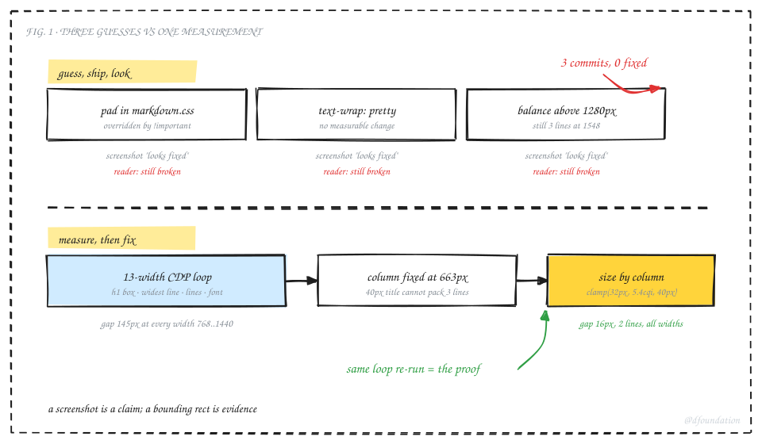
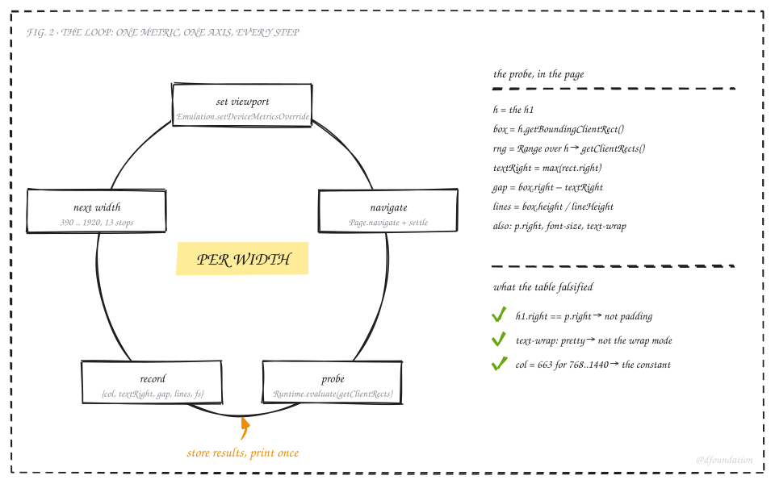

## TL;DR

A memo title looked inset on the right at some window sizes and fine at others. I had Claude fix it. It shipped three CSS commits, each with a plausible story, each reported as done, none of which changed what I saw. Then I asked it to drive a browser and measure instead. One loop over thirteen viewport widths, reading the title's bounding box straight out of the DOM, showed the real cause in a single table: the reading column sits at a fixed 663px across a wide band of screen sizes, and a 40px serif title in that column breaks into three lines that no word can fill. A second loop over font sizes gave the number that packs two lines. The fix was one container query. The same loop, re-run, is the proof. Verdict: for layout bugs, instrument before hypothesizing. A screenshot is a claim; a bounding rect is evidence. Loop over the axis the bug varies on, and let the table kill your theories before you commit them.

## 1. The bug and three fixes that did nothing

The symptom, in my words at the time: "there's a padding right at the title when we are in smaller screen; on normal screen nothing there."



_Fig. 1: Three guess-and-look rounds shipped as commits and fixed nothing; one measured loop found the cause and its own proof._

**Round one.** The agent read the stylesheet, found the blockquote rule (a different bug I had reported in the same breath), padded it in `markdown.css`, saw the dev server return 200, and reported the fix. Nothing changed, because a second stylesheet sets the same property with `!important` and wins. Lesson from round one: a 200 is not a render.

**Round two.** For the title itself, the agent found `text-wrap: balance` on the masthead rule and told a good story: balance evens line lengths, so a three-line title looks pulled in on the right. It switched to `text-wrap: pretty` below a breakpoint and took a headless screenshot that looked right. The screenshot lied. Headless Chrome had not loaded the web font within the render budget, the fallback serif is narrower, and the title wrapped differently than in my browser.

**Round three.** I sent a screenshot from a 1548px window, still three lines. The agent moved the breakpoint to 1280px. Same result, because my column was not any wider at 1548 than at 1100. Three commits on the branch, all plausible, all wrong, all "verified."

## 2. The loop

At that point I told it to stop guessing: use the browser, loop over screen sizes, and make it right at every one. That instruction changed the shape of the work.



_Fig. 2: One metric, one axis, every step. Set the viewport, load the page, read the DOM, record, repeat._

The setup is small. A headless Chrome with `--remote-debugging-port`, and a persistent CDP session (we use `browser-harness-js`, a REPL that keeps one DevTools connection open across calls). The loop:

```js
globalThis.out = [];
for (const w of [390, 600, 768, 900, 1024, 1100, 1200, 1280, 1366, 1440, 1548, 1600, 1920]) {
  await session.Emulation.setDeviceMetricsOverride({ width: w, height: 900, deviceScaleFactor: 1, mobile: w < 768 });
  await session.Page.navigate({ url: 'http://localhost:3010/reports/commentary/<slug>' });
  await new Promise(r => setTimeout(r, 2500));
  const r = await session.Runtime.evaluate({ returnByValue: true, expression: `(() => {
    const h = document.querySelector('.content-layout h1');
    const rg = document.createRange(); rg.selectNodeContents(h);
    const rects = [...rg.getClientRects()];
    const hb = h.getBoundingClientRect(), cs = getComputedStyle(h);
    const p = document.querySelector('.article-content p').getBoundingClientRect();
    return JSON.stringify({
      w: innerWidth, col: Math.round(hb.width),
      h1R: Math.round(hb.right), pR: Math.round(p.right),
      textR: Math.round(Math.max(...rects.map(x => x.right))),
      gap: Math.round(hb.right - Math.max(...rects.map(x => x.right))),
      lines: Math.round(hb.height / parseFloat(cs.lineHeight)),
      tw: cs.textWrapStyle || cs.textWrap, fs: cs.fontSize });
  })()` });
  globalThis.out.push(r.result.value);
}
```

The probe is the whole trick. `getBoundingClientRect` on the heading gives the box the CSS gave it. A `Range` over its contents and `getClientRects` gives one rect per rendered line, so the widest line's right edge is the real text edge. The difference is the gap the eye sees. The paragraph's right edge sits beside it so padding can be ruled in or out in the same row.

The first run, with `pretty` already applied:

| viewport | column | h1 right | p right | widest line right | gap | lines | font |
|---|---|---|---|---|---|---|---|
| 600 | 568 | 584 | 584 | 583 | 1 | 2 | 32px |
| 768 | 663 | 716 | 716 | 550 | 165 | 3 | 38.4px |
| 900 | 663 | 782 | 782 | 637 | 145 | 3 | 40px |
| 1100 | 663 | 882 | 882 | 737 | 145 | 3 | 40px |
| 1280 | 675 | 1005 | 1005 | 848 | 157 | 3 | 40px |
| 1440 | 675 | 1085 | 1085 | 928 | 157 | 3 | 40px |
| 1548 | 710 | 1127 | 1121 | 1125 | 1 | 2 | 40px |
| 1920 | 710 | 1313 | 1307 | 1311 | 1 | 2 | 40px |

Three hypotheses died in one table. The h1's right edge equals the paragraph's right edge at every width, so there is no padding. `text-wrap` reads `pretty` and the gap is unchanged, so the wrap mode was never the cause. And the column is 663px from 768 all the way to 1440; it only grows to 710px past 1548. That constant is the bug. At 40px this title's words break into three lines of about 500px, and the next word on each line is too long to fit. The rag is intrinsic to the font size in that column. No wrap mode moves it.

## 3. Sweep the variable, then fix

Once the cause is a number, the fix is a second loop. Same page, same probe, but now the font size is the axis, at a fixed 663px column:

| font-size | lines | gap |
|---|---|---|
| 40px | 3 | 145 |
| 38px | 3 | 171 |
| 36px | 2 | 12 |
| 35px | 2 | 30 |
| 32px | 2 | 3 |

At 36px the title packs two lines with a 12px rag. At 675px (the 1280 to 1440 band) 38px already fits. So the size has to follow the column, not the viewport, which is what a container query is for:

```css
.reading-view .content-layout { container-type: inline-size; }
.reading-view .content-layout h1 { font-size: clamp(32px, 5.4cqi, 40px) !important; }
```

5.4% of a 663px column is 35.8px; of 710px, 38.3px. Re-running the first loop:


_Fig. 3: The title's right-hand gap by viewport width. Before, a 145 to 157px plateau across the fixed-column band; after, 16px everywhere from 600 up._

| viewport | column | font | lines | gap |
|---|---|---|---|---|
| 390 | 358 | 32px | 4 | 9 |
| 600 | 568 | 32px | 2 | 1 |
| 768 to 1200 | 663 | 35.8px | 2 | 16 |
| 1280 to 1440 | 675 | 36.5px | 2 | 16 |
| 1548 to 1920 | 710 | 38.3px | 2 | 17 |

That second table went into the pull request's proof-of-done as the green run, with the first table as the negative control. The reviewer does not have to trust a screenshot.

## 4. Why the guesses failed and the loop worked

The three failed rounds share one shape: read code, form a story, edit, look once, report. Each look was at one width, and each look was itself unreliable (a status code, a screenshot without web fonts, a breakpoint checked at the wrong size). The agent was not lazy; it was reasoning from the stylesheet, and the stylesheet is not where layout lives. Layout lives in the computed boxes, and those depend on font metrics, column width and word lengths that no amount of reading CSS reveals.

The loop worked because it changed three things at once. It measured instead of looked. It measured across the whole axis the bug varied on, so a fix that worked at 1100 and failed at 1440 could not pass. And it recorded the numbers, so the same table serves as diagnosis, as proof, and as the artifact a reviewer checks.

## 5. What still went wrong

Two things bit even inside the good workflow, and both are worth knowing before you copy it.

The REPL prints only a single bare expression. A multi-statement snippet runs and returns nothing, which looks like a hang. The pattern that works is to push results onto `globalThis` inside the loop and print them with a second one-line call.

Browser image caching hid a real fix. The regenerated SVG figures were byte-identical on the server (we checked with `md5`), but the browser kept showing the old ones through a page reload. For a preview copy, a `?v=N` on the image reference is the cheap answer; the published files keep clean names.

And a limit of the fix itself: another title with different word lengths will still rag by its own words. The column-relative size removes the systematic three-line break for titles of this length; it is not a promise that every heading fills its measure.

## 6. If you want this loop

Copy the shape, not the numbers.

1. Name the metric before you touch code. For this bug: box right edge minus widest line right edge, plus line count.
2. Name the axis the bug varies on. Here viewport width; for others it is font size, content length, locale, theme.
3. Drive a real browser over CDP, not a static renderer, and load the real fonts. Give the page time to settle before you probe.
4. Put a control in the row. The paragraph's right edge told us "not padding" for free.
5. Read the table before you form a theory. Look for the constant.
6. Sweep the suspect variable in a second loop.
7. Apply the fix, re-run the first loop, and paste both tables into the proof.

The tooling is public: [browser-harness-js](https://github.com/tieubao/browser-harness-js) holds the CDP session; the loop above runs unchanged against any Chromium with `--remote-debugging-port`. The fix shipped in the memo frontend (foundation-apps #100). The figures in this post were drawn with fieldnote, our in-house hand-drawn diagram kit, which is not public yet.
