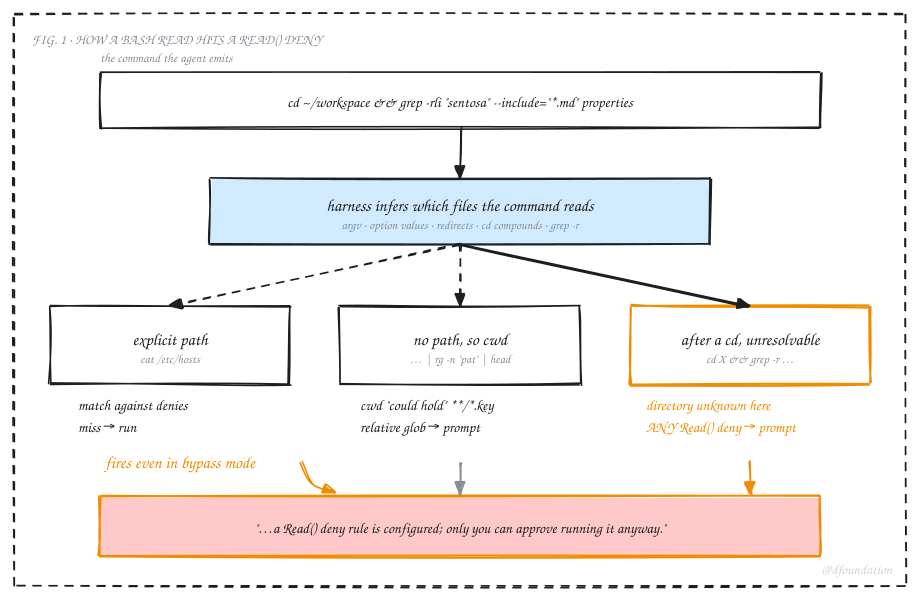
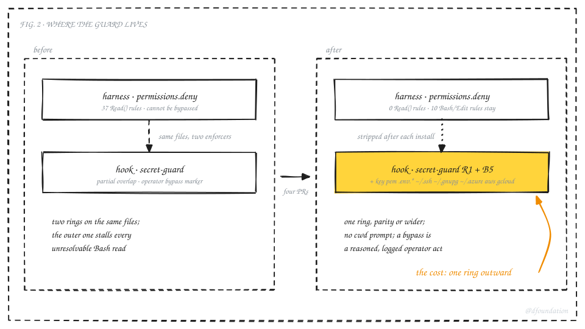
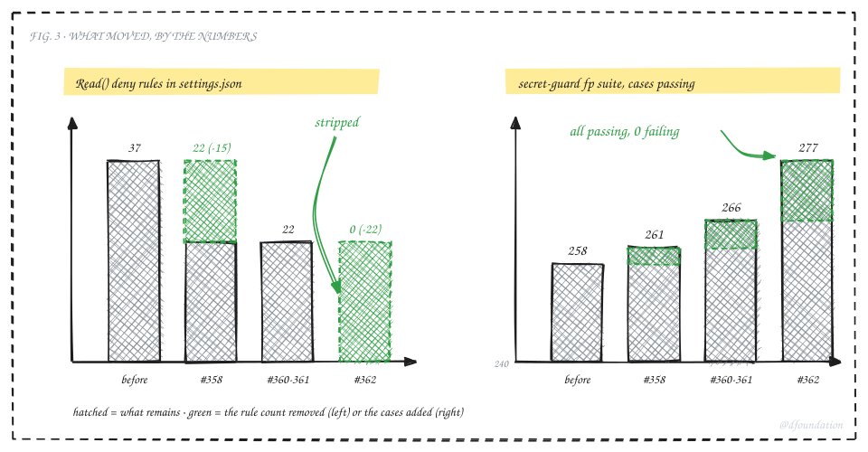

## TL;DR

Since Claude Code 2.1.257, `permissions.deny` rules of the form `Read(...)` apply to Bash commands. The harness parses the command, guesses which files it will read, and checks them against the deny list. 2.1.259 extended the guess to `cd DIR && cmd` compounds and recursive greps. When the guess can't be resolved, the harness prompts the operator, and it does so in `bypassPermissions` mode too. We ran about 40 such rules, installed by our own guardrails package, so unattended sessions kept stopping on reads of the current directory. A prose rule telling the agent to avoid one command shape bought a few hours. The durable fix stripped every `Read()` deny from settings and moved the same file classes into our PreToolUse hook. Verdict: a deny list that the harness enforces against Bash is the wrong place for secret-file rules once you run bypass mode; put them in a hook you control and accept that the hook has a bypass marker.

## 1. The prompt

Here is the second one I got in a fresh session, minutes after I thought the problem was closed:

```
Bash command
  cd ~/workspace && grep -rli "sentosa" --include="*.md" --include="*.toml" \
    properties family-office notes _inbox 2>/dev/null; ls properties/listings

  grep on '--include=*.md' after a cd would search a directory that cannot be
  determined here, and a Read() deny rule is configured; only you can approve
  running it anyway.

Do you want to proceed?
```

The session runs with `--dangerously-skip-permissions`. The agent was doing a plain search across a workspace for lease files. Nothing in that command touches a secret. And the harness still stopped, because it could not prove the command wouldn't.



_Fig. 1: The harness infers file reads from a Bash command. Two of the three branches end in a prompt, and the third fires on the mere existence of a Read() deny._

The first version of the prompt, earlier the same morning, read differently:

```
rg on '.' would read '/Users/.../ops-toolkit', which the deny rule
Read(**/*.key) covers; only you can approve running it anyway.
```

That one came from `rg -n "Status" file.ts | rg -n "status:" | head`. The second `rg` reads stdin. The harness saw a reader verb with no path argument, resolved it to the working directory, noticed the directory could contain a file matching `**/*.key`, and asked.

## 2. What changed, and when

Our deny rules didn't change. I checked every settings backup back to early August; `Read(**/*.key)` and its siblings sit in all of them. What changed is the harness. Two changelog entries:

> **2.1.257** Fixed Bash `Read()`/`Edit()` deny rules not applying to `< file` redirects and reader commands like `tac` and `egrep`; a deny rule on any argument or redirect target now refuses the command.

> **2.1.259** Fixed Bash `Read()` deny rules not covering files given as option values (`--ignore-revs-file=.env`, `-f.env`, `@file`), `git diff`/`git grep` file operands, or `cd DIR && cat FILE` compounds; `grep -r`/`cp -r` over a directory holding a denied file now asks.

Both are filed as fixes, and from Anthropic's side they are: a deny rule that a `< .env` redirect could walk around wasn't much of a deny rule. The consequence for a bypass-mode operator is a new class of stop. The harness now has three outcomes for a Bash read, and Fig. 1 shows them. An explicit path gets matched against the rules and runs on a miss. A reader verb with no path resolves to the working directory, and the directory matches any relative glob such as `**/*.key` because it could contain such a file. A reader verb after a `cd` cannot be resolved at all, so the harness prompts whenever any `Read()` deny exists, anchored to `~/.ssh/**` or not.

We asked whether a setting scopes or disables this check. There isn't one. The docs on permissions, the settings reference, and the permission-modes page describe deny rules as applying in every mode, and the only adjacent knob (`disableBypassPermissionsMode`) tightens rather than loosens. The rule list is the only lever.

## 3. Why the prose fix failed

Our first response, that same morning, was a line in the global `CLAUDE.md`: never `cd <dir> && <read relative/path>`, use absolute paths. It worked for that shape. Within the hour the agent emitted a piped `rg` with no path, which the rule didn't name. After that fix, it emitted `cd X && grep -r`, which the rule also didn't name.

The trigger set is open. Piped readers, `grep --include`, `git grep`, option-value files, recursive copies. Each prose rule closes one shape and the model complies with the shape it was told about. A cause that lives in `settings.json` needs a fix that lives in `settings.json`.

## 4. Where the rules came from

We publish [claude-guardrails](https://github.com/dwarvesf/claude-guardrails), a small installer that merges a deny list and a set of hooks into `~/.claude/settings.json`. It's how every Dwarves machine gets the same floor. Its deny list carried 37 `Read()` rules: relative globs (`**/*.key`, `**/*.pem`, `**/.env`, `**/.env.*`, `**/*.p12`, `**/*.pfx`, a few bare `.env.local` forms) and anchored paths (`~/.ssh/**`, `~/.aws/**`, `~/.gnupg/**`, `~/.config/gcloud/**`, `~/.kube/**`, and so on).

On my machine the same settings file also wires [secret-guard](https://github.com/tieubao/dotfiles/tree/main/home/dot_claude/hooks/secret-guard), a PreToolUse hook that inspects Bash, Read, Grep and Edit calls for secret-shaped reads: `op read` without a sink, cat-class verbs on credential files, context-grep dumps of a config, redirects that capture a secret to disk. The two guards overlapped on most file classes and disagreed on enforcement: the harness deny cannot be bypassed by the model, the hook honours an operator marker (`# secret-guard: allow: <why>`) that the agent is told never to write on its own.



_Fig. 2: Two rings guarded the same files. The outer ring, enforced by the harness, is the one that now stalls on unresolvable Bash reads._

## 5. What we did

Four PRs on the dotfiles repo, one working day.

**#358, strip the relative globs.** The guardrails installer runs from a chezmoi `run_onchange` script, which already had a post-install patch (it removes a push-to-main block hook we don't want on solo repos). I extended the patch with a `jq` filter that drops every `Read()` deny whose pattern isn't anchored to `~` or `/`. That killed the no-path branch. It also opened two holes I only saw when I stopped to ask "does this weaken anything" and wrote the coverage table out: a `cat server.key` in Bash was now guarded by nothing, since the hook's Bash-side file class never listed `.key`, and `.pem` reads were unguarded everywhere.

**#360 and #361, close the holes.** `.key` joined the hook's Bash class. `.pem` joined both the Read-tool and Bash classes, with public-cert bundles (`/ssl/certs/`, `/ca-certificates/`, `cacert.pem`) blanked before the match, the same way the hook already blanks `.env.example` and friends.

**#362, strip every Read deny.** The after-cd branch prompted on the 22 anchored rules I'd kept. Out they went, and the hook took over their file classes: the whole `~/.ssh` directory (private keys carry arbitrary names, so `config`, `known_hosts*`, `authorized_keys*`, `allowed_signers` and `*.pub` are excepted rather than the keys enumerated), `~/.gnupg`, `~/.azure`, the AWS SSO and CLI caches, and the gcloud token databases and legacy credentials.

The filter that now runs after every guardrails install:

```jq
.permissions.deny = ((.permissions.deny // []) | map(select(
    test("^Read[ (]") | not
)))
```

And the hook arm on the Read-tool side, trimmed to the new entries:

```bash
case "$P" in
*/.ssh/*.pub | */.ssh/config | */.ssh/known_hosts* | */.ssh/authorized_keys* | */.ssh/allowed_signers) ;;
*/.ssh/* | */.gnupg/* | */.azure/* | */.aws/sso/cache/* | */.aws/cli/cache/* \
    | */.config/gcloud/*.db | */.config/gcloud/legacy_credentials/*)
    block "Read tool target is a known secret-bearing path: $P" "R1" ;;
*/ssl/certs/*.pem | */ca-certificates/*.pem | */cacert.pem) ;;
*.pem) block "Read tool target is a known secret-bearing path: $P" "R1" ;;
esac
```



_Fig. 3: Read() deny rules in settings.json went from 37 to 0 across the four PRs; the hook's false-positive suite grew from 258 to 277 cases, all passing, to cover the same file classes._

Each PR shipped with its cases in the hook's test suites and a negative control: the new cases fail on the previous hook (2 of 18 on the first one), which is how we know the test measures the change and not the harness.

## 6. Did it work

Both shapes that prompted, run in a bypass-mode session after #362:

```
$ printf 'status: {\n' | rg -n "status: \{" | head -2
1:status: {

$ cd ~/workspace/tieubao && grep -rli "sentosa" --include="*.md" properties | head -2
properties/listings/...
```

No prompt. The deny list holds 10 rules, all `Bash(...)` and `Edit(...)`. The hook suites: fp 277/0, taint-tools 24/0, b9 22/0.

## 7. What it cost

Enforcement moved one ring outward. The harness deny was unconditional; the hook has a documented bypass. If an agent ever writes `# secret-guard: allow:` on its own initiative, the guard is gone for that command. We mitigate with an instruction the model reads every session, a hook that refuses a bare marker and writes every reasoned one to its audit log, and I'd still rather have the harness rule if the harness let me scope it to the Read tool. It doesn't, so this is the trade.

The `.pem` rule will false-positive on a private cert bundle stored outside the three excepted paths. `.env.*` catches `.env.example`, which the harness rule also caught, so nothing regressed there, and the hook's Bash side already blanks the template family.

The patch runs after each guardrails install. A machine that installs guardrails without our chezmoi script gets the deny list back and the prompts with it. That's the right default for a machine we don't manage. On ours, `chezmoi apply` is the reset.

Two things I found on the way and fixed because they were in the path: our dotfiles watcher failed `launchctl bootstrap` on every apply, because `bootout` returns before launchd finishes teardown and the 451-path WatchPaths agent wasn't gone yet when the script re-bootstrapped it (#359 adds a five-second retry). And a guardrails reinstall overwrites the hook's shared `secrets.json` pattern file, dropping a false-positive downgrade we'd made on the 64-hex rule; `chezmoi apply` catches the drift and asks.

## 8. If you run guardrails-style deny lists

Check your Claude Code version. At 2.1.257 or later, list your `Read()` denies:

```bash
python3 -c 'import json;d=json.load(open("'"$HOME"'/.claude/settings.json"))["permissions"]["deny"];print([x for x in d if x.startswith("Read")])'
```

If the list is non-empty and you run bypass mode for unattended work, you will get the cwd prompt. Decide where the guard belongs. Keep the harness rules if a human sits at every session and you want the unconditional block. Move the file classes into a hook if you run the agent unattended, and write the hook's bypass so it leaves a trace.

Everything here is public. The installer patch, the hook and its test suites live in [tieubao/dotfiles](https://github.com/tieubao/dotfiles), PRs #358 through #362. [claude-guardrails](https://github.com/dwarvesf/claude-guardrails) still ships the deny list unchanged; its other users may want the harness ring, so that default is a separate decision.
