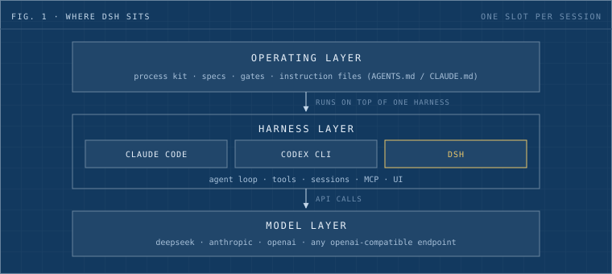
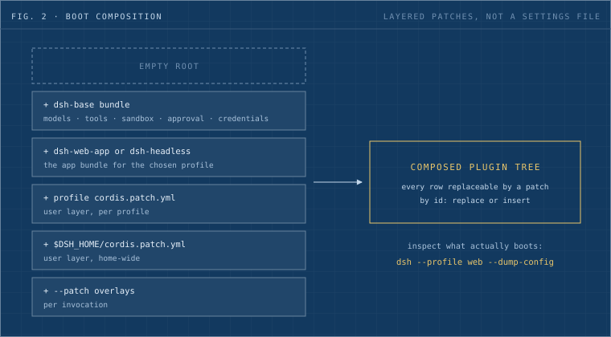
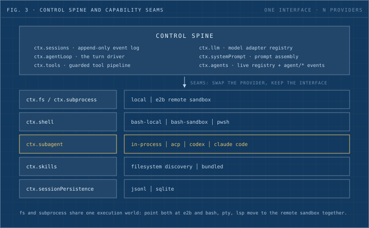
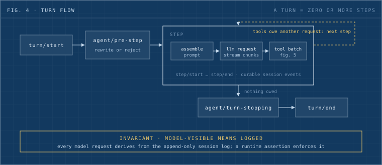
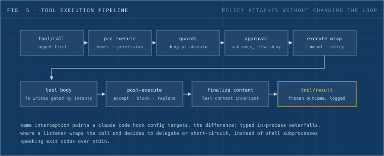

## TL;DR

DeepSeek released an open-source agent harness, `dsh`, and we read the codebase within a day of the drop. Under the "everything is a plugin" tagline sits a real architecture: a Cordis plugin tree composed from ordered patch layers, a small control spine surrounded by swappable capability seams, and one load-bearing invariant that says anything the model sees must derive from an append-only session log. It reads Claude Code instruction files natively, bridges Claude Code hooks, and can even drive Claude Code as a subagent. It is also a developer preview that promises breaking changes. Our verdict: study the design now, run it as a cheap DeepSeek-backed worker if you want, and hold off on betting real automation on it until the plugin API settles.

## 1. Background

An agent harness is the runtime around a model: the loop that assembles prompts, streams responses, executes tool calls, and keeps session state. Claude Code and Codex CLI live in this slot. `dsh` ([deepseek-ai/deepseek-harness](https://github.com/deepseek-ai/deepseek-harness)) is DeepSeek's entry, and it crossed 33k GitHub stars within hours of release.

The pitch is architectural. Every part of the product is a plugin on the [Cordis](https://github.com/cordiverse/cordis) framework, including the model adapter, the tool registry, and the agent loop itself. There is no privileged core to patch. You extend it by mounting a plugin beside the others, and every registration is a reversible effect that unwinds when its plugin unloads.

Figure 1 shows where it sits. A harness is one layer of a working stack; the process machinery a team runs on top (specs, gates, review machinery, instruction files) and the models underneath both stay put when the harness changes.

_Fig. 1: dsh occupies the harness slot. It competes with Claude Code and Codex CLI, and it leaves the layers above and below untouched._

## 2. Architecture

### 2.1 Boot: profiles as patch stacks

A running dsh is composed at boot from ordered layers over an empty root (fig. 2). A profile names a stack of bundles, each bundle contributes config rows plus the code they mount, and then the user's patch files apply on top. A patch targets a row by id and either replaces it whole or inserts new rows. `web` and `headless` ship as template profiles.

_Fig. 2: boot composition. The config model is a layered patch stack over a plugin tree, and `--dump-config` prints exactly what your machine boots._

This replaces the flat settings file most harnesses use. The inspectability matters more than the layering: any row the dump prints, a user patch can replace, which turns "can I change this behavior" from a feature request into a config edit.

### 2.2 The spine and the seams

Six core services form the control spine: the session log, the agent registry, the loop driver, the tool registry, prompt assembly, and the model adapter registry. Everything else is a capability seam: a declared interface with swappable providers (fig. 3).

_Fig. 3: the control spine and the seams around it. A seam is three roles: a service definition, a provider, and a consumer._

The seam design carries the most interesting consequences. Filesystem and subprocess providers share one execution world, so pointing both at an [E2B](https://e2b.dev) sandbox moves Bash, PTY, and LSP to remote execution with zero forked tools. The subagent seam goes further: a "subagent" can be an in-process child, an ACP peer, a Codex process, or a Claude Code process, all behind one interface. dsh is built to orchestrate other harnesses, which positions it as a meta-harness over the rest of the field.

### 2.3 The turn loop and its one invariant

A step is one model request plus the tools it calls; a turn is zero or more steps (fig. 4). Live control flows through typed events, and the interesting ones are waterfalls: around-middleware where a listener wraps the call, then either delegates via `next()` or short-circuits to own the decision.

_Fig. 4: turn flow. Durable facts land in the session log; live interception happens on the `agent/*` waterfalls._

The invariant at the bottom of fig. 4 is the soundest piece of the design. Model-visible means logged: anything that reaches a model request must be reconstructable from the append-only session log, and a runtime assertion enforces it. Fork, resume, replay, transcripts, and token metering all derive from that one stream. Context compaction is just another plugin listening for pressure on the pre-step waterfall. The transcript here is the source of truth, and the rest of the system is a projection of it.

### 2.4 The tool pipeline

Tool calls run through a guarded pipeline (fig. 5): pre-execute hooks and permission checks, monotonic guards, a one-shot approval prompt, an execute wrapper for timeouts and retries, then post-execute rewriting before the result freezes into the log.

_Fig. 5: the tool execution pipeline. Policy, sandboxing, and rewriting all attach to waterfall events without touching the loop._

These are the same interception points a Claude Code hook config targets. The trade is expressiveness against simplicity: typed in-process waterfalls are strictly more capable than shell subprocesses speaking exit codes over stdin, and they cost you the write-a-bash-script-in-five-minutes accessibility that made Claude Code hooks spread.

## 3. What carries over from a Claude Code setup

We checked the interop surface against a working Claude Code shop:

| Existing asset | dsh support | Mechanism |
| --- | --- | --- |
| `AGENTS.md` / `CLAUDE.md` | Native | Walks root to cwd, dedupes identical siblings, injects as durable context, tracks later file changes |
| Claude Code hooks | Partial bridge | `hooks-claude-code` runs the shell command-hook subset on dsh interception points, with CC-shaped payloads and env substitution |
| Skills | Concept ports | `ctx.skills` with filesystem discovery and a model-facing loader |
| MCP servers | Yes | Built-in MCP client |
| Claude Code itself | As a subagent | `subagent-claude-code` delegates a turn to a Claude Code process |
| Models | DeepSeek first-class, plus catalog and custom OpenAI-compatible providers | Keys live in `$DSH_HOME/.credentials.yaml`; env-var references supported |

The compatibility posture is deliberate. A team keeps its instruction files and hook scripts on day one, and native plugins remain the upgrade path once something outgrows the bridge.

## 4. Design notes

Three observations from the read, beyond the diagrams.

**The plugin bet is real.** The loop driver itself is a replaceable service. Claude Code exposes fixed extension points; dsh exposes the whole tree. The cost is a steep mental model: Cordis contexts, service injection, reversible effects, and four event dispatch modes stand between you and your first non-trivial plugin.

**Log-first state deserves copying.** "Model-visible means logged" is a design rule any agent runtime can adopt, whatever the framework. It buys deterministic replay and honest token accounting, and it forces every new model-visible feature to declare a durable event type instead of smuggling context in from the side.

**Web-first is a launch choice worth noticing.** The shipped profiles are `web` and `headless`. The docs mention a TUI profile only as a hypothetical install. Terminal-native developers, the crowd Claude Code won first, are visibly second in line here.

## 5. Limitations

The project labels itself a developer preview and promises compatibility-breaking changes, so plugin investments made today may not survive the quarter. DeepSeek's own chat route is text-only; image input needs another provider. And the ecosystem is hours old: lookalike packages appeared on other registries almost immediately, so the official surface is the npm package `@deepseek-ai/dsh` and the `deepseek-ai` GitHub org, nothing else.

## 6. Verdict

For a team already running Claude Code: keep your cockpit, read their session-log design, and try dsh where a cheap DeepSeek-backed headless worker fits (`dsh --profile headless "job"`). The architecture is ahead of the product right now. When the preview label comes off, the interop bridges mean switching costs will be lower than they usually are in this space, and that alone makes it worth tracking.

## References

- [deepseek-ai/deepseek-harness](https://github.com/deepseek-ai/deepseek-harness), the repository and its `docs/architecture.md`, `docs/cordis-primer.md`, `docs/agent-lifecycle.md`, `docs/tool-execution-pipeline.md`
- [Cordis](https://github.com/cordiverse/cordis), the plugin framework underneath dsh
- [Agent Client Protocol](https://agentclientprotocol.com), the editor-integration protocol dsh speaks
- [E2B](https://e2b.dev), the remote sandbox behind the `fs-e2b` and `subprocess-e2b` providers
