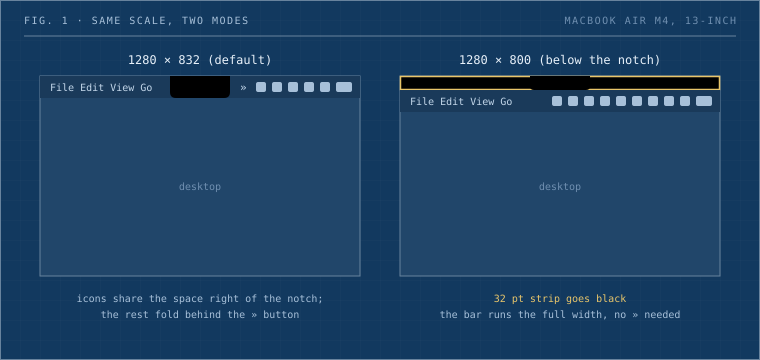

## TL;DR

On a notched MacBook, macOS 27 folds menu bar icons behind a new `»` button once they run out of room beside the notch. It also rebuilt the menu bar in a way that broke every third-party icon hider, our own Hidden Bar included. Before you install anything, switch the built-in display to its below-notch mode. On a 13-inch M4 Air that means 1280 × 800 instead of 1280 × 832. The top 32 points go black, the notch sits inside the black strip, and the menu bar gets the whole width back. You keep the same UI scale, you lose 4% of the screen height, and the `»` button shows up far less often.

## What changed in Golden Gate

Apple showed macOS 27 at WWDC on June 8, 2026. The menu bar got two changes that matter here.

The visible one is a native overflow control. When status icons stop fitting to the right of the notch, a `»` appears at the edge of the icon area. Click it and the hidden icons unfold, click again and they fold back. You can't configure it. There's no shortcut, no auto-collapse timer, and no way to say "always hide this one". The only lever is order: hold Command and drag icons, and the ones nearest the right edge are the last to fold.

The second change is the one that hurt. The menu bar is now drawn as a single window. Hidden Bar, Bartender and Ice all used some version of one trick: add your own status item, make it enormously wide, and let it push everything to its left off screen. On 27 the bar no longer reflows around an oversized item. It gets ejected from the layout, and an ejected item pushes nothing. So collapse "worked" and nothing moved.

For us this is personal, because [Hidden Bar](https://github.com/dwarvesf/hidden) is a Dwarves open source project. Issue [#360](https://github.com/dwarvesf/hidden/issues/360), "Osx 27 broken hidden bar", was opened the evening of the keynote and collected 50 comments. The fix is [PR #400](https://github.com/dwarvesf/hidden/pull/400) from contributor quaversgoose, open as I write this. It drops the wide-separator trick on macOS 27 and hides third-party menu bar bundles through `MenuBarClientCore`'s assessment mode. Per the [Pelmet](https://github.com/fif7y/pelmet) README, that is the mechanism behind macOS's exam lockdown. The PR says it plainly: that interface is undocumented and can't ship through the App Store. Every working hider on 27 sits on some unofficial path like this one, so treat all of them as one beta away from breaking.

## The fix that needs no app

The notch is a hardware problem, so part of the answer is a display setting. Every notched MacBook panel has a few extra rows of pixels at the top, and macOS offers each scaled resolution in two versions: one that uses those rows and wraps the menu bar around the notch, and one that leaves them black. Apple hides the second version by default.



_Fig. 1: Same scale, two modes. The below-notch mode gives up a 32-point strip and gets an unbroken menu bar in exchange._

These are the pairs on my 13-inch M4 Air (panel 2560 × 1664), listed by `displayplacer list`:

| Width                  | Wraps the notch | Below the notch | Height given up |
| ---------------------- | --------------- | --------------- | --------------- |
| 1024                   | 1024 × 666      | 1024 × 640      | 26 pt           |
| 1280                   | 1280 × 832      | 1280 × 800      | 32 pt           |
| 1470 (Apple's default) | 1470 × 956      | 1470 × 918      | 38 pt           |
| 1710                   | 1710 × 1112     | 1710 × 1068     | 44 pt           |

The widths match, so the UI stays the same size. The display stops drawing where the camera housing sits.

### In System Settings

1. Open System Settings → Displays.
2. Right-click the resolution thumbnails and choose "Show all resolutions" (on some builds it's a list with a toggle at the bottom).
3. Pick the entry with the same width as your current one and the shorter height, for example 1470 × 918 if you were on 1470 × 956.

### From the terminal

[displayplacer](https://github.com/jakehilborn/displayplacer) does the same thing and is easier to script or undo.

```bash
brew install jakehilborn/jakehilborn/displayplacer
displayplacer list          # find your built-in screen id and the mode pairs
displayplacer "id:<screen-id> res:1280x800 hz:60 color_depth:8 scaling:on origin:(0,0) degree:0"
```

`displayplacer list` ends by printing the exact command for your current layout. Save that line before you switch and you have a one-command undo.

### Check that it took

This prints what AppKit reports for each screen. In the below-notch mode the notch areas should be gone.

```bash
cat > /tmp/notch.swift <<'EOF'
import AppKit
for s in NSScreen.screens {
  print(s.localizedName, s.frame.size,
        "safeTop:", s.safeAreaInsets.top,
        "notchL:", s.auxiliaryTopLeftArea.map { "\($0.size)" } ?? "nil",
        "notchR:", s.auxiliaryTopRightArea.map { "\($0.size)" } ?? "nil")
}
EOF
swift /tmp/notch.swift
```

On my Air after the switch:

```
Built-in Retina Display (1280.0, 800.0) safeTop: 0.0 notchL: nil notchR: nil
```

A top safe-area inset of zero and no auxiliary areas means macOS no longer treats the notch as part of the layout. The menu bar is one continuous 30-point run.

## What it costs

You give up 32 points of height at my scale, a bit under 4% of the screen. On a 13-inch panel you feel that in a long document or a terminal. A native fullscreen app already blacks out that strip, so fullscreen looks the same either way.

If you mirror to an external screen, the mirror follows the built-in mode. My Air mirrors to a 42-inch TV, and `displayplacer` moved both to 1280 × 800 in one call.

The `»` button can still come back. With enough status items you'll hit the right edge again, and then you're back to Command-dragging or waiting on a hider that works on 27.

## What I'd do

1. Switch to the below-notch mode first. It's native, it survives updates, and it fixes most of the crowding on a notched Air.
2. Remove Apple's own icons you never click in System Settings → Menu Bar. A surprising amount of the clutter is Wi-Fi, Focus, Now Playing and Spotlight.
3. Command-drag the icons you use every day to the far right.
4. Only then pick a third-party hider, and check that its changelog names macOS 27. For Hidden Bar, follow [PR #400](https://github.com/dwarvesf/hidden/pull/400).
