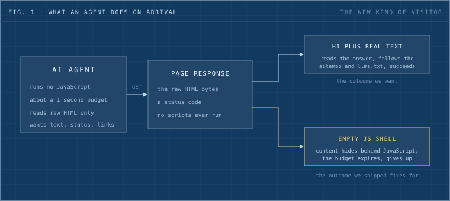
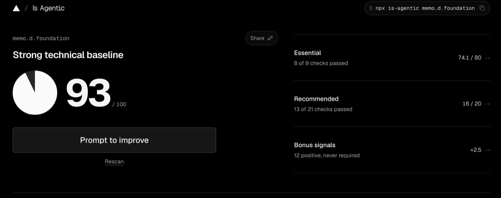
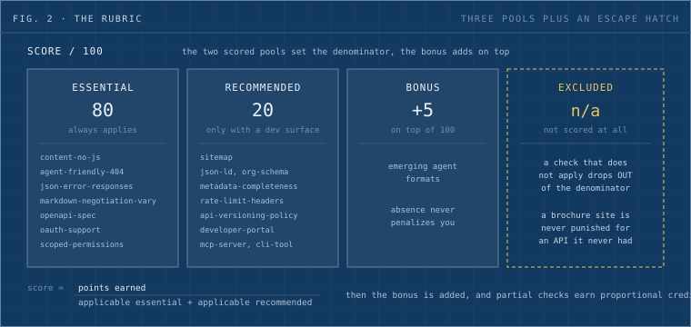
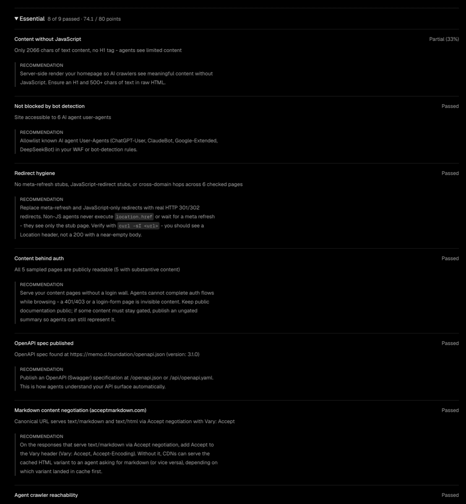
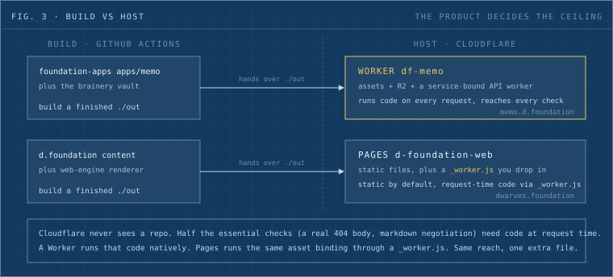
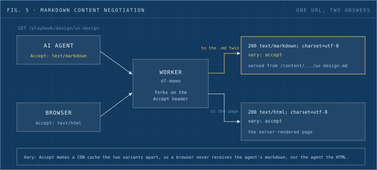
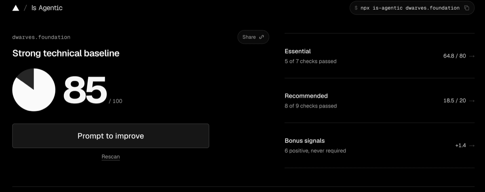
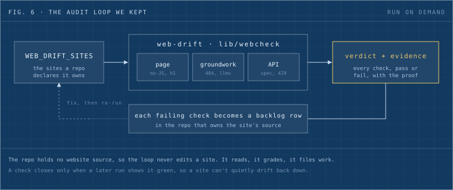

A new kind of visitor shows up at our sites now. It runs no JavaScript, and it gives up in about a second if it can't find what it came for. It's an AI agent fetching a page for a person who asked it a question, and it wants text, a status code, and links it can follow. We spent a day making [memo.d.foundation](https://memo.d.foundation) and [dwarves.foundation](https://dwarves.foundation) legible to that visitor. The docs site went from 50 to 93 on one scanner, the marketing site from 52 to 85. Here's what the scanner looks for, and what a day of fixes did to the page an agent sees.



_Fig. 1: what an agent does on arrival. It reads the raw HTML with no scripts run, and inside a one-second budget it either finds real content or gives up._

That gap is what the fixes target. A page that renders its answer client-side reads as blank to the agent, because the agent never runs the code that fills it in. The work lives in the bytes on the wire, which is the only thing the agent reads.

## What is-agentic measures

is-agentic.com, built by Ora, scores how readily an AI agent can discover, fetch, understand, and use a public website. You point it at a domain, it drives an agent through the site, and it grades the result out of 100. You can run it three ways: the web UI, `npx is-agentic <domain>`, or a read-only report API at `/api/v1/report`. It eats its own dog food, which is a good sign. It ships an OpenAPI spec, an MCP server, an `llms.txt`, and the same read-only report API it grades other people on.



_A scan of memo.d.foundation. The score sits on the left, the three pools on the right, and the command that produced it runs across the top._

The methodology page publishes the shape of the rubric but not the individual checks. We pulled the check names out of stored reports for a few well-known sites, so the list below is observed rather than official. The API only names a check when a site fails or partially passes it, so anything a site already does right stays invisible in its report. We assembled the roster by reading several sites' failures together.

## How the score is built

Three pools, 100 points plus a bonus.



_Fig. 2: the rubric. Two scored pools set the denominator, the bonus adds on top, and any check that doesn't apply drops out of the denominator instead of scoring zero._

The essential 80 carries most of the grade and covers the fundamentals an agent needs before anything else. The recommended 20 only switches on when the site advertises a developer surface, so a plain content site never gets marked down for lacking an API. The clever part is the last column. A check that doesn't apply is excluded from the denominator rather than scored zero, so a brochure site is never punished for missing an API it never claimed to have. Partial results earn proportional credit, and where a check appears twice (the MCP surface exposes duplicate IDs) the scores average.

For reference, on the day we ran this, Vercel scored 85, Stripe 74, GitHub 61, and Shopify 60. So the bar is real. Even good engineering teams sit in the 60s and 70s until they do this work on purpose.

## Every check, and how to pass it

This is the part worth keeping. For each check we'll say what it wants, how the scanner probes for it, what a pass looks like, and why an agent cares. You can read your own site against this list without running the scanner at all.



_The scanner's own breakdown of the Essential pool: each check, its verdict, and the evidence behind it._

### The essential checks

**`content-no-js`** wants real content in the raw HTML: an H1 and at least 500 characters, with no JavaScript run. The scanner fetches the page the way a cheap agent does, takes the bytes off the wire, and reads them without a browser engine. A pass means the H1 and the body text sit in the HTML you'd see from a plain `curl`. An agent on a budget won't boot a headless Chrome for you, so if the words live in `__NEXT_DATA__` and get painted by React, the agent sees an empty `__next` div and leaves. Our dwarves.foundation homepage shipped 17,893 bytes with zero `<h1>` and every word behind `__NEXT_DATA__`, which read as blank.

**`agent-friendly-404`** wants a real 404 status on a path that doesn't exist, plus a body that points the agent somewhere useful. The scanner requests a random unknown path and reads both the status line and the body. A pass is a 404 with a short body naming the sitemap, the `llms.txt`, and the homepage. An agent that gets a 200 and a full homepage for `/nope` believes every URL it guesses is a real page, so it can't tell a typo from a route. Our memo baseline answered every unknown path with a 200 and the home shell, and d.foundation answered a 301.

**`json-error-responses`** wants API errors delivered as JSON, not as an HTML error page. The scanner hits an API path that errors and checks the content type of the body. A pass is `{ "error": string }` with the HTTP status preserved. An agent parses an API answer as JSON, so an HTML 500 page makes the parse throw. Our failure was specific: an unrouted `/api/*` path fell through to the framework's default and came back as `text/plain 404`, which is exactly the path the scanner probed.

**`markdown-negotiation-vary`** wants the page served as markdown when the caller asks for it with `Accept: text/markdown`, and a `Vary: Accept` header so a cache keeps the two forms apart. The scanner sends `Accept: text/markdown` and inspects the content type and the Vary header on the way back. A pass is `content-type: text/markdown; charset=utf-8` alongside `vary: accept`. Markdown is cheaper for an agent to read than HTML wrapped in layout, and without the Vary header a CDN can hand the markdown to a browser or the HTML to an agent by mistake. Our memo baseline returned `text/html` with no Vary at all.

**`openapi-spec`** wants a machine-readable API description at a URL an agent can guess. The scanner looks for a spec at a predictable path such as `/openapi.json`. A pass is a valid OpenAPI document served there; we published 3.1 covering the 13 public routes. The spec is how an agent learns your routes, params, and response shapes without scraping prose out of a docs page.

**`oauth-support`** and **`scoped-permissions`** want honest auth when the site has auth: standard OAuth flows, and scopes that bound what a token can do. The scanner looks for OAuth metadata and scope declarations wherever a login exists. A pass is standard endpoints and named scopes. An agent acting for a person needs a sanctioned way in, and scopes limit the blast radius if a token leaks. On a public read-only API neither check applies, so the rubric drops both from the denominator rather than scoring them zero. That's the excluded column doing its job.

### The recommended checks

These only switch on once the scanner sees a developer surface: an API, OAuth, GraphQL, MCP, a dev portal, or commerce. memo counts 17 recommended checks because it exposes an API and an MCP surface, so adding surfaces widens the denominator you're graded against.

**`sitemap`** wants `/sitemap.xml` listing the site's URLs. The scanner requests that path. A pass is an XML sitemap; web-engine now builds one with 55 URLs. It's the index an agent uses to find every page without crawling links blind, and dwarves.foundation answered a 404 here at baseline.

**`json-ld`** and **`org-schema-completeness`** want a schema.org JSON-LD block, and for the Organization type to carry its real fields such as `contactPoint` and `PostalAddress`. The scanner parses the page for `application/ld+json` and checks the Organization shape. A pass is one Organization block per page with values that resolve. It's how an agent reads who publishes the site and how to reach them in a format it doesn't have to infer. We read every value from `site.json` and left `telephone` out, because no phone number exists anywhere in the content repo, and an empty field is more honest than a placeholder.

**`metadata-completeness`** wants a self-referencing canonical, an `html lang`, an `og:image`, and an `og:type`. The scanner reads the head. A pass has all four. The canonical stops an agent treating query-string variants as separate pages, the lang tag tells it the language, and the OG pair give it a title card to quote. memo carried no canonical on any page at baseline; we added it to 1519 of 1521 exported pages.

**`trust-anchors`** wants `/about`, `/contact`, and `/privacy` pages with real substance, 500-plus characters each. The scanner fetches those paths and measures the body. A pass is substantive pages rather than stubs. An agent deciding whether to trust a source reaches for the same anchors a careful person does.

**`agent-instruction`** wants a "when to use this" section inside `llms.txt`. The scanner reads `llms.txt` for guidance beyond a link list. A pass is a section that states what the site is for and when an agent should reach for it. It lets an agent route to you for the right questions instead of guessing from the domain name. memo's `llms.txt` was a bare link index until we added this.

**`api-versioning-policy`** wants a version in the API URL or a documented deprecation policy. The scanner checks for `/v1/`-style paths or a stated policy. A pass is `/api/v1/` with the old unversioned path kept as a permanent alias, plus a written deprecation policy. An agent that hardcodes your endpoint needs to know the contract won't shift under it without warning.

**`rate-limit-headers`** wants the IETF RateLimit headers so a caller can pace itself, and a 429 with `Retry-After` when it goes over. The scanner reads the response headers and the 429 shape. A pass emits `ratelimit` and `ratelimit-policy` on every response. A considerate agent backs off when you tell it the budget, and without the headers it either hammers you or crawls. We sized the limiter by counting real traffic, which the climb section covers.

**`api-error-model`** wants a typed error schema, referenced the same way across every route. The scanner compares error bodies across endpoints for a consistent shape. A pass is one error type, referenced in the OpenAPI spec. An agent writes a single error handler when your errors share a shape, and a tangle of special cases when they don't.

**`developer-portal`** and **`public-api-docs`** want a docs surface an agent can find by name, like a `/developers` page, with the API documented behind it. The scanner looks for the portal at the obvious path and for linked docs. A pass is a `/developers` page that names the base URL and the auth model in plain language. It's the front door an agent checks before it goes looking for a spec.

**`function-calling-compat`**, **`mcp-server`**, and **`cli-tool`** want surfaces an agent can call directly: an API shaped for function-calling, an MCP server, and a command-line tool. The scanner detects each surface where it's advertised. A pass is the surface existing and answering. The closer your site sits to something an agent can invoke, the less it has to improvise. memo scored partial on all of these; its MCP server exists, and adding Streamable HTTP transport would carry it to a full pass.

**`agentic-search-specific`**, **`brand-search-accuracy`**, **`onboarding-friction`**, and **`api-schema-analysis`** read reputation and shape rather than a single header. `brand-search-accuracy` asks whether your name resolves to you on a clean search, and it failed for d.foundation because "d.foundation" doesn't rank, which is a naming reality no header fixes. The other three grade how discoverable your agent-facing surfaces are and how cleanly your schema reads. We didn't get a precise probe shape for these out of the reports we read, so we're describing what they reward rather than a request you can replay.

### The bonus tier

The bonus rewards emerging agent-facing formats and never penalizes their absence, so it can only lift a score. The reports we pulled didn't expose the individual bonus check IDs the way they exposed the essential and recommended ones, so we're leaving the specific names out rather than guessing at them. memo carried 1.9 bonus points at baseline and d.foundation 0.6, which tells you the tier is live even on a site nobody targeted it with.

## Where each site comes from, and why it set the ceiling

Before any fix, we had to know where each site comes from, because the answer decided what was possible.



_Fig. 3: build versus host. GitHub Actions builds each site and hands Cloudflare a finished directory. memo lands on a Worker, dwarves.foundation on a Pages project, and that product choice set each site's ceiling._

Cloudflare never sees a repo. GitHub Actions builds each site and hands Cloudflare a finished `./out`. That one fact carried a trap we walked into. The marketing site's renderer, `web-engine`, had been archived weeks earlier, yet the site kept deploying, because an archived public repo still clones at build time. The break only surfaced when we tried to push a fix and the push bounced off a read-only repo. We unarchived it, landed the work, and wrote down the rule: a repo stays unarchived while it's load-bearing.

The two sites also sit on different Cloudflare products, and that difference set the ceiling for each. A Worker runs code on every request. A Pages project serves static files. Half the essential checks, a real 404 body and markdown negotiation among them, need code at request time. So memo, already a Worker, could reach every check, while the marketing site on Pages looked stuck. Then we learned Pages runs a `_worker.js` dropped into the build output, with the same asset binding a Worker has. We'd first assumed the marketing site needed a migration off Pages to run any request-time code, and that was wrong. The correction sits in our decision record now, because the mistake nearly cost the site three checks it could keep.

## From 50 to 93, round by round

memo moved in four scored jumps: 50, then 62, then 71, then 91.



_Fig. 4: the score climb. memo across four PR rounds against dwarves.foundation across three, with Vercel, Stripe, and GitHub drawn in as reference lines. The chart plots the four scored rounds to 91; later polish took memo to 93, where it sits now._

**50 to 62.** The baseline homepage answered every unknown path with a 200 and the full home shell, so an agent believed every URL was a real page. We gave `df-memo`'s worker a real 404 with a short markdown body pointing at the sitemap and `llms.txt`. We added a self-referencing canonical and an Organization JSON-LD block to every page, gave `llms.txt` a "when to use" section, and taught the worker to serve a page's markdown on `Accept: text/markdown` with `Vary: Accept`. The homepage itself learned to negotiate and to render its memo rows into the static HTML instead of fetching them client-side.

That markdown negotiation is the single mechanism doing the most work, so it's worth seeing whole.



_Fig. 5: content negotiation. One URL forks on the Accept header: an agent asking for markdown gets the `/content/<slug>.md` twin with `Vary: Accept`, a browser gets the rendered page._

The worker maps a page route to its markdown twin under `/content/`, so `/playbook/design/ux-design` has a sibling at `/content/playbook/design/ux-design.md`, and the Accept header decides which one you get. The check that reads cleanest as evidence:

```shell
$ curl -sI -H 'Accept: text/markdown' https://memo.d.foundation/playbook/design/ux-design
HTTP/2 200
content-type: text/markdown; charset=utf-8
vary: accept

$ curl -sI https://memo.d.foundation/nope-a-real-404
HTTP/2 404
content-type: text/markdown; charset=utf-8
vary: accept
```

**62 to 71.** memo has an API behind `/api/*`, so the recommended pool switched on and the site started failing the developer-surface checks. We wrote an OpenAPI 3.1 spec at `/openapi.json` for the 13 public routes, published a `/developers` page, and made the API answer JSON on every error. The scanner had been failing `json-error-responses` for a plain reason. An unrouted `/api/*` path fell through to the framework's default and came back as `text/plain 404`, exactly what the scanner probed. The worker now re-clothes any non-JSON API error as `{ "error": string }` with the status preserved.

One content-model bug hid inside this round. The vault's markdown wraps a JSX heading's newline children in a paragraph, which broke the H1 the `content-no-js` check counts, so the fix landed in the brainery vault rather than in the renderer that serves the page.

**71 to 91.** The last jump was API maturity. We added `/api/v1/` URL versioning at the edge with the unversioned path kept as a permanent alias, a real per-client rate limiter that answers 429 with `Retry-After` and emits the IETF RateLimit headers, and a documented deprecation policy. We sized the limiter by counting, not guessing. A cold homepage fires eight API calls, so 600 per minute is about ten times what one active human generates and still stops a scraper.

```shell
$ curl -sI https://memo.d.foundation/api/v1/tags
HTTP/2 200
ratelimit: "public-api";r=599;t=31
ratelimit-policy: "public-api";q=600;w=60
```

A last pass of smaller fixes after those four rounds, the vault H1 content-model bug and a few metadata gaps, took memo to 93, which is where the scan above sits.

dwarves.foundation ran the same play on its `_worker.js`. We server-rendered the page body to one H1 per page, added the sitemap, `llms.txt`, canonical, and Organization JSON-LD, wrote a markdown 404 body, and gave `robots.txt` a Sitemap line. The root cause of its `content-no-js` failure we found by building and bisecting rather than by reading: `template-render.tsx` gated the whole template behind an `isClient` flag and returned `null` on the server, so the static export emitted an empty `__next` div. Removing the gate took `out/index.html` from 0 to 4 `<h1>` and from 77 to 4,235 visible characters, with byte-identical full-page screenshots before and after and no hydration warning on seven routes. That site climbed 52 to 79 to 85.



_dwarves.foundation after the same work: 85 out of 100, held back only by the markdown negotiation a static Pages site can't do as cheaply as the Worker._

## The two fixes we refused

Two fixes would have raised the number and we refused both.

The marketing site is authored as components, so its "markdown" is JSX under the hood. The homepage prose lives inside `title="..."` attributes instead of paragraphs. We could have served those files on `Accept: text/markdown` and passed the negotiation check. We didn't, because what an agent would receive is worse than the server-rendered HTML it already gets. Passing that check would have made the site score higher and read worse. The rubric exists to serve the agent, and a check that rewards a downgrade has lost the plot for that one case.

The scanner also wants a developer portal with "API keys and a sandbox". memo's API is public and read-only. We wrote that plainly on `/developers` rather than invent a key-issuance flow and a sandbox that don't exist. A faked surface is a worse answer to an agent than an honest "this is public, here is the base URL", because the agent will try the fake and get nowhere.

One more honesty note worth keeping. The scanner's own evidence carries a timestamp. Twice it reported "no H1" on a homepage we'd already fixed, because the scan ran before the deploy finished. We learned to compare the scan time against the last deploy before trusting a single finding, and to verify each claim with a direct request rather than a rescan.

## Run this on your own site

Two ways to run this yourself. The fast one is the scanner we used:

```shell
$ npx is-agentic your-site.com
```

It prints a score and the failing checks. Read its evidence with a timestamp in mind, and confirm each finding with a direct request before you act on it.

The slower one is the checklist we ended up with. Every line is a request you can run by hand against your own domain. Walk it top to bottom, or grab the one-page version below and print it.

**Essential**

- [ ] Homepage has an `<h1>` and 500+ chars of text in the raw HTML (curl, no JS)
- [ ] An unknown path returns 404 or 410, never 200 with the app shell
- [ ] The 404 body carries a short text pointer to `/sitemap.xml` and `/llms.txt`
- [ ] API errors come back as JSON with a code and message, never `text/plain` or HTML
- [ ] `Accept: text/markdown` returns markdown, with `Vary: Accept` on it and on the HTML
- [ ] `/openapi.json` exists and parses as OpenAPI 3.x

**Recommended** (only if you expose an API or dev surface)

- [ ] `/sitemap.xml` lists every indexable URL
- [ ] Every page has a self-referencing `<link rel="canonical">`
- [ ] Every page carries Organization JSON-LD (name, url, logo, sameAs, contactPoint, address)
- [ ] `<html lang>`, `og:image`, `og:type` present
- [ ] `/llms.txt` has a "when to use" section, not just a link index
- [ ] The API base carries a version (`/v1/`) or a documented deprecation policy
- [ ] API responses emit the IETF RateLimit headers, and 429 adds `Retry-After`
- [ ] 4xx and 5xx responses reference one consistent typed error schema
- [ ] A `/developers` page states the auth reality plainly (no faked sandbox)

Grab the [one-page cheat sheet](assets/agent-ready-website-cheatsheet.html) if you want a printable version to tick off by hand.

## The tool we kept

We keep the machine version of that list as an internal audit tool, so a site never drifts back down without us noticing. It runs the same three tiers against any domain on demand and files each failing check as a work item in the repo that owns the site. Inside our dev kit it lives as a skill called `web-drift`: name the sites once, run it whenever, and read back a list of findings with the evidence attached.



_Fig. 6: the audit loop we kept. web-drift reads the sites a repo declares, probes each with the same three tiers, and files every failing check back into that repo's backlog with the evidence._

Building it paid off in a way we didn't plan for. The fresh reimplementation reproduced a security hole in the original tool that a chain of quick patches had walked right past, which is a good reason to rebuild a tool you mean to rely on. Whether we open it up for anyone to run is a decision worth making on its own, because the checklist above is most of the value and it costs nothing to share.

The agent that fetched this page ran none of that guesswork. It asked for markdown and got markdown, and it found the sitemap where the `llms.txt` said it would be.
