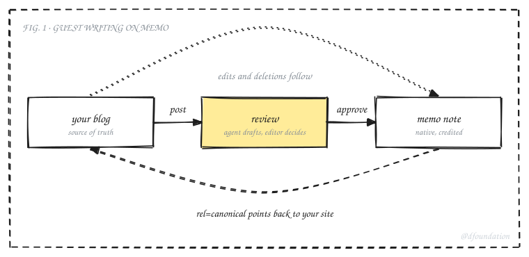
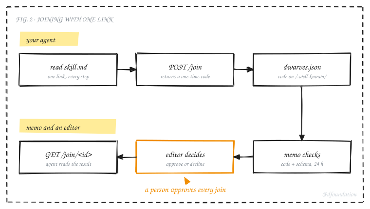
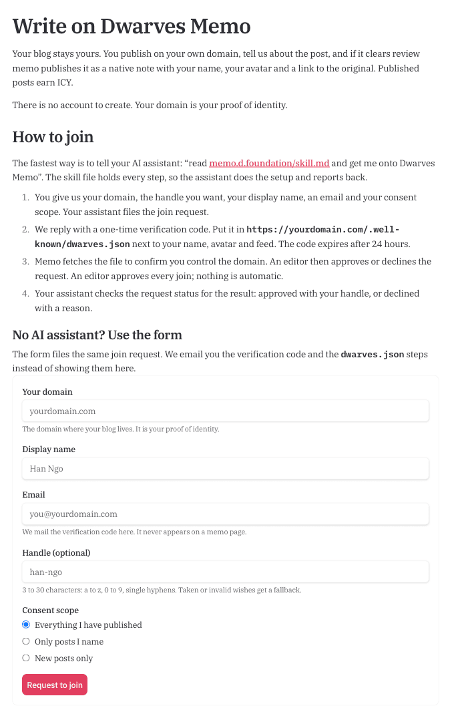
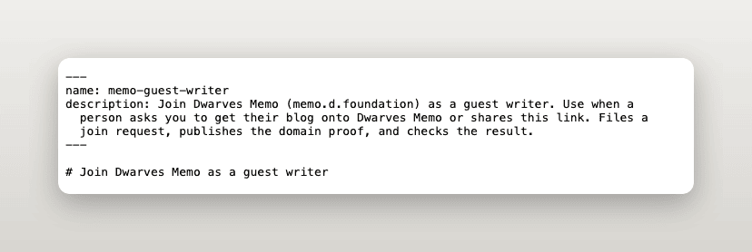
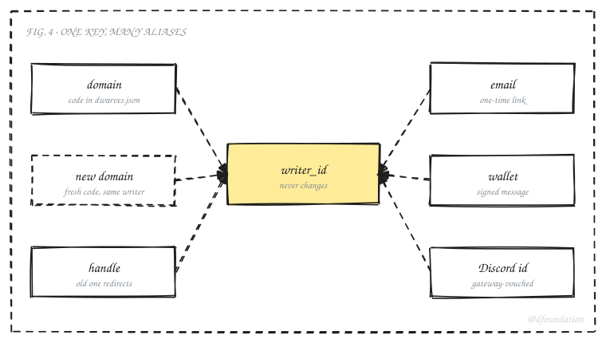
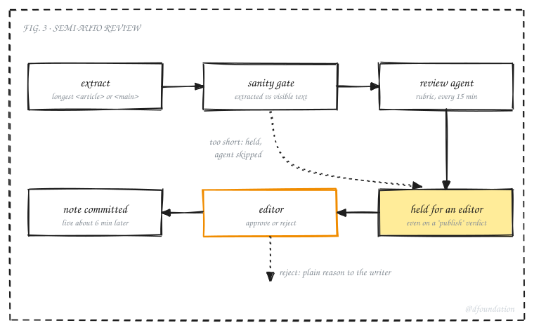
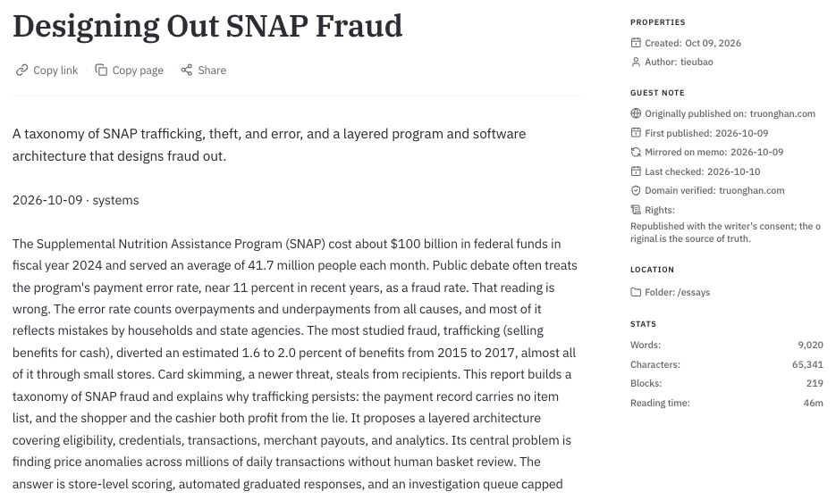
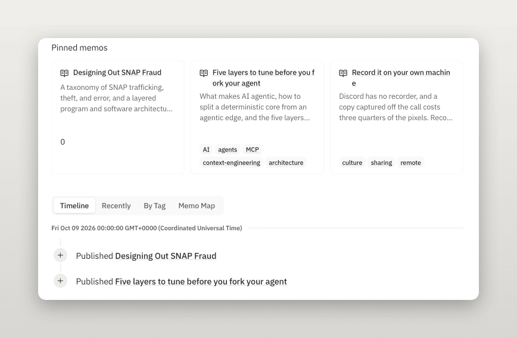
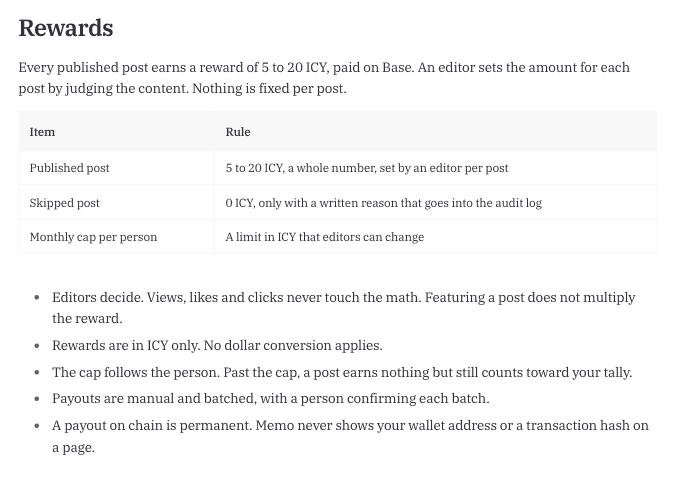
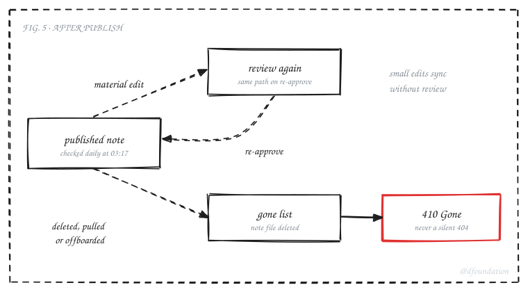

The first guest post memo ever reviewed was judged on 175 characters. The post, "Designing Out SNAP Fraud" from truonghan.com, runs to 93,252 characters of extracted text. The extractor took the first `<article>` element on the page, which happened to be a figure card, and the review agent read that fragment and held the post as incoherent. An editor rejected it as an extraction bug and resubmitted it. The resubmit never showed up in the editors' channel, because its notification key had already been used and was deduplicated.

That run is the reason the guest-writer design looks the way it does. Memo now accepts posts from writers who publish on their own sites, and every step of the pipeline assumes something can go wrong between the writer's page and the published note. This article explains how it works, for two readers: writers deciding whether to join, and engineers who want to know what runs where.



_Fig. 1: The writer's site stays the source. Memo reviews a post, publishes it as a native note, and points search engines back to the original._

## Why memo opens to guest writers

Memo started as the shared notebook of Dwarves Foundation. Engineers, designers and operators published field notes and post-mortems there. Over the years many of those writers moved to their own blogs, which is a healthy move: a personal site is a portfolio and an address the writer owns. The cost was that memo stopped seeing most of the writing it was built to collect.

The guest-writer program reverses the flow without asking anyone to move back. A writer keeps publishing on their own domain. When memo publishes one of their posts, the post becomes an ordinary memo note in a normal folder, with the writer credited, a `rel=canonical` link to the original, and a small reward. The writer's site remains the source of truth. If they edit the post, memo notices. If they delete it, memo takes the note down.

The domain carries the identity. There is no account to create. A writer proves they control a domain by placing a one-time code in a file on that domain, and that proof is what an editor sees before approving them. The design treats the domain as the writer's byline on the open web and memo as a second shelf for the same book.

That leads to two design choices. First, there is no separate guest area: a guest post lives at a normal memo path such as `/essays/designing-out-snap-fraud`, with the same sidebar, search, tag pages and contributor page as every other note. Second, the canonical link always points home, so search ranking stays with the writer's site.

## Joining takes one link

A writer tells their AI assistant: "read memo.d.foundation/skill.md and get me onto Dwarves Memo". The skill file is a short Markdown document written for agents. It lists what to collect from the writer, the exact calls to make, how to verify the result, and which errors to report instead of improvising around.



_Fig. 2: The agent does the setup. Memo checks the domain proof. A person approves every join._

The flow has six steps:

1. The agent reads `skill.md` and collects the writer's domain, the handle they want, a display name, a contact email and a consent scope.
2. It calls `POST /api/memo/join`. The reply carries a request id, a one-time verification code and the handle memo assigned.
3. The agent publishes the code in `https://<domain>/.well-known/dwarves.json`, next to the writer's name, avatar and feed.
4. Memo fetches that file, validates it against the published JSON Schema at `/schemas/dwarves.json`, and compares the code. The code expires 24 hours after the join call.
5. Only then does the request reach an editor, who approves or declines it with a reason.
6. The agent reads the outcome with one read-only call, `GET /api/memo/join/<id>`.

The join endpoint is public, so it never creates a writer by itself. It creates a request that a human must approve. The limits are strict and the errors are specific, so an agent can recover without guessing:

| Limit                      | Value       | Answer on breach                  |
| -------------------------- | ----------- | --------------------------------- |
| Join requests per IP       | 5 per hour  | `429` with `Retry-After`          |
| Open requests per domain   | 1 at a time | `409`                             |
| Requests per domain        | 3 per day   | `429` with `Retry-After`          |
| Verification code lifetime | 24 hours    | request declined as expired       |
| Domain already joined      | n/a         | `409`                             |
| Invalid fields             | n/a         | `422` listing every error at once |

The `dwarves.json` file is world-readable, so the schema allows only what the blog already shows: a required `name`, and optional `avatar`, `feed`, `bio`, `memo_verification` and `native`. Unknown fields are rejected. The live file on truonghan.com carries three fields: `name`, `feed` and `native`. The `native` field links the guest domain to the writer's existing memo contributor handle. Memo treats that link as a proposal, and an admin confirms it.



_Fig. 3: The live join page at memo.d.foundation/writers/join. A writer without an assistant uses the form, which files the same request._



_Fig. 4: The top of memo.d.foundation/skill.md, the one file an agent reads to do the whole setup._

## One permanent key behind every name

The first version of the pipeline keyed everything on the domain: the database row, the guest URL and the reward ledger. That worked for one writer and broke the moment anyone moved house. A domain change would orphan every post and every link.

The current model gives each writer one opaque, permanent `writer_id`. Every human-facing name hangs off it as an alias row, and each alias kind has its own proof.



_Fig. 5: Domains, handles, email, wallet and Discord id are all aliases. A rename or a domain move adds one alias row and migrates no data._

The handle is memo's own name for a writer. It appears in the contributor URL `/contributor/<handle>` and in the `authors` field of their notes, never in a post URL, so changing it cannot break a link to a post. The rules are short: lowercase `a` to `z`, digits and single hyphens, 3 to 30 characters. Reserved route names such as `admin`, `api`, `writers` and `join` are blocked, as is any existing contributor name. If a writer asks for nothing or for a taken handle, memo uses the display name in kebab case, then adds a number. After a rename, the old contributor URL answers `301` to the new one.

## How a post gets in

A post reaches memo in one of three ways, and all three land in the same review queue:

- Feed suggestions. If `dwarves.json` names a feed, memo checks it daily and suggests new posts to the editors.
- Submit by URL. An editor submits a post a writer asks about.
- Past posts. After a join is approved, memo reads the writer's feed and sitemap and builds a list of candidates. An operator picks which ones to import on an admin page.

The writer decides what memo may take. At join they pick one consent scope, in their own words, and the import page only lets an operator select inside it:

| The writer chooses            | What it means                                                                |
| ----------------------------- | ---------------------------------------------------------------------------- |
| "Everything I have published" | Memo may list any post published before today. Editors pick which to import. |
| "Only posts I name"           | Memo lists only the URLs the writer gave. Nothing else is touched.           |
| "New posts only"              | Nothing from before today. Memo may suggest posts published from now on.     |

Staff change a scope only on the writer's written request, and every scope keeps the writer's right to remove a post by deleting it on their own site. Posts an operator skips are remembered, so the feed watcher never suggests them again.

> TODO before publish: screenshot of the import page at `memo.d.foundation/admin/writers/<handle>/import`, showing candidates, the consent-scope filter and the Rewards tab. The page is built, but the Cloudflare Access application that protects it does not exist yet, so there is no real capture. Do not publish with this slot empty or filled by a mock.

## Semi-auto review with a human verdict

Every post goes through the same gate, and the gate has one hard rule: the review agent never publishes. A model verdict of "publish" lands as a hold marked ready for an editor. Only a human approve turns a post into a note.



_Fig. 6: Extraction, a sanity check, the review agent, then a person. Nothing reaches the vault without an editor's approve._

Extraction fetches the post's HTML, capped at 2 MB, and keeps the longest `<article>` or `<main>` element. Picking the longest instead of the first is the fix for the 175-character incident.

The sanity gate came out of the same incident. Before the model sees anything, memo compares the extracted length with the page's visible text. When the extraction is far shorter, the post is held as "extraction suspicious" with both numbers, and the agent is never called. A writer should never get a quality verdict on text that was not their post.

The review agent runs every 15 minutes on Workers AI and judges the text against a written rubric. The bar is permissive on purpose:

| Part of the rubric | Content                                                                                                                                                                                   |
| ------------------ | ----------------------------------------------------------------------------------------------------------------------------------------------------------------------------------------- |
| Scope              | Writing by people who build things, grounded in their own work: software, AI and agents, design and product, operations, crypto and infrastructure, team practice. English or Vietnamese. |
| Quality bar        | Original, grounded in something real, coherent from start to end.                                                                                                                         |
| Disqualifiers      | Plagiarism, generated filler, marketing or paid placement, doxxing, content that teaches harm, illegal content.                                                                           |
| Hold triggers      | Relevance uncertain, suspected plagiarism, legal or reputational risk, borderline quality.                                                                                                |

Long posts get their own path. The second review of the SNAP post failed for a different reason: its full text exceeded the model's context window, so the agent could not judge it at all. Posts beyond the context are now judged in parts, and the verdict records which method was used.

The first run, minute by minute, is the best argument for keeping a person in the loop:

| Time (Vietnam) | What happened                                                                                                                                    |
| -------------- | ------------------------------------------------------------------------------------------------------------------------------------------------ |
| 11:03          | truonghan.com registered; the post submitted. The extractor kept 175 characters.                                                                 |
| 11:16          | Review agent held it as incoherent, judging the fragment.                                                                                        |
| 12:39          | Editor rejected it as an extraction bug and resubmitted with the full 93,252 characters. The resubmit message was deduplicated and never posted. |
| next sweep     | Held again: the full text was larger than the model's context.                                                                                   |
| since          | Longest-element extraction, the sanity gate, attempt-numbered notification keys and long-post review all shipped.                                |

An agent judged the wrong text with full confidence. The only thing between that verdict and the writer was an editor who opened the page.

## What a published guest note looks like

When an editor approves, a small publisher step converts the stored HTML to Markdown, builds the frontmatter, and has the Dwarves ops bot commit the note to the memo vault. The converter keeps only the post's `<article>` or `<main>`, so the blog's own header and navigation stay behind. From that commit on, the guest note ships through the same publish chain as every native note, and it is live about six minutes later. The vault's formatting bot skips guest notes, so the body stays as the writer wrote it.

The frontmatter adds the fields only a mirrored post needs, and the sidebar reads them:

```yaml
guest: true
writer_id: "wr_<ULID>"
canonical_url: "https://truonghan.com/designing-out-snap-fraud/"
original_domain: "truonghan.com"
mirrored_at: 2026-10-09
last_checked: 2026-10-10
rights: "Republished with the writer's consent; the original is the source of truth."
redirect:
  - "/writers/truonghan.com/designing-out-snap-fraud"
```



_Fig. 7: The live guest note at memo.d.foundation/essays/designing-out-snap-fraud. The Guest note group shows where it first appeared, when memo mirrored and last checked it, the verified domain and the rights line._

The old guest URL keeps working. A request for `/writers/truonghan.com/designing-out-snap-fraud` answers `301` to `/essays/designing-out-snap-fraud`, through the same redirect map memo uses for every moved note.

On the contributor page, a guest note lists beside the writer's other notes. Here the writer is also a long-time Dwarves contributor, so the domain links to the existing native handle and the guest note appears in that timeline. A writer with no native history gets a contributor page of their own, with a guest badge and the verified domain.



_Fig. 8: The guest note on memo.d.foundation/contributor/tieubao, pinned and listed in the timeline next to native notes from the same day._

## Rewards in ICY

Every post memo publishes earns its writer between 5 and 20 ICY, the Dwarves community token. An editor sets the amount per post, as a whole number, with a short reason. A suggested amount, built from length, review score and the featured flag, sits next to the input as a hint and never decides.

| Rule           | Detail                                                                 |
| -------------- | ---------------------------------------------------------------------- |
| Amount         | 5 to 20 ICY, an integer, set per post by an editor                     |
| Who may set it | Only staff who may also pay rewards; editorial access alone cannot     |
| Bounds         | Enforced by the server: 4 and 21 are rejected                          |
| Changing it    | Allowed until the payout is confirmed, then locked                     |
| Audit          | Every set or change records who, when, old value, new value and reason |
| Featured posts | A filter and a hint, never a multiplier                                |
| Conversion     | None. The payout carries the ICY amount the editor set                 |
| Skipping       | 0 ICY, only with a written reason that goes into the audit log         |
| Monthly cap    | One cap per writer in ICY; the final value is still being set          |
| Visibility     | No amount appears on any public page or route                          |



_Fig. 9: The Rewards section of the live join page, stating the same rule to writers._

A wallet is optional at join. Rewards accrue whether or not a writer has linked one, and a writer links a wallet later by signing a message with it, so a typed address never counts. An agent may open the wallet page for a writer but never signs. Payouts are manual in this phase: an operator confirms a batch, sends the ICY, and records the transaction. Memo itself never moves a token, and it never shows a wallet address or a transaction hash on a page.

## Takedowns, 410 and domain moves

The writer's site stays in charge after publish. Takedowns run once the takedown switch is on (see the status table below). A freshness job re-fetches every published guest post daily at 03:17 UTC and compares it with the stored copy.



_Fig. 10: Small edits sync. A material edit goes back to review and updates the same note. A removal deletes the note and puts its path on a gone list, which answers 410._

| Event                                          | What memo does                                                                       |
| ---------------------------------------------- | ------------------------------------------------------------------------------------ |
| Small edit on the writer's site                | Syncs through without review                                                         |
| Rewrite or new title                           | Back to review; on approve, the same note updates in place                           |
| Post deleted on the writer's site              | Note deleted, path added to the gone list, `410 Gone`                                |
| Writer serves `410`                            | Taken down that day                                                                  |
| Writer serves `404`                            | One-day grace period, in case a deploy broke                                         |
| Editor pulls a post, or a writer is offboarded | Note deleted, gone entry added                                                       |
| Writer moves to a new domain                   | New domain verified with a fresh code; notes, rewards and contributor page unchanged |

A `410` tells readers and crawlers that the page was removed on purpose. The gone list lives in the vault as a public list of taken-down paths, and the site answers `410` for every path on it.

A domain move is one alias row. The writer verifies the new domain with a fresh code in its `dwarves.json`, and canonical links update on the next freshness run. Nothing in the vault moves.

Memo keeps a private, signed archive of every submitted post, including posts the writer later removes. The writer decides what stays public; the internal record stays with Dwarves, by the writer's consent.

## Where things stand

Most of the design is live. Some parts ship dark until a live proof or an owner decision lands, and the article states which:

| Piece                                                         | State                                                                            |
| ------------------------------------------------------------- | -------------------------------------------------------------------------------- |
| `skill.md`, join endpoint, status call, `dwarves.json` schema | Live                                                                             |
| Domain-code verification and editor approval                  | Live; waiting on the first outside applicant                                     |
| Semi-auto review, sanity gate, long-post review               | Live                                                                             |
| Guest posts as native notes, old-URL redirects                | Live (first note published)                                                      |
| Sidebar guest metadata, contributor listing                   | Live                                                                             |
| Takedown with gone list and `410`                             | Site answers `410`; the takedown switch stays off until a live proof records one |
| Import page with Rewards tab                                  | Built; waiting on its Cloudflare Access application                              |
| Editor-set rewards                                            | Server side live; monthly cap value pending                                      |
| Wallet linking by signature                                   | Built; opens later                                                               |
| Join by email, appeal by email reply                          | Built; waiting on inbound mail routing                                           |

## For engineers: what runs where

The site and the data plane are separate Cloudflare Workers. `df-memo` serves the website. `df-memo-api` is the only component that writes to D1 (writers, posts, verdicts, payouts) and R2 (the extracted text and raw HTML), the only one that commits guest notes to the vault through the ops bot, and the only one that posts to Discord. Three cron phases drive it: the review sweep every 15 minutes, freshness and feed suggestions once a day, and a daily digest line for editors that rides the freshness tick. Each cron pings a heartbeat monitor, and each post step writes one structured log line with the job, URL, step, outcome and duration, so a single post's history is one query away.

Messages follow the same discipline. Every memo message rides a registered stream that decides its channel, identity and format, and money events post under a different bot identity from editorial ones.

The design choice worth copying is the split between the human layer and the machine layer of identity. Domains and handles change over time, so no data is keyed on them. Every surface, whether a page route, a desk command or a cron, starts from whatever alias it has and resolves to the same writer.

## Joining

A writer who publishes on their own domain can join by pointing an assistant at [memo.d.foundation/skill.md](https://memo.d.foundation/skill.md), or by using the form on [memo.d.foundation/writers/join](https://memo.d.foundation/writers/join). Validate the profile file against [memo.d.foundation/schemas/dwarves.json](https://memo.d.foundation/schemas/dwarves.json) before the code expires.
