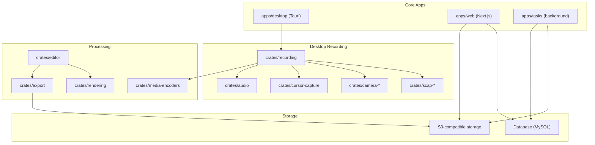
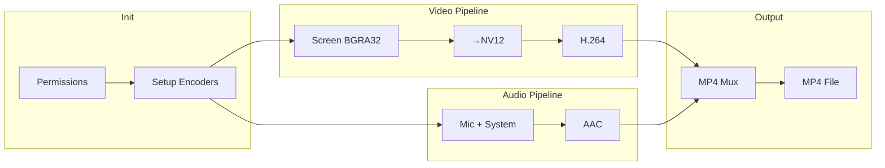
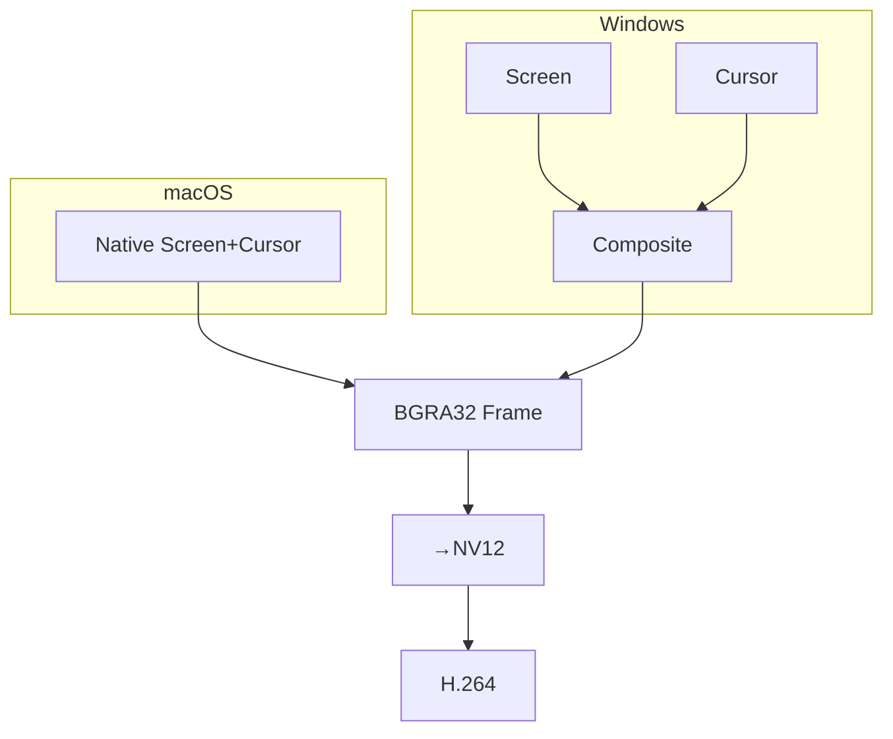

[Cap](https://github.com/CapSoftware/Cap) is an open-source, cross-platform screen recording system. It provides desktop and web apps for recording, editing, and sharing videos. All components are modular and can be self-hosted.


This documentation is a technical breakdown of Cap's Instant mode screen recording implementation. It describes the architecture, performance characteristics, and trade-offs made in the current implementation.

## Components

Cap is organized as a monorepo with two main types of components:

**Apps** — TypeScript/JavaScript applications that provide user interfaces and services:

- **apps/web** — Next.js 14 web application (sharing, management, dashboard).
- **apps/desktop** — Tauri v2 desktop app (recording, editing) with SolidJS.
- **apps/tasks** — Background processing service for AI and post-processing.

**Crates** — Rust libraries that handle performance-critical operations:

- **crates/recording** — Core recording functionality and pipeline management.
- **crates/camera\*** — Platform-specific camera capture implementations.
- **crates/scap-\*** — Screen capture implementations (ScreenCaptureKit, Direct3D, etc.).
- **crates/media-encoders** — Video/audio encoding modules with hardware acceleration.
- **crates/rendering** — Video rendering and compositing engine.
- **crates/editor** — Non-destructive editing system for advanced recording modes.
- **crates/export** — Output generation in various formats (MP4, GIF, WebM).
- **crates/cursor-capture** — Cursor movement and click tracking.

This architecture separates performance-critical capture/processing (Rust) from user interface logic (TypeScript).

Note: The architecture shows all available components. Instant mode uses a subset of these - specifically, it does not use the camera crate or the cursor-capture crate (which provides advanced cursor tracking for other modes). Instant mode embeds the cursor directly via OS APIs.

### Architecture

The following diagram illustrates how these components interact in Cap's overall system architecture:



## Instant screen recording

Having examined Cap's overall architecture, let's focus on how the instant recording mode leverages these components. Instant mode produces a single MP4 file that can be played immediately. While the file requires no post-processing for playback, standard MP4 editing tools can be used for trimming, cropping, or other modifications. This mode trades built-in editing features for reduced complexity and faster file availability.

### Recording flow

The instant recording pipeline consists of three phases:



#### Platform-specific capture implementation

The recording flow begins with platform-specific implementations. Cap uses different native APIs for each platform to capture screen content and system audio, optimizing for performance and feature availability on each operating system.

```rust
// crates/recording/src/sources/screen_capture/mod.rs
#[cfg(windows)]
mod windows;  // Windows.Graphics.Capture
#[cfg(target_os = "macos")]
mod macos;    // ScreenCaptureKit
```

**macOS (ScreenCaptureKit)**:

- Unified API for screen + system audio
- Native cursor compositing
- Display stream capability up to 120fps (instant mode uses 30fps)
- Typical latency: 16-20ms (measured via custom timestamps)

**Windows (Windows.Graphics.Capture)**:

- Direct3D11 capture pipeline
- Separate WASAPI for audio loopback
- Manual cursor rendering
- GPU-accelerated color conversion

Both platforms capture frames in BGRA32 format, which includes the desktop content and cursor. These raw frames must then undergo processing to prepare them for video encoding.

### Image recording

Once captured from the platform APIs, the image recording subsystem handles pixel format conversion and resolution management, with cursor capture integrated directly into the screen capture process.



BGRA32 is the native GPU framebuffer format - when you see content on screen, it's stored in video memory as BGRA32 pixels (Blue, Green, Red, Alpha channels, 8 bits each). Both macOS and Windows capture APIs return frames in this format since it requires no conversion from the display buffer.

NV12 is a YUV format that separates brightness (Y) from color (UV) information, using only 12 bits per pixel instead of BGRA32's 32 bits. This format matches how human vision works (more sensitive to brightness than color) and is required by H.264 encoders.

H.264 is the video compression codec that reduces the video data by ~99% (from 248MB/s to 2.3MB/s) by encoding only the differences between frames and using perceptual compression techniques.

The captured BGRA32 frames with embedded cursor must be converted to a format suitable for video encoding — a critical performance bottleneck optimized through GPU acceleration.

#### Pixel format conversion

The captured BGRA32 frames (with cursor already composited) undergo transformation:

1. **Native formats**: OS provides BGRA32 (GPU framebuffer format)
2. **Encoder requirements**: H.264 requires YUV color space (NV12)
3. **Bandwidth reduction**:
   - BGRA32: 32 bits/pixel (4 bytes)
   - NV12: 12 bits/pixel (1.5 bytes)
   - **Result**: 62.5% size reduction before encoding

4. **Performance at scale**:
   ```
   1080p@30fps BGRA32: 1920×1080×4×30 = 248.832 MB/s (237.3 MiB/s)
   1080p@30fps NV12:   1920×1080×1.5×30 = 93.312 MB/s (89.0 MiB/s)
   ```

**GPU-accelerated conversion**:

```rust
// crates/gpu-converters/src/nv12_rgba/mod.rs
pub struct NV12ToRGBA {
    device: wgpu::Device,
    queue: wgpu::Queue,
    pipeline: wgpu::ComputePipeline,
    bind_group_layout: wgpu::BindGroupLayout,
}
```

The conversion preserves cursor quality while maintaining color accuracy across the frame.

#### Resolution strategy

While capture happens at native resolution (including high-DPI displays), instant mode applies automatic downscaling when necessary:

1. **Capture resolution**: Always native display resolution
   - 5K iMac: 5120×2880
   - 4K display: 3840×2160
   - Ultrawide: 3440×1440

2. **Encoding resolution** (instant mode):
   - **Fixed**: Maximum 1080p (1920×1080)
   - **Frame rate**: Target 30fps (captures every 33.33ms, may reduce to 24fps under system stress)
   - **Downscaling**: Automatic if source > 1080p

3. **Downscaling pipeline**:
   - GPU compute shaders when available
   - Lanczos/bicubic filtering for sharp text
   - Cursor remains crisp during downscaling
   - Maintains even dimensions (H.264 requirement)

While the video pipeline processes frames at 30fps intervals, audio data flows continuously from hardware sources — requiring its own parallel processing pipeline.

### Audio recording

The audio recording subsystem operates concurrently with video capture, handling multiple responsibilities:

1. **Source management**: Captures from microphone and/or system audio with platform-specific APIs
2. **Audio mixing**: Combines multiple sources into a single stereo stream at 48kHz
3. **Buffering strategy**: Maintains elastic buffers to handle timing variations
4. **AAC encoding**: Compresses audio to 320 kbps constant bitrate

#### Audio sources

Instant mode supports two audio sources that can be used individually or combined:

```rust
// Microphone audio (optional)
if let Some(audio) = audio {
    let sink = audio_mixer.sink(*audio.audio_info());
    let source = AudioInputSource::init(audio, sink.tx, SystemTime::now());
    builder.spawn_source("microphone_capture", source);
}

// System audio (optional)
if let Some(system_audio) = system_audio {
    audio_mixer.add_source(system_audio.1, system_audio.0);
}
```

**Microphone capture**:

- **Sample format**: Float32 PCM
- **Sample rate**: 48kHz (industry standard for digital audio; resampled if necessary)
- **Channels**: Mono or stereo based on device
- **Buffer depth**: 64 slots for queuing (~83ms at 48kHz, balances latency vs. reliability)
- **Processing**: Noise suppression available

**System audio capture**:

- **macOS**: Captured via ScreenCaptureKit alongside video
  - Zero additional latency
  - Synchronized with screen content
  - Requires screen recording permission only
- **Windows**: WASAPI loopback capture (separate API)
  - ~10-20ms additional latency
  - Requires manual video alignment
  - May need additional permissions

After capturing these audio sources, they must be combined into a single cohesive stream that matches the output requirements of the AAC encoder.

#### Audio mixing

The `AudioMixer` component takes the individual audio sources and combines them into a single unified stream:

```rust
pub struct AudioMixer {
    sources: Vec<AudioSource>,
    output_tx: Sender<(ffmpeg::frame::Audio, f64)>,
}

// Output configuration
AudioInfo {
    sample_rate: 48000,  // 48kHz: professional audio standard
    channels: 2,         // Stereo output for spatial audio preservation
}
```

**Mixing pipeline**:

1. **Input normalization**: All sources resampled to 48kHz
2. **Channel mapping**:
   - Mono mic → Stereo (duplicated to both channels)
   - Stereo system audio → Passthrough
3. **Level mixing**: Simple additive mixing (no compression)
4. **Overflow prevention**: Soft clipping at ±1.0 (prevents harsh digital distortion)

The mixed audio now exists as a continuous stream of PCM samples, but a fundamental timing challenge emerges: audio flows continuously while video arrives in discrete 33.33ms frames. This mismatch necessitates sophisticated buffering.

#### Audio buffering

Audio buffering bridges the gap between continuous audio flow and discrete video timing. The buffer solves a fundamental mismatch: audio hardware produces samples continuously while video arrives in discrete frames (see [Audio-video synchronization](#audio-video-synchronization) for why video frames serve as the master clock), and must align with AAC format requirements for audio encoding. Without buffering, this mismatch would cause clicks, pops, and synchronization drift.

**Buffer implementation**:

```rust
pub struct AudioBuffer {
    pub data: Vec<VecDeque<f32>>,  // Per-channel elastic queues
    pub frame_size: usize,         // 1024 samples (AAC requirement)
    config: AudioInfo,
}
```

The buffer operates elastically, growing and shrinking to accommodate timing variations while maintaining a target depth of 21-42ms (1-2 AAC frames). This balances low latency with protection against underruns during CPU spikes.

**Key timing relationships**:

- Audio hardware: Delivers samples in variable chunks (256, 512, etc.)
- AAC encoder: Requires exactly 1024 samples per frame (21.3ms)
- Video frames: Arrive every 33.33ms (≈1,600 audio samples)
- Buffer: Accumulates samples and aligns both requirements

With the audio samples properly buffered and aligned to frame boundaries, they're ready for compression.

#### Audio encoding

The final step in the audio pipeline transforms uncompressed PCM audio into AAC (Advanced Audio Coding), reducing file size by approximately 75% while maintaining perceptual quality.

**Why AAC?**

AAC was chosen as the audio codec for several technical reasons:

1. **Universal compatibility**: Works in all browsers, mobile devices, and video players
2. **MP4 standard**: Native audio format for MP4 containers (no remuxing needed)
3. **Compression efficiency**: Better quality than MP3 at same bitrate
4. **Low latency**: LC profile adds minimal encoding delay

**Understanding audio compression**:

```
Uncompressed PCM audio (48kHz stereo):
- Size: 48,000 samples × 2 channels × 4 bytes = 384 KB/second
- Quality: Perfect reproduction
- Problem: 23 MB/minute is too large for screen recordings

AAC compression at 320 kbps:
- Size: 320,000 bits ÷ 8 = 40 KB/second
- Quality: Transparent to human hearing for most content
- Result: 2.4 MB/minute (83.3% size reduction)
```

**Encoding configuration**:

```rust
// AAC encoder configuration
const OUTPUT_BITRATE: usize = 320 * 1000;  // 320 kbps (high quality, ~2.4MB/min)
const SAMPLE_FORMAT: Sample = Sample::F32(Type::Planar);
```

Note: 320 kbps chosen for maximum compatibility while maintaining high quality. Variable bitrate (VBR) could reduce file size by 20-30% but was avoided due to compatibility concerns with some video players and streaming services.

**Quality considerations**:

- 320 kbps provides transparency for most content (comparable to streaming services)
- Voice remains clear even with background music
- System sounds preserved without artifacts
- Suitable for professional presentations

The audio pipeline — from capture through mixing, buffering, and encoding — now produces a high-quality AAC stream running in parallel with the H.264 video stream. However, these independent streams must maintain perfect temporal alignment to create a cohesive viewing experience.

### Audio-video synchronization

Synchronizing separate audio and video streams represents one of the most critical technical challenges in screen recording. Human perception is remarkably sensitive to A/V misalignment — timing errors exceeding 40ms are immediately noticeable and significantly degrade the viewing experience.

**Real-world example**: Imagine recording a balloon pop

```
What happens without proper sync:
┌─────────────┬─────────────┬─────────────┬──────────┬───────────┐
│   0ms       │   33ms      │   66ms      │   100ms  │   133ms   │
├─────────────┼─────────────┼─────────────┼──────────┼───────────┤
│ Video:      │ Pin touches │ Balloon     │ Balloon  │ Pieces    │
│             │ balloon     │ deforming   │ bursting │ flying    │
├─────────────┼─────────────┼─────────────┼──────────┼───────────┤
│ Audio       │ (silence)   │ (silence)   │ (silence)│ "POP!"    │
│ (50ms late):│             │             │          │           │
└─────────────┴─────────────┴─────────────┴──────────┴───────────┘

Result: The pop sound occurs after the balloon has already burst, breaking the cause-effect relationship.

With proper sync:
┌────────┬─────────────┬─────────────┬─────────────┬─────────────┐
│   0ms  │   33ms      │   66ms      │   100ms     │   133ms     │
├────────┼─────────────┼─────────────┼─────────────┼─────────────┤
│ Video: │ Pin touches │ Balloon     │ Balloon     │ Pieces      │
│        │ balloon     │ deforming   │ bursting    │ flying      │
├────────┼─────────────┼─────────────┼─────────────┼─────────────┤
│ Audio: │ (silence)   │ (silence)   │ "POP!"      │ (echo)      │
└────────┴─────────────┴─────────────┴─────────────┴─────────────┘

Result: Sound aligns perfectly with the visual burst
```

#### The synchronization challenge

Multiple factors make A/V sync difficult in screen recording:

**Independent hardware clocks**:

```
Video clock: Display refresh (60Hz, 120Hz, etc.)
Audio clock: Sample rate oscillator (48kHz ± 0.01%)
System clock: CPU high-resolution timer

Drift example over 1 hour:
- Video: 30fps × 3600s = 108,000 frames expected
- Audio: 48000Hz × 3600s = 172,800,000 samples expected
- With 0.01% clock drift: 17,280 sample difference = 360ms desync
- Cap's correction: Maintains <40ms offset through elastic buffering
```

**Variable capture latencies**:

- Screen capture: 5-20ms (varies by GPU load)
- Microphone: 10-50ms (depends on buffer size)
- System audio: 20-100ms (especially on Windows)
- Network cameras: 100-500ms (USB/compression delays)

#### Master clock architecture

Cap uses a video-driven master clock design:

```rust
// Instant recording timing
struct InstantRecordingActorState {
    segment_start_time: f64,  // Wall clock reference
    // Video frames provide timing heartbeat
}

// Fixed video frame intervals
const FRAME_DURATION_30FPS: f64 = 1.0 / 30.0;  // 33.33ms
```

**Why video as master?**

1. **Predictable intervals**: Exactly 33.33ms per frame
2. **User expectation**: Dropped audio less noticeable than frozen video
3. **Simpler pipeline**: Audio can adapt buffer size, video cannot
4. **Display sync**: Aligns with monitor refresh rate

#### Timestamp management

Each media source maintains its own timestamps, which must be correlated:

```rust
// Video timestamp (from capture)
video_pts = capture_time - recording_start_time

// Audio timestamp calculation
audio_pts = sample_position / sample_rate
// But must align to video frames:
aligned_audio_pts = round(audio_pts / FRAME_DURATION) * FRAME_DURATION
```

**Dual timestamp system**:

```rust
// Wall clock for absolute reference
segment_start_time: f64  // Unix timestamp

// Monotonic clock for relative timing
let elapsed = Instant::now() - start_instant;
let pts = elapsed.as_secs_f64();
```

This prevents system clock adjustments from causing sync issues.

#### Elastic buffer synchronization

The audio buffer adapts elastically to maintain synchronization with video timing:

```rust
impl AudioBuffer {
    fn read_frame(&mut self, video_pts: f64) -> Option<AudioFrame> {
        let target_samples = self.samples_for_video_pts(video_pts);

        if self.available_samples() < target_samples * 0.8 {
            // Underrun: repeat samples or insert silence
            self.handle_underrun(target_samples)
        } else if self.available_samples() > target_samples * 1.2 {
            // Overrun: drop oldest samples
            self.handle_overrun(target_samples)
        } else {
            // Normal operation
            self.read_samples(target_samples)
        }
    }
}
```

**Example: Processing balloon pop audio**

```
Video Frame 1 (0ms): Need 1,600 audio samples for 33.33ms
├─ Buffer has 1,500 samples of silence
├─ Status: Underrun (93%)
└─ Action: Duplicate last 100 samples to fill gap

Video Frame 2 (33ms): Need next 1,600 samples
├─ Buffer has 1,650 samples (silence + pop beginning)
├─ Status: Normal (103%)
└─ Action: Read exactly 1,600 samples

Video Frame 3 (66ms): Need next 1,600 samples
├─ Buffer has 2,100 samples ("POP!" sound)
├─ Status: Overrun (131%)
└─ Action: Drop oldest 500 samples to stay in sync
```

The buffer maintains synchronization through gradual adjustments, using 80%/120% thresholds to trigger corrections while avoiding audible artifacts.

#### Platform-specific synchronization

**macOS (Unified capture)**:

```objc
// ScreenCaptureKit provides synchronized timestamps
SCStreamHandler {
    didOutputVideoFrame: (frame, timestamp) {
        // Video and audio share same time base
        video_pts = CMTimeGetSeconds(timestamp)
    }
    didOutputAudioData: (data, timestamp) {
        audio_pts = CMTimeGetSeconds(timestamp)
        // Timestamps are pre-synchronized by the OS
    }
}
```

**Windows (Separate APIs)**:

```rust
// Manual synchronization required
let capture_delay = estimate_capture_latency();
let audio_delay = measure_wasapi_latency();

// Correlate using system clock
video_pts = video_capture_time - recording_start;
audio_pts = audio_capture_time - recording_start - (audio_delay - capture_delay);
```

#### Synchronization quality metrics

The pipeline monitors sync quality in real-time:

```rust
struct SyncMetrics {
    avg_offset: f64,      // Running average offset
    max_offset: f64,      // Worst case seen
    drift_rate: f64,      // ms/minute
    corrections: u32,     // Number of adjustments
}

// Acceptable thresholds
const MAX_SYNC_ERROR: f64 = 0.040;  // 40ms
const DRIFT_THRESHOLD: f64 = 0.001; // 1ms/minute
```

**Sync preservation strategies**:

1. **Frame dropping policy**: Drop P-frames first, preserve I-frames for seeking
2. **No resampling**: Avoid audio quality loss
3. **Minimal correction**: Small, gradual adjustments (<5ms per second)
4. **Early detection**: Monitor drift continuously

When frames must be dropped:

- P-frames dropped first (minimal visual impact)
- I-frames preserved to maintain seekability
- Audio never dropped (more noticeable than video drops)

#### Muxer synchronization

The MP4 muxer enforces final synchronization by interleaving audio and video data:

```rust
// Interleaving based on DTS (Decode Time Stamp)
loop {
    let next_video = video_queue.peek();
    let next_audio = audio_queue.peek();

    match (next_video, next_audio) {
        (Some(v), Some(a)) => {
            if v.dts <= a.dts {
                write_video_sample(v)?;
                video_queue.pop();
            } else {
                write_audio_sample(a)?;
                audio_queue.pop();
            }
        }
        (Some(v), None) => {
            write_video_sample(v)?;
            video_queue.pop();
        }
        (None, Some(a)) => {
            write_audio_sample(a)?;
            audio_queue.pop();
        }
        (None, None) => break,
    }
}
```

**Example: Muxing the balloon pop sequence**

```
Queue state during muxing:
┌──────────────────────────────────────────────────────────────┐
│ Video Queue: [V0:0ms] [V1:33ms] [V2:66ms] [V3:100ms]         │
│ Audio Queue: [A0:0ms] [A1:21ms] [A2:42ms] [A3:64ms] [A4:85ms]│
└──────────────────────────────────────────────────────────────┘

Muxing order (by timestamp):
1. Write V0 (0ms)    - Pin touches balloon
2. Write A0 (0ms)    - Silence
3. Write A1 (21ms)   - Silence
4. Write V1 (33ms)   - Balloon deforming
5. Write A2 (42ms)   - Silence
6. Write A3 (64ms)   - "POP!" begins
7. Write V2 (66ms)   - Balloon bursting
8. Write A4 (85ms)   - "POP!" peak
9. Write V3 (100ms)  - Pieces flying

Result: Synchronized playback with pop sound aligned to burst
```


**Edit lists for start alignment**:

```
// If audio starts 50ms late:
Video track: [edts] media_time=0, duration=full
Audio track: [edts] media_time=50ms, duration=full-50ms
```

This aligns playback start for both tracks.

With both streams properly synchronized, they must be combined into a single file that maintains this timing relationship during playback.

### MP4 muxing implementation

The muxing process combines the synchronized audio and video streams into a standard MP4 container. The `MP4AVAssetWriterEncoder` carefully interleaves the streams while preserving their temporal relationships, creating an MP4 file with the following structure:

1. **File type box (ftyp)**:

   ```
   - Major brand: mp42
   - Compatible brands: mp42, isom
   - Version: 0
   ```

2. **Media data box (mdat)**:
   - Interleaved samples in decode order
   - Chunk-based organization
   - No random access without moov

3. **Movie box (moov)**:
   - **mvhd**: Movie header (duration, timescale)
   - **trak** (video):
     - tkhd: Track header
     - mdia/minf/stbl: Sample tables
     - stts: Sample timing
     - stss: Sync samples (keyframes)
     - stco: Chunk offsets
   - **trak** (audio):
     - Similar structure for AAC track

4. **Faststart optimization**:
   ```
   Initial: [ftyp][mdat][moov]
   Final:   [ftyp][moov][mdat]  // Enables progressive download
   ```

The faststart optimization repositions metadata to enable progressive playback during download — a crucial feature for web sharing.

### Encoding configuration

Throughout the recording pipeline, Cap must balance quality with real-time performance constraints. The system uses FFmpeg's codec support with carefully tuned parameters:

```rust
// Hardware encoder selection priority
1. VideoToolbox (macOS)
2. NVENC (NVIDIA)
3. QuickSync (Intel)
4. AMF (AMD)
5. Software x264 (fallback)
```

**H.264 parameters**:

- **Preset**: "ultrafast" (optimized for real-time)
- **Profile**: High (when supported by hardware encoder, falls back to Main)
- **Level**: Auto (based on resolution)
- **B-frames**: 0 (reduce latency)
- **Reference frames**: 3
- **Rate control**: Calculated based on resolution (≈18.7 Mbps for 1080p@30fps)

**AAC parameters**:

- **Sample rate**: 48 kHz
- **Bitrate**: 320 kbps
- **Channels**: Stereo when available, mono fallback
- **Profile**: AAC-LC (Low Complexity)

These encoding parameters reflect extensive tuning to balance output quality with the stringent performance requirements of real-time capture.

### Performance characteristics

The careful optimization throughout the pipeline results in the following measured resource usage:

| Component      | CPU Usage\* | Memory | Notes                   |
| -------------- | ----------- | ------ | ----------------------- |
| Screen capture | 1-3%        | 20MB   | OS-handled              |
| BGRA→NV12      | 2-5%        | 50MB   | GPU when available      |
| H.264 encode   | 3-8%        | 80MB   | Hardware accelerated    |
| AAC encode     | 1-2%        | 10MB   | Hardware when available |
| MP4 muxing     | <1%         | 5MB    | Sequential writes       |

\*CPU percentages are estimates and due to parallel execution and shared resources, individual components may not sum to the total in actual measurement.

**Throughput metrics**:

- 1080p@30fps: ~248.8 MB/s raw → 18.7 Mbps encoded
- Audio: 1.5 Mbps raw → 320 kbps encoded

These modest resource requirements enable smooth concurrent operation with other applications on typical hardware — a key design goal for a tool meant to record other software in action.

### Error handling

Real-world recording scenarios present numerous failure modes — from permission issues to resource exhaustion. The instant mode pipeline implements comprehensive error recovery strategies across all components, prioritizing recording continuity over perfect quality when failures occur.

Errors are logged to system telemetry (when enabled) with the following metrics:

- `dropped_frames_count`
- `audio_underrun_count`
- `encoder_fallback_count`
- `sync_correction_count`
- `disk_space_warnings`

#### Permission & initialization errors

**Screen recording permission denied**:

```rust
// macOS: Direct user to System Preferences
// Windows: Retry with fallback to BitBlt API
match check_screen_permission() {
    Err(PermissionDenied) => {
        show_permission_dialog();
        return Err("Screen recording requires permission");
    }
    Ok(_) => continue,
}
```

**Audio device unavailable**:

```rust
// Continue recording without audio rather than failing
match init_microphone() {
    Err(_) => {
        log_warning("Microphone unavailable, continuing without audio");
        None
    }
    Ok(mic) => Some(mic),
}
```

#### Runtime capture errors

**Frame drops and recovery**:

```rust
// Monitor frame timing and adapt
if elapsed > FRAME_DURATION * 1.5 {
    // Missed frame deadline
    stats.dropped_frames += 1;

    if stats.dropped_frames > 10 {
        // Persistent issues - reduce capture rate
        reduce_framerate_to_24fps();
    }
} else {
    // Reset counter on successful capture
    stats.dropped_frames = 0;
}
```

**Encoder failures with fallback chain**:

```
1. Try hardware encoder (VideoToolbox/NVENC)
   ↓ Fails (GPU overloaded)
2. Try alternative hardware (QuickSync)
   ↓ Fails (not available)
3. Fall back to software x264
   ↓ Fails (CPU overloaded)
4. Reduce resolution to 720p and retry
   ↓ Success - continue recording
```

#### Resource management

**Disk space monitoring**:

```rust
// Check available space every second
fn monitor_disk_space(&self) -> Result<()> {
    let available = get_free_space(&self.output_path)?;

    match available {
        0..=100_000_000 => {      // <100MB
            self.stop_recording();
            Err("Insufficient disk space")
        }
        100_000_000..=500_000_000 => {  // 100-500MB (0.7-3.5 minutes at 142.7MB/min)
            self.show_warning("Low disk space");
            self.reduce_quality();  // Switch to lower bitrate
            Ok(())
        }
        _ => Ok(())  // Sufficient space
    }
}
```

**Memory pressure handling**:

```rust
// Adapt buffer sizes based on available memory
let buffer_size = match available_memory() {
    0..=1_000_000_000 => 32,      // <1GB: minimal buffers
    1_000_000_000..=4_000_000_000 => 64,   // 1-4GB: standard
    _ => 128,                      // >4GB: larger buffers
};
```

#### Synchronization recovery

**Audio drift correction**:

```rust
// Detect and correct audio/video drift
if audio_pts - video_pts > MAX_DRIFT {
    // Audio running ahead
    audio_buffer.drop_samples(drift_samples);
    log_event("Dropped {} audio samples to maintain sync", drift_samples);
} else if video_pts - audio_pts > MAX_DRIFT {
    // Video running ahead
    audio_buffer.insert_silence(drift_samples);
    log_event("Inserted {} silence samples to maintain sync", drift_samples);
}
```

#### Graceful degradation priority

When multiple errors occur, the system follows this degradation hierarchy:

1. **Maintain recording** - Never stop unless critical failure
2. **Preserve video** - Drop audio before dropping video
3. **Reduce quality** - Lower resolution/framerate before failing
4. **Simplify pipeline** - Disable effects, cursor, etc.
5. **Alert user** - Clear indication of degraded state

**Example cascade**:

```
Normal:     1080p30 + audio + cursor → 142.7MB/min
Degraded 1: 1080p24 + audio + cursor → 115MB/min (thermal throttle)
Degraded 2: 720p24 + audio + cursor  → 65MB/min (memory pressure)
Degraded 3: 720p24 + no audio        → 60MB/min (audio failure)
Emergency:  480p15 + no audio        → 20MB/min (critical resources)
```

This comprehensive error handling strategy ensures recordings continue even under adverse conditions, with graceful degradation that users can understand.

**User-facing error states**:

- Recording indicator changes color (green→yellow→red)
- Toast notifications for degraded quality
- Final recording includes metadata about any quality reductions

### Constraints & trade-offs

Every engineering decision involves trade-offs. Instant mode's design choices prioritize simplicity, immediate availability, and low resource usage — but these benefits come with specific limitations.

#### Feature constraints

**What instant mode CANNOT do**:

| Feature               | Why It Is Excluded                        | Impact                                        |
| --------------------- | ----------------------------------------- | --------------------------------------------- |
| Camera overlay        | Requires real-time compositing (+30% CPU) | No picture-in-picture presentations           |
| Cursor customization  | Cursor baked into frames during capture   | Cannot enhance or hide cursor after recording |
| Pause/resume          | Implementation choice for simplicity\*    | Must stop and start new recording             |
| Variable quality      | Encoders locked during capture            | Quality decisions must be made upfront        |
| Built-in editing      | Not included in instant mode\*\*          | Use Studio mode or external tools             |
| Multiple audio tracks | Single AAC stream in MP4                  | Cannot separate mic/system audio later        |

\*MP4 supports pause/resume through segment concatenation or edit lists, but instant mode prioritizes one-click simplicity over complex timeline management.

\*\*The MP4 files produced by instant mode are standard format and fully compatible with video editing software (FFmpeg, Adobe Premiere, DaVinci Resolve, etc.). Instant mode omits built-in editing features to maintain simplicity and reduce complexity.

#### Technical trade-offs

**Performance vs. Flexibility**:

```
Cap Instant Mode:       Traditional Screen Recorders (OBS, etc.):
├─ Single encoding pass         ├─ Capture raw → encode → remux
├─ Direct-to-MP4 muxing         ├─ MKV/FLV → convert to MP4
├─ 5-15% CPU usage (typical)    ├─ 20-40% CPU usage
├─ 165MB memory                 ├─ 400MB+ memory
├─ Direct MP4 output            ├─ Intermediate format → MP4
└─ Ready in <100ms              └─ Ready in 5-30 seconds
```

**Quality vs. File Size**:

- **Current**: 1080p30 @ 18.7 Mbps video + 320 kbps audio = 142.7 MB/minute
- **Alternative 1**: 4K30 @ 50 Mbps video + 320 kbps audio = 377.4 MB/minute (2.6x larger)
- **Alternative 2**: 1080p60 @ 25 Mbps video + 320 kbps audio = 189.9 MB/minute (1.3x larger)
- **Decision**: 1080p30 balances quality with reasonable file sizes

#### Design philosophy

The constraints reflect three core principles:

1. **Immediate availability**
   - No waiting for processing
   - No intermediate files
   - Direct upload capability

2. **Universal compatibility**
   - Standard MP4 container
   - H.264/AAC codecs work everywhere
   - No special players required

3. **Predictable performance**
   - Consistent resource usage
   - No surprise CPU spikes
   - Works on modest hardware

#### Ideal use cases

**Instant mode excels at**:

- Short demos and explanations (1-10 minutes)
- Bug reports and issue documentation
- Meeting recordings and presentations
- Social media content (sub-5 minute videos)
- Live troubleshooting sessions
- Educational content without heavy editing needs

**Instant mode struggles with**:

- Long recordings (>30 minutes due to file size)
- Content requiring post-production
- Multi-camera or complex audio setups
- Recordings needing precise editing
- Ultra-high quality requirements (4K/60fps)

These deliberate trade-offs create a tool optimized for a specific workflow: users who need to record and share screen content quickly without post-processing requirements.

## Summary

This technical breakdown has traced the complete journey of a screen recording through Cap's instant mode pipeline — from initial permission checks to final MP4 output. The implementation demonstrates how careful architectural choices enable high-quality screen recording with minimal system impact.

Cap's instant screen recording mode leverages platform-native APIs, GPU acceleration, and sophisticated synchronization mechanisms to achieve:

- **One-click recording** with no configuration required
- **Low resource usage** (5-10% CPU on M1 Max, 10-15% on i7-12700K)
- **Immediate sharing** with standard MP4 output
- **Professional quality** at 1080p30 with synchronized audio
- **Cross-platform consistency** between macOS and Windows

The single-pass architecture deliberately trades post-processing flexibility for reduced latency and simplified implementation. Every component — from platform-specific capture APIs to elastic audio buffers to synchronized muxing — serves the core design goals of immediate file availability, universal playback compatibility, and predictable resource usage.

This architectural approach positions Cap's instant mode as an ideal solution for modern screen recording needs, where the ability to quickly capture and share content often outweighs the need for complex editing features.

---

_Disclaimer: Additional appendices covering Performance Measurement Methodology, Platform Support & Limitations, Security & Privacy Considerations, and Known Issues have been excluded from this document to keep it focused on the core technical implementation._
