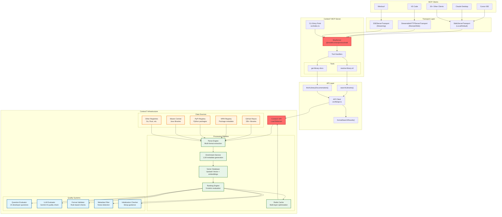
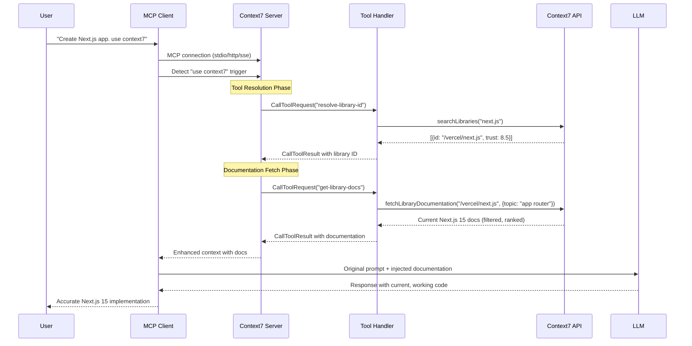
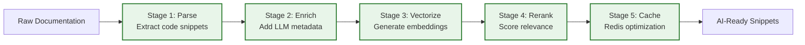
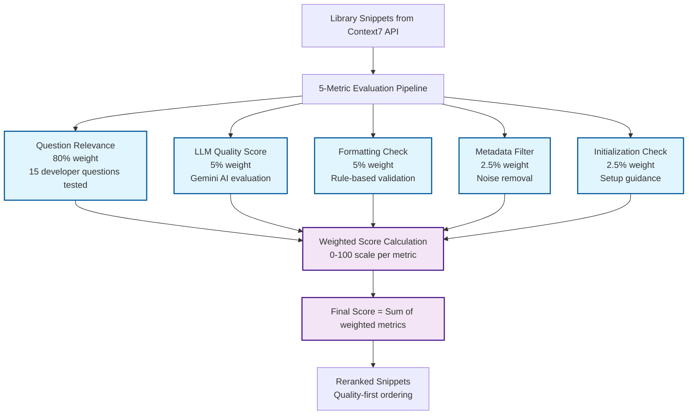

## Overview

Context7 is an intelligent documentation indexing and retrieval system that fundamentally changes how technical documentation becomes usable for AI systems. Unlike traditional approaches that dump raw markdown into vector databases, Context7 transforms documentation through a sophisticated 5-stage pipeline - parsing, enriching, vectorizing, reranking, and caching - to produce AI-optimized snippets that LLMs can actually use to generate working code.

### The problem is real

Traditional documentation retrieval systems fail spectacularly for AI code generation. When developers query "Next.js app router setup", they get either outdated examples from training data, raw documentation dumps that waste precious context tokens, or worse - AI hallucinations. LLMs confidently generate APIs that never existed, mix syntax from different versions, or create plausible-looking but completely fictional function names. The core issue: documentation isn't optimized for AI consumption, and without authoritative context, LLMs fill gaps with convincing but broken code. Raw markdown mixed with project metadata, unranked code snippets, and version mismatches create noise that confuses LLMs and generates broken code.

**Context7's core innovation**: A 5-stage documentation processing pipeline that transforms raw library docs into AI-optimized, ranked snippets. The system parses 33k+ libraries, enriches content with LLM-generated metadata, vectorizes using multiple embedding models, applies a 5-metric ranking system, and caches results for instant retrieval. The MCP integration is just the delivery mechanism - the real magic happens in the indexing and ranking algorithms.

### Key technical advances

- **Multi-stage documentation processing**: 5-pipeline transformation from raw docs to AI-ready snippets
- **5-metric quality ranking**: Question relevance, LLM evaluation, formatting, metadata filtering, initialization guidance
- **Intelligent snippet structuring**: Consistent TITLE/DESCRIPTION/CODE format with 40-dash delimiters
- **Real-time cache invalidation**: Version-aware caching that automatically updates when libraries change

### Architecture components

**Documentation Processing Pipeline**:

- Parse stage: Multi-format extraction (Markdown, MDX, rST, Jupyter)
- Enrich stage: LLM-powered metadata generation
- Vectorize stage: Multi-model embedding generation
- Rerank stage: 5-metric evaluation and scoring
- Cache stage: Redis-powered optimization with smart invalidation

**Quality Evaluation System**:

- Question relevance engine: 15 developer questions tested per snippet
- LLM quality assessment: Gemini AI technical evaluation
- Rule-based validation: Formatting and completeness checks
- Noise detection: Citations, licenses, directory structure filtering
- Setup guidance: Import/install instruction prioritization

**Search and Retrieval Infrastructure**:

- Library resolution: Fuzzy matching with LLM disambiguation
- Token-aware filtering: Budget-constrained result optimization
- Version tracking: Git-based change detection and cache invalidation

### Real-world impact

**Before Context7**: "Create a Next.js app with app router" → Generic response based on Next.js 12 training data → Broken code → Manual documentation lookup → Trial and error → 30+ minutes wasted

**With Context7**: "Create a Next.js app with app router. use context7" → Real Next.js 15 docs injected → 5-metric ranking applied → Best snippets surfaced first → Working code with current APIs → 0 minutes debugging

**See it in action**: Watch how Context7's intelligent ranking delivers better code examples compared to traditional documentation injection, demonstrated through building an MCP Python agent for Airbnb using the MCPUs framework.

<iframe width="560" height="315" src="https://www.youtube.com/embed/323l56VqJQw?si=tUF8UjUB5XfmgPBQ" title="YouTube video player" frameborder="0" allow="accelerometer; autoplay; clipboard-write; encrypted-media; gyroscope; picture-in-picture; web-share" referrerpolicy="strict-origin-when-cross-origin" allowfullscreen></iframe>

## How it works

### Architecture overview

The magic happens through a sophisticated pipeline that intercepts LLM prompts, identifies library references, fetches current documentation, and seamlessly injects it into the conversation context. The entire process takes milliseconds but saves hours of debugging.



### Request flow

Under the hood, Context7 orchestrates a carefully designed sequence that transforms outdated LLM knowledge into current, working code:



## Data structures and algorithms

### Core data models

Context7 uses carefully designed data structures that balance completeness with efficiency:

```typescript
// The actual types from Context7 MCP implementation
export interface SearchResult {
  id: string; // Context7-compatible ID like "/vercel/next.js"
  title: string; // Human-readable name
  description: string; // Library purpose
  branch: string; // Git branch for versioning
  lastUpdateDate: string; // When docs were last updated
  state: DocumentState; // Document processing state
  totalTokens: number; // Total documentation tokens
  totalSnippets: number; // Available code examples (quality indicator)
  totalPages: number; // Number of documentation pages
  stars?: number; // GitHub stars (popularity signal)
  trustScore?: number; // 0-10 authority score (optional)
  versions?: string[]; // Available versions for selection
}

export interface SearchResponse {
  error?: string; // Error message if search fails
  results: SearchResult[]; // Array of search results for LLM selection
}

// Document states reflect processing pipeline
export type DocumentState = "initial" | "finalized" | "error" | "delete";
```

### Library resolution algorithm

The trick here is Context7 doesn't try to be smart about matching - it returns results and lets the LLM decide:

```typescript
// Actual implementation: Simple API call with smart error handling
export async function searchLibraries(
  query: string,
  clientIp?: string
): Promise<SearchResponse> {
  try {
    const url = new URL(`${CONTEXT7_API_BASE_URL}/v1/search`);
    url.searchParams.set("query", query);

    const headers = generateHeaders(clientIp);
    const response = await fetch(url, { headers });

    if (!response.ok) {
      const errorCode = response.status;

      // Rate limiting protection
      if (errorCode === 429) {
        console.error(
          `Rate limited due to too many requests. Please try again later.`
        );
        return {
          results: [],
          error: `Rate limited due to too many requests. Please try again later.`,
        } as SearchResponse;
      }

      // Generic error handling
      console.error(`Failed to search libraries. Error code: ${errorCode}`);
      return {
        results: [],
        error: `Failed to search libraries. Error code: ${errorCode}`,
      } as SearchResponse;
    }

    return await response.json();
  } catch (error) {
    console.error("Error searching libraries:", error);
    return {
      results: [],
      error: `Error searching libraries: ${error}`,
    } as SearchResponse;
  }
}
```

Why this works: The LLM evaluates results based on:

- Name similarity (exact matches prioritized)
- Description relevance to query intent
- Documentation coverage (`totalSnippets` as quality signal)
- Trust score (7-10 considered authoritative)
- Document state (prefer "finalized" over "initial")

### Token-aware documentation filtering

The clever bit is Context7 enforces a minimum token guarantee while keeping the client simple:

```typescript
// Actual implementation from Context7 MCP
const DEFAULT_MINIMUM_TOKENS = 10000;

server.tool(
  "get-library-docs",
  "Fetches up-to-date documentation for a library",
  {
    context7CompatibleLibraryID: z
      .string()
      .describe("Exact Context7-compatible library ID"),
    topic: z.string().optional().describe("Topic to focus documentation on"),
    tokens: z
      .preprocess(
        (val) => (typeof val === "string" ? Number(val) : val),
        z.number()
      )
      // The trick: Never go below minimum for quality
      .transform((val) =>
        val < DEFAULT_MINIMUM_TOKENS ? DEFAULT_MINIMUM_TOKENS : val
      )
      .optional()
      .describe(
        `Maximum tokens of documentation (min: ${DEFAULT_MINIMUM_TOKENS})`
      ),
  },
  async ({
    context7CompatibleLibraryID,
    tokens = DEFAULT_MINIMUM_TOKENS,
    topic = "",
  }) => {
    // Fetch with token budget
    const fetchDocsResponse = await fetchLibraryDocumentation(
      context7CompatibleLibraryID,
      { tokens, topic },
      clientIp
    );

    if (!fetchDocsResponse) {
      return {
        content: [
          {
            type: "text",
            text: "Documentation not found or not finalized for this library.",
          },
        ],
      };
    }

    // Return raw documentation - ranking happens server-side
    return {
      content: [
        {
          type: "text",
          text: fetchDocsResponse,
        },
      ],
    };
  }
);
```

The magic happens on Context7's servers - proprietary ranking algorithms select the most valuable documentation chunks within the token budget. This keeps the MCP server lightweight while allowing continuous algorithm improvements.

### Data indexing and processing pipeline

Behind Context7's real-time documentation injection lies a sophisticated 5-stage pipeline that transforms raw documentation into AI-optimized content. This isn't just scraping docs - it's intelligent processing that makes documentation actually useful for LLMs.



#### Stage 1: Parse - Documentation extraction

Context7 doesn't discriminate - it parses everything: Markdown, MDX, plain text, reStructuredText, even Jupyter notebooks. The clever bit: projects can control parsing behavior with a `context7.json` config:

```json
{
  "description": "Brief description of what your library does",
  "folders": ["docs", "guides"],
  "excludeFolders": ["src", "build", "node_modules"],
  "excludeFiles": ["CHANGELOG.md", "LICENSE"],
  "rules": ["Always use TypeScript for better type safety"],
  "previousVersions": [{ "tag": "v2.0.0", "title": "Version 2.0" }]
}
```

Why this works: Instead of blindly indexing everything, Context7 respects project structure. Documentation stays documentation, source code doesn't pollute the index.

#### Stage 2: Enrich - LLM-powered metadata generation

Raw code snippets aren't enough. Context7 uses LLMs to generate contextual metadata - not just what the code does, but when and why to use it. This enrichment phase transforms dead examples into living documentation.

#### Stage 3: Vectorize - Embedding generation

Context7 leverages Upstash Vector with multiple embedding model options:

- **WhereIsAI/UAE-Large-V1**: 1024 dimensions for maximum precision
- **BAAI/bge-m3**: 8192 sequence length for handling large code blocks
- **sentence-transformers/all-MiniLM-L6-v2**: 384 dimensions for speed

The trick: Different models for different use cases. Small snippets get fast models, complex examples get high-precision embeddings.

#### Stage 4: Rerank - Proprietary relevance scoring

This is where the 5-metric evaluation system kicks in. Context7's proprietary algorithm doesn't just rely on vector similarity - it considers question relevance, code quality, formatting, metadata, and initialization guidance to surface the best snippets first.

#### Stage 5: Cache - Redis-powered optimization

The final optimization: Redis caching at multiple levels. Popular snippets, common queries, frequently accessed libraries - all cached for instant retrieval. No redundant processing, just immediate responses.

### Documentation quality ranking system

The problem with documentation retrieval isn't finding snippets - it's finding the RIGHT snippets. Context7 fetches hundreds of code examples per library, but without intelligent ranking, developers waste time scrolling through irrelevant examples. The solution: a 5-metric evaluation system that creates a "quality leaderboard" for code snippets.



#### The snippet collection pipeline

Every snippet from Context7 arrives with a consistent structure, separated by 40 dashes:

```typescript
// Snippet structure from Context7 API
interface CodeSnippet {
  TITLE: string; // What this code does
  DESCRIPTION: string; // Context and explanation
  SOURCE: string; // Origin reference
  LANGUAGE: string; // Programming language
  CODE: string; // The actual implementation
}

// Delimiter pattern: \n + (40 × '-') + \n
const SNIPPET_DELIMITER = "\n" + "-".repeat(40) + "\n";
```

#### Metric 1: Question relevance (80% weight)

The dominant factor. Unlike generic quality metrics, this tests against real developer questions:

```typescript
// From src/services/search.ts - Actual question evaluation implementation
async evaluateQuestions(questions: string, contexts: string[][]): Promise<QuestionEvaluationOutput> {
    const prompt = questionEvaluationPromptHandler(questions, contexts, this.prompts?.questionEvaluation);

    const config: object = {
        responseMimeType: "application/json",
        responseSchema: {
            type: Type.OBJECT,
            properties: {
                questionAverageScore: { type: Type.NUMBER },
                questionExplanation: { type: Type.STRING },
            },
            required: ["questionAverageScore", "questionExplanation"],
        },
        ...this.llmConfig
    }

    const response = await runLLM(prompt, config, this.client);
    const jsonResponse = JSON.parse(response);

    return {
        questionAverageScore: jsonResponse.questionAverageScore,
        questionExplanation: jsonResponse.questionExplanation
    };
}
```

Why this works: The system evaluates each snippet against 15 actual developer questions, scoring how well it answers each one. A snippet showing "npm install react" scores 100 for "How to install React?" but 0 for "How to optimize React performance?". This laser focus on actual developer needs is why the metric gets 80% weight.

#### Metric 2: LLM quality assessment (5% weight)

Gemini AI evaluates the technical substance of each snippet:

```typescript
// From src/services/llmEval.ts - Actual LLM evaluation implementation
async llmEvaluate(snippets: string): Promise<LLMScores> {
    const snippetDelimiter = "\n" + "-".repeat(40) + "\n";
    const prompt = llmEvaluationPromptHandler(snippets, snippetDelimiter, this.prompts?.llmEvaluation);

    const config: object = {
        responseMimeType: 'application/json',
        responseSchema: {
            type: 'object',
            properties: {
                llmAverageScore: { type: Type.NUMBER },
                llmExplanation: { type: Type.STRING },
            },
            required: ["llmAverageScore", "llmExplanation"],
        },
        ...this.llmConfig
    }

    const response = await runLLM(prompt, config, this.client);
    const jsonResponse = JSON.parse(response);

    return {
        llmAverageScore: jsonResponse.llmAverageScore,
        llmExplanation: jsonResponse.llmExplanation
    };
}
```

The trick: LLM evaluation catches subtle issues like deprecated APIs or anti-patterns that rule-based checks miss. The AI evaluates relevancy, clarity, and correctness, but at 5% weight, it refines rather than dominates the ranking.

#### Metric 3: Formatting validation (5% weight)

Rule-based checks ensure structural completeness:

````typescript
// From src/lib/textEval.ts - Actual formatting evaluation
formatting(): TextEvaluatorOutput {
    const snippetsList = this.splitSnippets();
    let improperFormatting = 0;

    for (const snippet of snippetsList) {
        const missingInfo = metrics.snippetIncomplete(snippet);
        const shortCode = metrics.codeSnippetLength(snippet);
        const descriptionForLang = metrics.languageDesc(snippet);
        const containsList = metrics.containsList(snippet);

        if ([missingInfo, shortCode, descriptionForLang, containsList].some(test => test)) {
            improperFormatting++;
        }
    }

    return {
        averageScore: ((snippetsList.length - improperFormatting) / snippetsList.length) * 100
    };
}

// From src/lib/textMetrics.ts - Formatting validation rules
export function snippetIncomplete(snippet: string): boolean {
    const components = ["TITLE:", "DESCRIPTION:", "LANGUAGE:", "SOURCE:", "CODE:"];
    return !components.every((c) => snippet.includes(c));
}

export function codeSnippetLength(snippet: string): boolean {
    const codes = accessCategory(snippet, "CODE") as string[];
    return codes.some(code => {
        const codeSnippets = code.split("CODE:")
        const codeBlock = codeSnippets[codeSnippets.length - 1].replace(/```/g, "")
        const cleanedCode = codeBlock.trim().replace(/\r?\n/g, " ");
        return cleanedCode.split(" ").filter(token => token.trim() !== "").length < 5;
    })
}
````

The formatting checks penalize snippets with missing sections, code blocks shorter than 5 words, or improper structure - ensuring only complete, usable examples rank highly.

#### Metric 4: Metadata filtering (2.5% weight)

Removes project-specific noise that doesn't help developers:

```typescript
// From src/lib/textEval.ts - Actual metadata evaluation
metadata(): TextEvaluatorOutput {
    const snippetsList = this.splitSnippets();
    let projectMetadata = 0;

    for (const snippet of snippetsList) {
        const citations = metrics.citations(snippet);
        const licenseInfo = metrics.licenseInfo(snippet);
        const directoryStructure = metrics.directoryStructure(snippet);

        if ([citations, licenseInfo, directoryStructure].some(test => test)) {
            projectMetadata++;
        }
    }

    return {
        averageScore: ((snippetsList.length - projectMetadata) / snippetsList.length) * 100
    };
}

// From src/lib/textMetrics.ts - Metadata detection patterns
export function citations(snippet: string): boolean {
    const citationFormats = ["bibtex", "biblatex", "ris", "mods", "marc", "csl json"]
    const langs = accessCategory(snippet, "LANGUAGE") as string[];
    return langs.some(lang => {
        const langSnippet = lang.split("CODE:")[0];
        const cleanLang = langSnippet.trim().replace(/\r?\n/g, "").toLowerCase();
        return citationFormats.some(format => cleanLang.includes(format))
    })
}

export function licenseInfo(snippet: string): boolean {
    const source = (accessCategory(snippet, "SOURCE") as string).toLowerCase();
    return source.includes('license')
}
```

The metadata filter identifies and penalizes snippets containing citations, license information, or directory structures - noise that clutters documentation without helping developers write code.

#### Metric 5: Initialization guidance (2.5% weight)

Prioritizes snippets that help developers get started:

````typescript
// From src/lib/textEval.ts - Actual initialization evaluation
initialization(): TextEvaluatorOutput {
    const snippetsList = this.splitSnippets();
    let initializationCheck = 0;

    for (const snippet of snippetsList) {
        const imports = metrics.imports(snippet);
        const installs = metrics.installs(snippet);

        if ([imports, installs].some(test => test)) {
            initializationCheck++;
        }
    }

    return {
        averageScore: ((snippetsList.length - initializationCheck) / snippetsList.length) * 100
    };
}

// From src/lib/textMetrics.ts - Initialization detection logic
export function imports(snippet: string): boolean {
    const importKeywords = ["import", "importing"]
    const title = (accessCategory(snippet, "TITLE") as string).toLowerCase();
    const codes = accessCategory(snippet, "CODE") as string[];

    return importKeywords.some((t) => title.includes(t)) &&
        codes.some(code => {
            const codeSnippet = code.split("CODE:")
            const cleanedCode = codeSnippet[codeSnippet.length - 1].trim().replace(/```/g, "");
            const singleLine = cleanedCode.split(/\r?\n/).filter(line => line.trim() !== "").length == 1;
            const noPath = !cleanedCode.includes("/");
            return singleLine && noPath;
        })
}

export function installs(snippet: string): boolean {
    const installKeywords = ["install", "initialize", "initializing", "installation"];
    const title = (accessCategory(snippet, "TITLE") as string).toLowerCase();
    const codes = accessCategory(snippet, "CODE") as string[];

    return installKeywords.some((t) => title.includes(t)) &&
        codes.some(code => {
            const codeSnippet = code.split("CODE:")
            const cleanCode = codeSnippet[codeSnippet.length - 1].trim().replace(/```/g, "");
            const singleLine = cleanCode.split(/\r?\n/).filter(line => line.trim() !== "").length === 1;
            return singleLine;
        })
}
````

The initialization check identifies snippets with import statements or installation commands - prioritizing examples that show developers how to set up and start using the library.

#### The scoring algorithm

All metrics combine into a single quality score:

```typescript
// From src/lib/utils.ts - Actual weighted average calculation
export function calculateAverageScore(
  scores: Metrics,
  weights?: Record<string, number>
): number {
  const defaultWeights = {
    question: 0.8,
    llm: 0.05,
    formatting: 0.05,
    metadata: 0.025,
    initialization: 0.025,
  };

  const finalWeights = weights || defaultWeights;

  return (
    scores.question * finalWeights.question +
    scores.llm * finalWeights.llm +
    scores.formatting * finalWeights.formatting +
    scores.metadata * finalWeights.metadata +
    scores.initialization * finalWeights.initialization
  );
}
```

The weighted calculation ensures question relevance dominates (80%), while other metrics act as quality filters. This creates a ranking where the most helpful snippets - those that directly answer developer questions with clean, complete code - rise to the top.

#### Library comparison mode

The clever bit: Context7 can compare snippet quality across different libraries for the same product:

```typescript
// Library comparison implementation
class LibraryComparator {
  // Same product check using fuzzy matching
  isSameProduct(lib1: string, lib2: string): boolean {
    return fuzzyMatch(lib1, lib2) > 0.8; // 80% similarity threshold
  }

  compareLibraries(library1: Library, library2: Library): ComparisonResult {
    // Verify comparing apples to apples
    if (!this.isSameProduct(library1.name, library2.name)) {
      throw new Error("Libraries are for different products");
    }

    // Parallel evaluation using identical metrics
    const scores1 = this.evaluateLibrary(library1);
    const scores2 = this.evaluateLibrary(library2);

    return {
      library1: {
        name: library1.name,
        averageScore: scores1.average,
        strengths: this.identifyStrengths(scores1),
        weaknesses: this.identifyWeaknesses(scores1),
      },
      library2: {
        name: library2.name,
        averageScore: scores2.average,
        strengths: this.identifyStrengths(scores2),
        weaknesses: this.identifyWeaknesses(scores2),
      },
      recommendation: scores1.average > scores2.average ? library1 : library2,
    };
  }
}
```

#### Real-world ranking example

Consider a query for "React hooks useState":

```typescript
// Snippet A: Direct useState implementation
{
  TITLE: "Using useState Hook",
  DESCRIPTION: "Manage component state with useState",
  CODE: `
    import { useState } from 'react';

    function Counter() {
      const [count, setCount] = useState(0);
      return <button onClick={() => setCount(count + 1)}>{count}</button>;
    }
  `,

  // Scoring breakdown
  questionRelevance: 95,    // Directly answers useState question
  llmQuality: 85,           // Clean, modern React code
  formatting: 100,          // All sections present
  metadata: 100,            // No project-specific noise
  initialization: 90,       // Has import, missing install command

  finalScore: 95 * 0.8 + 85 * 0.05 + 100 * 0.05 + 100 * 0.025 + 90 * 0.025
           = 76 + 4.25 + 5 + 2.5 + 2.25 = 90.0
}

// Snippet B: Generic React tutorial
{
  TITLE: "React Basics",
  DESCRIPTION: "Introduction to React components",
  CODE: `
    class Welcome extends React.Component {
      render() {
        return <h1>Hello, {this.props.name}</h1>;
      }
    }
  `,

  // Scoring breakdown
  questionRelevance: 20,    // Tangentially related to hooks
  llmQuality: 70,          // Outdated class component
  formatting: 100,         // Structure is fine
  metadata: 100,           // Clean code
  initialization: 60,      // No imports shown

  finalScore: 20 * 0.8 + 70 * 0.05 + 100 * 0.05 + 100 * 0.025 + 60 * 0.025
           = 16 + 3.5 + 5 + 2.5 + 1.5 = 28.5
}

// Result: Snippet A (90.0) ranks 3× higher than Snippet B (28.5)
// Developer gets the useState example first, not generic React info
```

#### Why this ranking system works

**Question-first approach**: The 80% weight on question relevance means developers get exactly what they're looking for, not just "high-quality" documentation in general.

**Quality over quantity**: A library with 10 excellent snippets ranks higher than one with 100 mediocre snippets.

**Consistent standards**: Every library gets evaluated by the same metrics, enabling fair comparisons.

**Developer-centric focus**: The metrics prioritize what actually helps developers ship code - clear examples, proper setup instructions, and relevant answers.

The result: Instead of scrolling through 100+ random snippets, developers see the best examples first. The top 3 snippets typically contain everything needed to solve their problem. No more documentation diving, just immediate answers.

## Technical challenges and solutions

### Challenge 1: Keeping 33k+ libraries updated vs static snapshots

**The problem**: Documentation changes constantly. Libraries release new versions, APIs get deprecated, examples become outdated. Traditional documentation systems take snapshots and serve stale data for months. By the time you notice the documentation is wrong, you've already wasted hours debugging.

**Context7's solution**: Scheduled sync cycles with intelligent change detection and manual override capabilities. The system operates on three levels:

**Automatic sync cycle (10-15 days)**: Context7 automatically crawls all 33k+ libraries on a rolling schedule. Each library gets checked every 10-15 days for updates, ensuring the index stays current without overwhelming source servers.

**Manual trigger via Context7 UI**: Users can manually trigger documentation updates for specific libraries through the Context7 interface. This is crucial when developers know a library just released a major update and need the latest docs immediately.

**Change detection system**: Before reprocessing, Context7 checks if the library actually has new changes. The system compares:

- Git commit hashes for repository-based documentation
- Package version numbers from registries (NPM, PyPI, Maven)


### Challenge 2: Context window limitations

**The problem**: Modern LLMs have context windows ranging from 8K to 200K tokens. Naive documentation injection could easily consume the entire context, leaving no room for conversation history or causing the LLM to "forget" important instructions.

**Context7's solution**: Server-side token management with a default guarantee of 10,000 tokens. The MCP client sends a token limit, Context7's API applies proprietary ranking to return the most relevant documentation within that budget. Code examples rank higher than prose, API signatures higher than descriptions. The result: maximum value per token.


### Challenge 3: Library name ambiguity

**The problem**: Users type "React", "react.js", "ReactJS", or "Facebook React" - all referring to the same library. Simple string matching fails, fuzzy matching returns wrong libraries entirely.

**Context7's solution**: The `resolve-library-id` tool returns multiple search results with metadata (trust scores, snippet counts, descriptions) and lets the LLM select the most appropriate match. This hybrid approach combines algorithmic search with LLM-powered disambiguation. No complex string matching in the MCP client, just smart delegation.

### Challenge 4: Multi-client compatibility

**The problem**: Different MCP clients (Cursor, VS Code, Claude Desktop) have different configuration formats, transport preferences, and connection methods. A one-size-fits-all approach doesn't work.

**Context7's solution**: Multi-transport support with auto-detection. The CLI accepts `--transport` flags for stdio (default), HTTP, and SSE. The HTTP server creates different endpoints (`/mcp`, `/sse`, `/messages`) to handle various client patterns. This architecture enables the same server to work across 20+ different MCP clients without modification.

## What we would do differently

### Current limitations and future improvements

**Documentation versioning**: Currently, Context7 serves the latest documentation by default. The better approach:

```typescript
// Proposed improvement: Version-aware documentation
interface VersionedDocRequest {
  libraryId: string;
  version?: string; // "15.0.0" or "latest" or "^14.0.0"
  preferStable?: boolean; // Avoid RC/beta versions
}

// This would enable:
// "Create Next.js 14 app" -> Specifically Next.js 14 docs
// "Create Next.js app" -> Latest stable version
```

**Intelligent caching strategy**: The current approach fetches documentation on every request. An improved design would:

- Cache documentation locally with smart invalidation
- Pre-fetch commonly used libraries during idle time
- Use ETags for efficient cache validation
- Implement differential updates for documentation changes

**Private package support**: Many organizations need documentation for internal packages:

```typescript
// Proposed: Private registry support
interface PrivateRegistry {
  authenticate(credentials: Credentials): Promise<Token>;
  indexPrivatePackages(registry: string): Promise<Library[]>;
  servePrivateDocs(packageId: string, token: Token): Promise<string>;
}
```

### Architectural enhancements

**Event-driven architecture**: The current request-response model could benefit from event streaming:

```typescript
// Better: Event-driven documentation updates
class DocumentationEventStream {
  async *streamUpdates(libraryId: string) {
    yield { type: "metadata", data: await this.fetchMetadata(libraryId) };
    yield { type: "quickstart", data: await this.fetchQuickStart(libraryId) };
    yield { type: "api", data: await this.fetchAPIReference(libraryId) };
    yield { type: "examples", data: await this.fetchExamples(libraryId) };
  }
}
```

### The bottom line

Context7 MCP elegantly solves a real problem every developer faces: LLMs generating outdated or broken code. Its architecture is clean, the implementation is thoughtful, and the results are immediately valuable. While there's room for improvement in versioning, caching, and private package support, the current implementation already saves developers hours of debugging time per week.

The true innovation isn't just the technology - it's recognizing that the gap between LLM training and real-world documentation is a solvable problem. By bridging this gap with MCP, Context7 transforms AI coding assistants from frustrating approximators into reliable partners. No more broken imports, no more hallucinated APIs, just working code on the first try.
