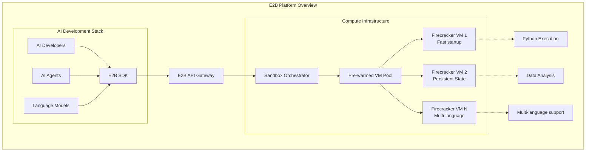
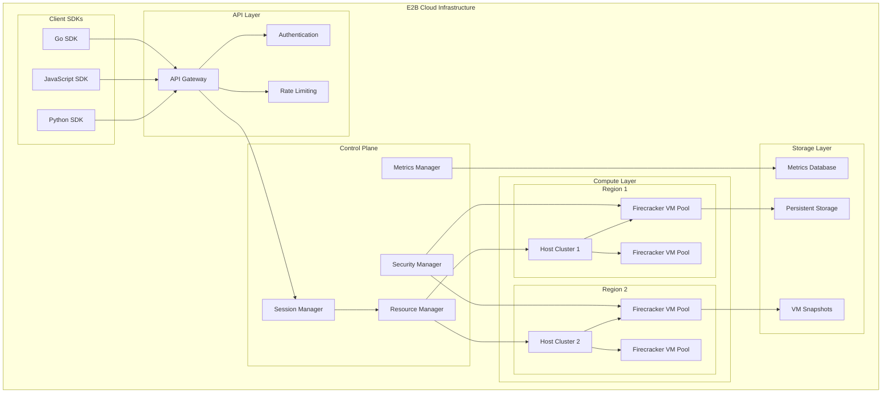
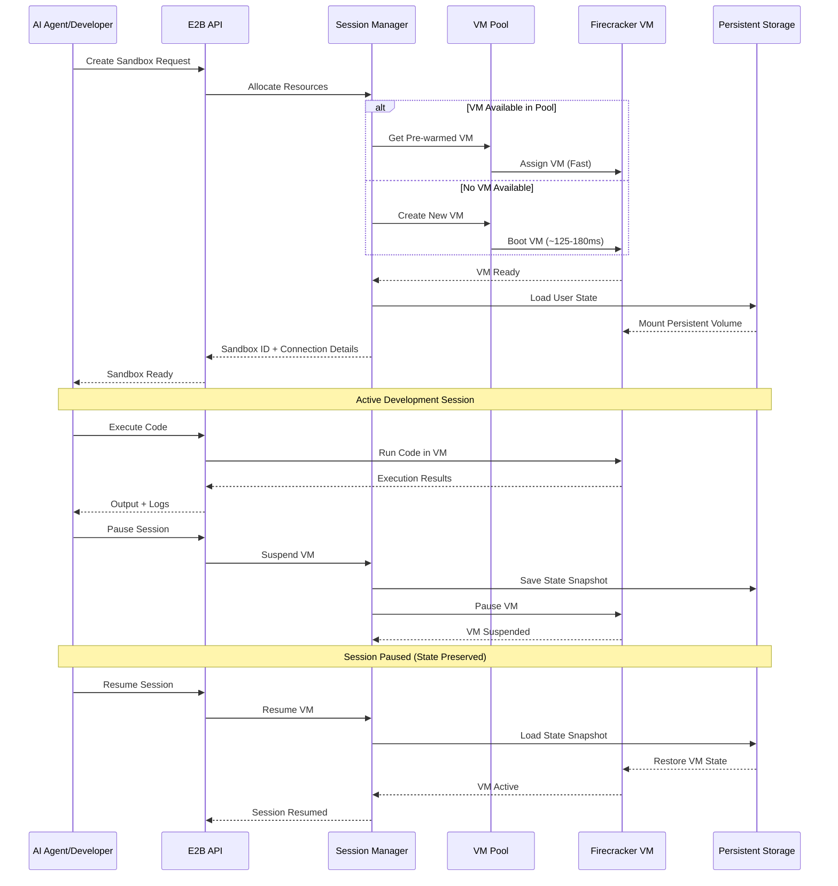
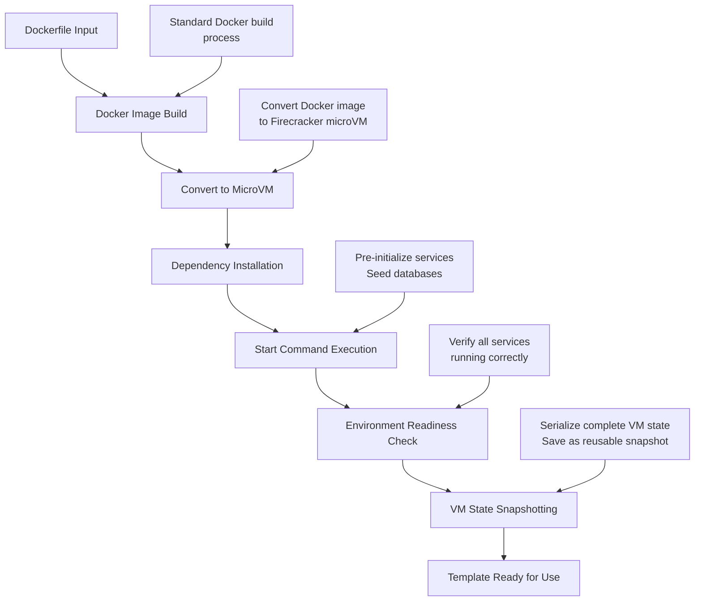
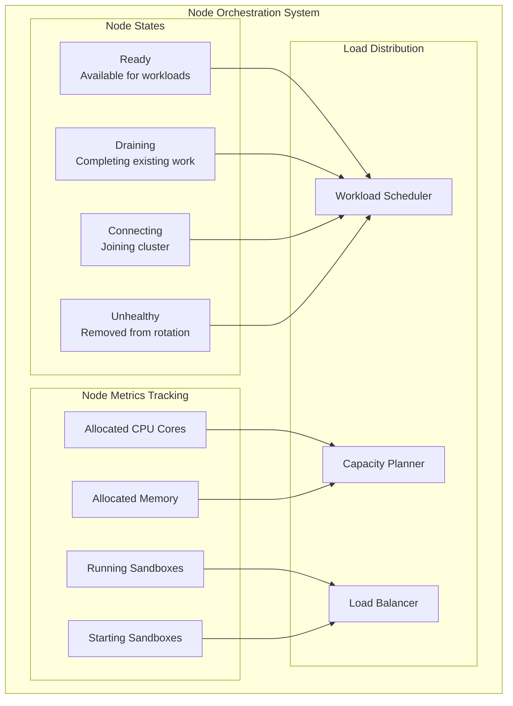
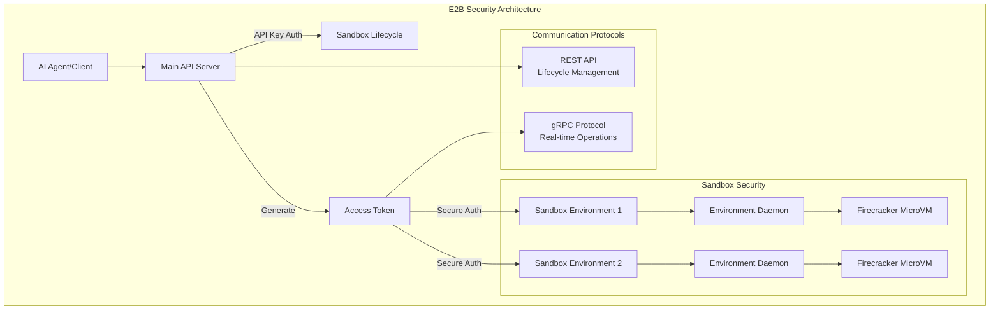
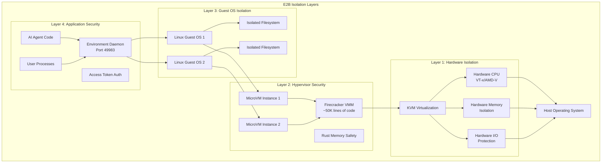
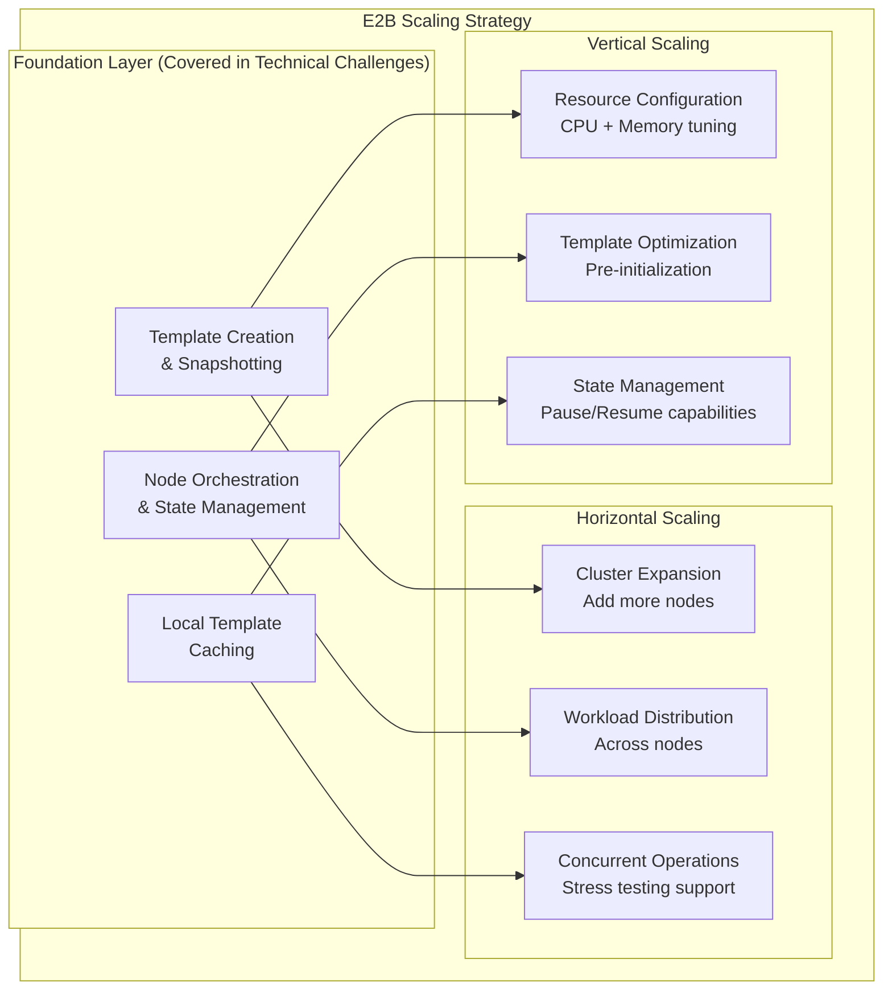

E2B is a cloud-based code execution platform designed for AI applications. By leveraging [Firecracker microVMs](https://firecracker-microvm.github.io/) instead of traditional [containers](https://en.wikipedia.org/wiki/OS-level_virtualization), E2B provides fast startup times and hardware-level isolation for untrusted AI-generated code. This technical breakdown analyzes E2B's architecture and the key components that power its performance.

## Introduction: The AI code execution challenge

### The problem space

AI-powered development tools require secure, fast code execution platforms. Unlike traditional development workflows, AI agents require:

- **Rapid iteration cycles** with sub-second response times
- **Untrusted code execution** with complete isolation
- **Persistent development environments** that maintain state
- **[Multi-tenant](https://en.wikipedia.org/wiki/Multitenancy) security** for enterprise deployment

### What is E2b?

E2B is an open-source, secure cloud runtime designed for AI applications and agents[¹](https://e2b.dev/docs). The platform provides secure, isolated [sandboxes](<https://en.wikipedia.org/wiki/Sandbox_(computer_security)>) in the cloud where AI agents can execute code, access browsers, and use full operating system capabilities. E2B offers JavaScript/TypeScript and Python SDKs for creating and managing sandboxes, connecting LLMs, and executing code across multiple programming languages[¹](https://e2b.dev/docs).

---

## E2B's architecture

### Core architecture components

E2B's architecture is built around several key components optimized for AI workloads, implemented primarily in Go and deployed using Terraform[⁴](https://github.com/e2b-dev/infra/):

The platform's core components include:

- **API Server**: Built with FastAPI to handle sandbox management and client requests[⁴](https://github.com/e2b-dev/infra/)
- **Daemon (envd)**: Runs inside each instance to manage the execution environment and handle code execution[⁴](https://github.com/e2b-dev/infra/)
- **Instance Management Service**: Oversees sandbox lifecycle including creation, monitoring, and termination[⁴](https://github.com/e2b-dev/infra/)
- **Environment Builder Service**: Constructs custom execution environments based on predefined templates[⁴](https://github.com/e2b-dev/infra/)
- **Firecracker microVMs**: AWS's open-source microVM virtualization technology, as the foundation for their sandbox infrastructure[⁴](https://github.com/e2b-dev/infra/). See [Firecracker microVM technology](#firecracker-microvm-technology) for more details.

### Session lifecycle management

E2B implements session management for persistent development environments. The boot times shown reflect Firecracker's performance characteristics[²](https://www.usenix.org/system/files/nsdi20-paper-agache.pdf):

---

## What are Firecracker microVMs and why E2B chose them?

### What is a MicroVM?

A **[microVM](https://en.wikipedia.org/wiki/Hypervisor#Classification)** (micro virtual machine) is a lightweight virtual machine designed to provide the security and isolation of traditional VMs while maintaining the resource efficiency and rapid startup times of containers[²](https://www.usenix.org/system/files/nsdi20-paper-agache.pdf). MicroVMs achieve this through a minimalist approach that includes only essential components needed to run applications, eliminating unnecessary OS services and drivers.

Unlike traditional VMs, which typically require ~131 MB of memory overhead and boot in seconds, microVMs are optimized for minimal resource usage with only **3-5 MB of memory overhead per instance** and can boot in **≤125 ms (pre-configured) to ~160-180 ms end-to-end**[²](https://www.usenix.org/system/files/nsdi20-paper-agache.pdf). MicroVMs leverage [KVM](https://en.wikipedia.org/wiki/Kernel-based_Virtual_Machine)-based hardware virtualization to provide hardware-enforced isolation, preventing malicious code from compromising the host system while maintaining the speed and resource efficiency of containers.

### E2B's Firecracker implementation

E2B uses **[Firecracker microVMs](https://firecracker-microvm.github.io/)** instead of traditional containers. Firecracker is AWS's purpose-built Virtual Machine Monitor (VMM) written in Rust with approximately **50,000 lines of code compared to QEMU's 1.4 million lines**[²](https://www.usenix.org/system/files/nsdi20-paper-agache.pdf).

Firecracker introduces MicroVMs as a minimalist virtual machine abstraction that combines the security isolation of traditional VMs with the speed and resource efficiency of containers[²](https://www.usenix.org/system/files/nsdi20-paper-agache.pdf). Key design principles include:

- **RESTful API control**: Each MicroVM is configured and controlled via a RESTful API over a UNIX socket, enabling asynchronous setup and fast "start" calls[²](https://www.usenix.org/system/files/nsdi20-paper-agache.pdf)
- **Minimal device emulation**: Scoped to essentials—virtio block and network, serial console, and minimal keyboard controller—trading flexibility for dramatically reduced Trusted Computing Base[²](https://www.usenix.org/system/files/nsdi20-paper-agache.pdf)
- **Built-in rate limiting**: Token-bucket rate limiters on disk and network I/O enforce bandwidth and IOPS caps per MicroVM, ensuring noisy-neighbor containment[²](https://www.usenix.org/system/files/nsdi20-paper-agache.pdf)

#### Architecture and Thread Model

Each Firecracker process encapsulates one microVM and runs three types of threads[³](https://github.com/firecracker-microvm/firecracker/blob/main/docs/design.md):

- **API thread**: Handles Firecracker's REST API server and control plane
- **VMM thread**: Manages the machine model and device emulation
- **vCPU threads**: Execute guest code via KVM (one thread per virtual CPU)

#### Security and Isolation

Firecracker implements multi-layered security[³](https://github.com/firecracker-microvm/firecracker/blob/main/docs/design.md):

- **Hardware-level isolation** with KVM-based virtualization and separate kernels per sandbox[²](https://www.usenix.org/system/files/nsdi20-paper-agache.pdf)
- **Jailer process**: In production, runs Firecracker in a secure sandbox with dropped privileges, cgroups, and namespaces[³](https://github.com/firecracker-microvm/firecracker/blob/main/docs/design.md)
- **Thread-specific seccomp filters**: Limit system calls per thread type for enhanced security[³](https://github.com/firecracker-microvm/firecracker/blob/main/docs/design.md)
- **Minimal attack surface** through limited device emulation (VirtIO block/network, serial console)[²](https://www.usenix.org/system/files/nsdi20-paper-agache.pdf)

#### Performance and Resource Management

- **Memory overhead**: ~3-5 MB per MicroVM, regardless of guest memory size (versus ~131 MB for QEMU)[²](https://www.usenix.org/system/files/nsdi20-paper-agache.pdf)
- **Boot latency**: Cold-start to guest init in ≤125 ms (pre-configured) and ~160-180 ms end-to-end (including API calls), roughly 2× faster than QEMU[²](https://www.usenix.org/system/files/nsdi20-paper-agache.pdf)
- **Creation throughput**: Up to **150 MicroVMs per second per host** without contention[²](https://www.usenix.org/system/files/nsdi20-paper-agache.pdf)
- **Rate limiting**: Built-in token bucket algorithm for I/O operations to ensure fair resource usage[³](https://github.com/firecracker-microvm/firecracker/blob/main/docs/design.md)
- **Production scale**: Supports millions of simultaneous workloads and processes trillions of serverless invocations per month in AWS Lambda and Fargate[²](https://www.usenix.org/system/files/nsdi20-paper-agache.pdf)
- **Persistent state management** across code executions with up to 24-hour session duration[¹](https://e2b.dev/docs)

#### Serverless Specialization and Production Readiness

Firecracker's design reflects specialization for serverless workloads, enabling massive simplification[²](https://www.usenix.org/system/files/nsdi20-paper-agache.pdf):

- **Focused scope**: Drops legacy device support, VM migration, BIOS, and PCI emulation to focus on the 80% of use-cases that power functions and containers[²](https://www.usenix.org/system/files/nsdi20-paper-agache.pdf)
- **Memory safety**: Rust's memory safety combined with minimal VMM features reduces attack surface compared to monolithic hypervisors[²](https://www.usenix.org/system/files/nsdi20-paper-agache.pdf)
- **Economic efficiency**: Fast startup and low overhead enable high levels of oversubscription and soft resource allocation, delivering multi-tenant serverless benefits without compromising isolation[²](https://www.usenix.org/system/files/nsdi20-paper-agache.pdf)
- **Production validation**: Seamless AWS Lambda migration from containers to Firecracker showed no customer-visible regressions, demonstrating production readiness[²](https://www.usenix.org/system/files/nsdi20-paper-agache.pdf)

### Technical comparison

The following comparison is based on the official Firecracker research[²](https://www.usenix.org/system/files/nsdi20-paper-agache.pdf):

| Dimension             | Linux Containers                                                                                 | QEMU/KVM Virtualization                                              | Firecracker MicroVMs                                                                 |
| --------------------- | ------------------------------------------------------------------------------------------------ | -------------------------------------------------------------------- | ------------------------------------------------------------------------------------ |
| **Security**          | Depends on kernel syscalls and namespaces; tradeoffs between compatibility and syscall filtering | Full guest kernel, hardware-enforced isolation, large TCB (QEMU+KVM) | Hardware-enforced isolation via KVM, minimal Rust VMM (≈50 KLOC), seccomp-bpf jailer |
| **Resource Overhead** | Negligible per container; shared kernel footprint                                                | ~131 MB per VM; seconds-scale boot                                   | ~3–5 MB per MicroVM; < 150 ms boot                                                   |
| **Boot Time**         | Milliseconds (container start)                                                                   | Seconds (VM)                                                         | 125–180 ms                                                                           |
| **Feature Scope**     | Full Linux API surface                                                                           | Broad device and BIOS emulation                                      | Minimal device set (virtio block, net, serial)                                       |
| **Multi-Tenancy**     | Soft isolation, noisy-neighbor risk                                                              | Strong isolation, high overhead                                      | Strong isolation, low overhead                                                       |

### Why E2B chose Firecracker

E2B's architectural decision to adopt Firecracker microVMs was driven by specific technical requirements for AI code execution platforms:

#### Security and isolation requirements

E2B requires strong isolation for executing untrusted AI-generated code. Firecracker provides **hardware-level isolation via KVM-based virtualization**, ensuring each sandbox operates with its own kernel and preventing cross-tenant attacks. Unlike container-based solutions that share the host kernel, Firecracker's **minimalist design reduces the attack surface** by excluding unnecessary devices and guest functionality.

#### Performance requirements

AI development workflows require **rapid environment provisioning** to maintain developer productivity. Firecracker's **≤125 millisecond boot times** enable near-instantaneous sandbox creation, while the **<5 MiB memory overhead per microVM** allows for high-density deployments essential for multi-tenant platforms.

#### Resource efficiency

E2B's cloud infrastructure requires efficient resource utilization for cost-effective scaling. Firecracker's **built-in rate limiters for network and storage resources** enable optimized sharing across thousands of concurrent microVMs, while the minimal resource footprint allows **high-density deployment on single hosts**[⁶](https://aws.amazon.com/blogs/opensource/firecracker-open-source-secure-fast-microvm-serverless/).

#### Persistent state management

AI agents require **stateful development environments** that maintain installed packages, file systems, and project state across sessions. Firecracker's VM-based architecture provides **native filesystem persistence** without requiring complex external state management systems, supporting E2B's up to 24-hour session duration.

---

## Technical challenges

### Achieving fast cold starts with full VM isolation

The **cold start problem** represents a fundamental challenge for AI code execution platforms: the latency between a user request and when code can actually execute. Traditional solutions force a choice between **security** (slow VM startup) or **speed** (fast but vulnerable containers).

- **Containers**: Fast startup (~50-200ms) but **shared kernel
  vulnerabilities**
- **Traditional VMs**: Strong isolation but **slow startup (seconds)** and high memory overhead (~131MB)
- **Required solution**: VM-level security with container-like performance

By leveraging Firecracker's microVM technology, E2B achieves **<200ms sandbox initialization** and "effectively eliminate cold starts" for AI applications, providing immediate responsiveness while maintaining VM-level security isolation required for untrusted code execution.

**Further optimizations:**

- **Pre-warmed infrastructure**: E2B maintains ready microVM pools to reduce allocation latency
- **Hardware isolation with minimal overhead**: Firecracker's ~5 MiB memory footprint enables high-density deployments
- **Session persistence**: Up to 24-hour session duration eliminates repeated cold starts for ongoing workflows

### Template-based environment provisioning and VM pooling

E2B implements a **sophisticated template-based resource management system** that enables efficient resource reuse through pre-built, snapshotted environments that can be rapidly instantiated multiple times.

#### Template creation and snapshotting

**Template build process**

Templates are created using the `e2b template build` command, which builds sandbox templates from Dockerfiles and converts them to microVM snapshots. The system uses an `e2b.toml` configuration file to store template metadata including resource specifications with configurable CPU and memory settings. Docker images serve as **build artifacts** during template creation but are converted to Firecracker microVM snapshots for runtime execution.

**Template lifecycle process**

The template creation process involves several key steps that optimize resource utilization:

This process transforms a standard Dockerfile into a **pre-configured, snapshotted microVM** that can be instantly restored without rebuilding. The final output is a Firecracker microVM snapshot, not a container image.

**Snapshotting technology**

This snapshotting approach captures the complete running state, including all processes and filesystem changes, allowing for **near-instantaneous restoration** and eliminating the need to rebuild environments from scratch for each sandbox.

#### Node-based orchestration and resource management

**Cluster resource tracking**

E2B manages resources through a cluster of nodes, where each node monitors:

- **CPU allocation**: Total CPU cores allocated across running sandboxes
- **Memory tracking**: Real-time memory usage across all instances
- **Sandbox capacity**: Current running instances and sandboxes being started

**Local template caching**

Each cluster node maintains **locally cached templates** - pre-built environments stored locally for immediate sandbox creation, reducing startup latency by eliminating the need to fetch and prepare VM images from remote storage.

**Node state management**

The platform employs a **node-based orchestration system** for managing sandboxes across a distributed cluster. Each node tracks critical metrics including allocated CPU cores, allocated memory, sandbox count, and operational status:

Nodes can be in various states (ready, draining, connecting, or unhealthy), providing the orchestration system with **granular control over resource allocation and workload distribution**.

**Resource allocation specifications**

The system uses predefined resource specifications with **minimum requirements of 1 CPU core and 128MB memory**. Sandbox creation requests specify template ID and resource parameters, allowing the orchestrator to schedule VMs on appropriate nodes based on available capacity.

#### Advanced resource optimization

**Start command pre-initialization**

Templates support start commands that pre-initialize services and applications, reducing runtime startup overhead. This feature allows running servers or seeded databases to be ready immediately when spawning sandboxes, eliminating wait times during runtime.

**Pause and resume functionality**

The system supports pause and resume functionality, allowing VMs to be temporarily suspended while preserving state, effectively extending the pre-warmed pool concept to running instances.

**Template management operations**

E2B provides comprehensive template management through CLI commands:

- **Template listing**: View all templates with their resource allocations
- **Template publishing**: Share templates across teams for resource standardization
- **Template deletion**: Clean up unused templates to free resources

This template-based architecture represents a sophisticated approach to environment reuse that significantly reduces resource overhead compared to traditional container-per-request models, enabling **sub-second sandbox startup times** while maintaining full isolation between instances.

---

## Security and isolation models

E2B implements a **multi-layered security and isolation model** that combines Firecracker microVM isolation, dual authentication mechanisms, and secure communication protocols to provide safe execution environments for AI agents.

### Authentication and access control

#### Dual authentication model

E2B uses a **dual authentication architecture** where API keys authenticate with the main API while access tokens secure communication with individual sandbox environments:

**Optional Secure Mode**

The system supports an **optional secure mode** that requires access token authentication for all sandbox operations. When enabled, this mode generates per-sandbox access tokens that must be included in all subsequent requests.

#### MicroVM-based isolation

Each sandbox runs as an **isolated Firecracker microVM** with its own environment daemon (`envd`) that provides secure access to filesystem, process, and terminal operations. The sandboxes are built from **Docker images** that are converted to microVM snapshots through customizable templates, providing VM-level security boundaries while maintaining rapid startup capabilities.

### Secure communication architecture

#### Dual protocol design

The platform uses **dual protocols** for different types of operations:

- **REST API**: Sandbox lifecycle management (create, kill, timeout) with API key authentication
- **gRPC Protocol**: Real-time operations (filesystem, commands, terminals) with access token authentication

All gRPC communications include authentication headers when access tokens are available, ensuring secure communication channels between clients and sandbox environments.

#### Network security

All communications use **HTTPS/TLS encryption** for data in transit, with the system automatically switching between HTTP (debug mode) and HTTPS (production) based on configuration.

### File access security

#### **Signature-based access control**

E2B implements **signature-based file access control** for enhanced security. In secure mode, file upload and download operations require cryptographic signatures that include the file path, operation type, user, and access token.

**Time-limited access**

The signature system supports **time-limited access** with configurable expiration times, providing fine-grained control over file access permissions. Without proper signatures in secure mode, file access requests are rejected with authentication errors.

### Runtime environment isolation

#### Multi-layer isolation architecture

E2B implements **defense-in-depth isolation** through multiple security boundaries, from hardware to application level:

**Security boundary analysis:**

- **Layer 1 (Hardware)**: KVM-based virtualization with CPU-level isolation (Intel VT-x/AMD-V)
- **Layer 2 (Hypervisor)**: Firecracker VMM with minimal attack surface (~50,000 vs 1.4M lines)
- **Layer 3 (Guest OS)**: Separate Linux instances with isolated filesystems per microVM
- **Layer 4 (Application)**: Environment daemon access control and process isolation

#### **Firecracker microVM isolation**

Each sandbox operates within its own **isolated Firecracker microVM** with hardware-level security boundaries and controlled access to system resources. The environment daemon runs on a dedicated port (49983) within each microVM and manages all interactions within the sandbox.

#### VM snapshotting technology

E2B leverages **VM snapshotting technology** that allows the entire VM state (filesystem + running processes) to be serialized and restored in **~150ms**. This enables rapid instantiation of pre-configured environments while maintaining complete isolation between sandboxes.

#### Lifecycle management

Sandboxes have **timeout-based lifecycle management** where microVMs are automatically terminated after a specified duration, providing resource cleanup and preventing long-running processes from consuming system resources indefinitely.

---

## Infrastructure and scaling patterns

E2B's infrastructure design enables **scalable AI code execution** by building upon the technical foundations described earlier. The platform's scaling strategy leverages its **Firecracker microVM architecture**, **template-based provisioning**, and **node orchestration** to support diverse workload patterns[¹¹](https://deepwiki.com/e2b-dev/E2B).

### Scaling architecture overview

Building on the **template lifecycle** and **node orchestration** systems detailed in the technical challenges section, E2B's infrastructure supports both horizontal and vertical scaling patterns:

### Production scaling capabilities

#### Enterprise-grade scaling

E2B's infrastructure design prioritizes **rapid provisioning**, **efficient resource utilization**, and **horizontal scalability**:

**Horizontal scaling:**

- **Node expansion**: Adding more nodes to the cluster, with each node capable of hosting multiple sandbox instances
- **Resource distribution**: System tracks resource allocation per node and distributes workloads across available nodes
- **Concurrent operations**: Support for concurrent sandbox operations with stress testing capabilities

**Vertical scaling:**

- **Resource configuration**: Templates can be optimized with specific CPU cores (1-16) and memory allocation (128MB-32GB)
- **Template optimization**: Pre-initialization through start commands and dependency caching
- **State management**: Pause/resume functionality for optimal resource utilization during inactivity

#### Operational excellence

**Resource efficiency:**

- **Template reuse**: Standardized environments eliminate redundant provisioning overhead
- **Snapshot mechanism**: Sub-second startup times through VM state preservation
- **Resource waste minimization**: Predictable resource patterns enable efficient capacity planning

**Reliability and Performance:**

- **Node state management**: Automated handling of unhealthy nodes and graceful workload draining
- **Concurrent file operations**: Support for multiple simultaneous operations and network requests
- **State preservation**: Maintains user progress and context across extended sessions

This **scaling-focused architecture** leverages the technical implementations detailed earlier to provide enterprise-grade performance and reliability for AI code execution workloads.

---

## References

1. [E2B Documentation - What is E2B?](https://e2b.dev/docs)
2. Agache, A., Brooker, M., Florescu, A., Iordache, A., Liguori, A., Neugebauer, R., Piwonka, P., & Popa, D.-M. (2020). [Firecracker: Lightweight Virtualization for Serverless Applications](https://www.usenix.org/system/files/nsdi20-paper-agache.pdf). _17th USENIX Symposium on Networked Systems Design and Implementation (NSDI 20)_.
3. [Firecracker Official Repository and Design Documentation](https://github.com/firecracker-microvm/firecracker/blob/main/docs/design.md)
4. [E2B Infrastructure Repository](https://github.com/e2b-dev/infra/)
5. [Firecracker microVM Official Website](https://firecracker-microvm.github.io/) - Technical specifications and performance characteristics
6. [AWS Firecracker Open Source Blog](https://aws.amazon.com/blogs/opensource/firecracker-open-source-secure-fast-microvm-serverless/) - Official announcement and technical details
7. [E2B SDK Reference](https://e2b.dev/docs/sdk-reference)
8. [E2B Sandbox Documentation](https://e2b.dev/docs/sandbox)
9. [E2B Enterprise Solutions](https://e2b.dev/enterprise)
10. [E2B Cookbook - Code Examples](https://github.com/e2b-dev/e2b-cookbook)
11. [DeepWiki - E2B](https://deepwiki.com/e2b-dev/E2B)

---

**About this analysis**

This technical breakdown analyzes E2B's public documentation, case studies, and architectural information to provide an objective assessment of their AI code execution infrastructure.

**Disclaimer**: This analysis is based on publicly available information. Technical details and performance characteristics may evolve as the platform continues to develop.
