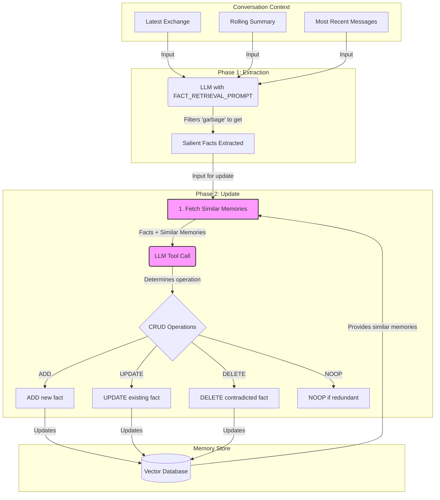
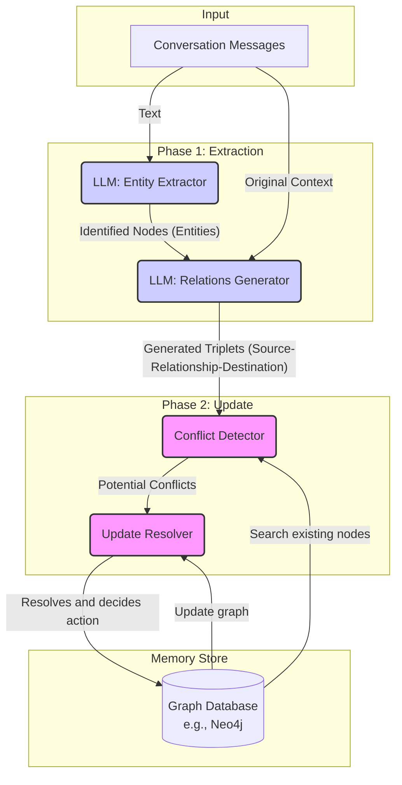

## Overview

### Introduction to Mem0 and the problems it solves

Large Language Models (LLMs) are limited by fixed context windows, which restrict their ability to maintain consistency over long, multi-session dialogues. Without persistent memory, AI agents may forget user preferences, repeat questions, or contradict previously established facts, undermining user experience and trust. For example, an agent might recommend chicken to a user who previously stated they were vegetarian and dairy-free. Even with large context windows (e.g., GPT-4, Claude 3.7 Sonnet, Gemini), these improvements only delay the problem, as meaningful conversation histories eventually exceed any window size. Additionally, important information can be buried under irrelevant tokens, and attention mechanisms degrade over distant tokens.

**Mem0** addresses these limitations with a scalable memory-centric architecture that dynamically extracts, consolidates, and retrieves salient information from ongoing conversations. This enables AI agents to build and maintain long-term memory, supporting stateful and contextually aware interactions that span days, weeks, or months. By integrating such memory mechanisms, Mem0 allows AI agents to maintain consistent personas, track evolving user preferences, and build upon prior exchanges—transforming AI from forgetful responders into reliable, long-term collaborators. Beyond conversation, memory mechanisms enhance agent performance in interactive environments, enabling anticipation of user needs, learning from mistakes, generalization across tasks, and improved decision-making.

### Key technical advances

- **Two-Phase Memory Pipeline:** Mem0 processes each new message pair (user message and assistant response) in two phases:

  - **Extraction:** Uses both a conversation summary and a sequence of recent messages to provide context. An LLM-based extraction function identifies salient memories (candidate facts) for the knowledge base.
  - **Update:** Each candidate fact is compared to existing memories using vector similarity. An LLM determines whether to ADD, UPDATE, DELETE, or NOOP (no change) for each fact, ensuring consistency and avoiding redundancy.

- **Graph-Based Memory Representation:** The Mem0g variant represents memories as a directed labeled graph, where:

  - **Nodes** represent entities (with types, embeddings, and metadata).
  - **Edges** represent relationships as triplets (source, relation, destination).
  - **Labels** assign semantic types to nodes. LLMs extract entities and relationships, and an update resolver manages conflicts and temporal reasoning. This structure supports advanced reasoning and multi-hop queries.

- **Implicit Forgetting via Relevance Filtering:** Mem0 avoids context overload by selectively extracting and retrieving only relevant information, rather than processing entire conversation histories. This reduces computational overhead, latency, and token costs, while preventing the model from being burdened by irrelevant data.

### Component categories and responsibilities

- **Extractor:** Identifies and extracts key facts from new message pairs, using both a conversation summary and recent messages. An LLM analyzes this context to produce candidate facts for the knowledge base.
- **Updater:** Consolidates information and ensures memory consistency. For each candidate fact, it retrieves similar existing memories and uses an LLM to decide whether to ADD, UPDATE, DELETE, or NOOP.
- **Retriever:** Accesses relevant information from the memory store.
  - For Mem0: Uses dense embeddings in a vector database for similarity search.
  - For Mem0g: Combines entity-centric graph traversal and semantic triplet matching for flexible retrieval.
- **Memory Store:** Pluggable backend for persistent storage and vector-based indexing.
  - Mem0 supports a wide range of vector store providers (e.g., Qdrant, ChromaDB, PineconeDB, FAISS).
  - Mem0g primarily uses Neo4j and other graph databases, combining structural richness with semantic flexibility.

### Example use cases

- **Personalized AI Assistants:** Remember user preferences and details across sessions for tailored assistance (e.g., dietary restrictions for dinner recommendations).
- **Multi-Session Customer Support:** Maintain context across multiple interactions, enabling seamless and effective support over days or weeks.
- **Complex Problem-Solving Agents:** Recall facts and constraints from long-running tasks, anticipate needs, learn from mistakes, and generalize knowledge for improved decision-making and long-term reasoning.
- **Cross-Platform Memory Sync:** The [Mem0 Chrome Extension](https://github.com/mem0ai/mem0-chrome-extension) maintains and synchronizes memory context across different AI chat interfaces, ensuring consistent experiences regardless of the platform used.
- **Conversational Memory Management:** The [OpenMemory MCP Server](https://mem0.ai/openmemory-mcp) manages and surfaces relevant memories during conversations, enabling AI systems to maintain contextual awareness across sessions.
- **Ambient Intelligence Applications:** When deployed in ambient computing scenarios, Mem0 can power:
  - **Recommendation Engines:** Learn user preferences over time to provide increasingly personalized suggestions.
  - **Health Trackers:** Monitor patterns, behaviors, and health metrics across extended periods for comprehensive wellness insights.
  - **Procedural Memory for Automation:** Store and recall complex workflows and automation sequences, adapting to user habits.
  - **Interactive Storytelling:** Create rich, persistent narrative experiences in gaming (imagine AI Dungeon with deep, consistent world memory and character development).

---

## How it works

Mem0 is a scalable, memory-centric architecture designed to overcome the fixed context window limitations of Large Language Models (LLMs) in maintaining long-term, multi-session consistency. It achieves this by dynamically extracting, consolidating, and retrieving salient information from conversations. The enhanced Mem0g variant leverages graph-based memory representations to capture complex relationships among conversational elements.

### Architecture overview

LLMs typically "forget" information once it falls outside their context window, leading to issues like lost user preferences or contradictory responses. Mem0 addresses this by externalizing memory management through several core components:

- **Extractor:** Identifies and captures key information from ongoing conversations.
- **Updater:** Compares extracted information with existing memories to maintain consistency and avoid redundancy.
- **Retriever:** Dynamically fetches relevant information from the memory store for new interactions.
- **Memory Store:** Central repository for storing and organizing memories. Mem0 uses dense, text-based storage, while Mem0g represents memories as directed labeled graphs (entities as nodes, relationships as edges).

This architecture mimics human cognition by selectively storing, consolidating, and retrieving important information, even as conversations exceed context window limits or lose thematic continuity.

### Request flow

A typical interaction with a Mem0-powered AI agent follows a structured, incremental process across two main phases: extraction and update.

1. **User Message:** The user sends a message, initiating a new interaction.
2. **Memory Retrieval:** The agent retrieves relevant memories using the message as a query.
   - Mem0 uses two sources: a conversation summary (semantic overview of the history) and a sequence of recent messages (controlled by a recency window hyperparameter, e.g., last 10 messages).
   - Mem0g combines entity-centric graph traversal (identifying key entities and relationships) with semantic triplet matching (using dense embeddings to match relationship triplets).
3. **Context Construction:** Retrieved memories, the conversation summary, recent messages, and the new message are combined into a prompt for the LLM.
4. **LLM Response:** The LLM generates a response using the constructed context.
5. **Extraction Phase:** The conversation turn (user message + agent response) is sent to the Extractor, which uses an LLM to extract salient facts (candidate memories) from the exchange.
   - In Mem0g, this involves entity extraction and relationship generation to form triplets.
6. **Update Phase:** The Updater evaluates each candidate fact against existing memories.
   - Retrieves the top-k semantically similar memories using vector embeddings.
   - Presents these to an LLM via a function-calling interface ("tool call").
   - The LLM decides to ADD, UPDATE, DELETE, or NOOP each fact.
   - In Mem0g, conflict detection and an LLM-based resolver handle relationship updates, supporting temporal reasoning by marking relationships as invalid rather than deleting them.

This pipeline enables Mem0 to dynamically capture, organize, and retrieve information, allowing AI agents to maintain coherent, context-aware conversations over extended periods—closely resembling human communication patterns.

---

## Data structures and algorithms

### Core data models

Mem0 manages conversational memory using several foundational data models:

- **Memory Object:** The primary unit of stored information, represented by the `MemoryItem` class. Each memory object includes:

  - **Fact/Data:** The core content of the memory.
  - **Vector Embedding:** A dense vector capturing the semantic meaning of the memory, generated by an Embedder component.
  - **Metadata:** Contextual details such as a unique ID, hash, timestamps (`created_at`, `updated_at`), and identifiers like `user_id` and `agent_id`. For Mem0g, entities also have a type classification.

- **Conversation Turn:** A complete exchange (user message and agent response), serving as the main source for fact extraction. Each turn is processed by the Extractor to identify new facts.

- **Retrieved Context:** A curated set of relevant Memory Objects fetched to inform the LLM's current turn. This context combines a conversation summary and a sequence of recent messages, forming a comprehensive prompt for the LLM.

### Key algorithms

Mem0 employs several algorithms throughout its memory management lifecycle:

- **Salient Fact Extraction:** An LLM analyzes conversational text using a specialized prompt that includes the conversation summary, recent messages, and the current message pair. The Extractor identifies salient memories (candidate facts) for the knowledge base. In Mem0g, this involves:

  - Entity extraction (identifying key entities and types).
  - Relationship generation (deriving connections between entities as triplets), using tools like `EXTRACT_ENTITIES_TOOL` and `RELATIONS_TOOL`.

- **Memory Consolidation:** The Updater maintains consistency and avoids redundancy:

  - Retrieves the top `s` semantically similar memories using vector embeddings.
  - Presents these and the new candidate fact to an LLM via a function-calling interface.
  - The LLM determines whether to **ADD**, **UPDATE**, **DELETE**, or **NOOP** each fact.
  - In Mem0g, conflict detection and an LLM-based resolver mark relationships as invalid (supporting temporal reasoning) rather than deleting them, using tools such as `ADD_MEMORY_TOOL_GRAPH`, `UPDATE_MEMORY_TOOL_GRAPH`, `DELETE_MEMORY_TOOL_GRAPH`, and `NOOP_TOOL`.

- **Relevance-Based Retrieval:** Efficiently fetches the most pertinent information for the LLM's context window:
  - Uses vector similarity search (e.g., cosine similarity) to find the top-k relevant memories.
  - Mem0g combines entity-centric graph traversal with semantic triplet matching (encoding queries as dense vectors and matching against relationship triplets).
  - Supports various vector database providers (e.g., Qdrant, Chroma, Pinecone, FAISS, and others).

### Storage and memory management

Mem0 features an abstracted storage layer and mechanisms for organizing conversational history:

- **Vector Store Structure:** An abstracted `VectorStore` layer supports multiple vector databases, enabling flexible deployment. Memories are indexed by embeddings for efficient retrieval. The `VectorStoreBase` class defines standard operations:

  - `create_col`, `insert`, `search`, `update`, `delete`, `get`, `list_cols`, `delete_col`, `col_info`, `list`, `reset`.

- **Conversation Chains:** Memories are logically associated with users or agents via metadata (`user_id`, `agent_id`), enabling:

  - Separation and retrieval of individual conversation histories.
  - Consistent personas and tracking of evolving preferences.
  - In Mem0g, graph nodes include metadata for precise querying and management, with temporal awareness to prioritize recent information.

## Technical challenges and solutions

### Stateless LLMs vs. stateful conversations

Large Language Models (LLMs) are inherently stateless, limited by fixed context windows that cause them to "forget" information once it falls outside the window. This makes it difficult to maintain consistency and coherence across long, multi-session dialogues. **Mem0** addresses this by externalizing conversational state into a persistent memory layer. By dynamically extracting, consolidating, and retrieving salient information, Mem0 enables LLMs to recall past interactions, user preferences, and established facts across sessions.

### Memory redundancy and bloat

Continuous fact extraction can lead to redundant or bloated memory stores. Mem0 mitigates this through its **Memory Consolidation (Update Phase)** algorithm. After extracting salient facts from a conversation turn, the Updater compares new facts against existing memories using vector similarity. An LLM, via a function-calling interface, determines the appropriate operation for each fact:

- **ADD:** Insert genuinely new information.
- **UPDATE:** Augment existing memories with more recent or detailed information (e.g., updating "User likes to play cricket" to "Loves to play cricket with friends").
- **DELETE:** Remove memories contradicted by new information.
- **NOOP:** Ignore if the fact already exists or is irrelevant.

This process prevents duplication and maintains a coherent, temporally consistent knowledge base. In Mem0g, conflict detection and an LLM-based resolver mark conflicting relationships as invalid, supporting temporal reasoning without deleting data.

### Maintaining contextual coherence

To respond contextually, an AI agent needs both recent and relevant long-term information. Mem0 creates a **Retrieved Context** for each conversational turn by combining:

- A conversation summary (semantic overview of the history).
- A sequence of recent messages (e.g., last 10 messages).
- The new message pair (user input and agent response).

This dual-context approach, along with selective retrieval of relevant Memory Objects, ensures the LLM has both broad thematic understanding and specific recent details. Mem0g enhances this with entity-centric retrieval and semantic triplet matching, exploring relationships within the knowledge graph for richer context.

### Fixed token budget management

LLMs have strict token limits, making it impractical to feed the entire conversation history. Mem0 addresses this by:

- **Salient Fact Extraction:** Using LLMs to extract only the most important facts and preferences, resulting in concise, structured memories.
- **Relevance-Based Retrieval:** Employing vector similarity search to retrieve only the top-k most relevant memories for each turn.

This selective approach significantly reduces token consumption and latency, achieving substantial cost and performance improvements over full-context methods.

### Ensuring memory accuracy

The quality of an agent's responses depends on memory accuracy. Mem0 leverages LLMs at critical stages:

- **Extraction:** LLMs analyze conversation turns and convert them into structured facts, minimizing missed or misrepresented information.
- **Consolidation:** LLMs resolve conflicts, augment existing memories, and avoid redundancy during the update phase.

These LLM-driven processes reduce hallucinations and outdated information. Mem0's evaluation on the LOCOMO benchmark demonstrates higher factual accuracy compared to existing memory systems.

### Backend flexibility

Production-ready AI agents require flexible storage solutions. Mem0 provides an abstracted **VectorStore** layer, defining standard operations (add, get, search, update, delete) implemented by various vector databases. Supported providers include Qdrant, Chroma, PGVector, Milvus, Upstash Vector, Azure AI Search, Pinecone, MongoDB, Redis, Elasticsearch, Vertex AI Vector Search, Supabase, Weaviate, FAISS, and Langchain. This modular design allows users to swap vector database backends without modifying Mem0's core logic, supporting diverse deployment needs.

## Clever tricks and tips we discovered

- **Prioritizing Recent Information:** Mem0 focuses memory extraction on the most immediate and relevant conversational exchanges, operating on the assumption that new information is typically the most pertinent. Extraction is triggered upon ingestion of each new message pair (user message and assistant response), with additional context provided by a configurable window of recent messages (e.g., last 10). This approach efficiently captures evolving user needs and preferences.

- **Dual Context Extraction:** To ensure comprehensive context, Mem0 combines two sources for memory extraction:

  - A **conversation summary** (semantic overview of the entire history), asynchronously generated and periodically refreshed to provide global thematic understanding.
  - A **sequence of recent messages** (e.g., last 10), offering granular temporal context and capturing details not yet consolidated into the summary.
    This dual-context prompt enables the LLM to extract salient memories while maintaining awareness of both broad themes and recent specifics.

- **Proactive Fact Extraction:** Mem0 keeps its memory store consistently up-to-date by extracting and evaluating salient facts after every conversation turn. This continuous, proactive process ensures that the memory reflects the latest interactions, reducing the risk of stale or outdated information.

- **Implicit Forgetting:** Rather than explicitly deleting old data, Mem0 "forgets" by selectively storing only the most salient facts and preferences. As new, more relevant information is extracted, older or less important details naturally become less likely to be retrieved. While DELETE operations exist for contradictions, the main mechanism is relevance-based retrieval—ensuring that only the most pertinent information is surfaced for each query.

- **Switching to Graphs for Complexity:** Mem0 supports two memory architectures:
  - The base **Mem0** uses dense natural language memories in vector databases, excelling at rapid retrieval and efficient multi-hop reasoning with low latency and token cost.
  - For tasks requiring deeper relational understanding, **Mem0g** leverages graph-based memory, structuring memories as directed labeled graphs (entities as nodes, relationships as edges). This enables nuanced temporal and contextual reasoning, at the cost of moderate additional latency and token usage, making it ideal for complex, open-domain queries.

## What we would do differently & future improvements

### Memory persistence & auditing

**Current State:**
Mem0 implements memory persistence and auditing through its ADD, UPDATE, DELETE, and NOOP operations during the update phase. Each memory modification is logged with `old_memory`, `new_memory`, event type, and timestamps, creating an audit trail. In Mem0g, relationships can be marked as invalid (soft deletion) to preserve historical context for temporal reasoning.

**Future Improvements:**
While change logging exists, there is no explicit human-in-the-loop review or comprehensive versioning beyond the current fields. Future work could introduce interfaces for human oversight, allowing review and override of AI-generated memory updates. A more robust versioning system would enable easier rollback and comparison of memory states. Further, developing memory consolidation mechanisms inspired by human cognition could enhance auditing and versioning.

### Handling nuance

**Current State:**
Mem0 uses LLMs for memory extraction, providing contextual understanding and basic multilingual support by recording facts in the detected language of user input.

**Future Improvements:**
Current methods do not explicitly address advanced linguistic nuances such as sarcasm, idioms, or complex multilingual interpretations. Future enhancements would focus on improving extraction functions to better capture these subtleties, ensuring memories reflect user intent even in indirect or culturally specific expressions.

### Dynamic triggering

**Current State:**
Memory extraction is triggered by each new message pair, with a configurable recency window (e.g., last 10 messages).

**Future Improvements:**
The trigger mechanism is static. Future research could explore dynamic strategies, such as:

- Detecting topic shifts to trigger extraction when conversations change direction.
- Using information density to trigger extraction when significant new information appears.
- Inferring user intent to prompt targeted memory updates.

### Formal benchmarking

**Current State:**
Mem0 includes a comprehensive evaluation framework, using the LOCOMO benchmark and LLM-as-a-Judge metrics to assess factual accuracy, relevance, and contextual appropriateness. Mem0 and Mem0g outperform existing systems, with Mem0g excelling in temporal reasoning.

**Future Improvements:**
Potential directions include:

- Standardizing evaluation protocols with the broader AI community for long-term memory systems.
- Developing adversarial tests to challenge the system’s robustness as memory size and complexity increase.
- Extending benchmarks to new domains, such as procedural reasoning and multimodal interactions, to measure memory accuracy in diverse contexts.
