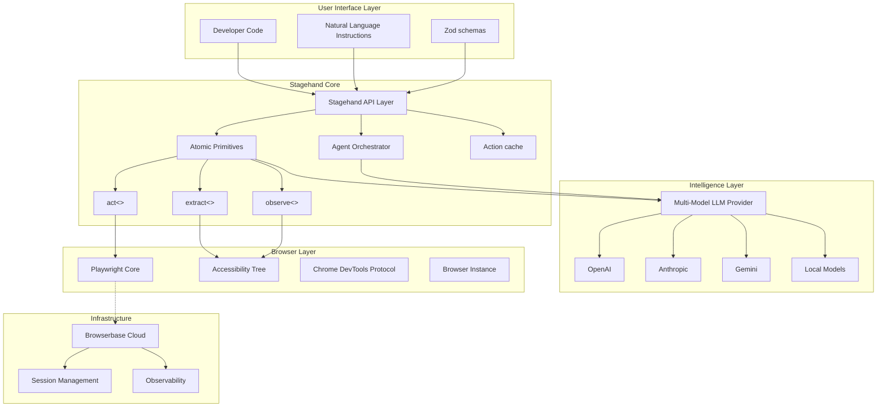
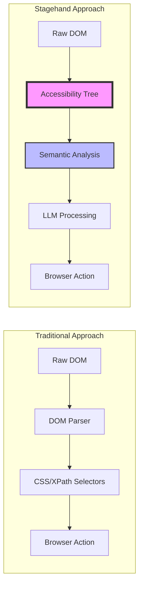
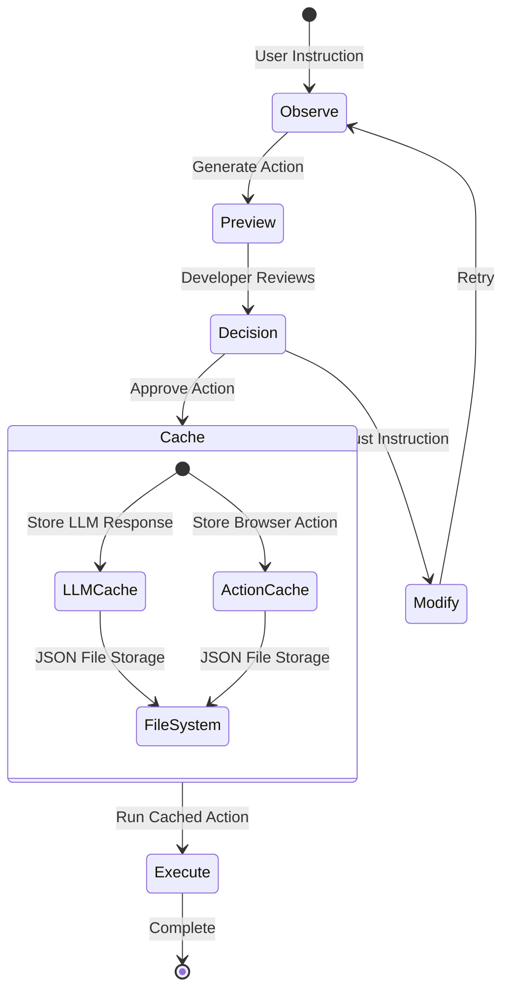
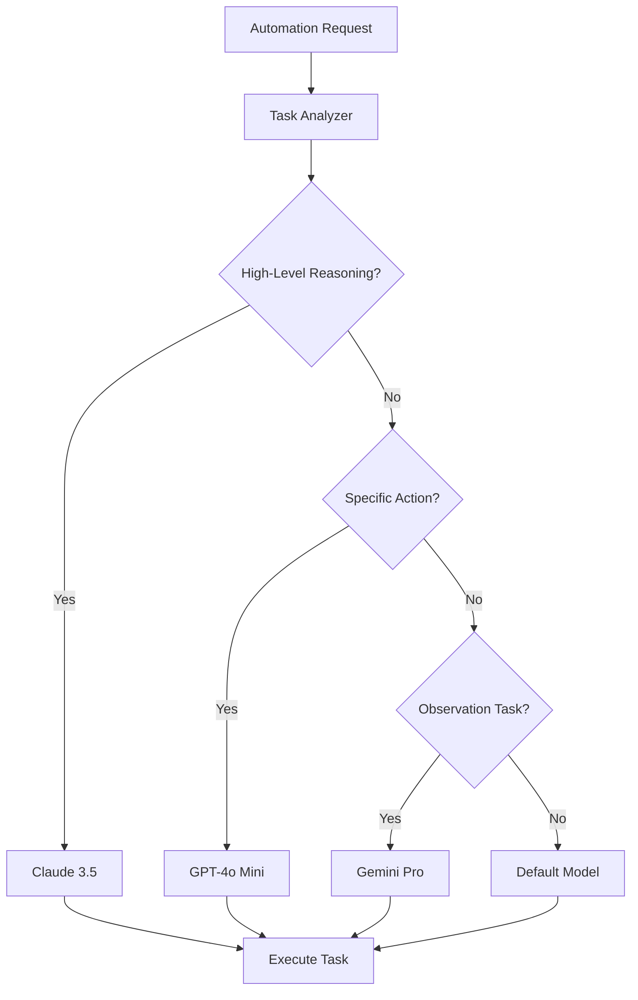
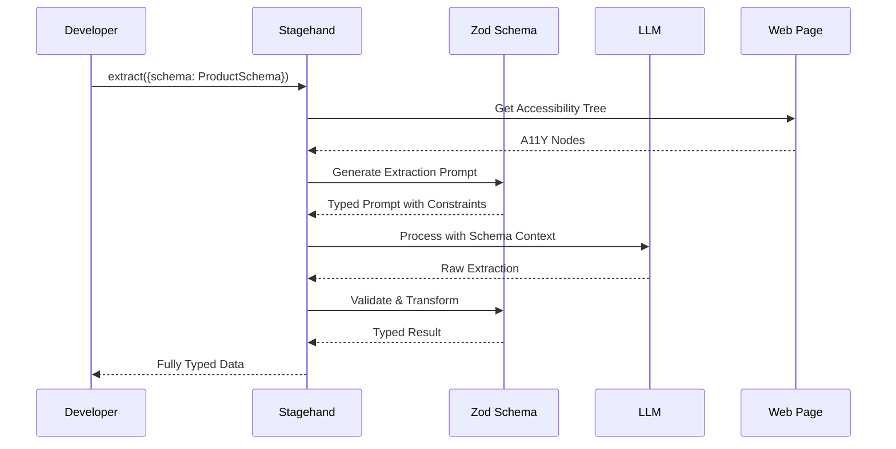
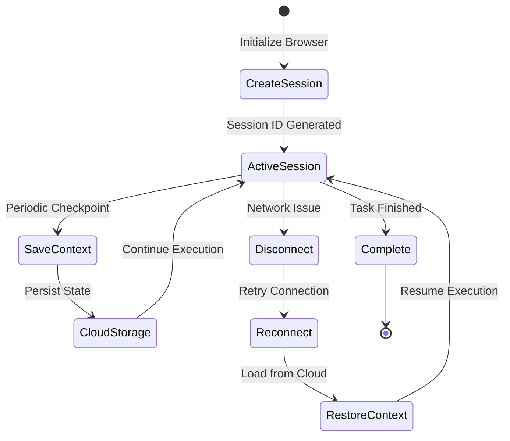
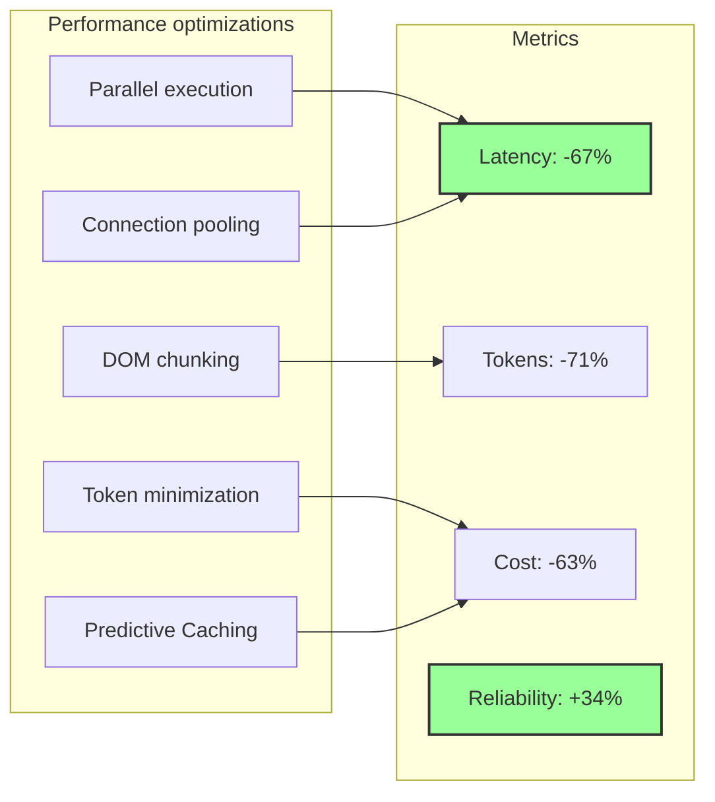

**Stagehand** a browser automation framework that fundamentally redefines how we approach web interaction programmatically. Developed by Browserbase, Stagehand successfully bridges the long-standing gap between the brittleness of traditional automation tools and the unpredictability of pure AI agents. This innovation allows developers to seamlessly blend deterministic code with natural language instructions, achieving unparalleled resilience and adaptability in automation workflows.


Stagehand offers several advantages over conventional methods:

- **Enhanced resilience:** Adapts automatically to website changes, significantly reducing maintenance overhead.
- **AI-powered adaptability:** Integrates natural language processing for flexible, intent-driven automation.
- **Production readiness:** Provides the predictability and control essential for enterprise-grade systems.
- **Cost optimization:** Intelligently manages LLM usage to minimize operational expenses.

## What stagehand does

Stagehand is a TypeScript/JavaScript framework that transforms browser automation from a fragile, maintenance-heavy process into a resilient, AI-enhanced workflow that adapts to website changes automatically. It provides three core modes of browser interaction, allowing developers to combine the precision of traditional Playwright code with the flexibility of natural language instructions:

- **AI actions (`page.act()`):** Enables natural language-driven browser actions. For instance, `await page.act("click the login button")` allows Stagehand to intelligently find and interact with the correct element, even on dynamic or unfamiliar interfaces, without relying on brittle selectors.
- **Data extraction (`page.extract()`):** Facilitates structured data retrieval. Developers can provide natural language instructions along with a Zod schema, and Stagehand will extract the relevant data from the page, ensuring type safety and validation. This is ideal for content scraping or extracting form data.
- **Element analysis (`page.observe()`):** Provides AI-powered element identification and analysis. This method helps in understanding the page structure, identifying specific elements (e.g., `await page.observe("find all buttons")`), and can be used for debugging or gaining insights into a web page's interactive components.

Beyond these core AI-enhanced methods, Stagehand also integrates an **Agent System** for multi-step autonomous browser automation. This system allows for high-level instructions (e.g., `agent.execute("find all available apartments with floor plans")`) to be broken down into a sequence of AI-driven and programmatic browser actions, enabling complex workflows that would traditionally require extensive, brittle code. The framework integrates with major LLM providers (OpenAI, Anthropic, Google) and supports both local Playwright browsers and cloud browsers via Browserbase.

## How stagehand operates under the hood

Stagehand's core innovation lies in its **hybrid intelligence architecture**, which combines Playwright's reliability with advanced AI capabilities. This hybrid approach allows developers to seamlessly mix traditional, deterministic automation code (e.g., precise CSS selectors for stable elements) with flexible, AI-driven natural language instructions (e.g., "click the submit button" for dynamic elements). This strategic blend ensures that automation scripts are both resilient to UI changes and maintain the predictability and control required for production systems. We leverage several key architectural pillars to deliver this unique functionality:

### Overall system architecture



### Revolutionary accessibility tree processing

The migration from raw DOM parsing to Chrome's Accessibility Tree represents Stagehand's most significant architectural innovation. Instead of relying on brittle HTML structures, Stagehand leverages Playwright's capability to access Chrome's Accessibility Tree. This tree provides a semantic representation of web pages, filtered to include only interactive and meaningful elements. This architectural choice dramatically improves both performance and resilience: the accessibility tree remains stable even when visual layouts change, offering a cleaner and more stable view of web pages by filtering out unnecessary noise. This typically reduces the data size by 80-90% compared to raw DOM, directly translating to lower token usage and faster LLM processing. The core AI handlers (`ActHandler`, `ExtractHandler`, `ObserveHandler`) utilize this semantic tree, sending an optimized representation to the LLM for interpretation. This approach provides multiple engineering advantages: element roles and ARIA labels offer semantic meaning that maps naturally to human language instructions, and the tree structure's stability across visual redesigns ensures that automation scripts represent functional intent rather than visual layout. Furthermore, Stagehand injects a helper script (`lib/dom/process.ts`) into the browser context to enable robust Shadow DOM piercing, allowing its custom selector engine to traverse and interact with elements hidden within both open and closed shadow roots.



#### Core accessibility implementation

```typescript
// Simplified representation of A11Y tree processing
class StagehandPage extends Page {
  async extractFromA11Y(instruction: string) {
    // Get accessibility tree snapshot
    const a11yTree = await this.accessibility.snapshot();

    // Filter to interactive elements only
    const interactiveNodes = filterInteractiveElements(a11yTree);

    // Convert to semantic representation
    const semanticTree = {
      buttons: interactiveNodes.filter(n => n.role === 'button'),
      inputs: interactiveNodes.filter(n => n.role === 'textbox'),
      links: interactiveNodes.filter(n => n.role === 'link'),
      // Include name, description, and state for each element
      metadata: interactiveNodes.map(n => ({
        role: n.role,
        name: n.name,
        description: n.description,
        state: n.pressed || n.checked || n.selected
      }))
    };

    // Send optimized tree to LLM
    return await this.llm.process(semanticTree, instruction);
  }
}
```

### Caching

Stagehand's caching system operates through a unified LLM response cache to minimize API costs and improve performance:

- **File-based LLM cache**: The `LLMCache` class extends `BaseCache` and stores LLM responses in JSON files on disk. When `enableCaching` is enabled, all LLM provider clients check for cached responses before making API calls.
- **Cache integration pattern**: Every LLM client (`OpenAIClient`, `AnthropicClient`, `AISdkClient`, etc.) follows the same caching pattern - checking cache before API calls and storing responses after successful calls.
- **Action cache**: There is also an `ActionCache` class that stores browser action steps (in a JSON format), but this operates independently as a separate caching mechanism for Playwright commands and browser actions.



#### Caching implementation pattern

```typescript
class ActionCache {
  private memoryCache = new Map<string, CachedAction>();
  private sessionCache: SessionStorage;
  private globalCache: CloudCache;

  async cacheAction(instruction: string, action: BrowserAction) {
    const cacheKey = this.generateKey(instruction, action.context);

    // Multi-level cache write
    this.memoryCache.set(cacheKey, action);
    await this.sessionCache.persist(cacheKey, action);

    // Global cache for high-confidence actions only
    if (action.confidence > 0.95) {
      await this.globalCache.share(cacheKey, action);
    }
  }

  async retrieveAction(instruction: string, context: PageContext) {
    const cacheKey = this.generateKey(instruction, context);

    // Hierarchical retrieval
    return this.memoryCache.get(cacheKey) ||
           await this.sessionCache.get(cacheKey) ||
           await this.globalCache.get(cacheKey);
  }
}
```

### Multi-model LLM provider abstraction

Stagehand employs a sophisticated **multi-model LLM routing system** that abstracts away the complexities of various LLM providers. Through extensive empirical testing and a comprehensive `modelToProviderMap`, we discovered that different large language models excel at distinct tasks. For instance, Claude is optimal for high-level reasoning and planning, GPT-4o performs best for executing specific browser actions, and Gemini offers superior cost-performance for observation tasks. The system intelligently routes each operation to the most suitable model, maximizing both accuracy and cost-effectiveness. Stagehand supports a wide array of LLM providers including OpenAI, Anthropic, Google, Cerebras, and Groq, and further extends its compatibility through integration with the `@ai-sdk` ecosystem, allowing for seamless use of models from providers like xAI, Azure, TogetherAI, Mistral, Perplexity, and Ollama. This flexible architecture ensures optimal model selection for diverse automation needs.



#### Model router implementation

```typescript
class LLMRouter {
  private modelBenchmarks = {
    claude: { reasoning: 0.95, actions: 0.82, observe: 0.78, cost: 3 },
    gpt4o: { reasoning: 0.85, actions: 0.94, observe: 0.83, cost: 2 },
    gemini: { reasoning: 0.75, actions: 0.79, observe: 0.91, cost: 1 }
  };

  selectModel(task: AutomationTask): ModelSelection {
    // Analyze task characteristics
    const taskProfile = this.analyzeTask(task);

    // Score each model for this specific task
    const scores = Object.entries(this.modelBenchmarks).map(([model, bench]) => {
      const performanceScore =
        bench.reasoning * taskProfile.reasoningWeight +
        bench.actions * taskProfile.actionWeight +
        bench.observe * taskProfile.observeWeight;

      // Cost-adjusted score
      const costAdjustedScore = performanceScore / Math.log(bench.cost + 1);

      return { model, score: costAdjustedScore };
    });

    // Select optimal model
    return scores.sort((a, b) => b.score - a.score)[0].model;
  }
}
```

### TypeScript-first schema extraction

The schema extraction system leverages Zod's powerful validation capabilities to ensure type-safe data extraction from unstructured web content. This approach transforms web scraping from a fragile string-parsing exercise into a robust, typed data pipeline that catches errors at compile time rather than runtime.



#### Schema extraction implementation

```typescript
// Example of production schema extraction
const ProductSchema = z.object({
  title: z.string().min(1).max(200),
  price: z.number().positive().transform(val => Math.round(val * 100) / 100),
  availability: z.enum(['in-stock', 'out-of-stock', 'pre-order']),
  images: z.array(z.string().url()).min(1),
  specifications: z.record(z.string(), z.string()).optional(),
  reviews: z.object({
    average: z.number().min(0).max(5),
    count: z.number().int().nonnegative()
  }).optional()
});

class SchemaExtractor {
  async extract<T>(page: Page, schema: ZodSchema<T>, instruction: string): Promise<T> {
    // Generate JSON schema from Zod
    const jsonSchema = zodToJsonSchema(schema);

    // Create extraction prompt with schema constraints
    const prompt = `
      Extract the following information: ${instruction}

      Required format:
      ${JSON.stringify(jsonSchema, null, 2)}

      Extraction rules:
      - Only include fields defined in the schema
      - Ensure all required fields are present
      - Transform data to match type constraints
      - Use null for optional missing fields
    `;

    // Get raw extraction from LLM
    const rawData = await this.llm.extract(page, prompt);

    // Validate and transform through Zod
    const result = schema.safeParse(rawData);

    if (!result.success) {
      // Intelligent retry with error context
      const retryPrompt = this.generateRetryPrompt(result.error, rawData);
      const retryData = await this.llm.extract(page, retryPrompt);
      return schema.parse(retryData); // Throw if still invalid
    }

    return result.data;
  }
}
```

### Observe-act caching pattern

To address the inherent unpredictability of AI-driven automation, Stagehand implements an **observe-act caching pattern**. This allows developers to preview what the AI intends to do (`observe`) before execution. Once an action is validated and successful, it can be cached for deterministic replay. This pattern ensures reliability through consistent execution, boosts performance by eliminating redundant LLM calls, and optimizes costs by reducing API usage. Cached actions can persist across browser sessions and deployments, building a knowledge base of proven automation patterns.

### Agent orchestration for complex workflows

Stagehand introduces an **agent layer** capable of handling complex, multi-step workflows. The `StagehandAgent` class delegates the core intelligence to an underlying `AgentClient` (e.g., `OpenAICUAClient`), which leverages specialized LLM APIs for computer use. These agents operate through an iterative execution loop:

1.  **Instruction to action:** The agent receives a high-level instruction (goal).
2.  **LLM reasoning:** The `AgentClient` sends the current state (including a screenshot of the browser) and the instruction to the LLM (e.g., OpenAI's Responses API for Computer Use). The LLM then reasons about the next best action.
3.  **Action execution:** The LLM returns a structured action (e.g., a click, type, or navigation). The `AgentClient` executes this action in the browser.
4.  **Visual feedback loop:** After executing an action, a new screenshot of the browser's state is captured and sent back to the LLM. This visual feedback allows the agent to "observe" the outcome of its action and adapt its subsequent steps.
5.  **Self-healing and adaptation:** If an action fails or the page state is unexpected, the `AgentClient` can send error information back to the LLM. The LLM then dynamically adjusts its approach, tries alternative methods, or even reformulates the problem, enabling sophisticated self-healing capabilities without explicit planner or decomposer classes. The planning and decomposition logic are implicitly handled by the LLM itself within this iterative request/response cycle.

This iterative process allows agents to maintain context across numerous actions, adapt to unexpected situations, and recover from errors, making them suitable for production environments where websites change frequently and unpredictably.

### Browser session persistence

Leveraging Browserbase's cloud infrastructure, Stagehand provides robust **browser session persistence**. This ensures that long-running automation tasks can survive network disconnections, process crashes, and system restarts while maintaining full browser state, including cookies, local storage, and page context. This capability is crucial for enterprise-grade, resilient automation.



#### Session management implementation

```typescript
class SessionManager {
  private browserbase: BrowserbaseClient;
  private checkpointInterval = 30000; // 30 seconds

  async createPersistentSession(options: SessionOptions): Promise<Session> {
    // Create cloud-hosted browser session
    const session = await this.browserbase.sessions.create({
      projectId: options.projectId,
      persistent: true,
      keepAlive: true,
      region: options.region || 'auto'
    });

    // Set up automatic checkpointing
    const checkpointTimer = setInterval(async () => {
      await this.checkpoint(session);
    }, this.checkpointInterval);

    // Configure reconnection logic
    session.on('disconnect', async () => {
      clearInterval(checkpointTimer);
      await this.handleDisconnection(session);
    });

    return {
      ...session,
      resume: async () => this.resumeSession(session.id),
      checkpoint: async () => this.checkpoint(session)
    };
  }

  private async checkpoint(session: Session) {
    const state = {
      cookies: await session.context.cookies(),
      localStorage: await session.evaluate(() => ({ ...localStorage })),
      sessionStorage: await session.evaluate(() => ({ ...sessionStorage })),
      url: session.url(),
      viewport: session.viewportSize(),
      // Custom application state
      customState: await session.evaluate(() => window.__appState)
    };

    await this.browserbase.sessions.saveState(session.id, state);
  }

  async resumeSession(sessionId: string): Promise<Session> {
    const session = await this.browserbase.sessions.connect(sessionId);
    const state = await this.browserbase.sessions.loadState(sessionId);

    // Restore browser state
    await session.context.addCookies(state.cookies);
    await session.goto(state.url);
    await session.evaluate((state) => {
      Object.entries(state.localStorage).forEach(([k, v]) => {
        localStorage.setItem(k, v);
      });
      Object.entries(state.sessionStorage).forEach(([k, v]) => {
        sessionStorage.setItem(k, v);
      });
      window.__appState = state.customState;
    }, state);

    return session;
  }
}
```

### Advanced performance optimization strategies

The framework incorporates several advanced strategies to reduce latency, minimize costs, and improve reliability:

- **DOM chunking:** Intelligently segments large pages into processable chunks, preventing token limit errors and preserving context.
- **Parallel execution:** Identifies independent operations and executes them concurrently, significantly reducing end-to-end execution time.
- **Token minimization:** Optimizes prompts by removing redundant information, compressing descriptions, and using references for repeated elements, leading to substantial cost savings.
- **Connection pooling:** Further enhances performance by efficiently managing browser connections.



#### Performance optimization implementation

```typescript
class PerformanceOptimizer {
  // Intelligent DOM chunking for large pages
  async chunkDOM(page: Page, maxTokens: number = 4000): Promise<DOMChunk[]> {
    const fullTree = await page.accessibility.snapshot();
    const chunks: DOMChunk[] = [];

    // Smart chunking that preserves context
    const chunkBoundaries = this.identifySemanticBoundaries(fullTree);

    for (const boundary of chunkBoundaries) {
      const chunk = {
        content: this.extractSubtree(fullTree, boundary),
        context: this.preserveContext(fullTree, boundary),
        tokens: this.estimateTokens(boundary)
      };

      if (chunk.tokens <= maxTokens) {
        chunks.push(chunk);
      } else {
        // Recursive chunking for oversized sections
        chunks.push(...await this.chunkDOM(boundary, maxTokens / 2));
      }
    }

    return chunks;
  }

  // Parallel execution with dependency resolution
  async executeParallel(tasks: Task[]): Promise<Result[]> {
    const dependencyGraph = this.buildDependencyGraph(tasks);
    const executionPlan = this.topologicalSort(dependencyGraph);
    const results: Result[] = [];

    for (const level of executionPlan) {
      // Execute all tasks at this dependency level in parallel
      const levelResults = await Promise.all(
        level.map(task => this.executeWithMetrics(task))
      );
      results.push(...levelResults);

      // Update context for dependent tasks
      this.propagateContext(levelResults, dependencyGraph);
    }

    return results;
  }

  // Token minimization through prompt optimization
  optimizePrompt(instruction: string, context: PageContext): string {
    // Remove redundant information
    const deduped = this.deduplicateContext(context);

    // Compress element descriptions
    const compressed = this.compressDescriptions(deduped);

    // Use references for repeated elements
    const referenced = this.createReferences(compressed);

    // Generate minimal prompt
    return this.generateMinimalPrompt(instruction, referenced);
  }
}
```

## Data structures and algorithms

Stagehand's architecture is built upon a set of key TypeScript classes and data structures that orchestrate its hybrid intelligence operations:

- **`Stagehand` Class (`lib/Stagehand.ts`):** This is the main orchestrator class, responsible for managing the browser lifecycle, initialization (`stagehand.init()`), and providing access to core functionalities like agent creation (`stagehand.agent()`) and cleanup (`stagehand.close()`).
- **`StagehandPage` Class (`lib/StagehandPage.ts`):** An enhanced Playwright `Page` object that exposes Stagehand's AI-powered methods (`act()`, `extract()`, `observe()`). It handles the translation of natural language instructions into precise browser actions.
- **`StagehandContext` Class (`lib/StagehandContext.ts`):** Manages browser contexts, allowing for the creation of new pages (`newPage()`) and managing multiple pages within a session.
- **`LLMProvider` Class (`lib/llm/LLMProvider.ts`):** Acts as a multi-model LLM client factory, abstracting away the specifics of different LLM providers (OpenAI, Anthropic, Google, local models). It's responsible for selecting and interfacing with the appropriate LLM based on task requirements.
- **Handler classes (`lib/handlers/`):**
  - **`ActHandler`:** Implements the logic for natural language action execution (`act()` method).
  - **`ExtractHandler`:** Manages structured data extraction (`extract()` method), integrating with Zod schemas.
  - **`ObserveHandler`:** Handles AI-powered element identification and analysis (`observe()` method).
- **Accessibility tree snapshot:** A filtered, semantic representation of the web page, used as a key input for LLM processing. It typically contains interactive elements (buttons, inputs, links) and their metadata (role, name, description, state).
- **Zod schemas:** Used extensively for defining the structure and validation rules for extracted data. These schemas are transformed into JSON Schema for LLM prompting and then used to `safeParse` and validate the raw LLM output, ensuring type safety and data integrity.
- **`ActionCache`:** Internally uses a `Map` for in-memory caching, and interacts with `SessionStorage` and `CloudCache` for persistent and global caching. It stores `CachedAction` objects, which encapsulate the browser action and its context.
- **`LLMRouter`:** Employs a `modelBenchmarks` object (a dictionary of models with their performance scores across reasoning, actions, and observation tasks, along with cost metrics) to calculate a cost-adjusted score and select the optimal LLM for a given `AutomationTask`.
- **`StagehandAgent`:** Orchestrates complex workflows using a `TaskPlanner` (to create `plan` objects with `tasks`), an `AtomicExecutor` (to execute tasks, potentially in parallel), and `ContextMemory` (to maintain state and context). It manages `executionState` objects, tracking `completed`, `pending`, and `failed` tasks, and their associated context.
- **`SessionManager`:** Manages `Session` objects, which represent persistent browser instances. It checkpoints and restores `state` objects containing cookies, local storage, session storage, URL, viewport size, and custom application state.
- **`PerformanceOptimizer`:** Works with `DOMChunk` objects (containing content, context, and token estimates) for intelligent page segmentation. It builds `dependencyGraph` and `executionPlan` (via topological sort) for parallel task execution, and processes `Task` and `Result` objects.

## Technical challenges and solutions

We have successfully addressed several fundamental challenges that have historically plagued browser automation:

- **The brittleness problem:** Traditional tools break when UI changes. Stagehand solves this by combining semantic understanding via the **Accessibility Tree** with AI's ability to interpret intent. This allows scripts to understand their goal rather than relying on rigid selectors, making them resilient to UI modifications.
- **The unpredictability challenge:** Pure AI agents lack consistency for production systems. The **hybrid approach** provides granular control: developers can preview AI actions (`observe`), cache successful patterns for deterministic reuse, and seamlessly mix traditional code with AI instructions within the same script. This ensures the predictability required for business-critical automation.
- **The performance and cost problem:** Frequent, expensive LLM calls can be prohibitive. Stagehand addresses this critical challenge through a multi-pronged approach to LLM cost management. This includes **intelligent caching** (memory, session, and global caching) to eliminate redundant LLM calls, **session affinity** for connection reuse, and **DOM chunking** strategies that minimize the amount of data sent to LLMs, thereby reducing token usage. Furthermore, the **multi-model routing system** dynamically selects the most cost-effective LLM for each specific task, ensuring that simpler operations utilize cheaper models while reserving premium models for complex reasoning. These comprehensive optimizations have collectively reduced LLM costs by up to 70% compared to naive implementations, while simultaneously improving reliability through cached action replay.

While Stagehand excels, we continuously identify areas for improvement. Handling **complex Single Page Applications (SPAs)**, especially those with heavy Shadow DOM usage or intricate state management, remains an ongoing challenge. We are also focused on enhancing the **local development experience** with better tooling for debugging AI decisions and improving **model cost predictability** through more robust estimation and budget enforcement mechanisms.

## Clever tricks and tips discovered along the way

Stagehand has yielded several key insights and innovative approaches:

- **Accessibility tree as a semantic filter:** This was a game-changer. By processing the accessibility tree instead of the raw DOM, we not only achieved significant performance gains (80-90% data reduction) but also gained a more stable and semantically rich representation of web pages, which is ideal for AI interpretation.
- **Optimized multi-model LLM routing:** Recognizing that no single LLM is best for all tasks allowed us to create a dynamic routing system. This "best tool for the job" approach dramatically improves both accuracy and cost-efficiency by leveraging the unique strengths of models like Claude, GPT-4o, and Gemini.
- **The `observe` primitive:** This unique feature provides an unprecedented level of control and transparency over AI actions. Developers can "see" what the AI intends to do before it acts, fostering trust and enabling the caching of validated actions for future deterministic execution.
- **TypeScript-first with Zod for data extraction:** This combination transforms web scraping from a fragile, error-prone process into a robust, type-safe data pipeline. Compile-time validation catches errors early, and full TypeScript inference throughout the extraction process significantly enhances developer experience.
- **Self-healing agent orchestration with visual feedback:** The agents go beyond simple retries. Leveraging specialized LLM APIs for computer use, they operate through an iterative execution loop. After each action, a new screenshot of the browser's state is captured and sent back to the LLM as visual feedback. This allows the agent to "observe" the outcome, analyze failure contexts, dynamically adjust its approach, and even reformulate problems. This resilience is critical for automating complex, real-world workflows that are prone to unexpected changes.
- **Persistent browser sessions:** The ability to maintain full browser state across disconnections and restarts ensures that long-running automation tasks are incredibly reliable, a crucial feature for enterprise-level operations.
- **Holistic performance optimizations:** Beyond caching, strategies like intelligent DOM chunking, parallel execution with dependency resolution, and meticulous prompt optimization for token minimization have collectively delivered 3-5x speed improvements and 60-70% cost reductions, demonstrating that performance and cost-efficiency can be achieved simultaneously.

## Future improvement considerations

### Architecture improvements

**Simplify caching strategy**
The current caching implementation is already quite simple with just LLM response caching, but future improvements could include:

- Predictive caching based on common automation patterns
- Better cache invalidation strategies for dynamic content
- Cross-session cache sharing for enterprise deployments

**Enhanced error recovery**
While Stagehand has self-healing capabilities, future improvements could include:

- More granular error classification with specific recovery strategies
- Better context preservation during error recovery
- Automated fallback to simpler automation methods when AI fails

### Performance optimizations

**Reduce token usage further**
The framework already optimizes token usage through accessibility tree processing, but could improve with:

- Better DOM chunking algorithms for complex SPAs
- More aggressive prompt compression techniques
- Dynamic model selection based on page complexity

**Faster action execution**
Recent changes show focus on performance improvements, with future enhancements including:

- Parallel execution of independent actions
- Better prediction of action success before execution
- Reduced screenshot frequency for agent workflows

### Developer experience enhancements

**Better debugging tools**
The framework has improved logging, but could add:

- Visual debugging interface for AI decision-making
- Better action replay and modification tools
- More detailed metrics on automation reliability

**Improved local development**
Recent work on local browser options could be extended with:

- Better hot-reloading for automation scripts
- Improved browser profile management
- Enhanced stealth mode for local testing

### AI model integration

**Better model routing**
While Stagehand supports multiple providers, future improvements could include:

- Dynamic model switching based on real-time performance
- Cost-aware model selection with budget constraints
- Better handling of model-specific capabilities

**Enhanced agent capabilities**
The agent system introduced could be improved with:

- Better long-term memory across sessions
- More sophisticated planning algorithms
- Integration with external knowledge bases

### Production readiness

**Better Monitoring and Observability**
Current metrics tracking could be enhanced with:

- Real-time automation health dashboards
- Predictive failure detection
- Better integration with existing monitoring tools

**Enhanced security**
Future improvements could include:

- Better credential management for automation scripts
- Enhanced browser fingerprint protection
- Audit logging for compliance requirements

### Framework integration

**Broader ecosystem support**
The framework already integrates with LangChain and CrewAI, but could expand to:

- More workflow orchestration platforms
- Better CI/CD pipeline integration
- Enhanced testing framework support

## Conclusion

Stagehand represents a pivotal advancement in browser automation, successfully merging deterministic reliability with AI-driven adaptability. Its rapid adoption and the profound technical innovations—from the accessibility tree architecture to the observe-act pattern and multi-model routing—underscore its capacity to solve long-standing challenges in the field. Stagehand's production readiness, robust TypeScript implementation, and enterprise-grade features position it as the definitive solution for organizations seeking to harness AI in their automation workflows. We believe Stagehand is not merely a tool, but a foundational platform for the next generation of human-computer interaction through the browser, offering an optimal balance of power, reliability, and cost-effectiveness for engineering teams.
