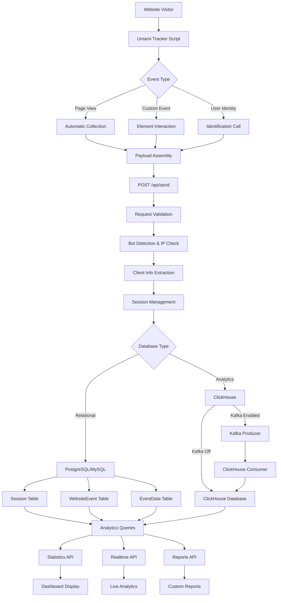

## System overview

**Umami** is a privacy-focused, open-source web analytics platform that serves as an alternative to Google Analytics. The platform offers several advantages over traditional analytics solutions: **self-hosted deployment**, **multi-database support**, and **advanced reporting capabilities** while maintaining strict privacy standards.


## Core functionality

Umami operates as a complete analytics platform that tracks and analyzes website visitor behavior through multiple data collection methods:

### Primary data collection

- **Page view tracking** with automatic URL change detection
- **Custom event monitoring** through data attributes and programmatic calls
- **Session management** with visitor identification and behavioral patterns
- **UTM parameter analysis** for marketing campaign attribution
- **Revenue tracking** through custom event data integration

### Advanced analytics reports

The platform provides **eight specialized report types** for comprehensive business intelligence:

- **Insights**: Custom data exploration and visualization
- **Funnel**: Conversion pathway analysis through multi-step processes
- **Retention**: User return behavior and engagement patterns
- **UTM**: Marketing campaign performance tracking
- **Goals**: Conversion event monitoring and optimization
- **Journey**: User navigation flow analysis
- **Revenue**: Financial performance and monetization tracking
- **Attribution**: Marketing channel effectiveness measurement

## Architecture and technical implementation



### Technology stack

Umami leverages **Next.js 15** as its core framework with **React 19** for the user interface, ensuring both optimal performance and modern development practices. The platform operates through **four integration layers**:

1. **Client-side tracker** for data collection
2. **API endpoints** for data processing and validation
3. **Database layer** with multi-engine support
4. **Analytics engine** for report generation and visualization

### Database architecture

The system supports **three database engines** to accommodate different scale requirements:

- **PostgreSQL** and **MySQL** for standard deployments with full relational capabilities
- **ClickHouse** for high-volume analytics with columnar storage optimization

### Data structure design

The platform employs a **hierarchical data model** optimized for analytics performance:

#### Core entities:

- `User` and `Team` for access management and multi-tenant support
- `Website` for tracking configuration and ownership
- `Session` for visitor identification with device and location data
- `WebsiteEvent` for all user interactions and page views
- `EventData` and `SessionData` for custom analytics parameters
- `Report` for saved analytics configurations

The database schema includes **strategic indexing** on time-based queries and website-specific lookups to ensure optimal query performance across millions of analytics events.

#### Performance infrastructure:

**ClickHouse integration**:
For high-scale deployments, Umami supports ClickHouse for analytics workloads. This includes optimized query functions for time-series data and advanced filtering capabilities.

```typescript
function getUTCString(date?: Date | string | number) {
  return formatInTimeZone(date || new Date(), 'UTC', 'yyyy-MM-dd HH:mm:ss');
}

function getDateStringSQL(data: any, unit: string = 'utc', timezone?: string) {
  if (timezone) {
    return `formatDateTime(${data}, '${CLICKHOUSE_DATE_FORMATS[unit]}', '${timezone}')`;
  }

  return `formatDateTime(${data}, '${CLICKHOUSE_DATE_FORMATS[unit]}')`;
}

function getDateSQL(field: string, unit: string, timezone?: string) {
  if (timezone) {
    return `toDateTime(date_trunc('${unit}', ${field}, '${timezone}'), '${timezone}')`;
  }
  return `toDateTime(date_trunc('${unit}', ${field}))`;
}

function getDateQuery(filters: QueryFilters = {}) {
  const { startDate, endDate, timezone } = filters;

  if (startDate) {
    if (endDate) {
      if (timezone) {
        return `and created_at between toTimezone({startDate:DateTime64},{timezone:String}) and toTimezone({endDate:DateTime64},{timezone:String})`;
      }
      return `and created_at between {startDate:DateTime64} and {endDate:DateTime64}`;
    } else {
      if (timezone) {
        return `and created_at >= toTimezone({startDate:DateTime64},{timezone:String})`;
      }
      return `and created_at >= {startDate:DateTime64}`;
    }
  }

  return '';
}
```

**Caching strategy**:
Redis-based caching reduces database load for frequently accessed data, while JWT tokens enable stateless session management.

```typescript
const cacheHeader = request.headers.get('x-umami-cache');

if (cacheHeader) {
  const result = await parseToken(cacheHeader, secret());
  if (result) {
    cache = result;
  }
}
```

**Kafka streaming**:
For enterprise deployments, Kafka integration enables real-time event processing and horizontal scaling.

```typescript
async function sendMessage(
  topic: string,
  message: { [key: string]: string | number } | { [key: string]: string | number }[],
): Promise<RecordMetadata[]> {
  try {
    await connect();

    return producer.send({
      topic,
      messages: Array.isArray(message)
        ? message.map(a => {
            return { value: JSON.stringify(a) };
          })
        : [
            {
              value: JSON.stringify(message),
            },
          ],
      timeout: SEND_TIMEOUT,
      acks: ACKS,
    });
  } catch (e) {
    console.log('KAFKA ERROR:', serializeError(e));
  }
}
```

### Data access layer

Umami implements a sophisticated data access layer that abstracts database differences. The `rawQuery` function handles parameterized queries across different database types:

```typescript
async function rawQuery(sql: string, data: object): Promise<any> {
  if (process.env.LOG_QUERY) {
    log('QUERY:\n', sql);
    log('PARAMETERS:\n', data);
  }

  const db = getDatabaseType();
  const params = [];

  if (db !== POSTGRESQL && db !== MYSQL) {
    return Promise.reject(new Error('Unknown database.'));
  }

  const query = sql?.replaceAll(/\{\{\s*(\w+)(::\w+)?\s*}}/g, (...args) => {
    const [, name, type] = args;

    const value = data[name];

    params.push(value);

    return db === MYSQL ? '?' : `$${params.length}${type ?? ''}`;
  });

  return process.env.DATABASE_REPLICA_URL
    ? client.$replica().$queryRawUnsafe(query, ...params)
    : client.$queryRawUnsafe(query, ...params);
}
```

This abstraction allows the same application code to work with different database backends by translating query syntax appropriately.

## Technical challenges and solutions

### Privacy protection and bot detection

Umami addresses the core problem of **privacy-compliant analytics** through multiple protective mechanisms:
**Do Not Track compliance**:

Umami implements comprehensive Do Not Track (DNT) detection in the client-side tracker. The system checks multiple DNT sources:

- Browser's `doNotTrack` property
- Navigator's `doNotTrack` and `msDoNotTrack` properties
- Data attribute override (`data-do-not-track="true"`)

The tracking is disabled when any DNT signal equals `1`, `'1'`, or `'yes'`. Additionally, users can manually disable tracking by setting `umami.disabled` in localStorage, providing granular user control over data collection.

```typescript
const hasDoNotTrack = () => {
  const dnt = doNotTrack || ndnt || msdnt;
  return dnt === 1 || dnt === '1' || dnt === 'yes';
};
```

**Bot filtering with isbot library**:

The server-side API implements sophisticated bot detection using the `isbot` npm library. When a bot is detected through user agent analysis, the system returns a playful `{ beep: 'boop' }` response instead of processing the analytics data.

This filtering can be disabled via the `DISABLE_BOT_CHECK` environment variable for testing scenarios. The bot detection occurs early in the request pipeline, preventing automated traffic from polluting analytics data.
**IP address handling and anonymization**:

Umami implements a sophisticated IP address extraction system that supports multiple proxy headers. The system checks headers in priority order:

- CloudFlare: `cf-connecting-ip`
- Custom headers via `CLIENT_IP_HEADER` environment variable
- Standard proxy headers: `x-forwarded-for`, `x-real-ip`, etc.

For `x-forwarded-for` headers, only the first IP is extracted to avoid proxy chain pollution. The system also includes IP blocking functionality through the `IGNORE_IP` environment variable, supporting both exact matches and CIDR notation for network ranges.

```typescript
export const IP_ADDRESS_HEADERS = [
  'cf-connecting-ip',
  'x-client-ip',
  'x-forwarded-for',
  'do-connecting-ip',
  'fastly-client-ip',
  'true-client-ip',
  'x-real-ip',
  'x-cluster-client-ip',
  'x-forwarded',
  'forwarded',
  'x-appengine-user-ip',
];

//-----

export function hasBlockedIp(clientIp: string) {
  const ignoreIps = process.env.IGNORE_IP;

  if (ignoreIps) {
    const ips = [];

    if (ignoreIps) {
      ips.push(...ignoreIps.split(',').map(n => n.trim()));
    }

    return ips.find(ip => {
      if (ip === clientIp) {
        return true;
      }

      // CIDR notation
      if (ip.indexOf('/') > 0) {
        const addr = ipaddr.parse(clientIp);
        const range = ipaddr.parseCIDR(ip);

        if (addr.kind() === range[0].kind() && addr.match(range)) {
          return true;
        }
      }
    });
  }

  return false;
}
```

**Geolocation with privacy safeguards**:

The geolocation system prioritizes privacy by first checking if the IP is localhost. For legitimate IPs, it uses a hierarchical approach:

1. **Header-based location** (CloudFlare, Vercel) for faster processing
2. **MaxMind GeoLite2 database** for IP-to-location mapping when headers unavailable

The system extracts only essential geographic data (country, region, city) without storing precise coordinates.

```typescript
// Database lookup
if (!global[MAXMIND]) {
  const dir = path.join(process.cwd(), 'geo');

  global[MAXMIND] = await maxmind.open(path.resolve(dir, 'GeoLite2-City.mmdb'));
}

// When the client IP is extracted from headers, sometimes the value includes a port
const cleanIp = ip?.split(':')[0];
const result = global[MAXMIND].get(cleanIp);
if (result) {
  const country = result.country?.iso_code ?? result?.registered_country?.iso_code;
  const region = result.subdivisions?.[0]?.iso_code;
  const city = result.city?.names?.en;

  return {
    country,
    region: getRegionCode(country, region),
    city,
  };
}
```

**Minimal data collection architecture**:

Umami's data collection is designed around privacy-first principles. The core payload structure collects only essential analytics data:

> - Website ID and screen resolution
> - Page title and URL (with configurable exclusions)
> - Language and referrer information
> - Optional identity for user tracking

The system supports URL sanitization through `excludeSearch` and `excludeHash` options, allowing websites to exclude sensitive query parameters or hash fragments from analytics.

### Performance optimization for high-volume analytics

The platform handles **scale challenges** through several architectural decisions:

**Session Management:**

- **Unique session identification** using UUID generation with website ID, IP address, user agent, and time-based salt
- **Visit expiration logic** with 30-minute timeouts to accurately track user engagement sessions
- **Caching mechanism** using JWT tokens to reduce database queries for repeated requests

```typescript
const sessionSalt = hash(startOfMonth(createdAt).toUTCString());
const visitSalt = hash(startOfHour(createdAt).toUTCString());

const sessionId = id ? uuid(websiteId, id) : uuid(websiteId, ip, userAgent, sessionSalt);

// Find session
if (!clickhouse.enabled && !cache?.sessionId) {
  const session = await fetchSession(websiteId, sessionId);

  // Create a session if not found
  if (!session) {
    try {
      await createSession({
        id: sessionId,
        websiteId,
        browser,
        os,
        device,
        screen,
        language,
        country,
        region,
        city,
        distinctId: id,
      });
    } catch (e: any) {
      if (!e.message.toLowerCase().includes('unique constraint')) {
        return serverError(e);
      }
    }
  }
}

// Visit info
let visitId = cache?.visitId || uuid(sessionId, visitSalt);
let iat = cache?.iat || now;

// Expire visit after 30 minutes
if (!timestamp && now - iat > 1800) {
  visitId = uuid(sessionId, visitSalt);
  iat = now;
}
```

**Database Query Optimization:**

- **Dual query system** supporting both relational and columnar database engines
- **Parallel processing** for complex analytics reports across multiple data dimensions
- **Time-based partitioning** strategies for efficient data retrieval

```typescript
async function pagedQuery(
  query: string,
  queryParams: { [key: string]: any },
  pageParams: PageParams = {},
) {
  const { page = 1, pageSize, orderBy, sortDescending = false } = pageParams;
  const size = +pageSize || DEFAULT_PAGE_SIZE;
  const offset = +size * (+page - 1);
  const direction = sortDescending ? 'desc' : 'asc';

  const statements = [
    orderBy && `order by ${orderBy} ${direction}`,
    +size > 0 && `limit ${+size} offset ${+offset}`,
  ]
    .filter(n => n)
    .join('\n');

  const count = await rawQuery(`select count(*) as num from (${query}) t`, queryParams).then(
    res => res[0].num,
  );

  const data = await rawQuery(`${query}${statements}`, queryParams);

  return { data, count, page: +page, pageSize: size, orderBy };
}
```

### Marketing attribution modeling

Umami provides **sophisticated attribution analysis** through configurable models:

- **First-click attribution** for customer acquisition analysis
- **Last-click attribution** for conversion optimization

```sql
## First Click
model AS (select e.session_id, min(we.created_at) created_at
from events e
join website_event we
on we.session_id = e.session_id
where we.website_id = {{websiteId::uuid}}
    and we.created_at between {{startDate}} and {{endDate}}
group by e.session_id)

## Last Click
model AS (select e.session_id, max(we.created_at) created_at
from events e
join website_event we
on we.session_id = e.session_id
where we.website_id = {{websiteId::uuid}}
    and we.created_at between {{startDate}} and {{endDate}}
    and we.created_at < e.max_dt
group by e.session_id)`;
```

- **Revenue attribution** with currency-specific tracking

```sql
WITH events AS (
select
    we.session_id,
    max(ed.created_at) max_dt,
    sum(coalesce(cast(number_value as decimal(10,2)), cast(string_value as decimal(10,2)))) value
from event_data ed
join website_event we
on we.event_id = ed.website_event_id
  and we.website_id = ed.website_id
join (select website_event_id
      from event_data
      where website_id = {{websiteId::uuid}}
        and created_at between {{startDate}} and {{endDate}}
        and data_key ${like} '%currency%'
        and string_value = {{currency}}) currency
on currency.website_event_id = ed.website_event_id
where ed.website_id = {{websiteId::uuid}}
  and ed.created_at between {{startDate}} and {{endDate}}
  and ${column} = {{conversionStep}}
  and ed.data_key ${like} '%revenue%'
group by 1),
```

- **Paid advertising detection** across multiple platforms with specific parameter through click IDs and storing them to database:
  - Google Ads: `gclid` parameter
  - Facebook/Meta: `fbclid` parameter
  - Microsoft Ads: `msclkid` parameter
  - TikTok Ads: `ttclid` parameter
  - LinkedIn Ads: `li_fat_id` parameter
  - Twitter Ads: `twclid` parameter

- **Attribution data analysis**: report analyzes multiple marketing dimensions:
  - **Referrer domains**: External websites driving traffic
  - **Paid advertising**: Platform-specific click ID attribution
  - **UTM parameters**: Campaign tracking across source, medium, campaign, content, and term
  - **Total metrics**: Overall pageviews, visitors, and visits for context

The attribution results are displayed through specialized UI components that show both tabular data and pie charts for visual attribution analysis

## Implementation insights and best practices

### Client-side data collection strategy

The tracking implementation employs **several clever techniques** for comprehensive yet unobtrusive data collection:

**Automatic Event Detection:**

- **History API hooking** to capture single-page application navigation without page reloads
- **Click tracking** with automatic event data extraction from HTML attributes, eg: can add `data-umami-event` attributes to any element to automatically track clicks without writing JavaScript.
- **Before-send callbacks** implements a flexible callback system that allows custom data validation and modification before events are sent to the server. This enables developers to:
  - Filter sensitive data from URLs or event parameters
  - Add custom metadata to all events
  - Implement client-side data validation rules
  - Transform event data based on business logic

**Data Quality Assurance:**

- **URL normalization** with configurable search parameter and hash exclusion
  - **Search parameter exclusion**: The system supports configurable exclusion of URL search parameters through `excludeSearch` options, preventing sensitive query parameters from being tracked.
  - **Hash fragment handling**: Hash fragments can be optionally excluded via `excludeHash` configuration, useful for applications that use hash routing but don't want to track fragment changes.

- **Referrer validation** to distinguish internal from external traffic sources
- **Domain filtering** for multi-site deployments with centralized analytics

### Revenue and conversion tracking

The platform handles **complex e-commerce analytics** through flexible event data structures:

- **Multi-currency support** with automatic currency detection and conversion calculation
- **Custom event parameters** for detailed transaction and user behavior analysis
- **Attribution modeling** linking revenue events back to marketing touchpoints, that enabling businesses to:
  - Track revenue by marketing channel
  - Calculate return on advertising spend (ROAS)
  - Analyze conversion value across different traffic sources
  - Support both first-click and last-click revenue attribution models

---

Umami represents a **comprehensive solution** for privacy-focused web analytics that successfully balances detailed business intelligence with user privacy protection. The platform's **multi-database architecture** ensures scalability from small websites to enterprise-level deployments, while its **extensible report system** provides the analytical depth required for data-driven decision making.

The system's **dual query implementation** for both relational and columnar databases demonstrates sophisticated technical architecture that maintains consistent functionality across different performance and scale requirements. This approach ensures optimal performance whether processing thousands or millions of analytics events.
