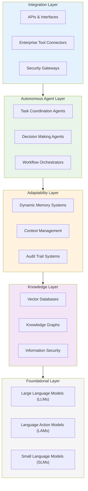

## The wave we're riding

We're witnessing something different this time. **Agentic AI** isn't just another LLM wrapper or chatbot upgrade. These are AI systems that actually make decisions and execute complex tasks without constantly asking for permission.

What makes this interesting? **Autonomous reasoning**. These systems can plan, adapt, and coordinate with other agents to solve problems we'd normally need humans for.

**What it's good at:**

- Automating multi-step workflows that require actual thinking
- Making real-time decisions in dynamic environments
- Coordinating between different systems and data sources
- Scaling operations without scaling headcount

**What it's not good at:**

- Tasks requiring deep emotional intelligence
- Creative work that goes beyond pattern recognition
- Situations where ethical judgment is paramount
- Environments with poor data quality or unclear objectives

**Our goal is simple:** to do more with less. And agentic AI might finally make that possible at scale.

## How we're upgrading

### Skills we're unlocking

We're not just building chatbots anymore. We're developing **AI workflows** and **agent orchestration systems** that act as copilots in our daily work. Key focus areas:

- **Reducing production costs** across code, design, documentation, and communication
- **Knowledge discovery** from our growing internal database
- **Shared intelligence** that gets smarter as our team grows

This shift means our engineers will become AI orchestrators, not just coders, specializing in AI Engineering. They'll need to master:

- **Foundation**: Understanding **foundation models**, model selection, and **prompt engineering**.

- **AI application building**: Differentiating between **agents vs. workflows** and managing deployment and observability.
- **AI-augmented software development**: Choosing the right tools (coding agents, IDEs, etc.), ensuring **context awareness** (runbooks, memory), and utilizing AI for review, testing, and refactoring within the development workflow.

### New service offerings

We're expanding our **AI services** to include:

- **AI engineering** for autonomous systems
- **Agent system development** for complex workflows
- **Multi-agent coordination** for enterprise operations

### Enterprise concerns and our architecture

When we talk to enterprises about agentic AI, they want to understand both the concerns and the technical foundation. Here's what we're hearing and how we're addressing it:

**Their concerns:**

- **Data security** and on-premise deployment requirements
- **Compliance** with industry regulations
- **Integration** with existing legacy systems
- **Control** over autonomous decision-making
- **Transparency** in AI reasoning processes

**Our architecture approach:**

- **Foundational layer**: LLMs, LAMs, and SLMs that handle basic language and reasoning
- **Knowledge layer**: Vector databases and knowledge graphs that organize information securely
- **Adaptability layer**: Dynamic memory systems that adjust based on context while maintaining audit trails
- **Autonomous agent layer**: The actual agents that coordinate and execute tasks with configurable oversight
- **Integration layer**: APIs and interfaces that connect to existing enterprise tools without disruption

These aren't just concerns. They're **opportunities** for us to solve if we want to sell these services effectively. Our layered approach ensures enterprises can deploy agentic AI without breaking their existing processes or compromising their security requirements.

## Our experiments

We're not waiting for the market to mature. We're building our expertise through targeted experiments:

- [x] **Smart social listening:** Actively monitoring and extracting insights from social signals to build our collective knowledge
- [x] **MCP-Discord integration:** Building an interface for our team to interact with our agentic systems directly through Discord
- [x] **Development toolchain:** Creating an AI-powered development environment that helps our engineers work more effectively in the age of AI agents
- [x] **AI GenZ survey:** Vietnamese demographic analysis system that processes Vietnamese demographic data to create virtual profiles for Gen Z demographics
- [ ] **Profile generator:** leverages AI to generate realistic, detailed user personas for various business scenarios including user research, marketing campaigns, and product development
- [ ] **Window form automation:** Automating the creation and management of window forms for data entry and user interaction
- [ ] **Agentic fortress:** Upgrading our current operational systems to AI workflows, from internal ops to project management
- [ ] **Team knowledge base:** Routing all our data through a central intelligence system that gets smarter with every project
- [ ] **Publication automation:** Using our knowledge base to generate more ideas and content for our communication strategy

## Reality check

The market is moving fast. New agentic AI products are launching weekly, and we need to stay current with what's actually working versus what's just marketing.

**Current market dynamics (updated regularly):**

- **The coding agents race:** Everyone's competing to build better coding assistants (Cursor, Windsurf, Aider, etc.)
- **Foundational model competition:** The race shifted from raw capability to specialized reasoning and action
- **Enterprise adoption patterns:** Still slower than B2B SaaS, but accelerating in specific verticals
- **Infrastructure vs. application layer:** Infrastructure providers seeing more sustainable traction
- **Engineering career shifts:** Developers becoming AI orchestrators rather than pure coders

**What we're actively tracking:**

- Which coding agent frameworks are gaining real developer mindshare
- How the foundational model landscape is consolidating or fragmenting
- Enterprise security and compliance solutions that actually work
- Where the biggest operational cost savings are being realized
- How engineering roles are evolving with agentic AI adoption

**Market signals we're watching:**

- **Multi-agent coordination** becoming the default architecture
- **API-first** approaches dominating successful implementations
- **Specialized models** outperforming general-purpose ones in specific domains
- **Human-in-the-loop** systems proving more reliable than fully autonomous ones

We're not just following trends. We're building the expertise to **help our clients navigate this wave** while upgrading our own operations to stay competitive.

The question isn't whether agentic AI will transform how we work. It's whether we'll be ready when it does.
