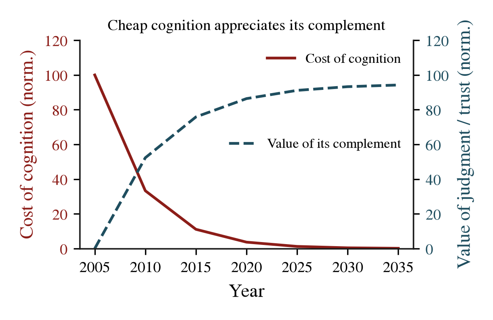
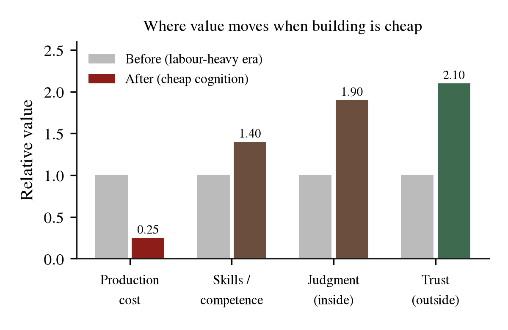

# What stays valuable when anyone can build anything

When building gets cheap, value moves to the two inputs that cannot be made: judgment inside the firm and trust outside it. This post shows the mechanism from first principles. It uses figures and it names where the argument leaks. It is a framework, not a prediction. Dwarves uses this lens to run its build-by-fleet operations.

## What actually stays valuable when building gets cheap?

When production stops being the bottleneck, the scarce goods become the ability to choose and the ability to be chosen. Inside the company, that is judgment. Judgment knows which actions move a goal forward. Outside the company, it is trust and attention. Trust and attention make people believe in you and follow you. Everything else, the execution, becomes a commodity. The market prices it toward zero.

All value comes from scarcity. The most fundamental scarcity is biological. You have one body, one mind, and a limited stock of time. Every hour spent on one thing is an hour not spent on another. To beat this limit, you need leverage. Historically, leverage meant the labor of other people. You buy that labor with capital or with equity.

Working with other minds has three costs. Context does not transfer cleanly. Objectives do not align. Vision does not survive the passage between minds. Committees average the visions. The output drifts from the intention.

AI removes these three costs. AI is synthetic cognitive labor. It gives the same leverage as hiring a team, without the lossy handoff, the politics, or the diluted vision. A firm with one person and a fleet of agents becomes the most efficient unit. This is not because the person is special. The firm has exactly one scarce input left, the owner's capacity to choose. Figure 1 and Figure 2 show the shape. The cost of cognition falls. The value of its complement rises.

**Fig. 1.** Cheap cognition appreciates its complement. Cost of cognition (solid) falls toward zero while the value of judgment and trust (dashed) rises to a new equilibrium. Schematic, normalised.

**Fig. 2.** Where value moves when building is cheap. Production cost falls while skills, judgment (inside) and trust (outside) appreciate. Illustrative, not to real scale.

## Where does the value actually sit?

Value sits inside where the firm chooses. Value sits outside where the market trusts. Judgment (inside) and trust (outside) are the two scarcities that survive. The cheap thing, cognition, has two complements. The complements match the two acts of business: value creation and distribution.

Every act of creation requires an act of selection. Making the thing is cheap. The expensive step is choosing the right thing to make. That is judgment. Judgment is inseparable from competence. Skills do not depreciate. With cheap cognition, you apply leverage to the judgment you hold. You do far more. On the distribution side, cheap content and cheap marketing flood the market. The things consumed with that content, attention and trust, appreciate. Attention is fixed at the biological limit. Trust cannot be bought into existence at scale. People earn trust by being repeatedly right.

## What happened the last four times a factor got cheap?

The mechanism is not new. It is the economics of complementary goods. Complements are goods consumed together. When one gets cheaper, the other becomes more valuable. The record is consistent.

| Cheap input | Becomes more valuable |
|---|---|
| Cheap computers | Data (you compute with it) |
| Cheap code | Verification (you check it) |
| Cheap distribution of media | Attention (you are noticed) |
| Cheap cognition (AI) | Judgment (you select), trust (you are trusted) |

Each row is the same move. A factor of production deflates. The stuff consumed with it gains value. Cheap cognition is the latest row in a table that has filled for fifty years. The inference follows from the same logic. Judgment and trust are the next columns. We do not predict them from a model that knows nothing.

## How we run on this at Dwarves, with receipts

This is not an abstract piece for us. A custom-software firm sells two things. They are the two rising complements. The firm decides what is right to build for a client. The firm is trusted to deliver it. We treat the one-person-company thesis as a load-bearing assumption. We test it on the harness we run. We worked the argument into our internal economics learning track. The complementary-goods row is the transferable concept.

Every figure in this post comes from a reproducible script (the `arxiv-style-figure` skill). The numbers and shapes can be regenerated. This is the standard we hold any claim we publish to.

## Where the argument leaks

The argument overreaches in three places. First, trust cannot be manufactured is an assertion, not a proof. Brands and platforms produce trust signals constantly. What cannot be faked is repeated, verified trust. Second, the ceiling on what one person can build is the same sits against the same essay. The essay claims one person can now run a large company. The ceiling probably moved too, just less than the floor. Third, attention is fixed per person. Platforms concentrate it. Concentration changes who captures the attention complement. None of these break the direction. They bound it.

## How to reproduce the thinking

Apply the complementary-goods lens to the factor that deflates in your market. Name the cheap input. Ask what is consumed with it and cannot be manufactured. That residue is where value moves. Inside a firm, the residue is judgment. Keep it by staying competent and choosing well. Outside the firm, the residue is trust. Keep it by being repeatedly right in public. The method is simple. Watch the cost curve of the factor. Name its two complements. Invest your scarce time in the complement that cannot be automated.

Our working answer to the title question is short: judgment inside, trust outside. The rest is the craft of getting good at both.

Related: [On agentic AI](on-agent.md), [The convergence](final.md), and the [arc series](README.md).
