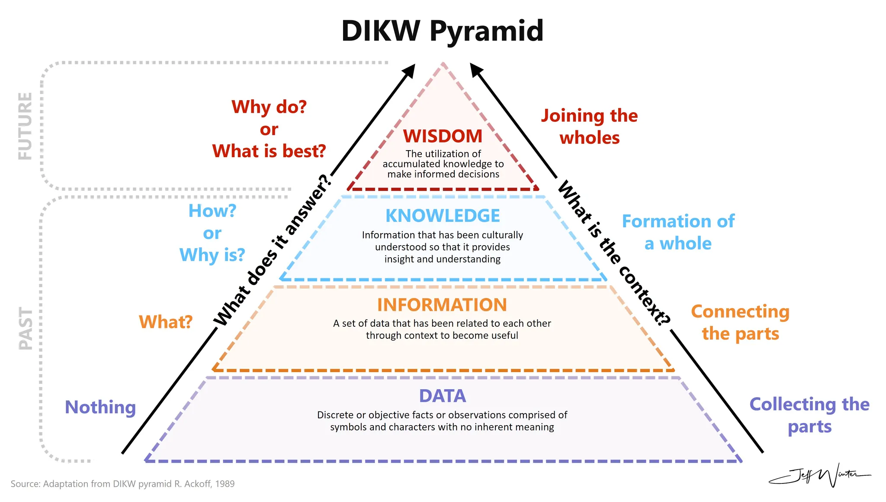

The fundamental drive here is to construct a system capable of **continual learning (CL)**, specifically moving beyond raw **data** towards **information** and **insight**, potentially even touching on **wisdom** as per the **DIKW pyramid**.



Traditional methods, whether involving database schemas or **Large Language Model (LLM)** fine-tuning, hit serious walls. Static database schemas are too rigid; they break when new types of information emerge, demanding complex **migrations**. You can't easily evolve the structure as understanding grows. Look at the [Anthropic MCP memory example](https://github.com/modelcontextprotocol/servers/tree/main/src/memory) – it uses a JSONL file, essentially a flat log, which is simple and works great as a memory component but lacks the querying power and time-series capabilities needed for sophisticated pattern detection.

On the **LLM** side, fine-tuning models continually leads to **catastrophic forgetting (CF)** – the model forgets past knowledge when learning new things. Relying purely on **in-context learning (ICL)** avoids **CF** because model parameters aren't updated, but it doesn't scale. Prompt sizes explode as you add examples for every piece of knowledge, exceeding token limits and degrading performance because the context gets cluttered with irrelevant information.

So, the motivation for *this* MCP knowledge base design is to sidestep these limitations entirely. We need a system that:

1. **Never Forgets:** By using an **append-only** **TimescaleDB** **hypertable** (`observation_log`), we ensure historical data integrity. Past observations are immutable, directly combating **CF** at the data layer.
2. **Adapts Without Breaking:** The flexible **JSONB** `payload` allows the structure of observations to evolve organically. When the **LLM** identifies a new pattern and coins a term like **"Vibe Coding"**, it just adds a new observation with the `coined_terms` field populated. No **schema migration** is needed. The system learns new *types* of knowledge without structural overhaul.
3. **Scales Over Time:** **TimescaleDB** is built for massive time-series datasets. **Continuous aggregates** pre-compute trends (like `content_trends`, `entity_trends`) efficiently, allowing the **LLM** to detect patterns without querying the entire raw log repeatedly. This is far more scalable than stuffing everything into an ever-growing ICL prompt.
4. **Facilitates Insight Generation:** The core loop involves the **LLM** observing raw data, querying the aggregates to find patterns (**information**), and then synthesizing these patterns into **coined terms** (**insight/knowledge**), which are then written back as new observations. This actively drives the progression up the **DIKW pyramid**.

Essentially, we're building an **evolving knowledge base** that leverages an **LLM** for processing and synthesis but relies on a robust, **append-only**, time-series database architecture to handle storage, scalability, and historical fidelity without the pitfalls of **migrations** or **catastrophic forgetting**. It's designed for emergent understanding, where concepts like **"Vibe Coding"** crystallize from raw data streams over time.

## How it all maps together

### **Data: raw observations**

This is the base layer – raw, unprocessed facts and symbols. In our system, this corresponds primarily to the raw ingested content and basic metadata within the `payload` before significant processing or structuring by the **LLM**. Think raw text dumps, initial source identifiers.

```json
// Example: Part of the payload representing raw Data
{
  "content": "Devs are using AI to generate code without writing it themselves",
  "source": {
    "source_type": "discord",
    "source_identifier": "#indie-devs",
    "ingestion_timestamp": "2025-03-10T12:00:00Z"
  },
  "tags": ["software", "ai"] // Initial, potentially noisy tags are closer to Data
  // ... other fields might exist but aren't yet processed into Information
}
```

### **Information: structured & contextualized data**

Here, raw data gets organized and contextualized. We answer the "who, what, when, where." This maps directly to the structured elements the **LLM** extracts and stores within the `payload`, like identified **entities** and **relations**. Furthermore, the outputs of our **TimescaleDB continuous aggregates** and `DISTINCT` queries represent **Information** – raw data aggregated into meaningful counts, frequencies, or unique lists over specific time intervals.

```json
// Example: Parts of the payload representing Information
{
  // ... raw content ...
  "entities": [
    {"name": "AI", "type": "technology"},
    {"name": "devs", "type": "group"}
  ],
  "relations": [
    {"from": "devs", "to": "AI", "type": "uses"}
  ]
  // ... source, tags ...
}
```

```
-- Example: Output row from 'content_trends' aggregate (Information)
-- bucket | content_text | mention_count | first_observed
-- -----------------------+-------------------------------------------+---------------+-----------------------
-- 2025-03-05 00:00:00+00 | devs using ai to generate code | 15 | 2025-03-06 09:15:00+00
-- Example: Output row from 'unique_entities' query (Information)
-- name | entity_type | first_observed
-- -----+-------------+-----------------------
-- AI | technology | 2025-03-06 09:15:00+00
```

### **Knowledge: synthesized patterns & understanding**

This level involves synthesizing information to understand patterns and answer "how." In our design, this is most clearly embodied by the **`coined_terms`** array within the `payload`. When the **LLM** analyzes the trends revealed by the aggregates (**Information**) and identifies an emergent phenomenon, it creates a `coined_term` like **"Vibe Coding"**. This isn't just data or information; it's a synthesized concept representing understanding derived from underlying patterns.

```json
// Example: Part of the payload representing Knowledge
{
  // ... content like "Coined 'Vibe Coding'..." ...
  "entities": [ /* ... */ ],
  "relations": [ /* ... */ ],
  "coined_terms": [
    {
      "name": "Vibe Coding",
      "type": "trend",
      "description": "Intuitive coding via AI without manual coding"
    }
  ],
  // ... source, tags ...
}
```

### **Wisdom: applied knowledge & judgment**

This is the pinnacle, answering "why" and involving judgment, principles, and evaluating outcomes. Our current schema doesn't explicitly store "Wisdom" as a distinct data type. It's more of an emergent property or a goal for how the accumulated **Knowledge** might be used. One could imagine future iterations where the **LLM** analyzes the long-term evolution of **`coined_terms`** tracked by `coined_term_trends`, reasons about *why* certain trends succeeded or failed, or uses the knowledge base to inform strategic decisions. For now, **Wisdom** remains an application layer built *on top* of the **Knowledge** derived from the system, rather than a stored artifact *within* it.

This mapping shows how the **append-only log** combined with **LLM** processing and **TimescaleDB** features directly facilitates moving from raw **Data** up through **Information** to synthesized **Knowledge**, setting the stage for potential **Wisdom**.

## Resources

- https://github.com/modelcontextprotocol/servers/tree/main/src/memory
- [In-context Continual Learning Assisted by an External Continual Learner](https://arxiv.org/abs/2412.15563)
