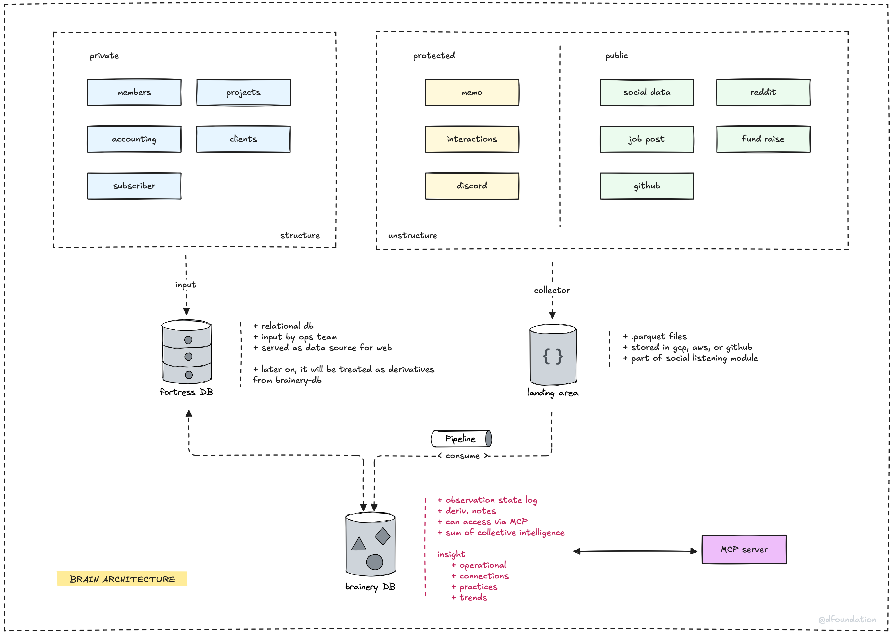

> **tl;dr**
>
> Brainery uses a multi-part architecture: **Fortress DB** for structured data, a **Landing area** for raw unstructured data, and a **Pipeline** that processes everything into the **brainery-db**. This core **TimescaleDB** is accessed via the **MCP Server** to turn diverse inputs into a living knowledge base.

Our second brain project, internally known as **Brainery**, is engineered to be more than just a data repository; it's a dynamic and evolving **knowledge base**. It’s designed to empower you to truly understand and connect disparate pieces of information, moving beyond simple AI queries to genuine insight. This article will walk you through the architecture that makes this possible, explaining how data flows and transforms into actionable knowledge.

### Data: The foundation of knowledge

At the heart of any "second brain" is data. The diagram you see shows how various types of data, each with its own characteristics, serve as the raw material for **Brainery**. We've categorized these sources to clarify how we handle them:

* **Private data (structured):** This category encompasses internal information that is already well-organized, such as `members`, `projects`, `accounting`, `clients`, and `subscriber` data. This **structured data** is primarily fed into the **Fortress DB**.
* **Protected data (unstructured):** This includes internal communications like `memo` (internal notes), `interactions`, and `discord` conversations. This **unstructured data** is channeled into a **Landing area**.
* **Public data (unstructured):** This is information gathered from public sources like `social data`, `reddit`, `job post` information, `fund raise` details, and `github` repositories. This also goes to the **Landing area**.

### Processing and storage: Transforming data into insights

Collecting data is just the first step. The real power of **Brainery** comes from how this data is processed, stored, and interconnected.

1. **Fortress DB:**

* This is a **relational database** (e.g., PostgreSQL, MySQL) storing structured private data in tables. It's ideal for precise queries using **SQL**.
* Input is managed by our operations team, and it serves web applications needing reliable, transactional data.
* Eventually, its data will also be treated as derivatives from the **Brainery DB** for a unified analytical view.

2. **Landing area (collector):**

* This is an initial aggregation point for **unstructured** and **semi-structured data** (from protected and public sources) before it enters the main processing pipeline.
* Data is often stored in **Parquet files**, a columnar format optimized for big data analytics, typically within **cloud storage** (GCP, AWS).
* It's crucial for our **social listening module**, capturing external signals.

3. **Pipeline (consume):**

* Data from **Fortress DB** and the **Landing area** is processed by this pipeline to prepare it for the **Brainery DB**.
* It uses a **Background Interface** (often an LLM) and an **MCP (Model Context Protocol) Server**. **MCP** standardizes data exchange between services and models, ensuring consistent communication.

4. **Brainery DB:**

* The core of our system, built on **TimescaleDB**, an extension of PostgreSQL optimized for **time-series data**.
* It features an `observation_log` **hypertable**, which auto-partitions data by time for efficiency. This uses an **append-only design**, meaning new data is added without altering existing records, ensuring an immutable history.
* This database cultivates:
  * An `observation state log`: The foundational record of all ingested data.
  * `deriv. notes`: LLM-generated summaries and interpretations.
  * The `sum of collective intelligence`: Holistic knowledge from all connected sources.
  * `insight`: Significant understandings from pattern analysis.
  * `operational` data, `connections` (relationships between data), `practices` (learned procedures), and `trends`.
* **LLMs** analyze observations here, detect trends, and can even coin new terms for novel patterns.

5. **MCP server:**

* The primary gateway for interacting with the **Brainery DB**, enforcing the **MCP** standard.
* It handles requests for parsing, structuring, storing data in **TimescaleDB**, and executing queries.
* This allows tools like **LLM-powered chatbots** to use natural language to query the **Brainery DB** through a standardized interface.

### The goal: A living knowledge base

This architecture aims to create a **living knowledge base** that grows and adapts. By systematically capturing, structuring, and intelligently processing diverse data, **Brainery** helps us uncover insights, track trends, and foster continuous learning and informed decision-making.

---

> Next: [Database design](database-design.md)
