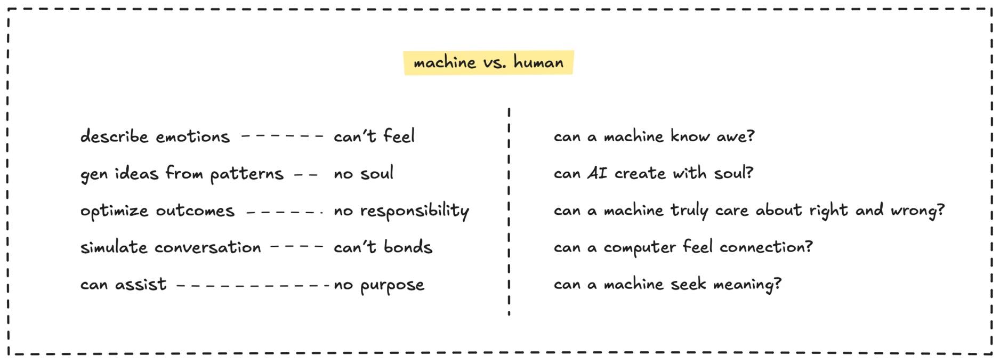

> **tl;dr**
>
> AI can mimic thinking, but being human is about feeling, creating, connecting, and defining purpose through emotions, intuition, relationships, and existential freedom, qualities machines can’t replicate.

As AI, like large language models, takes on tasks from problem-solving to idea generation, a profound question arises: **if computers can think for us, what’s the point of being human?** This Socratic inquiry invites us to probe what makes humanity distinct. If machines can process data faster, optimize decisions, or simulate creativity, do we still have a unique role? Let’s explore what AI can’t replicate.

Consider what it means to be human. **Our conscious experience defines us**: the joy of a sunset, the ache of loss, or the curiosity of existence. AI can describe emotions but can’t feel them, lacking the subjective depth that gives life meaning. Reflect: can a machine know awe?

Next, ponder creativity. AI generates ideas from patterns, but **humans excel at intuitive leaps**, weaving meaning from chaos. Art, philosophy, and innovation often spring from emotional or irrational sparks, beyond logic’s reach. Ask yourself: can AI create with soul?

Now, think about morality. **Humans bear the weight of ethical choices**, defining what “good” means in messy contexts. AI can optimize outcomes but doesn’t grapple with values or responsibility. Question: can a machine truly care about right and wrong?

**Relationships** shape us too. Love, empathy, and community are human experiences, not transactions. AI can simulate conversation but can’t form authentic bonds. Reflect: can a computer feel connection?

Finally, consider growth and freedom. Striving through challenges and **defining our purpose** through creativity, service, or exploration is uniquely human. AI assists but doesn’t wrestle with the “why” of existence. Ask: can a machine seek meaning?

To embrace your humanity:

- Lean into emotions and experiences AI can’t replicate.
- Create with intuition, not just data.
- Build relationships and define your purpose.

Being human isn’t diminished by AI; it’s amplified. Computers think, but we feel, create, connect, and choose meaning, making our existence profoundly irreplaceable.

---

> Next: [Maintain human edge](human-edge.md)
