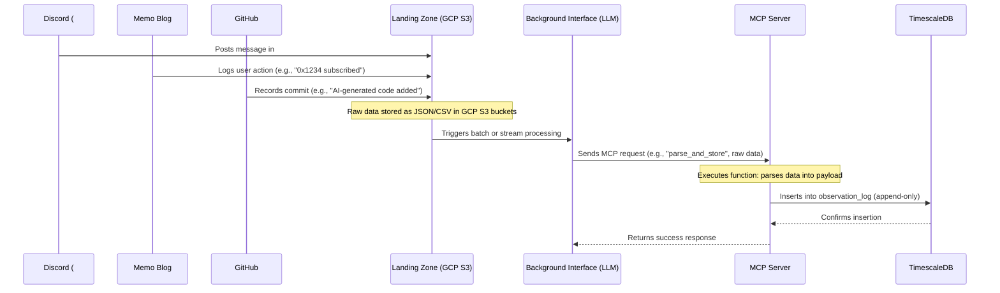
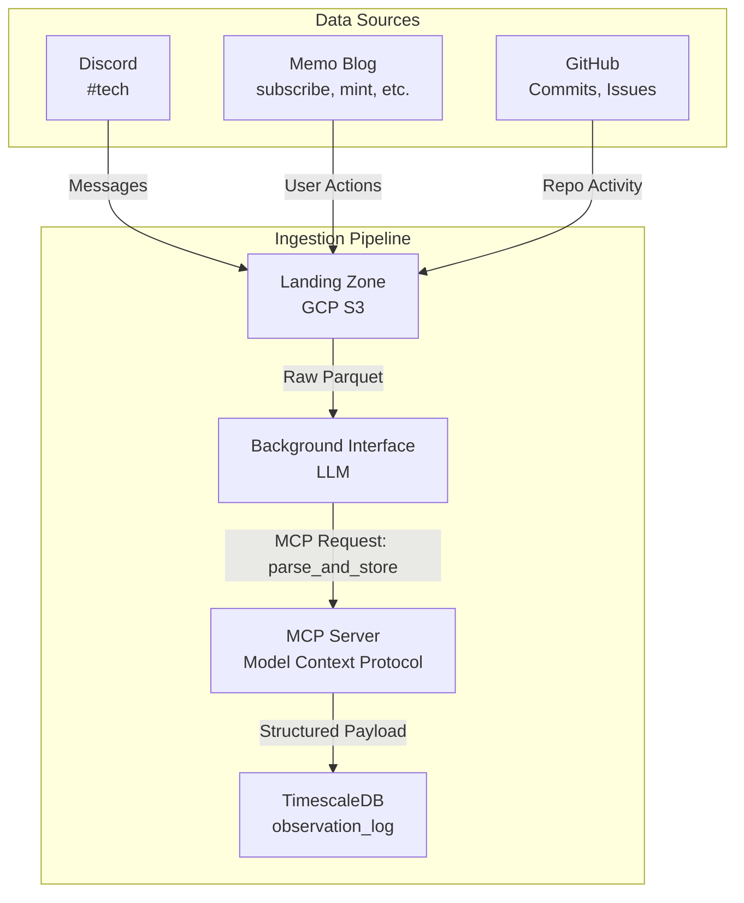
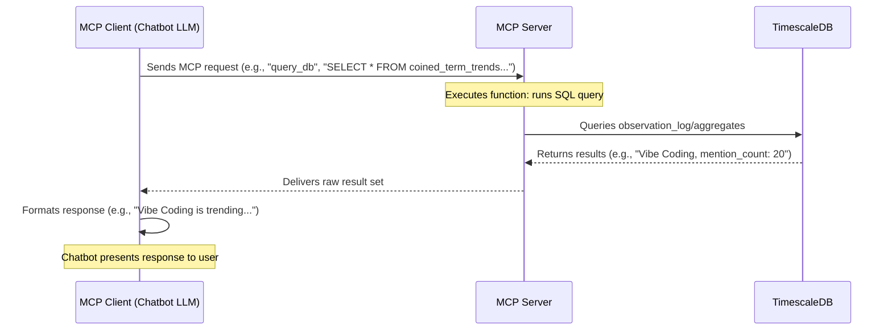
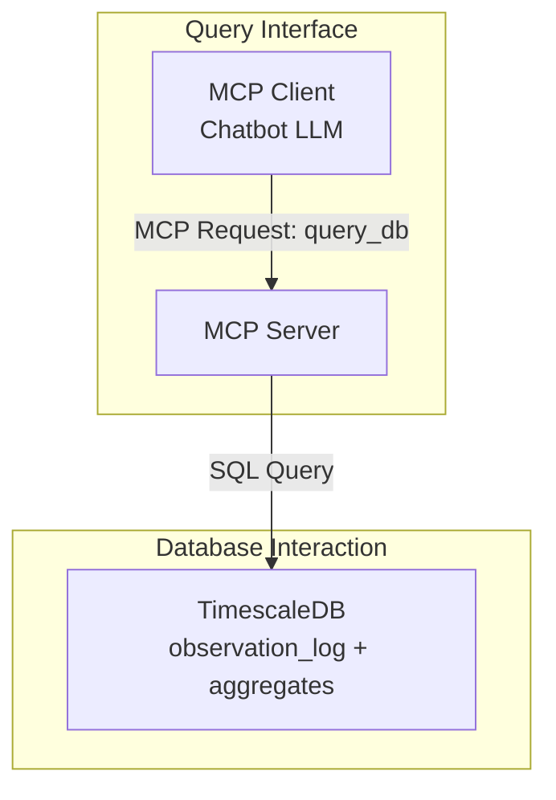

> **tl;dr**
>
> Brainery gets data from sources like Discord and GitHub into a **Landing Zone**, processes it via **MCP** and **LLMs**, and stores it in the **TimescaleDB observation_log**. **MCP** also lets you query this data easily.

This guide explains how the Brainery system processes and queries data across multiple sources. We'll explore two main flows: data ingestion and query processing. The system leverages **Model Context Protocol (MCP)** for structured data handling and **TimescaleDB** for efficient time-series storage.

## Data ingestion flow

The ingestion pipeline processes data from multiple sources into a structured, queryable format. Here's how it works:

### System components

### How it works

1. **Data collection**: Raw data flows into the system from three primary sources:
   - **Discord**: Technical discussions and insights from #tech channel
   - **Memo Blog**: User actions like subscriptions and content interactions
   - **GitHub**: Repository activities including commits and issues

2. **Landing zone**: All raw data is initially stored in **GCP S3** buckets in JSON/CSV format, acting as a reliable buffer for incoming data.

3. **Processing pipeline**:
   - The **Background Interface** (an LLM instance) monitors the landing zone
   - When new data arrives, it triggers processing through **MCP requests**
   - The **MCP Server** parses raw data into structured payloads
   - Data is stored in TimescaleDB's **observation_log** hypertable

4. **Storage**: TimescaleDB maintains an **append-only** observation log, ensuring data integrity and auditability.

## Query flow

The query flow enables external services to interact with the stored data through an LLM-powered chatbot interface.

### Query architecture

### Query process

1. **Request handling**:
   - External services send natural language queries to the **MCP Client** (chatbot)
   - The LLM interprets the request and generates appropriate SQL queries

2. **Query execution**:
   - The **MCP Server** receives and validates the query request
   - Queries are executed against TimescaleDB's **observation_log** or **aggregates**
   - Results are returned to the MCP Client

3. **Response formatting**:
   - The LLM formats raw data into natural language responses
   - Responses are delivered directly to the requesting service

## Key benefits

- **Structured data flow**: The MCP protocol ensures consistent data handling across the system
- **Scalable storage**: TimescaleDB's hypertable architecture enables efficient time-series data management
- **Intelligent interface**: LLM-powered chatbot provides natural language access to complex data
- **Reliable processing**: Append-only logs maintain data integrity and auditability

## Implementation notes

- The **Background Interface** operates as an LLM that uses MCP for data ingestion
- The **MCP Server** acts as a protocol layer between LLMs and TimescaleDB
- The system maintains **append-only** logs for data integrity
- All data transformations are handled through **MCP requests** for consistency

---

> Next: [Promote data to insight](promote-data-to-insight.md)
