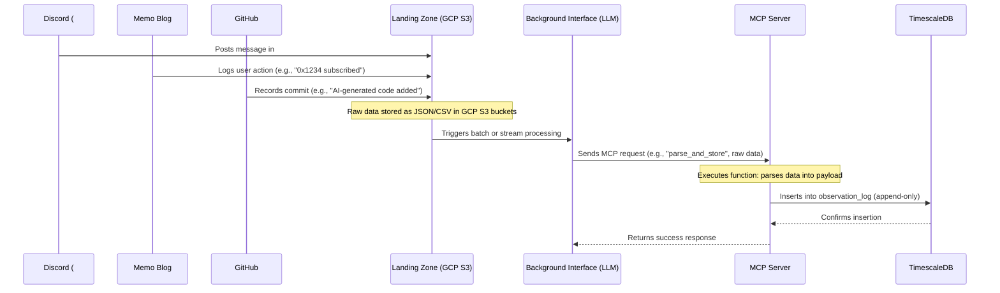
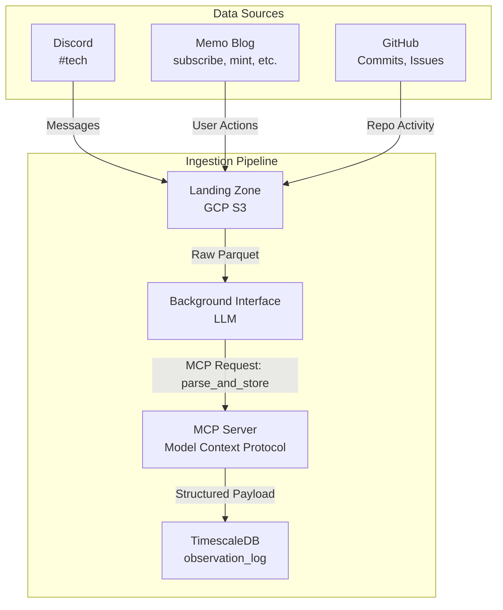
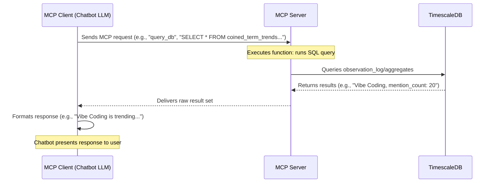
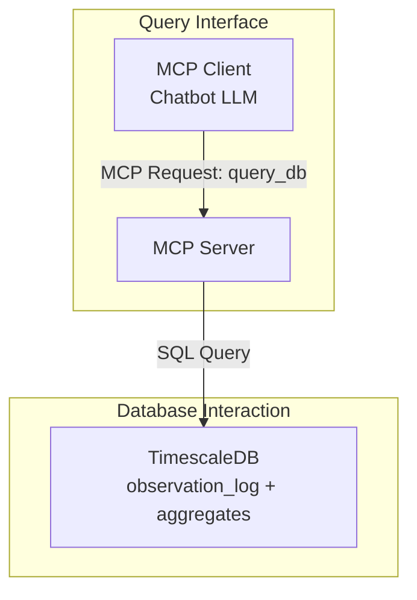

## 1. Sequence data flow: from Discord/... -> Landing zone -> TimescaleDB

This diagram illustrates how data from Discord, Memo Blog, and GitHub is ingested into TimescaleDB via the MCP server, with the background interface acting as an LLM leveraging the MCP protocol.

## Explanation

The flow begins with Discord (e.g., a message in #tech), Memo Blog (e.g., a subscription), and GitHub (e.g., a commit) depositing raw data into the landing zone (GCP S3). The background interface, an LLM instance, monitors the landing zone and initiates processing by sending an MCP request to the MCP server. This request invokes a function (e.g., “parse_and_store”), passing the raw data as input. The MCP server, adhering to the Model Context Protocol, interprets the request, parses the data into a structured payload (e.g., with entities, relations, and tags), and inserts it into the observation_log hypertable in TimescaleDB. The append-only nature is preserved, and the MCP server confirms the insertion back to the background interface, completing the pipeline.

## 2. Sequence query flow: from external services/platform -> MCP -> Timescaledb

This diagram depicts how an external service queries the database through the MCP client (chatbot), an LLM that uses the MCP server to execute actions against TimescaleDB.

The sequence starts when an external service or platform (e.g., a user’s chat app) sends a natural language request to the MCP client, a chatbot powered by an LLM. For instance, a user asks, “What’s trending in #tech?” The MCP client interprets this request and constructs an MCP request (e.g., a function call like “query_db”) with a generated SQL query, such as “SELECT * FROM coined_term_trends WHERE bucket >= NOW() - INTERVAL '1 month'”. The MCP server receives this request, executes the specified function, and queries TimescaleDB—either the raw observation_log or a continuous aggregate like coined_term_trends. The database returns the results (e.g., trend data), which the MCP server relays back to the MCP client. The MCP client then uses its LLM capabilities to format the raw data into a natural language response (e.g., “Vibe Coding is trending with 20 mentions this week”) and sends it to the external service, bypassing a traditional frontend.

In the data flow, the background interface operates as an LLM that interacts with the MCP server using the Model Context Protocol. It processes raw data from the landing zone (GCP S3) and relies on the MCP server to handle the insertion logic, ensuring structured payloads are written to TimescaleDB. This aligns with Anthropic’s MCP vision of enabling LLMs to call functions and manage context, here applied to data ingestion.

In the query flow, the MCP client (chatbot) is another LLM instance that uses the MCP server to execute database queries. The MCP server acts as a protocol layer, interpreting function calls from the MCP client and interfacing with TimescaleDB. The chatbot handles both query generation and response formatting, leveraging the MCP protocol to abstract the database interaction.
