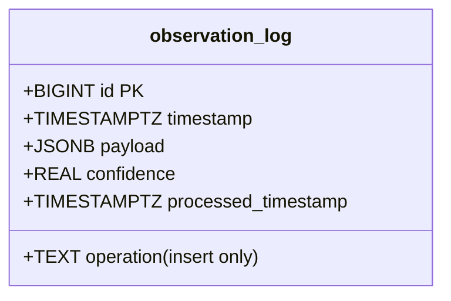
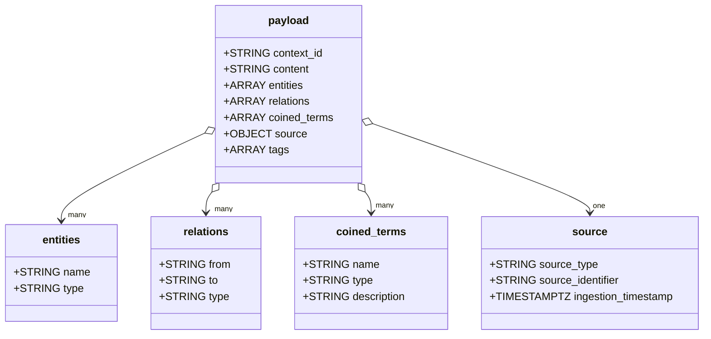

> **tl;dr** Our database uses a single **TimescaleDB hypertable** (`observation_log`) that is **append-only** and uses flexible **JSONB payload**. This lets **LLMs** detect patterns and coin terms without needing schema migrations.

This document outlines a **TimescaleDB**-based schema designed for capturing observational data and facilitating the emergence of coined terms through pattern detection. The system leverages a single **hypertable** named **observation_log** as its foundation, eschewing static tables in favor of dynamic, continuous aggregates and runtime queries.

## Why this design matters

The primary objective is to enable an evolving knowledge base where a **large language model (LLM)** can:

* Ingest raw observations
* Detect emerging trends
* Coin terms like "Vibe Coding" to encapsulate patterns
* Maintain scalability and temporal integrity

The system is explicitly **append-only**, ensuring that historical data remains immutable as new insights accrete over time.

## Core structure: The observation_log hypertable

The **observation_log** serves as the sole **hypertable** within this schema, functioning as the append-only repository for all observational data. Configured atop **TimescaleDB**, it harnesses time-based partitioning to optimize performance for time-series analysis.

### Schema definition

```sql
CREATE TABLE observation_log (
    id BIGINT GENERATED ALWAYS AS IDENTITY PRIMARY KEY,
    timestamp TIMESTAMPTZ NOT NULL DEFAULT NOW(),
    payload JSONB NOT NULL,
    operation TEXT NOT NULL DEFAULT 'insert' CHECK (operation = 'insert'),
    confidence REAL,
    processed_timestamp TIMESTAMPTZ,
    CHECK (jsonb_typeof(payload) = 'object')
);

SELECT create_hypertable('observation_log', 'timestamp', chunk_time_interval => INTERVAL '1 month');
CREATE INDEX idx_observation_log_payload ON observation_log USING GIN (payload);
```

### Structure visualization



The **payload** column, encoded in **JSONB**, encapsulates the observation's content and metadata, providing a flexible, semi-structured format that evolves without necessitating schema migrations. The **GIN index** on **payload** accelerates queries involving **JSONB** operations, such as runtime deduplication and pattern extraction.

## Payload composition and evolution

The **payload** within **observation_log** is the linchpin of this design, housing raw observational data and evolving to reflect coined terms as trends emerge. Initially, the **LLM** populates the **payload** with:

* Raw **content**
* Atomic **entities**
* Direct **relations**

Higher-level concepts like **coined_terms** remain undefined until patterns solidify. As trends are detected, the **LLM** appends new observations that introduce **coined_terms**, encapsulating emergent phenomena such as "Vibe Coding"—a term coined to describe developers leveraging **AI** to generate code without manual intervention.

### Example payloads

#### Pre-coining phase

```json
{
    "context_id": "discord:#indie-devs:12345",
    "content": "Devs are using AI to generate code without writing it themselves",
    "entities": [
        {"name": "AI", "type": "technology"},
        {"name": "devs", "type": "group"}
    ],
    "relations": [
        {"from": "devs", "to": "AI", "type": "uses"}
    ],
    "coined_terms": [],
    "source": {
        "source_type": "discord",
        "source_identifier": "#indie-devs",
        "ingestion_timestamp": "2025-03-10T12:00:00Z"
    },
    "tags": ["software", "ai"]
}
```

#### Post-coining phase

```json
{
    "context_id": "system:trend-analysis:2025-03-10",
    "content": "Coined 'Vibe Coding' for devs using AI to generate code without coding themselves",
    "entities": [
        {"name": "AI", "type": "technology"},
        {"name": "devs", "type": "group"}
    ],
    "relations": [
        {"from": "devs", "to": "AI", "type": "uses"}
    ],
    "coined_terms": [
        {"name": "Vibe Coding", "type": "trend", "description": "Intuitive coding via AI without manual coding"}
    ],
    "source": {
        "source_type": "system",
        "source_identifier": "trend-analysis",
        "ingestion_timestamp": "2025-03-10T13:00:00Z"
    },
    "tags": ["trend", "software", "ai"]
}
```

### Payload structure



This structure ensures that **entities** and **relations** remain grounded in raw data, while **coined_terms** emerge as synthesized trends, maintaining a clear delineation within an append-only framework.

## Continuous aggregates for pattern detection

To facilitate trend detection and term coining, the design employs **continuous aggregates** atop **observation_log**. These aggregates, managed by **TimescaleDB**, pre-compute time-series summaries, enabling the **LLM** to identify patterns without altering the underlying data.

### Content trends aggregate

The **content_trends** aggregate extracts recurring phrases from the **content** field, providing the raw material for term coining:

```sql
CREATE MATERIALIZED VIEW content_trends
WITH (timescaledb.continuous) AS
SELECT
    time_bucket('1 week', timestamp) AS bucket,
    lower(regexp_replace(payload->>'content', '[^a-zA-Z0-9 ]', '', 'g')) AS content_text,
    COUNT(*) AS mention_count,
    MIN(timestamp) AS first_observed
FROM observation_log
WHERE payload->>'content' IS NOT NULL
GROUP BY time_bucket('1 week', timestamp), content_text
HAVING COUNT(*) > 1;

SELECT add_continuous_aggregate_policy('content_trends',
    start_offset => INTERVAL '1 month',
    end_offset => INTERVAL '1 minute',
    schedule_interval => INTERVAL '1 hour');
```

### Entity trends aggregate

The **entity_trends** aggregate monitors the frequency of atomic **entities**:

```sql
CREATE MATERIALIZED VIEW entity_trends
WITH (timescaledb.continuous) AS
SELECT
    time_bucket('1 week', timestamp) AS bucket,
    payload->'entities'->>'name' AS entity_name,
    COUNT(*) AS mention_count,
    MIN(timestamp) AS first_observed
FROM observation_log,
    jsonb_array_elements(payload->'entities') AS entities
GROUP BY time_bucket('1 week', timestamp), payload->'entities'->>'name';

SELECT add_continuous_aggregate_policy('entity_trends',
    start_offset => INTERVAL '1 month',
    end_offset => INTERVAL '1 minute',
    schedule_interval => INTERVAL '1 hour');
```

### Relation trends aggregate

The **relation_trends** aggregate tracks the evolution of **relations**:

```sql
CREATE MATERIALIZED VIEW relation_trends
WITH (timescaledb.continuous) AS
SELECT
    time_bucket('1 week', timestamp) AS bucket,
    payload->'relations'->>'from' AS from_entity,
    payload->'relations'->>'to' AS to_entity,
    payload->'relations'->>'type' AS relation_type,
    COUNT(*) AS relation_count,
    MIN(timestamp) AS first_observed
FROM observation_log,
    jsonb_array_elements(payload->'relations') AS relations
GROUP BY time_bucket('1 week', timestamp), from_entity, to_entity, relation_type;

SELECT add_continuous_aggregate_policy('relation_trends',
    start_offset => INTERVAL '1 month',
    end_offset => INTERVAL '1 minute',
    schedule_interval => INTERVAL '1 hour');
```

### Coined term trends aggregate

The **coined_term_trends** aggregate follows the adoption of **coined_terms**:

```sql
CREATE MATERIALIZED VIEW coined_term_trends
WITH (timescaledb.continuous) AS
SELECT
    time_bucket('1 week', timestamp) AS bucket,
    payload->'coined_terms'->>'name' AS term_name,
    COUNT(*) AS mention_count,
    MIN(timestamp) AS first_observed
FROM observation_log,
    jsonb_array_elements(payload->'coined_terms') AS coined_terms
GROUP BY time_bucket('1 week', timestamp), payload->'coined_terms'->>'name';

SELECT add_continuous_aggregate_policy('coined_term_trends',
    start_offset => INTERVAL '1 month',
    end_offset => INTERVAL '1 minute',
    schedule_interval => INTERVAL '1 hour');
```

### Tag trends aggregate

The **tag_trends** aggregate quantifies the prevalence of **tags**:

```sql
CREATE MATERIALIZED VIEW tag_trends
WITH (timescaledb.continuous) AS
SELECT
    time_bucket('1 week', timestamp) AS bucket,
    tag AS tag_name,
    COUNT(*) AS tag_count,
    MIN(timestamp) AS first_observed
FROM observation_log,
    jsonb_array_elements_text(payload->'tags') AS tag
GROUP BY time_bucket('1 week', timestamp), tag;

SELECT add_continuous_aggregate_policy('tag_trends',
    start_offset => INTERVAL '1 month',
    end_offset => INTERVAL '1 minute',
    schedule_interval => INTERVAL '1 hour');
```

These aggregates collectively empower the **LLM** to detect patterns across raw content, entities, relations, and tags, culminating in the coining of terms that encapsulate significant trends.

## Runtime deduplication queries

To maintain a migration-less system devoid of static tables, deduplication of **entities**, **relations**, **coined_terms**, and other elements occurs at runtime via **DISTINCT** queries on **observation_log**. This approach leverages the **GIN index** on **payload** to ensure efficient execution.

### Unique entities query

The query for unique **entities** extracts deduplicated atomic components:

```sql
SELECT DISTINCT ON (entities->>'name')
    entities->>'name' AS name,
    entities->>'type' AS entity_type,
    MIN(timestamp) AS first_observed
FROM observation_log,
    jsonb_array_elements(payload->'entities') AS entities
GROUP BY entities->>'name', entities->>'type';
```

### Unique coined terms query

The query for unique **coined_terms** isolates emergent trends:

```sql
SELECT DISTINCT ON (coined_terms->>'name')
    coined_terms->>'name' AS term_name,
    coined_terms->>'type' AS term_type,
    coined_terms->>'description' AS description,
    MIN(timestamp) AS first_observed
FROM observation_log,
    jsonb_array_elements(payload->'coined_terms') AS coined_terms
GROUP BY coined_terms->>'name', coined_terms->>'type', coined_terms->>'description';
```

This design's reliance on runtime queries ensures that the system remains fluid, adapting to new data without the rigidity of static tables.

## Operational workflow

The **LLM** engages with **observation_log** in a cyclical process that drives the evolution of observational patterns:

1. **Initial ingestion**: The **LLM** ingests raw data from diverse sources—such as Discord or X—recording observations with minimal **entities** and **relations**, focusing on **content** and **tags**.

2. **Pattern detection**: Periodically, it queries the **continuous aggregates** to identify recurring patterns, such as:
   * A surge in mentions of "generate code without writing" within **content_trends**
   * "devs uses AI" in **relation_trends**

3. **Term coining**: Upon detecting a threshold—say, a **mention_count** exceeding 10—the **LLM** coins a term like "Vibe Coding" and appends a new observation to **observation_log**, populating the **coined_terms** array.

4. **Trend reinforcement**: Subsequent observations reference this term, tracked by **coined_term_trends**, reinforcing its significance over time.

This append-only paradigm, coupled with the absence of static tables, ensures that the system evolves organically, requiring no migrations as new patterns emerge. The **TimescaleDB hypertable** and **continuous aggregates** provide the temporal backbone, while runtime **DISTINCT** queries offer flexibility without structural overhead.

## Purpose and philosophy

The overarching purpose of this design is to foster an evolving observational pattern within a migration-less framework. By anchoring all data in the **observation_log** hypertable and leveraging **continuous aggregates** for trend detection, the system empowers the **LLM** to discern and name emergent phenomena without the constraints of predefined schemas.

The exclusion of static tables beyond **observation_log** eliminates the need for schema migrations, ensuring that the database adapts seamlessly to new insights. This approach not only preserves historical fidelity through its append-only nature but also positions the system as a dynamic tool for uncovering and naming trends like "Vibe Coding" as they crystallize from raw observational data.

---

> Next: [Data flows](data-flow.md)
