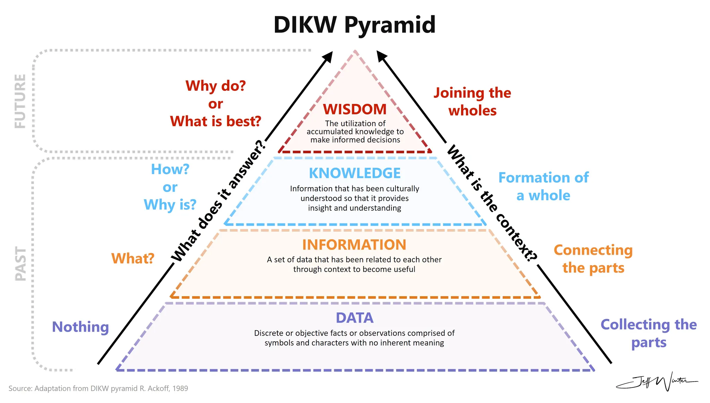

Our main goal is to build a system that enables **continual learning (CL)**. We want to move beyond basic **data** collection to create meaningful **information** and **insight**, with the potential to reach **wisdom** (following the **DIKW pyramid**).



## The problem with traditional approaches

Current methods face significant challenges:

- **Database schemas** are too rigid. When new information types emerge, they require complex **migrations**. You can't easily evolve the structure as your understanding grows.
- **Large Language Models (LLMs)** face **catastrophic forgetting (CF)** when fine-tuned. While **in-context learning (ICL)** avoids this issue, it doesn't scale well. As you add more examples, prompt sizes grow, exceeding token limits and reducing performance.

## Our solution

We've designed a system that overcomes these limitations. Here's how it works:

1. [**Never forgets:**](never-forget.md) Using an **append-only** **TimescaleDB** **hypertable** (`observation_log`), we maintain complete historical data. Past observations remain unchanged, preventing **CF** at the data level.
2. **Adapts without breaking:** The flexible **JSONB** `payload` lets observations evolve naturally. When the **LLM** identifies a new pattern (like **"Vibe Coding"**), it simply adds a new observation with the `coined_terms` field. No **schema migration** needed.
3. **Scales over time:** **TimescaleDB** handles large time-series datasets efficiently. **Continuous aggregates** (like `content_trends`, `entity_trends`) pre-compute trends, helping the **LLM** detect patterns without repeatedly querying the entire log.
4. **Generates insights:** The system follows a simple loop:
   - **LLM** observes raw data
   - Queries aggregates to find patterns (**information**)
   - Synthesizes patterns into **coined terms** (**insight/knowledge**)
   - Writes new observations

## How it maps to the DIKW pyramid

### Data: raw observations

This is your base layer - raw facts and symbols. In our system, this includes:

- Raw ingested content
- Basic metadata in the `payload`
- Initial source identifiers

```json
{
  "content": "Devs are using AI to generate code without writing it themselves",
  "source": {
    "source_type": "discord",
    "source_identifier": "#indie-devs",
    "ingestion_timestamp": "2025-03-10T12:00:00Z"
  },
  "tags": ["software", "ai"]
}
```

### Information: structured & contextualized data

Here, we organize and contextualize raw data. The **LLM** extracts and stores:

- Identified **entities**
- **Relations** between entities
- Outputs from **TimescaleDB continuous aggregates**

```json
{
  "entities": [
    {"name": "AI", "type": "technology"},
    {"name": "devs", "type": "group"}
  ],
  "relations": [
    {"from": "devs", "to": "AI", "type": "uses"}
  ]
}
```

### Knowledge: synthesized patterns & understanding

This level involves understanding patterns. In our system, this appears in the **`coined_terms`** array:

```json
{
  "coined_terms": [
    {
      "name": "Vibe Coding",
      "type": "trend",
      "description": "Intuitive coding via AI without manual coding"
    }
  ]
}
```

### Wisdom: applied knowledge & judgment

This is the highest level, answering "why" questions. While our current schema doesn't explicitly store wisdom, it emerges from:

- Long-term evolution of **`coined_terms`**
- Analysis of trends in `coined_term_trends`
- Strategic decision-making based on accumulated knowledge

## Resources

- [In-context Continual Learning Assisted by an External Continual Learner](https://arxiv.org/abs/2412.15563)

---

> Next: [Build a brain that never forgets](never-forget.md)
