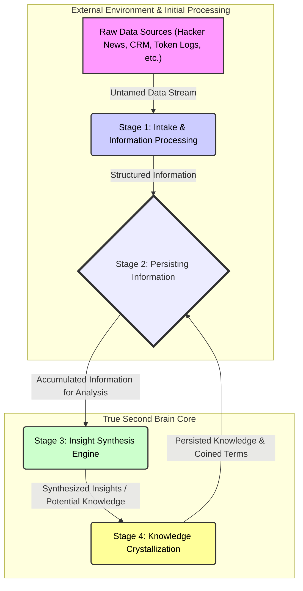

> Prev: [Building use-cases from and for our true second brain](building-use-cases-second-brain.md)

So, you've got data. Tons of it. Streaming in from everywhere; Hacker News, our CRM, token usage logs, project reports. That’s great. But raw **data**, by itself, is mostly useless. It’s noisy, chaotic, and often just a jumble of bits. You can't make decisions off a raw server log any more than you can build a rocket from a pile of unrefined ore. The real game is transforming that raw stream into actionable **insight**, and eventually, into persistent **knowledge** within our **true second brain**. This is the pipeline, the "promotion" process, that makes our brain actually intelligent.



## Stage 1: The intake; taming the raw chaos

First, let's be clear: raw **data** is wild. It's the untamed frontier. Think of scraping Hacker News comments; you get everything: brilliance, nonsense, flame wars, typos. Or CRM logs; a mix of crucial updates and mundane automated entries. Our **ICY token** transactions? Just a ledger of numbers without context. This is the starting point. We don't shy away from it; we ingest it.

But we don't just dump this raw sludge directly into the core of our second brain. That would be like trying to feed a supercomputer with mud. Instead, these raw streams are often first handled by specialized **supporting systems** or dedicated scripts, frequently leveraging their own **LLMs** optimized for specific parsing or structuring tasks.

Their job? To perform the initial heavy lifting. This is where basic **data cleaning** happens; stripping out irrelevant HTML from web scrapes, normalizing date formats, maybe fixing common misspellings. They perform initial **entity extraction**; identifying "NVIDIA," "React," or "Q2 Financials" within a block of text. They might do preliminary **sentiment analysis** on customer feedback or social media chatter. Essentially, they take the absolute chaos and impose a first layer of order. They turn raw **data** into something slightly more manageable, something we can start to call **Information**. This is like sifting the gravel to find the pebbles that *might* contain gold.

This structured **Information**, which is now more than just raw symbols, might look like this for a Hacker News comment:
```json
{
  "source_id": "hn_comment_xyz123",
  "raw_text": "lol, this new JS framework is 🔥 but docs r terrible!!1",
  "cleaned_text": "This new JavaScript framework is impressive, but the documentation is terrible.",
  "entities_extracted": [
    {"text": "JavaScript framework", "type": "TECHNOLOGY"},
    {"text": "documentation", "type": "ASSET"}
  ],
  "sentiment": {"score": -0.5, "label": "NEGATIVE", "focus": "documentation"},
  "initial_tags": ["javascript", "developer_tool", "feedback"]
}
```
See? Still fairly basic, but it's no longer just a random string of characters. It has *structure*.

## Stage 2: Feeding the beast; persisting structured information

Once this initial transformation from raw **Data** to structured **Information** is done by our supporting systems, this refined payload is ready for the next step. It gets piped directly into the **observation_log** of our **true second brain**. This is crucial. We're not just processing it in memory and forgetting it; we are creating a permanent, **append-only** record of this **Information**.

The beauty of the **JSONB payload** in our **TimescaleDB hypertable** really shines here. It can handle this structured, yet still diverse, **Information** without us needing to define a rigid schema upfront for every possible data source. The **Information** from Hacker News, the CRM, and token logs can all coexist, each with its own relevant structure, within the same unified log.

At this point, the brain has ingested something digestible. It's no longer raw, unprocessed material. It's **Information** that has context and a degree of organization. This is the fuel that powers the next, more sophisticated stage of analysis.

## Stage 3: The synthesis engine; where information becomes insight

Now we're inside the **true second brain**. All this structured **Information** is accumulating in the `observation_log`. This is where our *internal* **LLM**, the core cognitive engine of the second brain, takes over. Its job isn't just to store the **Information**, but to *understand* it, to find the patterns hidden within it, across different sources and over time.

How does it do this efficiently? This is where **TimescaleDB continuous aggregates** are absolute game-changers. Imagine trying to find trends by re-scanning terabytes of historical **Information** every few minutes. Insane, right? **Continuous aggregates** pre-compute summaries and trends on the fly. For example, we might have aggregates tracking:
*   The frequency of certain **entities** (like "serverless" or "AI ethics") appearing together.
*   The velocity of **sentiment** changes around specific topics.
*   The correlation between certain types of CRM activities and subsequent sales performance.
*   The adoption rate of new features in our ICY token platform alongside discussions on developer forums.

Our internal **LLM** queries these aggregates, and the raw **Information** when needed, looking for signals that rise above the noise. It's looking for correlations that aren't obvious, anomalies that suggest something interesting is happening, or the gradual emergence of a new theme across multiple, seemingly unrelated data streams. This is where the "Aha!" moment happens. This is where **Information** starts to transform into genuine **Insight**. It's the brain detecting that "discussions about 'decentralized AI compute' are spiking on Hacker News *at the same time* as we're seeing increased ICY token transactions from wallets also interacting with known DePIN projects." That's not just two pieces of **Information**; that's the beginning of an **Insight**.

## Stage 4: Crystallizing understanding; coining terms and persisting knowledge

When the internal **LLM** identifies such a significant pattern, a novel connection, or an emergent trend that it deems important, it doesn't just keep it to itself. It needs to make this new understanding concrete and reusable. This is where the concept of **coining terms** (or creating formal knowledge structures) becomes critical.

The **LLM** synthesizes this newfound **Insight** and often gives it a name, a **coined term**, along with a description, related entities, and perhaps a confidence score. For the example above, it might coin the term: `"DePIN Compute Convergence"`.

And then, crucially, this newly minted **Insight**, now often elevated to the level of **Knowledge** because it's a synthesized, validated understanding, is written *back* into the `observation_log` as a new, highly valuable observation.
```json
{
  "context_id": "system:insight_synthesis:2025-09-10",
  "insight_type": "emergent_trend_detection",
  "coined_terms": [{
    "name": "DePIN Compute Convergence",
    "description": "Observed trend of increased discussion and activity at the intersection of Decentralized Physical Infrastructure Networks (DePIN) and demand for distributed AI compute resources, reflected in token movements and forum discussions.",
    "supporting_observation_ids": ["hn_post_abc", "icy_txn_cluster_def", "crm_inquiry_ghi"],
    "confidence": 0.85
  }],
  "summary": "Identified a growing convergence between DePIN initiatives and the need for decentralized AI compute resources.",
  "source": {"source_type": "internal_llm_synthesis_engine", /* ... */},
  "tags": ["insight", "coined_term", "depin", "ai_compute", "emerging_trend"]
}
```
This isn't just logging; it's the brain *teaching itself* and making that lesson a permanent part of its memory. This new **coined term** and the **Knowledge** it represents can now be tracked over time. The brain can look for future signals related to "DePIN Compute Convergence," refining its understanding as more data comes in. This **Insight** becomes a building block for even more sophisticated future analyses.

## Why this promotion pipeline is a big deal

This deliberate, multi-stage process of promoting raw **Data** to structured **Information**, and then synthesizing that **Information** into persistent **Insight** and **Knowledge**, is what separates a smart system from a dumb database.

It’s **scalable** because we're not trying to do everything with one monolithic process. Specialized systems handle the initial grunt work. The core brain focuses on the higher-level synthesis, aided by efficient tools like **continuous aggregates**.

It’s **evolvable**. As the brain ingests more **Information** and synthesizes more **Insights**, it literally gets better at its job. The **coined terms** create a richer vocabulary for understanding the world, allowing it to spot more nuanced patterns in the future.

And most importantly, it’s geared towards producing **actionable insights**. We're not just collecting data for the sake of it. The whole point is to surface understandings that can inform decisions, reveal opportunities, or flag potential risks.

### Fluid vs. Crystallized intelligence in our system

Think about how human intelligence works. Psychologists talk about **fluid intelligence**; the ability to reason, solve new problems, and think abstractly. Then there's **crystallized intelligence**; the accumulation of knowledge, facts, and skills over time. Our system mirrors this.

Our **LLMs**, especially the pre-trained foundation models we might use for initial processing or even for the internal synthesis engine, embody a form of **fluid intelligence**. They have an incredible ability to understand language, make connections, and reason about novel inputs based on their vast training. However, their core knowledge is largely a "snapshot" from when they were trained. They can process new things, but they don't inherently *learn and retain* new facts in their own parameters without retraining.

Our **true second brain**, specifically the `observation_log` and the process of persisting **Information** and **Knowledge** (including **coined terms**), represents the development of **crystallized intelligence**. Every piece of structured **Information**, every synthesized **Insight**, every **coined term** written back to the log *becomes part of this growing, permanent knowledge base*. This is our system's long-term memory, its accumulated experience. The **LLM's** **fluid intelligence** is used to *process* the incoming data and *generate* new insights, but those insights are then *crystallized* into the `observation_log`. This ensures that the system doesn't just react to new data with its "snapshot" knowledge; it builds upon a continuously expanding foundation of prior learnings. This synergy is key: the **LLM's** dynamic processing power builds the enduring, **crystallized intelligence** of our **true second brain**. This means our brain doesn't just have a massive, static understanding from a pre-trained model; it also has an ever-growing, context-specific, and historically grounded set of **Knowledge** derived from *our* data, *our* insights. It's the best of both worlds.

## From noise to signal, continuously

So, that's the core of it. We're not just running ETL jobs. We're orchestrating an intelligent pipeline that takes the chaotic flood of raw **data**, refines it into structured **Information**, and then uses a powerful synthesis engine to forge that **Information** into durable, high-value **Insight** and **Knowledge**. This cycle of streaming, promoting, and persisting understanding is what allows our **true second brain** to learn, adapt, and ultimately provide real leverage. It’s how you build something that doesn't just store facts, but actually *thinks*.
