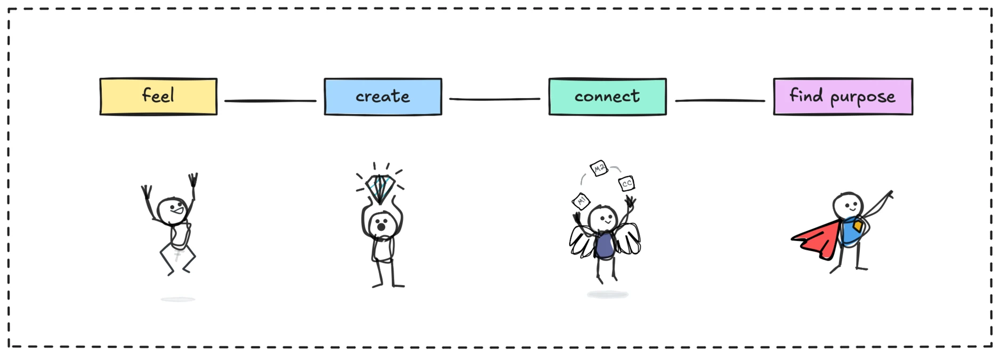

> **tl;dr** Humans excel in **empathy**, **creativity**, **intuition**, and **purpose**, outshining AI in emotional and meaningful tasks. To maintain this edge, create authentic work, practice unplugged problem-solving, and prioritize real connections.

The **human edge** lies in our ability to **feel**, **create**, **connect**, and **find purpose**, qualities AI can’t replicate. While AI excels at **pattern-driven tasks** like data analysis or automation, humans shine in **emotional intelligence**, **intuitive leaps**, **authentic creativity**, and **ethical reasoning**. Here’s a clear look at our strengths, the challenges we face, and how to overcome them.

### The human edge

- **Emotional connection**: We build trust and empathy through shared feelings, like a friend’s support in tough times.
- **Creativity**: We craft original art, stories, or ideas infused with personal experience, unlike AI’s derivative outputs.
- **Intuition**: We make gut decisions in ambiguous situations, like a doctor sensing something tests miss.
- **Purpose**: We seek meaning and values, driving resilience and moral choices AI can’t authentically make.

### Challenges and solutions (maybe)

AI’s impressive outputs, like generated art or text, can feel “good enough,” tempting us to lean on them and **stifle our own creativity**. To counter this, focus on authenticity, create from your unique story, cultural roots, or emotions, crafting work AI can’t replicate.

Another hurdle is **over-relying on AI for decisions**, which dulls our intuition and problem-solving. Combat this by tackling challenges without tech, like brainstorming on paper or trusting your gut in small choices, to sharpen your instincts.

Finally, a tech-driven world can isolate us, **weakening the human connections** that fuel collaboration and joy. Fight this by prioritizing real relationships, meet friends face-to-face, join a local group, or host a gathering to nurture bonds that ground you.

To maintain your edge, **embrace your humanity**. Practice empathy, take creative risks, trust your gut, and align with your values. Use AI to handle routine tasks, freeing you to focus on what makes you human. By cultivating these strengths, you’ll thrive in a world where AI handles patterns, but humans shape meaning.
