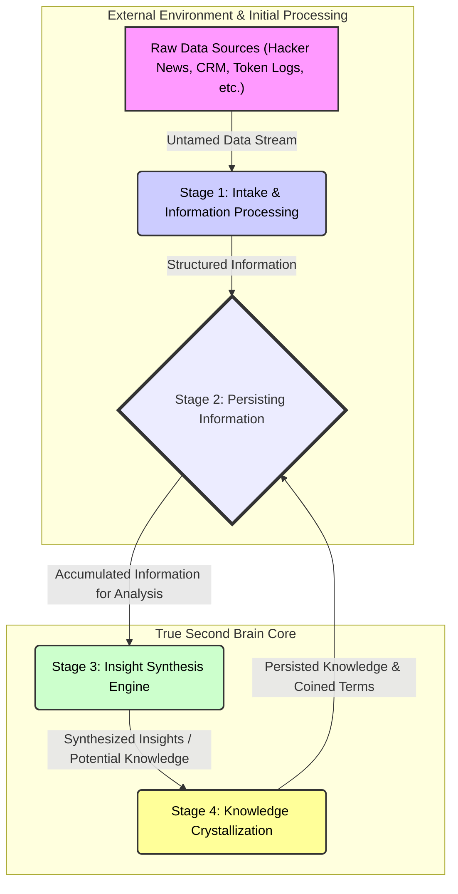

> **tl;dr** We turn raw **data** into actionable **insight** and lasting **knowledge** using a multi-stage pipeline with **supporting systems**, **TimescaleDB**, and **LLMs**.

We've got data. Lots of it. Streaming in from everywhere: Hacker News, our CRM, token usage logs, project reports. That's great. But raw **data** by itself? It's mostly noise. We can't make decisions from a raw server log any more than we can build a rocket from unrefined ore. The real magic happens when we transform that raw stream into actionable **insight**, and eventually, into persistent **knowledge** within our **true second brain**. This is the pipeline that makes our brain actually intelligent.



## Stage 1: Taming the raw chaos

Raw **data** is wild. It's the untamed frontier. Think of scraping Hacker News comments: we get everything from brilliant insights to flame wars. Or CRM logs: a mix of crucial updates and automated entries. Our **ICY token** transactions? Just a ledger of numbers without context.

We don't dump this raw data directly into our second brain. That would be like feeding a supercomputer with mud. Instead, we use specialized **supporting systems** and dedicated scripts, often powered by their own **LLMs** optimized for specific parsing tasks.

These systems handle the initial heavy lifting:

* Basic **data cleaning** (stripping HTML, normalizing dates)
* **Entity extraction** (identifying "NVIDIA," "React," or "Q2 Financials")
* Preliminary **sentiment analysis** on feedback
* Initial **tagging** and categorization

They transform raw **data** into structured **information**. Here's what that looks like for a Hacker News comment:

```json
{
  "source_id": "hn_comment_xyz123",
  "raw_text": "lol, this new JS framework is 🔥 but docs r terrible!!1",
  "cleaned_text": "This new JavaScript framework is impressive, but the documentation is terrible.",
  "entities_extracted": [
    {"text": "JavaScript framework", "type": "TECHNOLOGY"},
    {"text": "documentation", "type": "ASSET"}
  ],
  "sentiment": {"score": -0.5, "label": "NEGATIVE", "focus": "documentation"},
  "initial_tags": ["javascript", "developer_tool", "feedback"]
}
```

## Stage 2: Feeding the brain

Once our supporting systems transform raw **data** into structured **information**, it's ready for the next step. We pipe it directly into the **observation_log** of our **true second brain**. This creates a permanent, **append-only** record of this **information**.

The **JSONB payload** in our **TimescaleDB hypertable** handles this structured **information** without rigid schemas. Different data sources (Hacker News, CRM, token logs) can coexist in the same unified log, each with its own relevant structure.

## Stage 3: The synthesis engine

Inside our **true second brain**, all this structured **information** accumulates in the `observation_log`. This is where our internal **LLM** takes over. Its job isn't just storage, but understanding and pattern recognition across different sources and time periods.

**TimescaleDB continuous aggregates** make this efficient. Instead of rescanning terabytes of historical **information** every few minutes, we pre-compute summaries and trends. Our aggregates track:

* **Entity** co-occurrence frequencies (like "serverless" and "AI ethics")
* **Sentiment** velocity around specific topics
* Correlation between CRM activities and sales performance
* ICY token platform feature adoption rates alongside developer forum discussions

Our internal **LLM** queries these aggregates and raw **information** to find signals above the noise. It looks for:

* Non-obvious correlations
* Interesting anomalies
* Emerging themes across unrelated data streams

This is where **information** transforms into genuine **insight**. For example, detecting that "discussions about 'decentralized AI compute' are spiking on Hacker News at the same time as increased ICY token transactions from wallets interacting with known DePIN projects."

## Stage 4: Crystallizing knowledge

When our internal **LLM** identifies significant patterns or trends, it doesn't just keep them to itself. It makes this understanding concrete and reusable through **coined terms** (formal knowledge structures).

The **LLM** synthesizes the **insight** and gives it a name, description, related entities, and confidence score. For our example, it might coin: `"DePIN Compute Convergence"`.

This new **insight** (now elevated to **knowledge**) gets written back into the `observation_log`:

```json
{
  "context_id": "system:insight_synthesis:2025-09-10",
  "insight_type": "emergent_trend_detection",
  "coined_terms": [{
    "name": "DePIN Compute Convergence",
    "description": "Observed trend of increased discussion and activity at the intersection of Decentralized Physical Infrastructure Networks (DePIN) and demand for distributed AI compute resources, reflected in token movements and forum discussions.",
    "supporting_observation_ids": ["hn_post_abc", "icy_txn_cluster_def", "crm_inquiry_ghi"],
    "confidence": 0.85
  }],
  "summary": "Identified a growing convergence between DePIN initiatives and the need for decentralized AI compute resources.",
  "source": {"source_type": "internal_llm_synthesis_engine"},
  "tags": ["insight", "coined_term", "depin", "ai_compute", "emerging_trend"]
}
```

## Why this pipeline matters

This multi-stage process of promoting raw **data** to structured **information**, and then to **insight** and **knowledge**, is what makes our system intelligent.

It's **scalable** because we use specialized systems for initial processing. The core brain focuses on higher-level synthesis, aided by **continuous aggregates**.

It's **evolvable**. As the brain ingests more **information** and synthesizes more **insights**, it gets better at its job. **Coined terms** create a richer vocabulary for understanding the world.

Most importantly, it produces **actionable insights**. We're not just collecting data. We're surfacing understandings that inform decisions, reveal opportunities, and flag risks.

## Fluid vs. crystallized intelligence

Our system mirrors human intelligence. Psychologists talk about **fluid intelligence** (reasoning and problem-solving) and **crystallized intelligence** (accumulated knowledge). Our system has both:

* **Fluid intelligence**: Our **LLMs** can understand language, make connections, and reason about novel inputs. However, their core knowledge is a "snapshot" from training.

* **Crystallized intelligence**: Our **true second brain** (the `observation_log` and knowledge persistence) represents accumulated experience. Every piece of structured **information**, every **insight**, every **coined term** becomes part of this growing knowledge base.

The **LLM's** **fluid intelligence** processes data and generates insights, which then crystallize into the `observation_log`. This ensures our system builds upon continuously expanding knowledge, not just reacting with "snapshot" understanding.

## From noise to signal, continuously

We're not just running ETL jobs. We're orchestrating an intelligent pipeline that transforms chaotic data into structured **information**, then forges that into durable, high-value **insight** and **knowledge**. This cycle of streaming, promoting, and persisting understanding is what makes our **true second brain** learn, adapt, and provide real leverage. It's how we build something that doesn't just store facts, but actually thinks.

---

> Next: [Building use-cases](use-cases.md)
