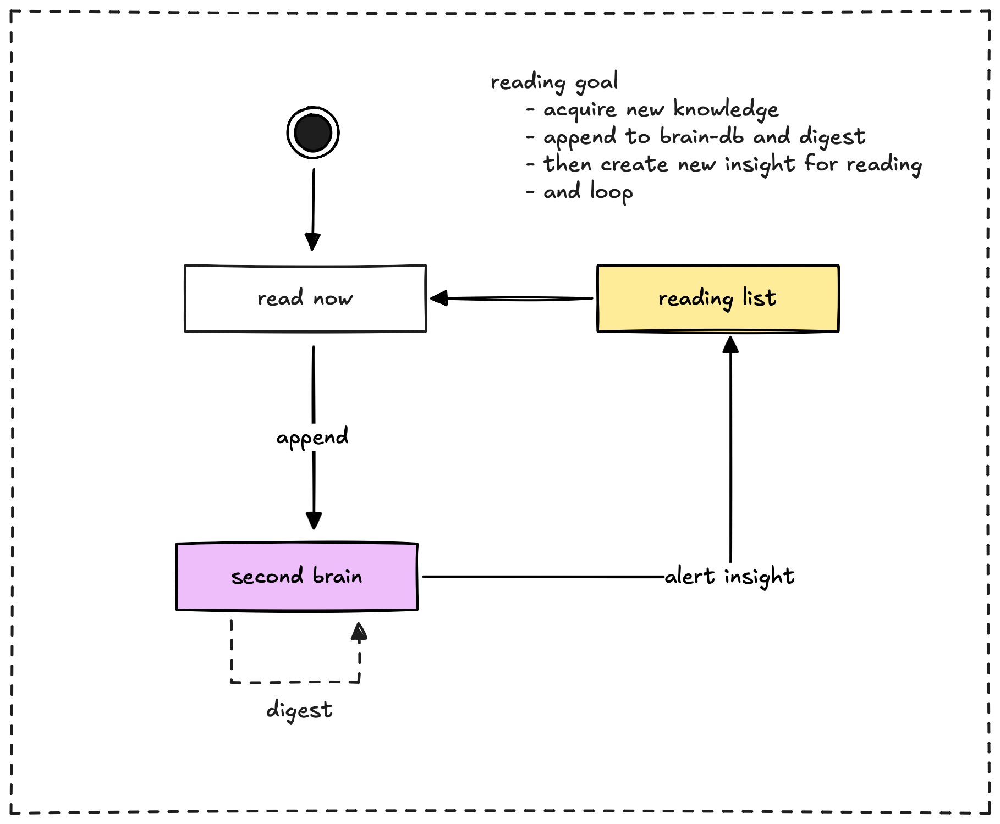

> **tl;dr** Brainery creates a dynamic reading workflow by helping you integrate what you read and proactively suggesting new content and **insights** based on your growing **knowledge base**.

## Two ways to feed your brain with Brainery

With **Brainery**, you get two powerful ways to learn and grow. You can keep reading articles and news like you always have, but now you also get smart suggestions from your second brain. Let's see how this works.

### Your reading channels

You now have two ways to discover and consume content:

1. **Your usual reading flow:** Keep finding and reading articles, books, and news like you always have. Nothing changes here.
2. **Brainery's insight channel:** Get smart suggestions from your second brain based on what you've already learned and saved.

### How Brainery makes your reading smarter

When you add what you read to **Brainery**, it does more than just store it. Here's what happens:

**Save your reading:** After you read something interesting, add it to **Brainery**. This could be notes, key points, or the whole piece.
**Brainery digests it:** Your second brain gets to work:

* Connects new info with your existing knowledge
* Spots key topics and people
* Compares it with other things you've read
* Uses AI to find important points and arguments

**Get fresh insights:** This is where it gets interesting. **Brainery** looks at your growing knowledge and suggests:

* New connections between ideas
* Gaps in your understanding
* Different perspectives on topics
* Related content you might have missed

### What makes this special?

The real power comes from having both channels working together:

* **You find content:** Keep discovering articles and books through your usual channels
* **Brainery finds content:** Get smart suggestions based on your growing knowledge
* **Everything connects:** Both channels feed into your **Brainery**, making your knowledge base richer
* **Better understanding:** As you read from both channels, you build a deeper understanding of topics

### What kind of suggestions will you get?

When **Brainery** suggests something to read, it's not random. You might get:

* **Missing pieces:** If you read something advanced, **Brainery** might suggest basics you need to understand it better
* **Different views:** When new info challenges your existing knowledge, **Brainery** can suggest reading that shows both sides
* **Deep dives:** If you're interested in a topic, **Brainery** can suggest related content you haven't seen yet
* **New connections:** **Brainery** might show how a new idea links to something you read months ago

### The reading loop

This creates a smart cycle:

1. Read from either channel
2. Add what you learn to **Brainery**
3. Get new suggestions based on your growing knowledge
4. Read those suggestions
5. Repeat

The result? You're not just collecting information. You're building a growing web of knowledge that helps you learn more effectively and discover new ideas you might have missed otherwise.
